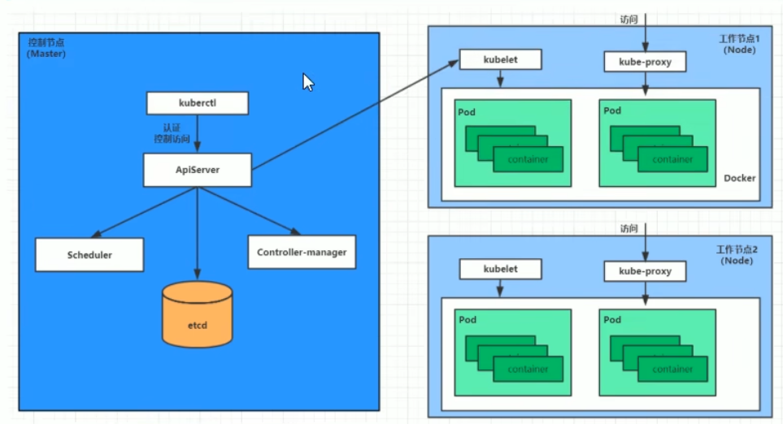
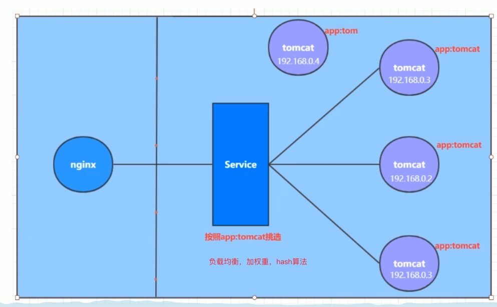
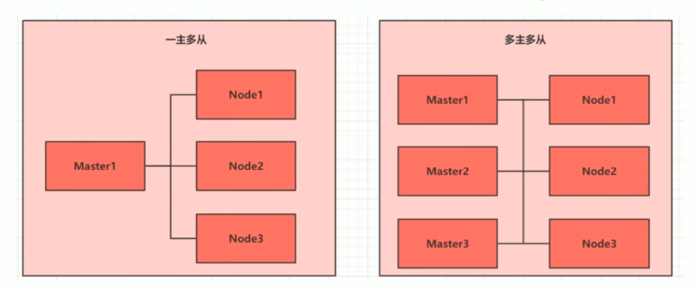
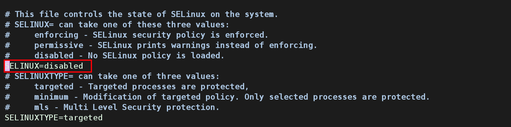
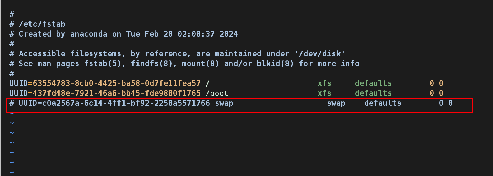
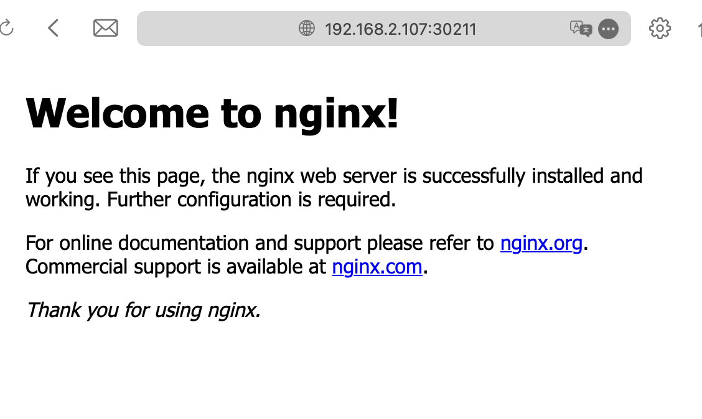
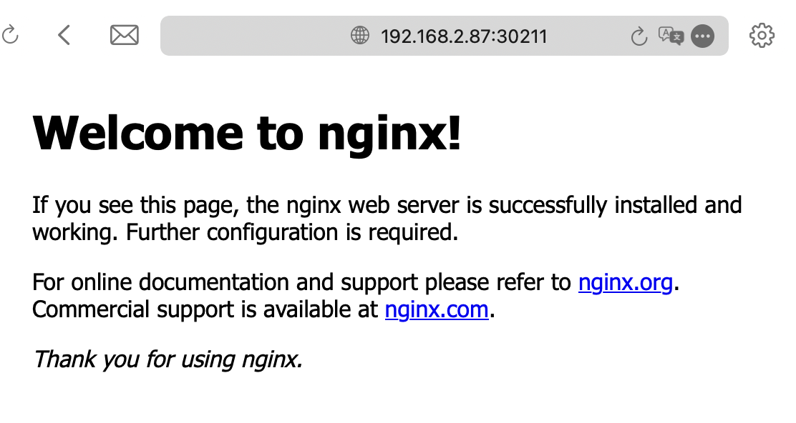
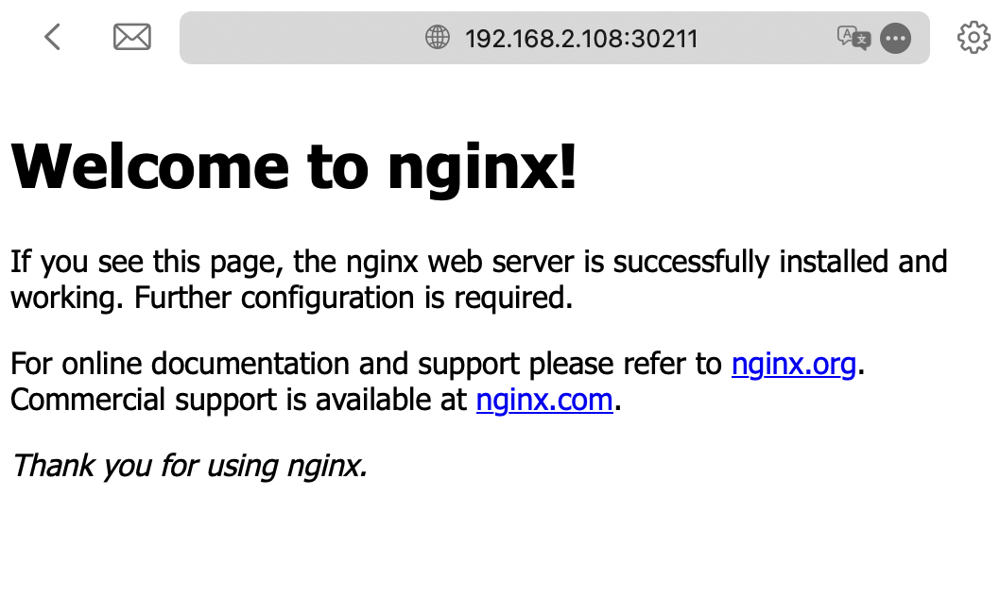

# Kubernetes 官网（中文）

[Kubernetes 文档 | Kubernetes](https://kubernetes.io/zh-cn/docs/home/)

## 1. 组件

一个kubernetes 集群主要是由 控制节点（master），工作节点（node）节点构成，每个节点都会安装不同的组件。

### master 节点

（负责集群的控制平面，负责集群的决策-管理）

> ApiServer: 资源操作的唯一入口，接受用户输入的命令，提供认证、授权、API注册和发现等机制

> Scheduler: 负责整个集群的资源调度，按照预定的调度策略将Pod 调度到相应的node节点上

> ControllerManager: 组册维护集群的状态，比如 程序部署安排、故障检测、自动扩展、滚动更新等

> Etcd: 负责存储集群中各种资源对象的信息

### node 节点

（集群的数据平面，负责为容器提供运行环境-干活）

> Kubelet: 负责维护容器的生命周期，即通过控制docker，来创建、更新、销毁容器

> KubeProxy: 负责提供集群内部的服务发现和负载均衡

> Docker: 负责节点上容器的各种操作



下面，以部署一个nginx 服务来说明kubernetes系统各个组件调用关系：

1. 首先要明确，一旦kubernetes 环境启动之后，master和node都会将自身的信息存储到etcd 数据库中，也就是持久化处理；
2. 一个nginx 服务的安装请求会先被发送到master 节点的 apiServer 组件；
3. apiServer 组件会调用 scheduler 组件来决定到底应该吧这个服务安装到呢个node节点上，在此时，他会从etcd 中读取各个node 节点的信息，然后按照一定的算法进行选择，并将结果告知apiServer；
4. apiServer 调用 controller-manager 去调度Node节点安装 nginx 服务；
5. kubelet 接收到指令后，会通知docker ，然后由 docker 来启动一个 nginx 的pod；（pod是kubernetes的最小操作单元，容器必须跑在pod中）
6. 这样，一个 nginx 服务就运行了，如果需要访问 nginx，就需要通过 kube-proxy 来对 pod 产生的代理；

   **外界用户就可以访问集群中的 nginx 服务了**

## 2. 概念

- Master：集群控制节点，每个集群需要至少一个master 节点负责集群的管控；
- Node：工作负载节点，由 master 分配容器到这些 node 工作点上，然后 node 节点上的 docker 负责容器的运行；
- Pod：kubernetes 的最小控制单元，容器都是运行在 pod 中的，一个pod 中，可以有 1 个或者多个容器
- Controller：多种控制器，通过他来实现对 pod 的管理，比如 启动 pod、停止 pod 的数量等；
- Service：pod对外服务的统一福口，下面可以维护同一类的多个 pod
- Label：标签，用于对 pod 进行分类，同一类 pod 会拥有相同的标签，比如下图中的 app:tomcat 、app:tom标签
- NameSpace：命名空间，用来隔离pod的运行环境 ，比如 dev、prod，test 环境



## 3. 集群环境搭建

### 环境规划

#### 集群类型

`Kubernetes` 集群大体上分为两类：

- 一主多从：一台`master`节点和多台`node`节点，搭建简单，有单机故障风险，用户测试环境；
- 多主多从：多台`master`节点和多台`node`节点，搭建麻烦，安全性高，多余于生产环境；



> 本次测试使用 一主多从 类型的集群

#### 安装方式

`Kubernetes` 有多种部署方式，目前比较主流的方式有 `kubeadm`, `minikube`,`二进制包`

- `Minikube`：一个用于快于搭建单节点`kubernetes` 的工具
- `Kubeadm`：一个用于快速搭建`kubernetes` 集群的工具
- 二进制包：从官网下载每个组件的二进制包，依次去安装，此方式对于理解`kubernetes` 组件更加有效

> 本地搭建使用 `kubeadm`方式搭建集群环境

#### 主机规划


| 作用   | IP地址        | 操作系统   | 配置      |
| ------ | ------------- | ---------- | --------- |
| Master | 192.168.2.87  | Centos 7.9 | 2C 2M 50G |
| node1  | 192.168.2.107 | Centos7.9  | 2C 2M 50G |
| Node2  | 192.168.2.108 | Centos7.9  | 2C 2M 50G |

### 环境搭建

本地搭建环境需要安装三台`Linux`环境 为 `centos 7.9` 镜像包，在每台linux 中分别安装`docker 18.06.3`、`kubeadm 1.17.4 `、`kubelet 1.17.4` 、`kubelet 1.17.4` 程序

#### 主机安装

> 前置环境检测 命令查询

```shell
[root@localhost ~]# cat /etc/os-release
NAME="CentOS Linux"
VERSION="7 (Core)"
ID="centos"
ID_LIKE="rhel fedora"
VERSION_ID="7"
PRETTY_NAME="CentOS Linux 7 (Core)"
ANSI_COLOR="0;31"
CPE_NAME="cpe:/o:centos:centos:7"
HOME_URL="https://www.centos.org/"
BUG_REPORT_URL="https://bugs.centos.org/"

CENTOS_MANTISBT_PROJECT="CentOS-7"
CENTOS_MANTISBT_PROJECT_VERSION="7"
REDHAT_SUPPORT_PRODUCT="centos"
REDHAT_SUPPORT_PRODUCT_VERSION="7"

[root@localhost ~]# uname -a
Linux localhost.localdomain 3.10.0-1160.el7.x86_64 #1 SMP Mon Oct 19 16:18:59 UTC 2020 x86_64 x86_64 x86_64 GNU/Linux
[root@localhost ~]# ifconfig
docker0: flags=4099<UP,BROADCAST,MULTICAST>  mtu 1500
        inet 172.17.0.1  netmask 255.255.0.0  broadcast 172.17.255.255
        ether 02:42:05:b9:e6:a3  txqueuelen 0  (Ethernet)
        RX packets 0  bytes 0 (0.0 B)
        RX errors 0  dropped 0  overruns 0  frame 0
        TX packets 0  bytes 0 (0.0 B)
        TX errors 0  dropped 0 overruns 0  carrier 0  collisions 0

ens33: flags=4163<UP,BROADCAST,RUNNING,MULTICAST>  mtu 1500
        inet 192.168.2.87  netmask 255.255.255.0  broadcast 192.168.2.255
        inet6 fe80::e9c9:1cb5:4138:9922  prefixlen 64  scopeid 0x20<link>
        ether 00:0c:29:5f:12:cd  txqueuelen 1000  (Ethernet)
        RX packets 1406494  bytes 348489669 (332.3 MiB)
        RX errors 0  dropped 0  overruns 0  frame 0
        TX packets 1471741  bytes 503756781 (480.4 MiB)
        TX errors 0  dropped 0 overruns 0  carrier 0  collisions 0
[root@localhost ~]# docker --version
Docker version 25.0.3, build 4debf41
[root@localhost ~]# cat /etc/redhat-release 
CentOS Linux release 7.9.2009 (Core)

```

> 初始化系统环境

- 检查操作系统版本，在`centos 7.5` 以上

```shell
Last login: Wed Feb 21 20:17:46 2024 from 192.168.2.83
[root@master ~]# cat /etc/redhat-release 
CentOS Linux release 7.9.2009 (Core)
```

- 配置主机名解析，为了方面后面集群节点间的直接调用，配置主机名解析，企业中推荐使用内部 `DNS 服务器`，主机名解析，编辑三台服务器的`/etc/hosts`文件，添加以下内容

  192.168.2.87 master

  192.168.2.107 node1

  192.168.2.108 node2

```shell
[root@master ~]# echo "192.168.2.87 master
192.168.2.107 node1
192.168.2.108 node2" >> /etc/hosts
# 互相检测 ping
[root@localhost ~]# ping master
PING master (192.168.2.87) 56(84) bytes of data.
64 bytes from master (192.168.2.87): icmp_seq=1 ttl=64 time=2.12 ms
64 bytes from master (192.168.2.87): icmp_seq=2 ttl=64 time=1.05 ms
64 bytes from master (192.168.2.87): icmp_seq=3 ttl=64 time=0.608 ms
--- master ping statistics ---
3 packets transmitted, 3 received, 0% packet loss, time 2003ms
rtt min/avg/max/mdev = 0.608/1.261/2.126/0.638 ms
[root@localhost ~]# ping node1
PING node1 (192.168.2.107) 56(84) bytes of data.
64 bytes from node1 (192.168.2.107): icmp_seq=1 ttl=64 time=0.464 ms
64 bytes from node1 (192.168.2.107): icmp_seq=2 ttl=64 time=0.358 ms
--- node1 ping statistics ---
2 packets transmitted, 2 received, 0% packet loss, time 1000ms
rtt min/avg/max/mdev = 0.358/0.411/0.464/0.053 ms
[root@localhost ~]# ping node2
PING node2 (192.168.2.108) 56(84) bytes of data.
64 bytes from node2 (192.168.2.108): icmp_seq=1 ttl=64 time=0.023 ms
64 bytes from node2 (192.168.2.108): icmp_seq=2 ttl=64 time=0.083 ms
--- node2 ping statistics ---
2 packets transmitted, 2 received, 0% packet loss, time 999ms
rtt min/avg/max/mdev = 0.023/0.053/0.083/0.030 ms

```

- 时间同步 （`kubernets` 要求集群中的节点时间必须精确一致，这里直接使用 `chronyd`
  服务 从网络同步时间，企业中建议配置内部时间同步服务器）

```shell
[root@localhost ~]# systemctl start chronyd
[root@localhost ~]# systemctl enable chronyd
[root@localhost ~]# date
2024年 02月 23日 星期五 00:47:53 PST
```

- 禁用`iptables` 和 `firewalld` 服务（`kubernetes` 和 `docker` 在运行中会产生大量的`iptables` 规则，为了不让系统规则混淆，直接关闭系统规则）

```shell
# 关闭 firewalld 服务
[root@localhost ~]# systemctl stop firewalld
[root@localhost ~]# systemctl disable firewalld
# 关闭 iptables 服务
[root@localhost ~]# systemctl stop iptables
[root@localhost ~]# systemctl disable iptables
```

- 禁用 `selinux` （`selinux` 是 `linux` 系统下的一个安全服务，如果不关闭他，在安装集群中会产生各种各样的问题）

```shell
# 编辑 /etc/selinux/config 文件，修改 selinux 的值为 disabled
# 修改完毕之后，重启才会生效 SELINUX=disabled
[root@localhost ~]# vim /etc/selinux/config
```



- 禁用 `swap` 分区（`swap` 分区指的的 虚拟内存分区，在物理内存使用完之后，将磁盘空间，虚拟成内存使用，启用`swap` 设备会对系统的性能产生非常负面的影响，因为`kubernetes`要求每个节点都要禁用 `swap` 设备，如果因为某些原因确实不能关闭`swap` 分区，就需要在集群安装过程中通过明确的参数进行配置说明）

```shell
# 编辑分区配置文件 /etc/fstab,注释swap 分区这一行
# 修改完毕之后需重启linux服务
[root@localhost ~]# vim /etc/fstab
```



- 修改`linux`的内核参数

```shell
# 修改linux的内核参数，添加网桥过滤和地址转发功能
# 编辑/etc/sysctl.d/kubernetes.conf文件,添加如下配署:
net.bridge.bridge-nf-call-ip6tables = 1
net.bridge.bridge-nf-call-iptables = 1
net.ipv4.ip_forward = 1

[root@localhost ~]# vim /etc/sysctl.d/kubernetes.conf
[root@node1 ~]# cat /etc/sysctl.d/kubernetes.conf 
net.bridge.bridge-nf-call-ip6tables = 1
net.bridge.bridge-nf-call-iptables = 1
net.ipv4.ip_forward = 1
# 重新加载配置
[root@localhost ~]# sysctl -p
# 加载网桥过滤模块
[root@localhost ~]# modprobe br_netfilter
# 查看网桥过滤模块是否加载成功
[root@localhost ~]# lsmod | grep br_netfilter
br_netfilter           22256  0 
bridge                151336  1 br_netfilter
```

- 配置 `ipvs` 功能 （在 `kubernetes` 中 `service` 有两种代理模式，一种基于 `iptables`的，一种基于 `ipvs`，两者进行比较的话，`ipvs` 的性能明显更高一点，如果使用它，需要手动载入 `ipvs` 模块）

```shell

# 1 安装ipset 和 ipvsadm
[root@localhost ~]# yum install ipset ipvsadmin -y
[root@localhost ~]# yum install ipset ipvsadm -y
已加载插件：fastestmirror, langpacks
Loading mirror speeds from cached hostfile
 * base: mirrors.aliyun.com
 * extras: mirrors.aliyun.com
 * updates: mirrors.aliyun.com
软件包 ipset-7.1-1.el7.x86_64 已安装并且是最新版本
正在解决依赖关系
--> 正在检查事务
---> 软件包 ipvsadm.x86_64.0.1.27-8.el7 将被 安装
--> 解决依赖关系完成

依赖关系解决

================================================================================================================================
 Package                       架构                         版本                               源                          大小
================================================================================================================================
正在安装:
 ipvsadm                       x86_64                       1.27-8.el7                         base                        45 k

事务概要
================================================================================================================================
安装  1 软件包

总下载量：45 k
安装大小：75 k
Downloading packages:
警告：/var/cache/yum/x86_64/7/base/packages/ipvsadm-1.27-8.el7.x86_64.rpm: 头V3 RSA/SHA256 Signature, 密钥 ID f4a80eb5: NOKEYTA 
ipvsadm-1.27-8.el7.x86_64.rpm 的公钥尚未安装
ipvsadm-1.27-8.el7.x86_64.rpm                                                                            |  45 kB  00:00:03   
从 file:///etc/pki/rpm-gpg/RPM-GPG-KEY-CentOS-7 检索密钥
导入 GPG key 0xF4A80EB5:
 用户ID     : "CentOS-7 Key (CentOS 7 Official Signing Key) <security@centos.org>"
 指纹       : 6341 ab27 53d7 8a78 a7c2 7bb1 24c6 a8a7 f4a8 0eb5
 软件包     : centos-release-7-9.2009.0.el7.centos.x86_64 (@anaconda)
 来自       : /etc/pki/rpm-gpg/RPM-GPG-KEY-CentOS-7
Running transaction check
Running transaction test
Transaction test succeeded
Running transaction
  正在安装    : ipvsadm-1.27-8.el7.x86_64                                                                                   1/1 
  验证中      : ipvsadm-1.27-8.el7.x86_64                                                                                   1/1 

已安装:
  ipvsadm.x86_64 0:1.27-8.el7                                                                                             

完毕！

# 2 添加需要加载的模块写入脚本文件
[root@localhost ~]# cat <<EOF > /etc/sysconfig/modules/ipvs.modules
#!/bin/bash
modprobe -- ip_vs
modprobe -- ip_vs_rr
modprobe -- ip_vs_wrr
modprobe -- ip_vs_sh
modprobe -- nf_conntrack_ipv4 
EOF

# 3 脚本文件添加执行权限
[root@localhost ~]# chmod +x /etc/sysconfig/modules/ipvs.modules

# 4 执行脚本文件
[root@localhost ~]# /bin/bash /etc/sysconfig/modules/ipvs.modules

# 5 查看对应的模块是否加载成功
[root@localhost ~]# lsmod | grep -e ip_vs -e nf_conntrack_ipv4
nf_conntrack_ipv4      15053  0 
nf_defrag_ipv4         12729  1 nf_conntrack_ipv4
ip_vs_sh               12688  0 
ip_vs_wrr              12697  0 
ip_vs_rr               12600  0 
ip_vs                 145458  6 ip_vs_rr,ip_vs_sh,ip_vs_wrr
nf_conntrack          139264  2 ip_vs,nf_conntrack_ipv4
libcrc32c              12644  3 xfs,ip_vs,nf_conntrack
# 6 重启服务器
[root@localhost ~]# reboot

# 查看 selinux
[root@node1 ~]# getenforce
Disabled

# 查看 swap 分区
[root@node1 ~]# free -m
              total        used        free      shared  buff/cache   available
Mem:           3250         538        2312          20         400        2477
Swap:             0           0           0
```

### 安装docker

**安装之前先卸载docke**

- 切换镜像源

```shell
[root@node1 ~]# wget https://mirrors.aliyun.com/docker-ce/linux/centos/docker-ce.repo -O /etc/yum.repos.d/docker-ce.repo
--2024-02-25 18:46:15--  https://mirrors.aliyun.com/docker-ce/linux/centos/docker-ce.repo
正在解析主机 mirrors.aliyun.com (mirrors.aliyun.com)... 42.101.1.237, 42.101.1.242, 42.101.1.240, ...
正在连接 mirrors.aliyun.com (mirrors.aliyun.com)|42.101.1.237|:443... 已连接。
已发出 HTTP 请求，正在等待回应... 200 OK
长度：2081 (2.0K) [application/octet-stream]
正在保存至: “/etc/yum.repos.d/docker-ce.repo”

100%[======================================================================================>] 2,081       --.-K/s 用时 0s  

2024-02-25 18:46:16 (474 MB/s) - 已保存 “/etc/yum.repos.d/docker-ce.repo” [2081/2081])

```

- 查看当前镜像源中支持的`docker`版本

```shell
[root@node1 ~]# yum list docker-ce --showduplicates
已加载插件：fastestmirror, langpacks
Loading mirror speeds from cached hostfile
 * base: mirrors.aliyun.com
 * extras: mirrors.aliyun.com
 * updates: mirrors.aliyun.com
base                                                                                                     | 3.6 kB  00:00:00   
docker-ce-stable                                                                                         | 3.5 kB  00:00:00   
extras                                                                                                   | 2.9 kB  00:00:00   
updates                                                                                                  | 2.9 kB  00:00:00   
(1/2): docker-ce-stable/7/x86_64/updateinfo                                                              |   55 B  00:00:00   
(2/2): docker-ce-stable/7/x86_64/primary_db                                                              | 133 kB  00:00:00   
可安装的软件包
docker-ce.x86_64                                    17.03.0.ce-1.el7.centos                                     docker-ce-stable
docker-ce.x86_64                                    17.03.1.ce-1.el7.centos                                     docker-ce-stable
docker-ce.x86_64                                    17.03.2.ce-1.el7.centos                                     docker-ce-stable
docker-ce.x86_64                                    17.03.3.ce-1.el7                                            docker-ce-stable
docker-ce.x86_64                                    17.06.0.ce-1.el7.centos                                     docker-ce-stable
docker-ce.x86_64                                    17.06.1.ce-1.el7.centos                                     docker-ce-stable
docker-ce.x86_64                                    17.06.2.ce-1.el7.centos                                     docker-ce-stable
docker-ce.x86_64                                    17.09.0.ce-1.el7.centos                                     docker-ce-stable
docker-ce.x86_64                                    17.09.1.ce-1.el7.centos                                     docker-ce-stable
docker-ce.x86_64                                    17.12.0.ce-1.el7.centos                                     docker-ce-stable
docker-ce.x86_64                                    17.12.1.ce-1.el7.centos                                     docker-ce-stable
docker-ce.x86_64                                    18.03.0.ce-1.el7.centos                                     docker-ce-stable
docker-ce.x86_64                                    18.03.1.ce-1.el7.centos                                     docker-ce-stable
docker-ce.x86_64                                    18.06.0.ce-3.el7                                            docker-ce-stable
docker-ce.x86_64                                    18.06.1.ce-3.el7                                            docker-ce-stable
docker-ce.x86_64                                    18.06.2.ce-3.el7                                            docker-ce-stable
docker-ce.x86_64                                    18.06.3.ce-3.el7                                            docker-ce-stable
docker-ce.x86_64                                    3:18.09.0-3.el7                                             docker-ce-stable
docker-ce.x86_64                                    3:18.09.1-3.el7                                             docker-ce-stable
docker-ce.x86_64                                    3:18.09.2-3.el7                                             docker-ce-stable
docker-ce.x86_64                                    3:18.09.3-3.el7                                             docker-ce-stable
docker-ce.x86_64                                    3:18.09.4-3.el7                                             docker-ce-stable
docker-ce.x86_64                                    3:18.09.5-3.el7                                             docker-ce-stable
docker-ce.x86_64                                    3:18.09.6-3.el7                                             docker-ce-stable
docker-ce.x86_64                                    3:18.09.7-3.el7                                             docker-ce-stable
docker-ce.x86_64                                    3:18.09.8-3.el7                                             docker-ce-stable
docker-ce.x86_64                                    3:18.09.9-3.el7                                             docker-ce-stable
docker-ce.x86_64                                    3:19.03.0-3.el7                                             docker-ce-stable
docker-ce.x86_64                                    3:19.03.1-3.el7                                             docker-ce-stable
docker-ce.x86_64                                    3:19.03.2-3.el7                                             docker-ce-stable
docker-ce.x86_64                                    3:19.03.3-3.el7                                             docker-ce-stable
docker-ce.x86_64                                    3:19.03.4-3.el7                                             docker-ce-stable
docker-ce.x86_64                                    3:19.03.5-3.el7                                             docker-ce-stable
docker-ce.x86_64                                    3:19.03.6-3.el7                                             docker-ce-stable
docker-ce.x86_64                                    3:19.03.7-3.el7                                             docker-ce-stable
docker-ce.x86_64                                    3:19.03.8-3.el7                                             docker-ce-stable
docker-ce.x86_64                                    3:19.03.9-3.el7                                             docker-ce-stable
docker-ce.x86_64                                    3:19.03.10-3.el7                                            docker-ce-stable
docker-ce.x86_64                                    3:19.03.11-3.el7                                            docker-ce-stable
docker-ce.x86_64                                    3:19.03.12-3.el7                                            docker-ce-stable
docker-ce.x86_64                                    3:19.03.13-3.el7                                            docker-ce-stable
docker-ce.x86_64                                    3:19.03.14-3.el7                                            docker-ce-stable
docker-ce.x86_64                                    3:19.03.15-3.el7                                            docker-ce-stable
docker-ce.x86_64                                    3:20.10.0-3.el7                                             docker-ce-stable
docker-ce.x86_64                                    3:20.10.1-3.el7                                             docker-ce-stable
docker-ce.x86_64                                    3:20.10.2-3.el7                                             docker-ce-stable
docker-ce.x86_64                                    3:20.10.3-3.el7                                             docker-ce-stable
docker-ce.x86_64                                    3:20.10.4-3.el7                                             docker-ce-stable
docker-ce.x86_64                                    3:20.10.5-3.el7                                             docker-ce-stable
docker-ce.x86_64                                    3:20.10.6-3.el7                                             docker-ce-stable
docker-ce.x86_64                                    3:20.10.7-3.el7                                             docker-ce-stable
docker-ce.x86_64                                    3:20.10.8-3.el7                                             docker-ce-stable
docker-ce.x86_64                                    3:20.10.9-3.el7                                             docker-ce-stable
docker-ce.x86_64                                    3:20.10.10-3.el7                                            docker-ce-stable
docker-ce.x86_64                                    3:20.10.11-3.el7                                            docker-ce-stable
docker-ce.x86_64                                    3:20.10.12-3.el7                                            docker-ce-stable
docker-ce.x86_64                                    3:20.10.13-3.el7                                            docker-ce-stable
docker-ce.x86_64                                    3:20.10.14-3.el7                                            docker-ce-stable
docker-ce.x86_64                                    3:20.10.15-3.el7                                            docker-ce-stable
docker-ce.x86_64                                    3:20.10.16-3.el7                                            docker-ce-stable
docker-ce.x86_64                                    3:20.10.17-3.el7                                            docker-ce-stable
docker-ce.x86_64                                    3:20.10.18-3.el7                                            docker-ce-stable
docker-ce.x86_64                                    3:20.10.19-3.el7                                            docker-ce-stable
docker-ce.x86_64                                    3:20.10.20-3.el7                                            docker-ce-stable
docker-ce.x86_64                                    3:20.10.21-3.el7                                            docker-ce-stable
docker-ce.x86_64                                    3:20.10.22-3.el7                                            docker-ce-stable
docker-ce.x86_64                                    3:20.10.23-3.el7                                            docker-ce-stable
docker-ce.x86_64                                    3:20.10.24-3.el7                                            docker-ce-stable
docker-ce.x86_64                                    3:23.0.0-1.el7                                              docker-ce-stable
docker-ce.x86_64                                    3:23.0.1-1.el7                                              docker-ce-stable
docker-ce.x86_64                                    3:23.0.2-1.el7                                              docker-ce-stable
docker-ce.x86_64                                    3:23.0.3-1.el7                                              docker-ce-stable
docker-ce.x86_64                                    3:23.0.4-1.el7                                              docker-ce-stable
docker-ce.x86_64                                    3:23.0.5-1.el7                                              docker-ce-stable
docker-ce.x86_64                                    3:23.0.6-1.el7                                              docker-ce-stable
docker-ce.x86_64                                    3:24.0.0-1.el7                                              docker-ce-stable
docker-ce.x86_64                                    3:24.0.1-1.el7                                              docker-ce-stable
docker-ce.x86_64                                    3:24.0.2-1.el7                                              docker-ce-stable
docker-ce.x86_64                                    3:24.0.3-1.el7                                              docker-ce-stable
docker-ce.x86_64                                    3:24.0.4-1.el7                                              docker-ce-stable
docker-ce.x86_64                                    3:24.0.5-1.el7                                              docker-ce-stable
docker-ce.x86_64                                    3:24.0.6-1.el7                                              docker-ce-stable
docker-ce.x86_64                                    3:24.0.7-1.el7                                              docker-ce-stable
docker-ce.x86_64                                    3:24.0.8-1.el7                                              docker-ce-stable
docker-ce.x86_64                                    3:24.0.9-1.el7                                              docker-ce-stable
docker-ce.x86_64                                    3:25.0.0-1.el7                                              docker-ce-stable
docker-ce.x86_64                                    3:25.0.1-1.el7                                              docker-ce-stable
docker-ce.x86_64                                    3:25.0.2-1.el7                                              docker-ce-stable
docker-ce.x86_64                                    3:25.0.3-1.el7                                              docker-ce-stable
```

- 安装特定版本的 `docker-ce`（必须制定 ` --setopt=obsoletes=0`，负责 `yum` 会自动安装更高版本）

```shell
[root@node1 ~]# yum install --setopt=obsoletes=0 docker-ce-18.06.3.ce-3.el7 -y
已加载插件：fastestmirror, langpacks
Loading mirror speeds from cached hostfile
 * base: mirrors.aliyun.com
 * extras: mirrors.aliyun.com
 * updates: mirrors.aliyun.com
正在解决依赖关系
--> 正在检查事务
---> 软件包 docker-ce.x86_64.0.18.06.3.ce-3.el7 将被 安装
--> 正在处理依赖关系 container-selinux >= 2.9，它被软件包 docker-ce-18.06.3.ce-3.el7.x86_64 需要
--> 正在检查事务
---> 软件包 container-selinux.noarch.2.2.119.2-1.911c772.el7_8 将被 安装
--> 解决依赖关系完成

依赖关系解决

================================================================================================================================
 Package                        架构                版本                                    源                             大小
================================================================================================================================
正在安装:
 docker-ce                      x86_64              18.06.3.ce-3.el7                        docker-ce-stable               41 M
为依赖而安装:
 container-selinux              noarch              2:2.119.2-1.911c772.el7_8               extras                         40 k

事务概要
================================================================================================================================
安装  1 软件包 (+1 依赖软件包)

总下载量：41 M
安装大小：168 M
Downloading packages:
(1/2): container-selinux-2.119.2-1.911c772.el7_8.noarch.rpm                                              |  40 kB  00:00:00   
warning: /var/cache/yum/x86_64/7/docker-ce-stable/packages/docker-ce-18.06.3.ce-3.el7.x86_64.rpm: Header V4 RSA/SHA512 Signature, key ID 621e9f35: NOKEY
docker-ce-18.06.3.ce-3.el7.x86_64.rpm 的公钥尚未安装
(2/2): docker-ce-18.06.3.ce-3.el7.x86_64.rpm                                                             |  41 MB  00:00:10   
--------------------------------------------------------------------------------------------------------------------------------
总计                                                                                            4.0 MB/s |  41 MB  00:00:10   
从 https://mirrors.aliyun.com/docker-ce/linux/centos/gpg 检索密钥
导入 GPG key 0x621E9F35:
 用户ID     : "Docker Release (CE rpm) <docker@docker.com>"
 指纹       : 060a 61c5 1b55 8a7f 742b 77aa c52f eb6b 621e 9f35
 来自       : https://mirrors.aliyun.com/docker-ce/linux/centos/gpg
Running transaction check
Running transaction test
Transaction test succeeded
Running transaction
  正在安装    : 2:container-selinux-2.119.2-1.911c772.el7_8.noarch                                                          1/2 
setsebool:  SELinux is disabled.
  正在安装    : docker-ce-18.06.3.ce-3.el7.x86_64                                                                           2/2 
  验证中      : docker-ce-18.06.3.ce-3.el7.x86_64                                                                           1/2 
  验证中      : 2:container-selinux-2.119.2-1.911c772.el7_8.noarch                                                          2/2 

已安装:
  docker-ce.x86_64 0:18.06.3.ce-3.el7                                                                                     

作为依赖被安装:
  container-selinux.noarch 2:2.119.2-1.911c772.el7_8                                                                      

完毕！
```

- 添加一个配置文件（`docker` 在默认情况下使用的 `Cgroup Driver` 为 `cgroupfs`,而 `Kubernetes` 推荐使用 `systemd`来 代替 `cgroupfs`）

```shell
[root@node1 ~]# mkdir /etc/docker
[root@node1 ~]# cat <<EOF> /etc/docker/daemon.json
{
"exec-opts": ["native.cgroupdriver=systemd"],
"registry-mirrors": ["https://kn0t2bca.mirror.aliyuncs.com"]
}
EOF
[root@node1 ~]# more /etc/docker/daemon.json
{
"exec-opts": ["native.cgroupdriver=systemd"],
"registry-mirrors": ["https://kn0t2bca.mirror.aliyuncs.com"]
}


# 重启docker 
[root@node1 ~]# systemctl restart docker
# 设置开机自启动
[root@node1 ~]# systemctl enable docker
Created symlink from /etc/systemd/system/multi-user.target.wants/docker.service to /usr/lib/systemd/system/docker.service.
# 查看docker 版本
[root@node1 ~]# docker version
Client:
 Version:           18.06.3-ce
 API version:       1.38
 Go version:        go1.10.3
 Git commit:        d7080c1
 Built:             Wed Feb 20 02:26:51 2019
 OS/Arch:           linux/amd64
 Experimental:      false

Server:
 Engine:
  Version:          18.06.3-ce
  API version:      1.38 (minimum version 1.12)
  Go version:       go1.10.3
  Git commit:       d7080c1
  Built:            Wed Feb 20 02:28:17 2019
  OS/Arch:          linux/amd64
  Experimental:     false
```

### 安装Kubernetes组件

- 由于 `kubernetes` 的镜像在国外，速度较慢，切换成国内的镜像源

```shell
# 编辑/etc/yum.repos.d/kubernetes.repo,添加下面的配置
[kubernetes]
name=Kubernetes
baseurl=http://mirrors.aliyun.com/kubernetes/yum/repos/kubernetes-el7-x86_64
enabled=1
gpgchech=0
repo_gpgcheck=0
gpgkey=http://mirrors.aliyun.com/kubernetes/yum/doc/yum-key.gpg
			http://mirrors.aliyun.com/kubernetes/yum/doc/rpm-package-key.gpg

[root@node1 ~]# vim /etc/yum.repos.d/kubernetes.repo
[root@node2 ~]# more /etc/yum.repos.d/kubernetes.repo
[kubernetes]
name=Kubernetes
baseurl=http://mirrors.aliyun.com/kubernetes/yum/repos/kubernetes-el7-x86_64
enabled=1
gpgchech=0
repo_gpgcheck=0
gpgkey=http://mirrors.aliyun.com/kubernetes/yum/doc/yum-key.gpg
                        http://mirrors.aliyun.com/kubernetes/yum/doc/rpm-package-key.gpg
```

- 安装 `kubeadm`、`kubelet`、`kubectl`

```shell
[root@node1 ~]# yum install --setopt=obsoletes=0 kubeadm-1.17.4-0 kubelet-1.17.4-0 kubectl-1.17.4-0 -y
已加载插件：fastestmirror, langpacks
Loading mirror speeds from cached hostfile
 * base: mirrors.aliyun.com
 * extras: mirrors.aliyun.com
 * updates: mirrors.aliyun.com
kubernetes                                                                                               | 1.4 kB  00:00:00   
正在解决依赖关系
--> 正在检查事务
---> 软件包 kubeadm.x86_64.0.1.17.4-0 将被 安装
--> 正在处理依赖关系 kubernetes-cni >= 0.7.5，它被软件包 kubeadm-1.17.4-0.x86_64 需要
--> 正在处理依赖关系 cri-tools >= 1.13.0，它被软件包 kubeadm-1.17.4-0.x86_64 需要
---> 软件包 kubectl.x86_64.0.1.17.4-0 将被 安装
---> 软件包 kubelet.x86_64.0.1.17.4-0 将被 安装
--> 正在处理依赖关系 socat，它被软件包 kubelet-1.17.4-0.x86_64 需要
--> 正在处理依赖关系 conntrack，它被软件包 kubelet-1.17.4-0.x86_64 需要
--> 正在检查事务
---> 软件包 conntrack-tools.x86_64.0.1.4.4-7.el7 将被 安装
--> 正在处理依赖关系 libnetfilter_cttimeout.so.1(LIBNETFILTER_CTTIMEOUT_1.1)(64bit)，它被软件包 conntrack-tools-1.4.4-7.el7.x86_64 需要
--> 正在处理依赖关系 libnetfilter_cttimeout.so.1(LIBNETFILTER_CTTIMEOUT_1.0)(64bit)，它被软件包 conntrack-tools-1.4.4-7.el7.x86_64 需要
--> 正在处理依赖关系 libnetfilter_cthelper.so.0(LIBNETFILTER_CTHELPER_1.0)(64bit)，它被软件包 conntrack-tools-1.4.4-7.el7.x86_64 需要
--> 正在处理依赖关系 libnetfilter_queue.so.1()(64bit)，它被软件包 conntrack-tools-1.4.4-7.el7.x86_64 需要
--> 正在处理依赖关系 libnetfilter_cttimeout.so.1()(64bit)，它被软件包 conntrack-tools-1.4.4-7.el7.x86_64 需要
--> 正在处理依赖关系 libnetfilter_cthelper.so.0()(64bit)，它被软件包 conntrack-tools-1.4.4-7.el7.x86_64 需要
---> 软件包 cri-tools.x86_64.0.1.26.0-0 将被 安装
---> 软件包 kubernetes-cni.x86_64.0.1.2.0-0 将被 安装
---> 软件包 socat.x86_64.0.1.7.3.2-2.el7 将被 安装
--> 正在检查事务
---> 软件包 libnetfilter_cthelper.x86_64.0.1.0.0-11.el7 将被 安装
---> 软件包 libnetfilter_cttimeout.x86_64.0.1.0.0-7.el7 将被 安装
---> 软件包 libnetfilter_queue.x86_64.0.1.0.2-2.el7_2 将被 安装
--> 解决依赖关系完成

依赖关系解决

================================================================================================================================
 Package                                架构                   版本                            源                          大小
================================================================================================================================
正在安装:
 kubeadm                                x86_64                 1.17.4-0                        kubernetes                 8.7 M
 kubectl                                x86_64                 1.17.4-0                        kubernetes                 9.4 M
 kubelet                                x86_64                 1.17.4-0                        kubernetes                  20 M
为依赖而安装:
 conntrack-tools                        x86_64                 1.4.4-7.el7                     base                       187 k
 cri-tools                              x86_64                 1.26.0-0                        kubernetes                 8.6 M
 kubernetes-cni                         x86_64                 1.2.0-0                         kubernetes                  17 M
 libnetfilter_cthelper                  x86_64                 1.0.0-11.el7                    base                        18 k
 libnetfilter_cttimeout                 x86_64                 1.0.0-7.el7                     base                        18 k
 libnetfilter_queue                     x86_64                 1.0.2-2.el7_2                   base                        23 k
 socat                                  x86_64                 1.7.3.2-2.el7                   base                       290 k

事务概要
================================================================================================================================
安装  3 软件包 (+7 依赖软件包)

总计：65 M
安装大小：275 M
Downloading packages:
警告：/var/cache/yum/x86_64/7/kubernetes/packages/0f2a2afd740d476ad77c508847bad1f559afc2425816c1f2ce4432a62dfe0b9d-kubernetes-cni-1.2.0-0.x86_64.rpm: 头V4 RSA/SHA512 Signature, 密钥 ID 3e1ba8d5: NOKEY
从 http://mirrors.aliyun.com/kubernetes/yum/doc/yum-key.gpg 检索密钥
导入 GPG key 0x13EDEF05:
 用户ID     : "Rapture Automatic Signing Key (cloud-rapture-signing-key-2022-03-07-08_01_01.pub)"
 指纹       : a362 b822 f6de dc65 2817 ea46 b53d c80d 13ed ef05
 来自       : http://mirrors.aliyun.com/kubernetes/yum/doc/yum-key.gpg
从 http://mirrors.aliyun.com/kubernetes/yum/doc/rpm-package-key.gpg 检索密钥
导入 GPG key 0x3E1BA8D5:
 用户ID     : "Google Cloud Packages RPM Signing Key <gc-team@google.com>"
 指纹       : 3749 e1ba 95a8 6ce0 5454 6ed2 f09c 394c 3e1b a8d5
 来自       : http://mirrors.aliyun.com/kubernetes/yum/doc/rpm-package-key.gpg
Running transaction check
Running transaction test
Transaction test succeeded
Running transaction
  正在安装    : libnetfilter_cthelper-1.0.0-11.el7.x86_64                                                                  1/10 
  正在安装    : socat-1.7.3.2-2.el7.x86_64                                                                                 2/10 
  正在安装    : libnetfilter_cttimeout-1.0.0-7.el7.x86_64                                                                  3/10 
  正在安装    : kubectl-1.17.4-0.x86_64                                                                                    4/10 
  正在安装    : cri-tools-1.26.0-0.x86_64                                                                                  5/10 
  正在安装    : libnetfilter_queue-1.0.2-2.el7_2.x86_64                                                                    6/10 
  正在安装    : conntrack-tools-1.4.4-7.el7.x86_64                                                                         7/10 
  正在安装    : kubelet-1.17.4-0.x86_64                                                                                    8/10 
  正在安装    : kubernetes-cni-1.2.0-0.x86_64                                                                              9/10 
  正在安装    : kubeadm-1.17.4-0.x86_64                                                                                   10/10 
  验证中      : kubernetes-cni-1.2.0-0.x86_64                                                                              1/10 
  验证中      : conntrack-tools-1.4.4-7.el7.x86_64                                                                         2/10 
  验证中      : libnetfilter_queue-1.0.2-2.el7_2.x86_64                                                                    3/10 
  验证中      : cri-tools-1.26.0-0.x86_64                                                                                  4/10 
  验证中      : kubeadm-1.17.4-0.x86_64                                                                                    5/10 
  验证中      : kubectl-1.17.4-0.x86_64                                                                                    6/10 
  验证中      : libnetfilter_cttimeout-1.0.0-7.el7.x86_64                                                                  7/10 
  验证中      : socat-1.7.3.2-2.el7.x86_64                                                                                 8/10 
  验证中      : kubelet-1.17.4-0.x86_64                                                                                    9/10 
  验证中      : libnetfilter_cthelper-1.0.0-11.el7.x86_64                                                                 10/10 

已安装:
  kubeadm.x86_64 0:1.17.4-0                 kubectl.x86_64 0:1.17.4-0                 kubelet.x86_64 0:1.17.4-0          

作为依赖被安装:
  conntrack-tools.x86_64 0:1.4.4-7.el7                           cri-tools.x86_64 0:1.26.0-0                             
  kubernetes-cni.x86_64 0:1.2.0-0                                libnetfilter_cthelper.x86_64 0:1.0.0-11.el7             
  libnetfilter_cttimeout.x86_64 0:1.0.0-7.el7                    libnetfilter_queue.x86_64 0:1.0.2-2.el7_2               
  socat.x86_64 0:1.7.3.2-2.el7                            

完毕！
```

- 配置 `kubelet` 的 `cgroup`

```shell
#编辑/etc/sysconfig/kubelet, 添加下面的配置
KUBELET_CGROUP_ARGS="--cgroup-driver=systemd"
KUBE_PROXY_MODE="ipvs"

[root@node1 ~]# vim /etc/sysconfig/kubelet
[root@node1 ~]# more /etc/sysconfig/kubelet
KUBELET_EXTRA_ARGS=


KUBELET_CGROUP_ARGS="--cgroup-driver=systemd"
KUBE_PROXY_MODE="ipvs"

# 设置 kubelet 开机自启
[root@node1 ~]# systemctl enable kubelet
Created symlink from /etc/systemd/system/multi-user.target.wants/kubelet.service to /usr/lib/systemd/system/kubelet.service.
```

- 准备集群镜像

```shell
# 在安装kubernetes集群之前，必须要提前准备好集群需要的镜像，所需镜像可以通过下面命令查看
[root@master ~]# kubeadm config images list
I0226 19:37:10.445485   16948 version.go:251] remote version is much newer: v1.29.2; falling back to: stable-1.17
W0226 19:37:12.850298   16948 validation.go:28] Cannot validate kube-proxy config - no validator is available
W0226 19:37:12.850342   16948 validation.go:28] Cannot validate kubelet config - no validator is available
k8s.gcr.io/kube-apiserver:v1.17.17
k8s.gcr.io/kube-controller-manager:v1.17.17
k8s.gcr.io/kube-scheduler:v1.17.17
k8s.gcr.io/kube-proxy:v1.17.17
k8s.gcr.io/pause:3.1
k8s.gcr.io/etcd:3.4.3-0
k8s.gcr.io/coredns:1.6.5

# 下载镜像
# 此镜像kubernetes的仓库中，由于网络原因，无法连接，下面提供了一种替换方案
images=(
	kube-apiserver:v1.17.4
	kube-controller-manager:v1.17.4
	kube-scheduler:v1.17.4
	kube-proxy:v1.17.4
	pause:3.1
	etcd:3.4.3-0
	coredns:1.6.5
)

for imageName in ${images[@]};do
	docker pull registry.cn-hangzhou.aliyuncs.com/google_containers/$imageName
	docker tag registry.cn-hangzhou.aliyuncs.com/google_containers/$imageName k8s.gcr.io/$imageName
	docker rmi registry.cn-hangzhou.aliyuncs.com/google_containers/$imageName 
done

[root@master ~]# images=(
 kube-apiserver:v1.17.4
 kube-controller-manager:v1.17.4
 kube-scheduler:v1.17.4
 kube-proxy:v1.17.4
 pause:3.1
 etcd:3.4.3-0
 coredns:1.6.5
 )
[root@master ~]# for imageName in ${images[@]};do
 docker pull registry.cn-hangzhou.aliyuncs.com/google_containers/$imageName
 docker tag registry.cn-hangzhou.aliyuncs.com/google_containers/$imageName k8s.gcr.io/$imageName
 docker rmi registry.cn-hangzhou.aliyuncs.com/google_containers/$imageName 
 done
v1.17.4: Pulling from google_containers/kube-apiserver
Digest: sha256:bbcec0b4ee3ef6c0f0a27c028b3a44234863f6e783a71c79cb5e651f82e992c8
Status: Downloaded newer image for registry.cn-hangzhou.aliyuncs.com/google_containers/kube-apiserver:v1.17.4
Untagged: registry.cn-hangzhou.aliyuncs.com/google_containers/kube-apiserver:v1.17.4
Untagged: registry.cn-hangzhou.aliyuncs.com/google_containers/kube-apiserver@sha256:bbcec0b4ee3ef6c0f0a27c028b3a44234863f6e783a71c79cb5e651f82e992c8
v1.17.4: Pulling from google_containers/kube-controller-manager
Digest: sha256:29f57d6d1e821e417a4dcef5a3669ab545530469e332420131387c7df3bec62f
Status: Downloaded newer image for registry.cn-hangzhou.aliyuncs.com/google_containers/kube-controller-manager:v1.17.4
Untagged: registry.cn-hangzhou.aliyuncs.com/google_containers/kube-controller-manager:v1.17.4
Untagged: registry.cn-hangzhou.aliyuncs.com/google_containers/kube-controller-manager@sha256:29f57d6d1e821e417a4dcef5a3669ab545530469e332420131387c7df3bec62f
v1.17.4: Pulling from google_containers/kube-scheduler
Digest: sha256:819fa2bf3c0d4ccf3df94445c6096a73730a3b4e982f6cd1daa25a5679aea55f
Status: Downloaded newer image for registry.cn-hangzhou.aliyuncs.com/google_containers/kube-scheduler:v1.17.4
Untagged: registry.cn-hangzhou.aliyuncs.com/google_containers/kube-scheduler:v1.17.4
Untagged: registry.cn-hangzhou.aliyuncs.com/google_containers/kube-scheduler@sha256:819fa2bf3c0d4ccf3df94445c6096a73730a3b4e982f6cd1daa25a5679aea55f
v1.17.4: Pulling from google_containers/kube-proxy
Digest: sha256:e3db5d1a2a3959f2745fa80ae008a9fb6bce3294f85819eb3cd5f695b2bb4785
Status: Downloaded newer image for registry.cn-hangzhou.aliyuncs.com/google_containers/kube-proxy:v1.17.4
Untagged: registry.cn-hangzhou.aliyuncs.com/google_containers/kube-proxy:v1.17.4
Untagged: registry.cn-hangzhou.aliyuncs.com/google_containers/kube-proxy@sha256:e3db5d1a2a3959f2745fa80ae008a9fb6bce3294f85819eb3cd5f695b2bb4785
3.1: Pulling from google_containers/pause
Digest: sha256:f78411e19d84a252e53bff71a4407a5686c46983a2c2eeed83929b888179acea
Status: Downloaded newer image for registry.cn-hangzhou.aliyuncs.com/google_containers/pause:3.1
Untagged: registry.cn-hangzhou.aliyuncs.com/google_containers/pause:3.1
Untagged: registry.cn-hangzhou.aliyuncs.com/google_containers/pause@sha256:f78411e19d84a252e53bff71a4407a5686c46983a2c2eeed83929b888179acea
3.4.3-0: Pulling from google_containers/etcd
39fafc05754f: Pull complete 
3736e1e115b8: Pull complete 
79de61f59f2e: Pull complete 
Digest: sha256:4afb99b4690b418ffc2ceb67e1a17376457e441c1f09ab55447f0aaf992fa646
Status: Downloaded newer image for registry.cn-hangzhou.aliyuncs.com/google_containers/etcd:3.4.3-0
Untagged: registry.cn-hangzhou.aliyuncs.com/google_containers/etcd:3.4.3-0
Untagged: registry.cn-hangzhou.aliyuncs.com/google_containers/etcd@sha256:4afb99b4690b418ffc2ceb67e1a17376457e441c1f09ab55447f0aaf992fa646
1.6.5: Pulling from google_containers/coredns
c6568d217a00: Pull complete 
fc6a9081f665: Pull complete 
Digest: sha256:7ec975f167d815311a7136c32e70735f0d00b73781365df1befd46ed35bd4fe7
Status: Downloaded newer image for registry.cn-hangzhou.aliyuncs.com/google_containers/coredns:1.6.5
Untagged: registry.cn-hangzhou.aliyuncs.com/google_containers/coredns:1.6.5
Untagged: registry.cn-hangzhou.aliyuncs.com/google_containers/coredns@sha256:7ec975f167d815311a7136c32e70735f0d00b73781365df1befd46ed35bd4fe7
```

### 集群初始化

> 下面的操作只需在`master`节点上执行即可

```shell
# 创建集群
kubeadm init \
	--apiserver-advertise-address=192.168.2.87 \
	--image-repository registry.aliyuncs.com/google_containers \
	--kubernetes-version=v1.17.4 \
	--service-cidr=10.96.0.0/12 \
	--pod-network-cidr=10.244.0.0/16

# 集群初始化
[root@master ~]# kubeadm init \
>   --image-repository registry.aliyuncs.com/google_containers \
> --apiserver-advertise-address=192.168.2.87 \
> --kubernetes-version=v1.17.4 \
> --service-cidr=10.96.0.0/12 \
> --pod-network-cidr=10.244.0.0/16
W0226 19:40:08.299469   20424 validation.go:28] Cannot validate kube-proxy config - no validator is available
W0226 19:40:08.299520   20424 validation.go:28] Cannot validate kubelet config - no validator is available
[init] Using Kubernetes version: v1.17.4
[preflight] Running pre-flight checks
[preflight] Pulling images required for setting up a Kubernetes cluster
[preflight] This might take a minute or two, depending on the speed of your internet connection
[preflight] You can also perform this action in beforehand using 'kubeadm config images pull'
[kubelet-start] Writing kubelet environment file with flags to file "/var/lib/kubelet/kubeadm-flags.env"
[kubelet-start] Writing kubelet configuration to file "/var/lib/kubelet/config.yaml"
[kubelet-start] Starting the kubelet
[certs] Using certificateDir folder "/etc/kubernetes/pki"
[certs] Generating "ca" certificate and key
[certs] Generating "apiserver" certificate and key
[certs] apiserver serving cert is signed for DNS names [master kubernetes kubernetes.default kubernetes.default.svc kubernetes.default.svc.cluster.local] and IPs [10.96.0.1 192.168.2.87]
[certs] Generating "apiserver-kubelet-client" certificate and key
[certs] Generating "front-proxy-ca" certificate and key
[certs] Generating "front-proxy-client" certificate and key
[certs] Generating "etcd/ca" certificate and key
[certs] Generating "etcd/server" certificate and key
[certs] etcd/server serving cert is signed for DNS names [master localhost] and IPs [192.168.2.87 127.0.0.1 ::1]
[certs] Generating "etcd/peer" certificate and key
[certs] etcd/peer serving cert is signed for DNS names [master localhost] and IPs [192.168.2.87 127.0.0.1 ::1]
[certs] Generating "etcd/healthcheck-client" certificate and key
[certs] Generating "apiserver-etcd-client" certificate and key
[certs] Generating "sa" key and public key
[kubeconfig] Using kubeconfig folder "/etc/kubernetes"
[kubeconfig] Writing "admin.conf" kubeconfig file
[kubeconfig] Writing "kubelet.conf" kubeconfig file
[kubeconfig] Writing "controller-manager.conf" kubeconfig file
[kubeconfig] Writing "scheduler.conf" kubeconfig file
[control-plane] Using manifest folder "/etc/kubernetes/manifests"
[control-plane] Creating static Pod manifest for "kube-apiserver"
[control-plane] Creating static Pod manifest for "kube-controller-manager"
W0226 19:40:16.502167   20424 manifests.go:214] the default kube-apiserver authorization-mode is "Node,RBAC"; using "Node,RBAC"
[control-plane] Creating static Pod manifest for "kube-scheduler"
W0226 19:40:16.502761   20424 manifests.go:214] the default kube-apiserver authorization-mode is "Node,RBAC"; using "Node,RBAC"
[etcd] Creating static Pod manifest for local etcd in "/etc/kubernetes/manifests"
[wait-control-plane] Waiting for the kubelet to boot up the control plane as static Pods from directory "/etc/kubernetes/manifests". This can take up to 4m0s
[apiclient] All control plane components are healthy after 33.506627 seconds
[upload-config] Storing the configuration used in ConfigMap "kubeadm-config" in the "kube-system" Namespace
[kubelet] Creating a ConfigMap "kubelet-config-1.17" in namespace kube-system with the configuration for the kubelets in the cluster
[upload-certs] Skipping phase. Please see --upload-certs
[mark-control-plane] Marking the node master as control-plane by adding the label "node-role.kubernetes.io/master=''"
[mark-control-plane] Marking the node master as control-plane by adding the taints [node-role.kubernetes.io/master:NoSchedule]
[bootstrap-token] Using token: 660r2d.c2r5jqnl3arzppix
[bootstrap-token] Configuring bootstrap tokens, cluster-info ConfigMap, RBAC Roles
[bootstrap-token] configured RBAC rules to allow Node Bootstrap tokens to post CSRs in order for nodes to get long term certificate credentials
[bootstrap-token] configured RBAC rules to allow the csrapprover controller automatically approve CSRs from a Node Bootstrap Token
[bootstrap-token] configured RBAC rules to allow certificate rotation for all node client certificates in the cluster
[bootstrap-token] Creating the "cluster-info" ConfigMap in the "kube-public" namespace
[kubelet-finalize] Updating "/etc/kubernetes/kubelet.conf" to point to a rotatable kubelet client certificate and key
[addons] Applied essential addon: CoreDNS
[addons] Applied essential addon: kube-proxy

Your Kubernetes control-plane has initialized successfully!

To start using your cluster, you need to run the following as a regular user:

  mkdir -p $HOME/.kube
  sudo cp -i /etc/kubernetes/admin.conf $HOME/.kube/config
  sudo chown $(id -u):$(id -g) $HOME/.kube/config

You should now deploy a pod network to the cluster.
Run "kubectl apply -f [podnetwork].yaml" with one of the options listed at:
  https://kubernetes.io/docs/concepts/cluster-administration/addons/

Then you can join any number of worker nodes by running the following on each as root:

kubeadm join 192.168.2.87:6443 --token 660r2d.c2r5jqnl3arzppix \
    --discovery-token-ca-cert-hash sha256:8c1047783364a2b2527a903b0429a85ea56cf246dff026e95ac5b4f21b1bfc2c 
  
# 创建必要文件
[root@master ~]# mkdir -p $HOME/.kube
[root@master ~]# sudo cp -i /etc/kubernetes/admin.conf $HOME/.kube/config
[root@master ~]# sudo chown $(id -u):$(id -g) $HOME/.kube/config
[root@master ~]# kubectl get nodes
NAME     STATUS     ROLES    AGE   VERSION
master   NotReady   master   33m   v1.17.4
```

##### ps: 遇到这么个错误

```shell
[kubelet-check] Initial timeout of 40s passed.

Unfortunately, an error has occurred:
        timed out waiting for the condition

This error is likely caused by:
        - The kubelet is not running
        - The kubelet is unhealthy due to a misconfiguration of the node in some way (required cgroups disabled)

If you are on a systemd-powered system, you can try to troubleshoot the error with the following commands:

   - 'systemctl status kubelet'
     ournalctl -xeu kubelet'

Additionally, a control plane component may have crashed or exited when started by the container runtime.
To troubleshoot, list all containers using your preferred container runtimes CLI, e.g. docker.
Here is one example how you may list all Kubernetes containers running in docker:

   - 'docker ps -a | grep kube | grep -v pause'
      you have found the failing container, you can inspect its logs with:
        - 'docker logs CONTAINERID'
          error execution phase wait-control-plane: couldn't initialize a Kubernetes cluster
          To see the stack trace of this error execute with --v=5 or higher
    
# 看到网站有很多解决办法，但是都没有生效，最后怀疑是 docker版本的原因，之前在 192.168.2.87上安装过 docker，应该是 docker版本 和 kubernetes无法兼容导致的
# 最后是通过重新安装 ios 镜像解决的
```

> 下面的操作只需要在 `node`节点执行即可

```shell
# 执行集群初始化最后一句
kubeadm join 192.168.2.87:6443 --token 660r2d.c2r5jqnl3arzppix \
    --discovery-token-ca-cert-hash sha256:8c1047783364a2b2527a903b0429a85ea56cf246dff026e95ac5b4f21b1bfc2c 
[root@node1 ~]# kubeadm join 192.168.2.87:6443 --token 660r2d.c2r5jqnl3arzppix \
     --discovery-token-ca-cert-hash sha256:8c1047783364a2b2527a903b0429a85ea56cf246dff026e95ac5b4f21b1bfc2c 
W0226 20:12:26.740729  104350 join.go:346] [preflight] WARNING: JoinControlPane.controlPlane settings will be ignored when control-plane flag is not set.
[preflight] Running pre-flight checks
[preflight] Reading configuration from the cluster...
[preflight] FYI: You can look at this config file with 'kubectl -n kube-system get cm kubeadm-config -oyaml'
[kubelet-start] Downloading configuration for the kubelet from the "kubelet-config-1.17" ConfigMap in the kube-system namespace
[kubelet-start] Writing kubelet configuration to file "/var/lib/kubelet/config.yaml"
[kubelet-start] Writing kubelet environment file with flags to file "/var/lib/kubelet/kubeadm-flags.env"
[kubelet-start] Starting the kubelet
[kubelet-start] Waiting for the kubelet to perform the TLS Bootstrap...

This node has joined the cluster:
* Certificate signing request was sent to apiserver and a response was received.
* The Kubelet was informed of the new secure connection details.

Run 'kubectl get nodes' on the control-plane to see this node join the cluster.

# 查看 nodes 节点状态，注意此时节点的 STATUS 是 NotReady 状态（此时的网络没有接通）
[root@master ~]# kubectl get nodes
NAME     STATUS     ROLES    AGE     VERSION
master   NotReady   master   36m     v1.17.4
node1    NotReady   <none>   4m38s   v1.17.4
node2    NotReady   <none>   107s    v1.17.4
```

### 安装网络插件

`Kubernetes` 支持多种网络插件，比如 `flannel`、`calico`、`canal` 等等，本次选用 `flannel`

> 下面操作依旧只在 `master` 节点执行就可，插件使用的是 `DaemonSet` 的控制器，它会在每个节点上都运行

```shell
# 获取 fannel 的配置文件（这里发现因为网络的原因，一直超时）
wget https://raw.githubusercontent.com/coreos/flannel/master/Documentation/kube-flannel.yml
[root@master ~]# wget https://raw.githubusercontent.com/coreos/flannel/master/Documentation/kube-flannel.yml
--2024-02-26 20:46:31--  https://raw.githubusercontent.com/coreos/flannel/master/Documentation/kube-flannel.yml
正在解析主机 raw.githubusercontent.com (raw.githubusercontent.com)... 185.199.108.133, 185.199.109.133, 185.199.110.133, ...
正在连接 raw.githubusercontent.com (raw.githubusercontent.com)|185.199.108.133|:443... ^C

# 下面已经提前下载好了
# 使用配置文件启动 fannel
[root@master ~]# kubectl apply -f kube-flannel.yml 
namespace/kube-flannel created
clusterrole.rbac.authorization.k8s.io/flannel created
clusterrolebinding.rbac.authorization.k8s.io/flannel created
serviceaccount/flannel created
configmap/kube-flannel-cfg created
daemonset.apps/kube-flannel-ds created

# 查看 node 节点 发现仍然是 NoetReady
[root@master ~]# kubectl get nodes
NAME     STATUS     ROLES    AGE   VERSION
master   NotReady   master   63m   v1.17.4
node1    NotReady   <none>   31m   v1.17.4
node2    NotReady   <none>   28m   v1.17.4

# 通过 journalctl -f -u kubelet.service 查看 kubelet 的状态，提示 Unable to update cni config: no networks found in /etc/cni/net.d 错误 
[root@master ~]# journalctl -f -u kubelet.service
-- Logs begin at 一 2024-02-26 19:29:08 PST. --
2月 26 20:44:16 master kubelet[21952]: W0226 20:44:16.900332   21952 cni.go:237] Unable to update cni config: no networks found in /etc/cni/net.d
2月 26 20:44:19 master kubelet[21952]: E0226 20:44:19.024578   21952 kubelet.go:2183] Container runtime network not ready: NetworkReady=false reason:NetworkPluginNotReady message:docker: network plugin is not ready: cni config uninitialized
2月 26 20:44:21 master kubelet[21952]: W0226 20:44:21.901316   21952 cni.go:237] Unable to update cni config: no networks found in /etc/cni/net.d
2月 26 20:44:24 master kubelet[21952]: E0226 20:44:24.028692   21952 kubelet.go:2183] Container runtime network not ready: NetworkReady=false reason:NetworkPluginNotReady message:docker: network plugin is not ready: cni config uninitialized
2月 26 20:44:26 master kubelet[21952]: W0226 20:44:26.901735   21952 cni.go:237] Unable to update cni config: no networks found in /etc/cni/net.d
2月 26 20:44:29 master kubelet[21952]: E0226 20:44:29.031788   21952 kubelet.go:2183] Container runtime network not ready: NetworkReady=false reason:NetworkPluginNotReady message:docker: network plugin is not ready: cni config uninitialized
2月 26 20:44:31 master kubelet[21952]: W0226 20:44:31.902443   21952 cni.go:237] Unable to update cni config: no networks found in /etc/cni/net.d
2月 26 20:44:34 master kubelet[21952]: E0226 20:44:34.035697   21952 kubelet.go:2183] Container runtime network not ready: NetworkReady=false reason:NetworkPluginNotReady message:docker: network plugin is not ready: cni config uninitialized
2月 26 20:44:36 master kubelet[21952]: W0226 20:44:36.902773   21952 cni.go:237] Unable to update cni config: no networks found in /etc/cni/net.d
2月 26 20:44:39 master kubelet[21952]: E0226 20:44:39.036954   21952 kubelet.go:2183] Container runtime network not ready: NetworkReady=false reason:NetworkPluginNotReady message:docker: network plugin is not ready: cni config uninitialized
[root@master ~]# ^C

# 编辑 /etc/cni/net.d/10-flannel.conf 文件
[root@master ~]# vim /etc/cni/net.d/10-flannel.conf

# 添加 以下代码 
{
 "name":"cbr0",
 "cniVersion":"0.3.1",
 "type":"flannel",
 "deledate":{
    "hairpinMode":true,
    "isDefaultGateway":true
  }
}
[root@master ~]# more /etc/cni/net.d/10-flannel.conf
{
 "name":"cbr0",
 "cniVersion":"0.3.1",
 "type":"flannel",
 "deledate":{
    "hairpinMode":true,
    "isDefaultGateway":true
  }
}

# 再次查看 nodes 节点 status 状态 已经 ready 
[root@master ~]# kubectl get nodes
NAME     STATUS   ROLES    AGE   VERSION
master   Ready    master   64m   v1.17.4
node1    Ready    <none>   32m   v1.17.4
node2    Ready    <none>   29m   v1.17.4
```

```yaml
# wget https://raw.githubusercontent.com/coreos/flannel/master/Documentation/kube-flannel.yml
# kube-flannel.yml
---
kind: Namespace
apiVersion: v1
metadata:
  name: kube-flannel
  labels:
    k8s-app: flannel
    pod-security.kubernetes.io/enforce: privileged
---
kind: ClusterRole
apiVersion: rbac.authorization.k8s.io/v1
metadata:
  labels:
    k8s-app: flannel
  name: flannel
rules:
- apiGroups:
  - ""
  resources:
  - pods
  verbs:
  - get
- apiGroups:
  - ""
  resources:
  - nodes
  verbs:
  - get
  - list
  - watch
- apiGroups:
  - ""
  resources:
  - nodes/status
  verbs:
  - patch
- apiGroups:
  - networking.k8s.io
  resources:
  - clustercidrs
  verbs:
  - list
  - watch
---
kind: ClusterRoleBinding
apiVersion: rbac.authorization.k8s.io/v1
metadata:
  labels:
    k8s-app: flannel
  name: flannel
roleRef:
  apiGroup: rbac.authorization.k8s.io
  kind: ClusterRole
  name: flannel
subjects:
- kind: ServiceAccount
  name: flannel
  namespace: kube-flannel
---
apiVersion: v1
kind: ServiceAccount
metadata:
  labels:
    k8s-app: flannel
  name: flannel
  namespace: kube-flannel
---
kind: ConfigMap
apiVersion: v1
metadata:
  name: kube-flannel-cfg
  namespace: kube-flannel
  labels:
    tier: node
    k8s-app: flannel
    app: flannel
data:
  cni-conf.json: |
    {
      "name": "cbr0",
      "cniVersion": "0.3.1",
      "plugins": [
        {
          "type": "flannel",
          "delegate": {
            "hairpinMode": true,
            "isDefaultGateway": true
          }
        },
        {
          "type": "portmap",
          "capabilities": {
            "portMappings": true
          }
        }
      ]
    }
  net-conf.json: |
    {
      "Network": "10.244.0.0/16",
      "Backend": {
        "Type": "vxlan"
      }
    }
---
apiVersion: apps/v1
kind: DaemonSet
metadata:
  name: kube-flannel-ds
  namespace: kube-flannel
  labels:
    tier: node
    app: flannel
    k8s-app: flannel
spec:
  selector:
    matchLabels:
      app: flannel
  template:
    metadata:
      labels:
        tier: node
        app: flannel
    spec:
      affinity:
        nodeAffinity:
          requiredDuringSchedulingIgnoredDuringExecution:
            nodeSelectorTerms:
            - matchExpressions:
              - key: kubernetes.io/os
                operator: In
                values:
                - linux
      hostNetwork: true
      priorityClassName: system-node-critical
      tolerations:
      - operator: Exists
        effect: NoSchedule
      serviceAccountName: flannel
      initContainers:
      - name: install-cni-plugin
        image: docker.io/flannel/flannel-cni-plugin:v1.4.0-flannel1
        command:
        - cp
        args:
        - -f
        - /flannel
        - /opt/cni/bin/flannel
        volumeMounts:
        - name: cni-plugin
          mountPath: /opt/cni/bin
      - name: install-cni
        image: docker.io/flannel/flannel:v0.24.2
        command:
        - cp
        args:
        - -f
        - /etc/kube-flannel/cni-conf.json
        - /etc/cni/net.d/10-flannel.conflist
        volumeMounts:
        - name: cni
          mountPath: /etc/cni/net.d
        - name: flannel-cfg
          mountPath: /etc/kube-flannel/
      containers:
      - name: kube-flannel
        image: docker.io/flannel/flannel:v0.24.2
        command:
        - /opt/bin/flanneld
        args:
        - --ip-masq
        - --kube-subnet-mgr
        resources:
          requests:
            cpu: "100m"
            memory: "50Mi"
        securityContext:
          privileged: false
          capabilities:
            add: ["NET_ADMIN", "NET_RAW"]
        env:
        - name: POD_NAME
          valueFrom:
            fieldRef:
              fieldPath: metadata.name
        - name: POD_NAMESPACE
          valueFrom:
            fieldRef:
              fieldPath: metadata.namespace
        - name: EVENT_QUEUE_DEPTH
          value: "5000"
        volumeMounts:
        - name: run
          mountPath: /run/flannel
        - name: flannel-cfg
          mountPath: /etc/kube-flannel/
        - name: xtables-lock
          mountPath: /run/xtables.lock
      volumes:
      - name: run
        hostPath:
          path: /run/flannel
      - name: cni-plugin
        hostPath:
          path: /opt/cni/bin
      - name: cni
        hostPath:
          path: /etc/cni/net.d
      - name: flannel-cfg
        configMap:
          name: kube-flannel-cfg
      - name: xtables-lock
        hostPath:
          path: /run/xtables.lock
          type: FileOrCreate
```

### 重置集群

```shell
# 使用 `kubeadam reset` 重置集群
# 在master节点之外的节点进行操作
kubeadm reset
systemctl stop kubelet
systemctl stop docker
rm -rf /var/lib/cni/
rm -rf /var/lib/kubelet/*
rm -rf /etc/cni/
ifconfig cni0 down
ifconfig flannel.1 down
ifconfig docker0 down
ip link delete cni0
ip link delete flannel.1
## 重启kubelet
systemctl restart kubelet
## 重启docker
systemctl restart docker
```

### 重启`kubelet`和`docker`

```shell
# 重启kubelet
systemctl restart kubelet
# 重启docker
systemctl restart docker
```

## 4. `Nginx` 部署

```shell
# 部署 nginx
[root@master ~]# kubectl create deployment nginx  --image=nginx:1.14-alpine
deployment.apps/nginx created

# 暴漏端口
[root@master ~]# kubectl expose deploy nginx  --port=80 --target-port=80  --type=NodePort
service/nginx exposed

# 查看服务
[root@master ~]# kubectl get pod,svc
NAME                         READY   STATUS    RESTARTS   AGE
pod/nginx-6867cdf567-72rjc   1/1     Running   0          8m23s

NAME                 TYPE        CLUSTER-IP    EXTERNAL-IP   PORT(S)        AGE
service/kubernetes   ClusterIP   10.96.0.1     <none>        443/TCP        19m
service/nginx        NodePort    10.109.11.2   <none>        80:30211/TCP   6m31s


[root@master ~]# kubectl get pod
NAME                     READY   STATUS    RESTARTS   AGE
nginx-6867cdf567-72rjc   1/1     Running   0          8m42s
[root@master ~]# kubectl get service
NAME         TYPE        CLUSTER-IP    EXTERNAL-IP   PORT(S)        AGE
kubernetes   ClusterIP   10.96.0.1     <none>        443/TCP        19m
nginx        NodePort    10.109.11.2   <none>        80:30211/TCP   6m55s

```

> 测试结果（master:30211 或者 node1:30211 不行 是因为 DNS的原因 不用管）：






