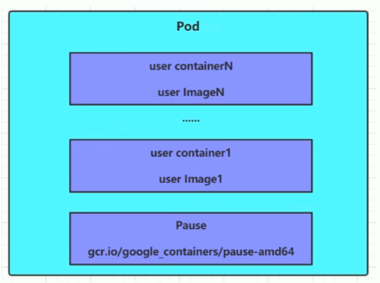
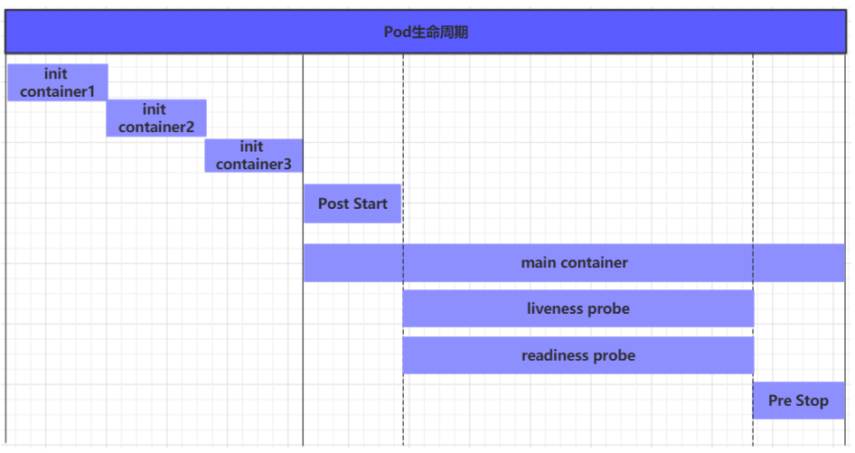
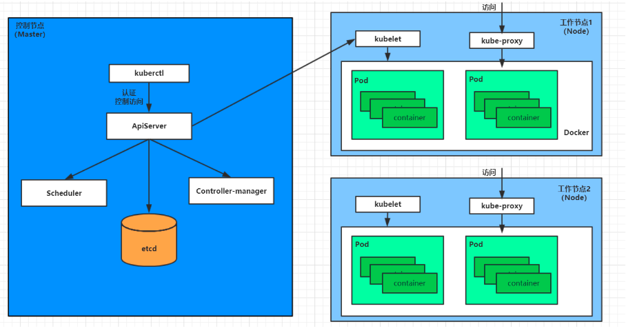

# `Pod` 详解

## 1. `Pod` 介绍

### 1.1 `Pod` 结构



> 每个`Pod` 中都可以包含一个或者多个容器，这些容器可以分为两类：
>
> - 用户程序所在的容器，数量可多可少
> - `Pause` 容器，每个`Pod`都会有一个根容器：作用有两个：
>   1. 以它为依据，评估整个`Pod`的**健康状态**
>   2. 在根容器上设置`IP`**地址**，其他容器都此`ip`（Pod IP）,以实现`Pod`内部的网络通信（这里是`Pod`内部的通讯，`Pod`之间的通讯采用哦虚拟二层网络技术来实现，当前环境用的`Flannel`）

### 1.2 `Pod` 定义

> **资源清单**
>
> ```shell
> apiVersion: v1      #必选，版本号，例如v1
> kind: Pod       　  #必选，资源类型，例如 Pod
> metadata:       　  #必选，元数据
>   name: string      #必选，Pod名称
>   namespace: string #Pod所属的命名空间,默认为"default"
>   labels:       　　 #自定义标签列表
>     - name: string      　      
> spec:              #必选，Pod中容器的详细定义
>   containers:      #必选，Pod中容器列表
>   - name: string   #必选，容器名称
>     image: string  #必选，容器的镜像名称
>     imagePullPolicy: [ Always|Never|IfNotPresent ]  #获取镜像的策略 
>     command: [string]   #容器的启动命令列表，如不指定，使用打包时使用的启动命令
>     args: [string]      #容器的启动命令参数列表
>     workingDir: string  #容器的工作目录
>     volumeMounts:       #挂载到容器内部的存储卷配置
>     - name: string      #引用pod定义的共享存储卷的名称，需用volumes[]部分定义的的卷名
>       mountPath: string #存储卷在容器内mount的绝对路径，应少于512字符
>       readOnly: boolean #是否为只读模式
>     ports: 								#需要暴露的端口库号列表
>     - name: string        #端口的名称
>       containerPort: int  #容器需要监听的端口号
>       hostPort: int       #容器所在主机需要监听的端口号，默认与Container相同
>       protocol: string    #端口协议，支持TCP和UDP，默认TCP
>     env:   					#容器运行前需设置的环境变量列表
>     - name: string  #环境变量名称
>       value: string #环境变量的值
>     resources: 					#资源限制和请求的设置
>       limits:  					#资源限制的设置
>         cpu: string     #Cpu的限制，单位为core数，将用于docker run --cpu-shares参数
>         memory: string  #内存限制，单位可以为Mib/Gib，将用于docker run --memory参数
>       requests: 				#资源请求的设置
>         cpu: string     #Cpu请求，容器启动的初始可用数量
>         memory: string  #内存请求,容器启动的初始可用数量
>     lifecycle: 			#生命周期钩子
>         postStart: 	#容器启动后立即执行此钩子,如果执行失败,会根据重启策略进行重启
>         preStop: 		#容器终止前执行此钩子,无论结果如何,容器都会终止
>     livenessProbe:  #对Pod内各容器健康检查的设置，当探测无响应几次后将自动重启该容器
>       exec:       　 #对Pod容器内检查方式设置为exec方式
>         command: [string]  #exec方式需要制定的命令或脚本
>       httpGet:      			 #对Pod内个容器健康检查方法设置为HttpGet，需要制定Path、port
>         path: string
>         port: number
>         host: string
>         scheme: string
>         HttpHeaders:
>         - name: string
>           value: string
>       tcpSocket:     #对Pod内个容器健康检查方式设置为tcpSocket方式
>          port: number
>        initialDelaySeconds: 0        #容器启动完成后首次探测的时间，单位为秒
>        timeoutSeconds: 0    　　     #对容器健康检查探测等待响应的超时时间，单位秒，默认1秒
>        periodSeconds: 0     　　     #对容器监控检查的定期探测时间设置，单位秒，默认10秒一次
>        successThreshold: 0
>        failureThreshold: 0
>        securityContext:
>          privileged: false
>   restartPolicy: [Always | Never | OnFailure]  #Pod的重启策略
>   nodeName: <string> #设置NodeName表示将该Pod调度到指定到名称的node节点上
>   nodeSelector: obeject #设置NodeSelector表示将该Pod调度到包含这个label的node上
>   imagePullSecrets: #Pull镜像时使用的secret名称，以key：secretkey格式指定
>   - name: string
>   hostNetwork: false   #是否使用主机网络模式，默认为false，如果设置为true，表示使用宿主机网络
>   volumes:   					 #在该pod上定义共享存储卷列表
>   - name: string    	 #共享存储卷名称 （volumes类型有很多种）
>     emptyDir: {}       #类型为emtyDir的存储卷，与Pod同生命周期的一个临时目录。为空值
>     hostPath: string   #类型为hostPath的存储卷，表示挂载Pod所在宿主机的目录
>       path: string     #Pod所在宿主机的目录，将被用于同期中mount的目录
>     secret:       　　　#类型为secret的存储卷，挂载集群与定义的secret对象到容器内部
>       scretname: string  
>       items:   
>       - key: string
>         path: string
>     configMap:         #类型为configMap的存储卷，挂载预定义的configMap对象到容器内部
>       name: string
>       items:
>       - key: string
>         path: string
> ```
>
> 在`kubernetes` 中基本所有资源的一级属性都是一样的，主要包含 5 部分：
>
> - `apiverion` 版本，由 `kubernetes` 内部定义，可以用 `kubectl api-version` 查询
> - `kind` 版本，由`kubernetes`内部定义，可以用 `kubectl api-resouces`查询
> - `metadata`元数据，主要是资源标识和说明，常用的有 `name`、`namespace`、`labels`等
> - `spec`描述，这是配置中最重要的一部分，里面是对各种资源配置的详细描述
> - `status` 状态信息，里面的内容不需要定义，由 `kubernetes`自动生成
>
> 在上面的属性中，`spec` 是重点，常见的子属性：
>
> - `containers <[]Object>` 容器列表，用于定义容器的详细信息
> - `nodeName` 根据`nodeName` 的值将`Pod` 调度到指定的Node节点上
> - `nodeSelector <map[]>` 根据`NodeSelector`中定义的信息选择将该 `Pod` 调度到包含这些`label`的`Node`
> - `hostNetwork` 是否使用主机网络模式，默认为 `false`、如果设置为`true`，表示使用宿主机网络
> - `volumes <[]Object>` 存储卷，用于定义`Pod`上面挂载的存储信息
> - `restartPolicy`重启策略，表示`Pod`在遇到故障的时候处理策略

```shell
# 小提示：
# 在这里，可通过一个命令来查看每种资源的可配置项
# kubectl explain 资源类型		 查看某种资源可以配置的一级属性
# kubectl explain 资源类型.属性 查看属性的子属性

[root@master ~]#  kubectl explain pod
KIND:     Pod
VERSION:  v1
# 描述
DESCRIPTION:
     Pod is a collection of containers that can run on a host. This resource is
     created by clients and scheduled onto hosts.

FIELDS:
   apiVersion   <string>
     APIVersion defines the versioned schema of this representation of an
     object. Servers should convert recognized schemas to the latest internal
     value, and may reject unrecognized values. More info:
     https://git.k8s.io/community/contributors/devel/sig-architecture/api-conventions.md#resources

   kind <string>
     Kind is a string value representing the REST resource this object
     represents. Servers may infer this from the endpoint the client submits
     requests to. Cannot be updated. In CamelCase. More info:
     https://git.k8s.io/community/contributors/devel/sig-architecture/api-conventions.md#types-kinds

   metadata     <Object>
     Standard object's metadata. More info:
     https://git.k8s.io/community/contributors/devel/sig-architecture/api-conventions.md#metadata

   spec <Object>
     Specification of the desired behavior of the pod. More info:
     https://git.k8s.io/community/contributors/devel/sig-architecture/api-conventions.md#spec-and-status

   status       <Object>
     Most recently observed status of the pod. This data may not be up to date.
     Populated by the system. Read-only. More info:
     https://git.k8s.io/community/contributors/devel/sig-architecture/api-conventions.md#spec-and-status
   
# 查看某种资源
[root@master ~]# kubectl explain pod.metadata
KIND:     Pod
VERSION:  v1

RESOURCE: metadata <Object>

DESCRIPTION:
     Standard object's metadata. More info:
     https://git.k8s.io/community/contributors/devel/sig-architecture/api-conventions.md#metadata
 
     ObjectMeta is metadata that all persisted resources must have, which
     includes all objects users must create.

FIELDS:
   annotations  <map[string]string>
     Annotations is an unstructured key value map stored with a resource that
     may be set by external tools to store and retrieve arbitrary metadata. They
     are not queryable and should be preserved when modifying objects. More
     info: http://kubernetes.io/docs/user-guide/annotations

   clusterName  <string>
     The name of the cluster which the object belongs to. This is used to
     distinguish resources with same name and namespace in different clusters.
     This field is not set anywhere right now and apiserver is going to ignore
     it if set in create or update request.

   creationTimestamp    <string>
     CreationTimestamp is a timestamp representing the server time when this
     object was created. It is not guaranteed to be set in happens-before order
     across separate operations. Clients may not set this value. It is
     represented in RFC3339 form and is in UTC. Populated by the system.
     Read-only. Null for lists. More info:
     https://git.k8s.io/community/contributors/devel/sig-architecture/api-conventions.md#metadata

   deletionGracePeriodSeconds   <integer>
     Number of seconds allowed for this object to gracefully terminate before it
     will be removed from the system. Only set when deletionTimestamp is also
     set. May only be shortened. Read-only.

   deletionTimestamp    <string>
     DeletionTimestamp is RFC 3339 date and time at which this resource will be
     deleted. This field is set by the server when a graceful deletion is
     requested by the user, and is not directly settable by a client. The
     resource is expected to be deleted (no longer visible from resource lists,
     and not reachable by name) after the time in this field, once the
     finalizers list is empty. As long as the finalizers list contains items,
     deletion is blocked. Once the deletionTimestamp is set, this value may not
     be unset or be set further into the future, although it may be shortened or
     the resource may be deleted prior to this time. For example, a user may
     request that a pod is deleted in 30 seconds. The Kubelet will react by
     sending a graceful termination signal to the containers in the pod. After
     that 30 seconds, the Kubelet will send a hard termination signal (SIGKILL)
     to the container and after cleanup, remove the pod from the API. In the
     presence of network partitions, this object may still exist after this
     timestamp, until an administrator or automated process can determine the
     resource is fully terminated. If not set, graceful deletion of the object
     has not been requested. Populated by the system when a graceful deletion is
     requested. Read-only. More info:
     https://git.k8s.io/community/contributors/devel/sig-architecture/api-conventions.md#metadata

   finalizers   <[]string>
     Must be empty before the object is deleted from the registry. Each entry is
     an identifier for the responsible component that will remove the entry from
     the list. If the deletionTimestamp of the object is non-nil, entries in
     this list can only be removed. Finalizers may be processed and removed in
     any order. Order is NOT enforced because it introduces significant risk of
     stuck finalizers. finalizers is a shared field, any actor with permission
     can reorder it. If the finalizer list is processed in order, then this can
     lead to a situation in which the component responsible for the first
     finalizer in the list is waiting for a signal (field value, external
     system, or other) produced by a component responsible for a finalizer later
     in the list, resulting in a deadlock. Without enforced ordering finalizers
     are free to order amongst themselves and are not vulnerable to ordering
     changes in the list.

   generateName <string>
     GenerateName is an optional prefix, used by the server, to generate a
     unique name ONLY IF the Name field has not been provided. If this field is
     used, the name returned to the client will be different than the name
     passed. This value will also be combined with a unique suffix. The provided
     value has the same validation rules as the Name field, and may be truncated
     by the length of the suffix required to make the value unique on the
     server. If this field is specified and the generated name exists, the
     server will NOT return a 409 - instead, it will either return 201 Created
     or 500 with Reason ServerTimeout indicating a unique name could not be
     found in the time allotted, and the client should retry (optionally after
     the time indicated in the Retry-After header). Applied only if Name is not
     specified. More info:
     https://git.k8s.io/community/contributors/devel/sig-architecture/api-conventions.md#idempotency

   generation   <integer>
     A sequence number representing a specific generation of the desired state.
     Populated by the system. Read-only.

   labels       <map[string]string>
     Map of string keys and values that can be used to organize and categorize
     (scope and select) objects. May match selectors of replication controllers
     and services. More info: http://kubernetes.io/docs/user-guide/labels

   managedFields        <[]Object>
     ManagedFields maps workflow-id and version to the set of fields that are
     managed by that workflow. This is mostly for internal housekeeping, and
     users typically shouldn't need to set or understand this field. A workflow
     can be the user's name, a controller's name, or the name of a specific
     apply path like "ci-cd". The set of fields is always in the version that
     the workflow used when modifying the object.

   name <string>
     Name must be unique within a namespace. Is required when creating
     resources, although some resources may allow a client to request the
     generation of an appropriate name automatically. Name is primarily intended
     for creation idempotence and configuration definition. Cannot be updated.
     More info: http://kubernetes.io/docs/user-guide/identifiers#names

   namespace    <string>
     Namespace defines the space within each name must be unique. An empty
     namespace is equivalent to the "default" namespace, but "default" is the
     canonical representation. Not all objects are required to be scoped to a
     namespace - the value of this field for those objects will be empty. Must
     be a DNS_LABEL. Cannot be updated. More info:
     http://kubernetes.io/docs/user-guide/namespaces

   ownerReferences      <[]Object>
     List of objects depended by this object. If ALL objects in the list have
     been deleted, this object will be garbage collected. If this object is
     managed by a controller, then an entry in this list will point to this
     controller, with the controller field set to true. There cannot be more
     than one managing controller.

   resourceVersion      <string>
     An opaque value that represents the internal version of this object that
     can be used by clients to determine when objects have changed. May be used
     for optimistic concurrency, change detection, and the watch operation on a
     resource or set of resources. Clients must treat these values as opaque and
     passed unmodified back to the server. They may only be valid for a
     particular resource or set of resources. Populated by the system.
     Read-only. Value must be treated as opaque by clients and . More info:
     https://git.k8s.io/community/contributors/devel/sig-architecture/api-conventions.md#concurrency-control-and-consistency

   selfLink     <string>
     SelfLink is a URL representing this object. Populated by the system.
     Read-only. DEPRECATED Kubernetes will stop propagating this field in 1.20
     release and the field is planned to be removed in 1.21 release.

   uid  <string>
     UID is the unique in time and space value for this object. It is typically
     generated by the server on successful creation of a resource and is not
     allowed to change on PUT operations. Populated by the system. Read-only.
     More info: http://kubernetes.io/docs/user-guide/identifiers#uids
   
# 可以继续点击
[root@master ~]# kubectl explain pod.metadata.managedFields
KIND:     Pod
VERSION:  v1

RESOURCE: managedFields <[]Object>

DESCRIPTION:
     ManagedFields maps workflow-id and version to the set of fields that are
     managed by that workflow. This is mostly for internal housekeeping, and
     users typically shouldn't need to set or understand this field. A workflow
     can be the user's name, a controller's name, or the name of a specific
     apply path like "ci-cd". The set of fields is always in the version that
     the workflow used when modifying the object.

     ManagedFieldsEntry is a workflow-id, a FieldSet and the group version of
     the resource that the fieldset applies to.

FIELDS:
   apiVersion   <string>
     APIVersion defines the version of this resource that this field set applies
     to. The format is "group/version" just like the top-level APIVersion field.
     It is necessary to track the version of a field set because it cannot be
     automatically converted.

   fieldsType   <string>
     FieldsType is the discriminator for the different fields format and
     version. There is currently only one possible value: "FieldsV1"

   fieldsV1     <map[string]>
     FieldsV1 holds the first JSON version format as described in the "FieldsV1"
     type.

   manager      <string>
     Manager is an identifier of the workflow managing these fields.

   operation    <string>
     Operation is the type of operation which lead to this ManagedFieldsEntry
     being created. The only valid values for this field are 'Apply' and
     'Update'.

   time <string>
     Time is timestamp of when these fields were set. It should always be empty
     if Operation is 'Apply'
[root@master ~]# kubectl api-versions
admissionregistration.k8s.io/v1
admissionregistration.k8s.io/v1beta1
apiextensions.k8s.io/v1
apiextensions.k8s.io/v1beta1
apiregistration.k8s.io/v1
apiregistration.k8s.io/v1beta1
apps/v1
authentication.k8s.io/v1
authentication.k8s.io/v1beta1
authorization.k8s.io/v1
authorization.k8s.io/v1beta1
autoscaling/v1
autoscaling/v2beta1
autoscaling/v2beta2
batch/v1
batch/v1beta1
certificates.k8s.io/v1beta1
coordination.k8s.io/v1
coordination.k8s.io/v1beta1
discovery.k8s.io/v1beta1
events.k8s.io/v1beta1
extensions/v1beta1
networking.k8s.io/v1
networking.k8s.io/v1beta1
node.k8s.io/v1beta1
policy/v1beta1
rbac.authorization.k8s.io/v1
rbac.authorization.k8s.io/v1beta1
scheduling.k8s.io/v1
scheduling.k8s.io/v1beta1
storage.k8s.io/v1
storage.k8s.io/v1beta1
v1
[root@master ~]# kubectl api-resources
NAME                              SHORTNAMES   APIGROUP                       NAMESPACED   KIND
bindings                                                                      true         Binding
componentstatuses                 cs                                          false        ComponentStatus
configmaps                        cm                                          true         ConfigMap
endpoints                         ep                                          true         Endpoints
events                            ev                                          true         Event
limitranges                       limits                                      true         LimitRange
namespaces                        ns                                          false        Namespace
nodes                             no                                          false        Node
persistentvolumeclaims            pvc                                         true         PersistentVolumeClaim
persistentvolumes                 pv                                          false        PersistentVolume
pods                              po                                          true         Pod
podtemplates                                                                  true         PodTemplate
replicationcontrollers            rc                                          true         ReplicationController
resourcequotas                    quota                                       true         ResourceQuota
secrets                                                                       true         Secret
serviceaccounts                   sa                                          true         ServiceAccount
services                          svc                                         true         Service
mutatingwebhookconfigurations                  admissionregistration.k8s.io   false        MutatingWebhookConfiguration
validatingwebhookconfigurations                admissionregistration.k8s.io   false        ValidatingWebhookConfiguration
customresourcedefinitions         crd,crds     apiextensions.k8s.io           false        CustomResourceDefinition
apiservices                                    apiregistration.k8s.io         false        APIService
controllerrevisions                            apps                           true         ControllerRevision
daemonsets                        ds           apps                           true         DaemonSet
deployments                       deploy       apps                           true         Deployment
replicasets                       rs           apps                           true         ReplicaSet
statefulsets                      sts          apps                           true         StatefulSet
tokenreviews                                   authentication.k8s.io          false        TokenReview
localsubjectaccessreviews                      authorization.k8s.io           true         LocalSubjectAccessReview
selfsubjectaccessreviews                       authorization.k8s.io           false        SelfSubjectAccessReview
selfsubjectrulesreviews                        authorization.k8s.io           false        SelfSubjectRulesReview
subjectaccessreviews                           authorization.k8s.io           false        SubjectAccessReview
horizontalpodautoscalers          hpa          autoscaling                    true         HorizontalPodAutoscaler
cronjobs                          cj           batch                          true         CronJob
jobs                                           batch                          true         Job
certificatesigningrequests        csr          certificates.k8s.io            false        CertificateSigningRequest
leases                                         coordination.k8s.io            true         Lease
endpointslices                                 discovery.k8s.io               true         EndpointSlice
events                            ev           events.k8s.io                  true         Event
ingresses                         ing          extensions                     true         Ingress
ingresses                         ing          networking.k8s.io              true         Ingress
networkpolicies                   netpol       networking.k8s.io              true         NetworkPolicy
runtimeclasses                                 node.k8s.io                    false        RuntimeClass
poddisruptionbudgets              pdb          policy                         true         PodDisruptionBudget
podsecuritypolicies               psp          policy                         false        PodSecurityPolicy
clusterrolebindings                            rbac.authorization.k8s.io      false        ClusterRoleBinding
clusterroles                                   rbac.authorization.k8s.io      false        ClusterRole
rolebindings                                   rbac.authorization.k8s.io      true         RoleBinding
roles                                          rbac.authorization.k8s.io      true         Role
priorityclasses                   pc           scheduling.k8s.io              false        PriorityClass
csidrivers                                     storage.k8s.io                 false        CSIDriver
csinodes                                       storage.k8s.io                 false        CSINode
storageclasses                    sc           storage.k8s.io                 false        StorageClass
volumeattachments                              storage.k8s.io                 false        VolumeAttachment
[root@master ~]# kubectl get pods -n dev 
NAME                     READY   STATUS    RESTARTS   AGE
nginx-64777cd554-7snm4   1/1     Running   0          4d19h
nginx-64777cd554-sjpkm   1/1     Running   0          4d19h
nginx-64777cd554-vbjsd   1/1     Running   0          4d19h
[root@master ~]# kubectl get pods nginx-64777cd554-7snm4 -n dev -o yaml
apiVersion: v1
kind: Pod
metadata:
  creationTimestamp: "2024-02-29T10:35:07Z"
  generateName: nginx-64777cd554-
  labels:
    pod-template-hash: 64777cd554
    run: nginx
  name: nginx-64777cd554-7snm4
  namespace: dev
  ownerReferences:
  - apiVersion: apps/v1
    blockOwnerDeletion: true
    controller: true
    kind: ReplicaSet
    name: nginx-64777cd554
    uid: 2eeca344-c9d5-4b5b-aa23-3a1f3de1d2b3
  resourceVersion: "442828"
  selfLink: /api/v1/namespaces/dev/pods/nginx-64777cd554-7snm4
  uid: ca2d66bc-a413-4544-be2e-574da2ef5faf
spec:
  containers:
  - image: nginx:1.17.1
    imagePullPolicy: IfNotPresent
    name: nginx
    ports:
    - containerPort: 80
      protocol: TCP
    resources: {}
    terminationMessagePath: /dev/termination-log
    terminationMessagePolicy: File
    volumeMounts:
    - mountPath: /var/run/secrets/kubernetes.io/serviceaccount
      name: default-token-bncww
      readOnly: true
  dnsPolicy: ClusterFirst
  enableServiceLinks: true
  nodeName: node2
  priority: 0
  restartPolicy: Always
  schedulerName: default-scheduler
  securityContext: {}
  serviceAccount: default
  serviceAccountName: default
  terminationGracePeriodSeconds: 30
  tolerations:
  - effect: NoExecute
    key: node.kubernetes.io/not-ready
    operator: Exists
    tolerationSeconds: 300
  - effect: NoExecute
    key: node.kubernetes.io/unreachable
    operator: Exists
    tolerationSeconds: 300
  volumes:
  - name: default-token-bncww
    secret:
      defaultMode: 420
      secretName: default-token-bncww
status:
  conditions:
  - lastProbeTime: null
    lastTransitionTime: "2024-02-29T10:35:07Z"
    status: "True"
    type: Initialized
  - lastProbeTime: null
    lastTransitionTime: "2024-02-29T10:35:08Z"
    status: "True"
    type: Ready
  - lastProbeTime: null
    lastTransitionTime: "2024-02-29T10:35:08Z"
    status: "True"
    type: ContainersReady
  - lastProbeTime: null
    lastTransitionTime: "2024-02-29T10:35:07Z"
    status: "True"
    type: PodScheduled
  containerStatuses:
  - containerID: docker://a59191746d614341aab3a8a9dec085239d2efe373a4565a3f242e2e32ad307d6
    image: nginx:1.17.1
    imageID: docker-pullable://nginx@sha256:b4b9b3eee194703fc2fa8afa5b7510c77ae70cfba567af1376a573a967c03dbb
    lastState: {}
    name: nginx
    ready: true
    restartCount: 0
    started: true
    state:
      running:
        startedAt: "2024-02-29T10:35:08Z"
  hostIP: 192.168.2.108
  phase: Running
  podIP: 10.244.2.24
  podIPs:
  - ip: 10.244.2.24
  qosClass: BestEffort
  startTime: "2024-02-29T10:35:07Z"
  
# 查看描述信息
[root@master ~]# kubectl explain pod.spec
KIND:     Pod
VERSION:  v1

RESOURCE: spec <Object>

DESCRIPTION:
     Specification of the desired behavior of the pod. More info:
     https://git.k8s.io/community/contributors/devel/sig-architecture/api-conventions.md#spec-and-status

     PodSpec is a description of a pod.

FIELDS:
   activeDeadlineSeconds        <integer>
     Optional duration in seconds the pod may be active on the node relative to
     StartTime before the system will actively try to mark it failed and kill
     associated containers. Value must be a positive integer.

   affinity     <Object>
     If specified, the pod's scheduling constraints

   automountServiceAccountToken <boolean>
     AutomountServiceAccountToken indicates whether a service account token
     should be automatically mounted.

   containers   <[]Object> -required-
     List of containers belonging to the pod. Containers cannot currently be
     added or removed. There must be at least one container in a Pod. Cannot be
     updated.

   dnsConfig    <Object>
     Specifies the DNS parameters of a pod. Parameters specified here will be
     merged to the generated DNS configuration based on DNSPolicy.

   dnsPolicy    <string>
     Set DNS policy for the pod. Defaults to "ClusterFirst". Valid values are
     'ClusterFirstWithHostNet', 'ClusterFirst', 'Default' or 'None'. DNS
     parameters given in DNSConfig will be merged with the policy selected with
     DNSPolicy. To have DNS options set along with hostNetwork, you have to
     specify DNS policy explicitly to 'ClusterFirstWithHostNet'.

   enableServiceLinks   <boolean>
     EnableServiceLinks indicates whether information about services should be
     injected into pod's environment variables, matching the syntax of Docker
     links. Optional: Defaults to true.

   ephemeralContainers  <[]Object>
     List of ephemeral containers run in this pod. Ephemeral containers may be
     run in an existing pod to perform user-initiated actions such as debugging.
     This list cannot be specified when creating a pod, and it cannot be
     modified by updating the pod spec. In order to add an ephemeral container
     to an existing pod, use the pod's ephemeralcontainers subresource. This
     field is alpha-level and is only honored by servers that enable the
     EphemeralContainers feature.

   hostAliases  <[]Object>
     HostAliases is an optional list of hosts and IPs that will be injected into
     the pod's hosts file if specified. This is only valid for non-hostNetwork
     pods.

   hostIPC      <boolean>
     Use the host's ipc namespace. Optional: Default to false.

   hostNetwork  <boolean>
     Host networking requested for this pod. Use the host's network namespace.
     If this option is set, the ports that will be used must be specified.
     Default to false.

   hostPID      <boolean>
     Use the host's pid namespace. Optional: Default to false.

   hostname     <string>
     Specifies the hostname of the Pod If not specified, the pod's hostname will
     be set to a system-defined value.

   imagePullSecrets     <[]Object>
     ImagePullSecrets is an optional list of references to secrets in the same
     namespace to use for pulling any of the images used by this PodSpec. If
     specified, these secrets will be passed to individual puller
     implementations for them to use. For example, in the case of docker, only
     DockerConfig type secrets are honored. More info:
     https://kubernetes.io/docs/concepts/containers/images#specifying-imagepullsecrets-on-a-pod

   initContainers       <[]Object>
     List of initialization containers belonging to the pod. Init containers are
     executed in order prior to containers being started. If any init container
     fails, the pod is considered to have failed and is handled according to its
     restartPolicy. The name for an init container or normal container must be
     unique among all containers. Init containers may not have Lifecycle
     actions, Readiness probes, Liveness probes, or Startup probes. The
     resourceRequirements of an init container are taken into account during
     scheduling by finding the highest request/limit for each resource type, and
     then using the max of of that value or the sum of the normal containers.
     Limits are applied to init containers in a similar fashion. Init containers
     cannot currently be added or removed. Cannot be updated. More info:
     https://kubernetes.io/docs/concepts/workloads/pods/init-containers/

   nodeName     <string>
     NodeName is a request to schedule this pod onto a specific node. If it is
     non-empty, the scheduler simply schedules this pod onto that node, assuming
     that it fits resource requirements.

   nodeSelector <map[string]string>
     NodeSelector is a selector which must be true for the pod to fit on a node.
     Selector which must match a node's labels for the pod to be scheduled on
     that node. More info:
     https://kubernetes.io/docs/concepts/configuration/assign-pod-node/

   overhead     <map[string]string>
     Overhead represents the resource overhead associated with running a pod for
     a given RuntimeClass. This field will be autopopulated at admission time by
     the RuntimeClass admission controller. If the RuntimeClass admission
     controller is enabled, overhead must not be set in Pod create requests. The
     RuntimeClass admission controller will reject Pod create requests which
     have the overhead already set. If RuntimeClass is configured and selected
     in the PodSpec, Overhead will be set to the value defined in the
     corresponding RuntimeClass, otherwise it will remain unset and treated as
     zero. More info:
     https://git.k8s.io/enhancements/keps/sig-node/20190226-pod-overhead.md This
     field is alpha-level as of Kubernetes v1.16, and is only honored by servers
     that enable the PodOverhead feature.

   preemptionPolicy     <string>
     PreemptionPolicy is the Policy for preempting pods with lower priority. One
     of Never, PreemptLowerPriority. Defaults to PreemptLowerPriority if unset.
     This field is alpha-level and is only honored by servers that enable the
     NonPreemptingPriority feature.

   priority     <integer>
     The priority value. Various system components use this field to find the
     priority of the pod. When Priority Admission Controller is enabled, it
     prevents users from setting this field. The admission controller populates
     this field from PriorityClassName. The higher the value, the higher the
     priority.

   priorityClassName    <string>
     If specified, indicates the pod's priority. "system-node-critical" and
     "system-cluster-critical" are two special keywords which indicate the
     highest priorities with the former being the highest priority. Any other
     name must be defined by creating a PriorityClass object with that name. If
     not specified, the pod priority will be default or zero if there is no
     default.

   readinessGates       <[]Object>
     If specified, all readiness gates will be evaluated for pod readiness. A
     pod is ready when all its containers are ready AND all conditions specified
     in the readiness gates have status equal to "True" More info:
     https://git.k8s.io/enhancements/keps/sig-network/0007-pod-ready%2B%2B.md

   restartPolicy        <string>
     Restart policy for all containers within the pod. One of Always, OnFailure,
     Never. Default to Always. More info:
     https://kubernetes.io/docs/concepts/workloads/pods/pod-lifecycle/#restart-policy

   runtimeClassName     <string>
     RuntimeClassName refers to a RuntimeClass object in the node.k8s.io group,
     which should be used to run this pod. If no RuntimeClass resource matches
     the named class, the pod will not be run. If unset or empty, the "legacy"
     RuntimeClass will be used, which is an implicit class with an empty
     definition that uses the default runtime handler. More info:
     https://git.k8s.io/enhancements/keps/sig-node/runtime-class.md This is a
     beta feature as of Kubernetes v1.14.

   schedulerName        <string>
     If specified, the pod will be dispatched by specified scheduler. If not
     specified, the pod will be dispatched by default scheduler.

   securityContext      <Object>
     SecurityContext holds pod-level security attributes and common container
     settings. Optional: Defaults to empty. See type description for default
     values of each field.

   serviceAccount       <string>
     DeprecatedServiceAccount is a depreciated alias for ServiceAccountName.
     Deprecated: Use serviceAccountName instead.

   serviceAccountName   <string>
     ServiceAccountName is the name of the ServiceAccount to use to run this
     pod. More info:
     https://kubernetes.io/docs/tasks/configure-pod-container/configure-service-account/

   shareProcessNamespace        <boolean>
     Share a single process namespace between all of the containers in a pod.
     When this is set containers will be able to view and signal processes from
     other containers in the same pod, and the first process in each container
     will not be assigned PID 1. HostPID and ShareProcessNamespace cannot both
     be set. Optional: Default to false.

   subdomain    <string>
     If specified, the fully qualified Pod hostname will be
     "<hostname>.<subdomain>.<pod namespace>.svc.<cluster domain>". If not
     specified, the pod will not have a domainname at all.

   terminationGracePeriodSeconds        <integer>
     Optional duration in seconds the pod needs to terminate gracefully. May be
     decreased in delete request. Value must be non-negative integer. The value
     zero indicates delete immediately. If this value is nil, the default grace
     period will be used instead. The grace period is the duration in seconds
     after the processes running in the pod are sent a termination signal and
     the time when the processes are forcibly halted with a kill signal. Set
     this value longer than the expected cleanup time for your process. Defaults
     to 30 seconds.

   tolerations  <[]Object>
     If specified, the pod's tolerations.

   topologySpreadConstraints    <[]Object>
     TopologySpreadConstraints describes how a group of pods ought to spread
     across topology domains. Scheduler will schedule pods in a way which abides
     by the constraints. This field is alpha-level and is only honored by
     clusters that enables the EvenPodsSpread feature. All
     topologySpreadConstraints are ANDed.

   volumes      <[]Object>
     List of volumes that can be mounted by containers belonging to the pod.
     More info: https://kubernetes.io/docs/concepts/storage/volumes
```

## 2. `Pod`配置

> `Pod.spec.containers`属性，是`Pod`配置中最为关键的一项配置
>
> ```shell
> [root@master ~]# kubectl explain pod.spec.containers
> KIND:     Pod
> VERSION:  v1
>
> # 数组 ，代表多个容器
> RESOURCE: containers <[]Object>
> # 描述
> DESCRIPTION:
> FIELDS:
> 	 # 容器的启动命令需要的参数列表
>    args <[]string>
>    # 容器启动命令命令列表，如不指定，使用打包时使用的启动命令
>    command      <[]string>
> 	 # 容器环境变量的配置
>    env  <[]Object>
>    envFrom      <[]Object>
>    # 容器需要的镜像地址
>    image        <string>
> 	 # 镜像拉去策略
>    imagePullPolicy      <string>
>    lifecycle    <Object>
>    livenessProbe        <Object>
> 	 # 容器名称
>    name <string> -required-
> 	 # 容器需要暴漏的端口号列表
>    ports        <[]Object>
> 	 # 
>    readinessProbe       <Object>
>    # 资源限制和资源请求设置
>    resources    <Object>
>    securityContext      <Object>
>    startupProbe <Object>
>    stdin        <boolean>
>    stdinOnce    <boolean>
>    terminationMessagePath       <string>
>    terminationMessagePolicy     <string>
>
>    tty  <boolean>
>    volumeDevices        <[]Object>
>    volumeMounts <[]Object>
>    workingDir   <string>
>
> ```

### 2.1 基本配置

```shell
# 创建 pod-base.yaml 文件
apiVersion: v1
kind: Pod
metadata:
  name: pod-base
  namespace: dev
  labels:
    user: heima
spec:
  containers:
  - name: nginx
    image: nginx:1.17.1
  - name: busybox
    image: busybox:1.30
```

上面定义了一个比较简单的Pod 的配置，里面有两个容器：

- `nginx`：用`1.17.1`版本的 `nginx` 镜像创建，（`nginx` 是一个轻量级 `web` 容器）
- busybox：用`1.30` 版本的`busybox`镜像创建，（`busybox 是一个小巧的linux 命令集合`）

```shell
[root@master ~]# kubectl delete ns dev
namespace "dev" deleted
[root@master ~]# kubectl get ns 
NAME              STATUS   AGE
default           Active   6d23h
kube-flannel      Active   6d23h
kube-node-lease   Active   6d23h
kube-public       Active   6d23h
kube-system       Active   6d23h
[root@master ~]# kubectl create ns dev
namespace/dev created
[root@master ~]# vim pod-base.yaml
[root@master ~]# mv pod-base.yaml /root/Download/
[root@master ~]# cd Download/

# 创建Pod
[root@master Download]# kubectl create -f pod-base.yaml 
pod/pod-base created
[root@master Download]# kubectl get pods -n dev
NAME       READY   STATUS              RESTARTS   AGE
pod-base   0/2     ContainerCreating   0          10s
[root@master Download]# kubectl get pods -n dev
NAME       READY   STATUS             RESTARTS   AGE
pod-base   1/2     CrashLoopBackOff   1          30s

# 查看Pod状况
# READY 1/2 : 表示当前Pod中有2个容器，其中1个准备就绪，1个未就绪
# RESTARTS  : 重启次数，因为有1个容器故障了，Pod一直在重启试图恢复它
[root@master Download]# kubectl get pods -n dev
NAME       READY   STATUS    RESTARTS   AGE
pod-base   1/2     Running   2          44s

# 通过 describe 查看内部的详情
# 此时已经运行起来了一个基本的 Pod，虽然它暂时有问题
[root@master Download]# kubectl describe pods pod-base -n dev
Name:         pod-base
Namespace:    dev
Priority:     0
Node:         node2/192.168.2.108
Start Time:   Mon, 04 Mar 2024 22:28:38 -0800
Labels:       user=heima
Annotations:  <none>
Status:       Running
IP:           10.244.2.25
IPs:
  IP:  10.244.2.25
Containers:
  nginx:
    Container ID:   docker://29d7c500893ee9221cd683c3be55c6e821d208557b4f46cd5cb0b1dcf58df510
    Image:          nginx:1.17.1
    Image ID:       docker-pullable://nginx@sha256:b4b9b3eee194703fc2fa8afa5b7510c77ae70cfba567af1376a573a967c03dbb
    Port:           <none>
    Host Port:      <none>
    State:          Running
      Started:      Mon, 04 Mar 2024 22:28:39 -0800
    Ready:          True
    Restart Count:  0
    Environment:    <none>
    Mounts:
      /var/run/secrets/kubernetes.io/serviceaccount from default-token-2k89b (ro)
  busybox:
    Container ID:   docker://bb5645cbdb2b09819261b35a64d81feb517e8dee52e0fc80d4012cc64bbc0e91
    Image:          busybox:1.30
    Image ID:       docker-pullable://busybox@sha256:4b6ad3a68d34da29bf7c8ccb5d355ba8b4babcad1f99798204e7abb43e54ee3d
    Port:           <none>
    Host Port:      <none>
    State:          Waiting
      Reason:       CrashLoopBackOff
    Last State:     Terminated
      Reason:       Completed
      Exit Code:    0
      Started:      Mon, 04 Mar 2024 22:30:40 -0800
      Finished:     Mon, 04 Mar 2024 22:30:40 -0800
    Ready:          False
    Restart Count:  4
    Environment:    <none>
    Mounts:
      /var/run/secrets/kubernetes.io/serviceaccount from default-token-2k89b (ro)
Conditions:
  Type              Status
  Initialized       True 
  Ready             False 
  ContainersReady   False 
  PodScheduled      True 
Volumes:
  default-token-2k89b:
    Type:        Secret (a volume populated by a Secret)
    SecretName:  default-token-2k89b
    Optional:    false
QoS Class:       BestEffort
Node-Selectors:  <none>
Tolerations:     node.kubernetes.io/not-ready:NoExecute for 300s
                 node.kubernetes.io/unreachable:NoExecute for 300s
Events:
  Type     Reason     Age                  From               Message
  ----     ------     ----                 ----               -------
  Normal   Scheduled  2m45s                default-scheduler  Successfully assigned dev/pod-base to node2
  Normal   Pulled     2m44s                kubelet, node2     Container image "nginx:1.17.1" already present on machine
  Normal   Created    2m44s                kubelet, node2     Created container nginx
  Normal   Started    2m44s                kubelet, node2     Started container nginx
  Normal   Pulling    2m44s                kubelet, node2     Pulling image "busybox:1.30"
  Normal   Pulled     2m22s                kubelet, node2     Successfully pulled image "busybox:1.30"
  Normal   Created    98s (x4 over 2m22s)  kubelet, node2     Created container busybox
  Normal   Started    97s (x4 over 2m22s)  kubelet, node2     Started container busybox
  Warning  BackOff    59s (x8 over 2m20s)  kubelet, node2     Back-off restarting failed container
  Normal   Pulled     44s (x4 over 2m21s)  kubelet, node2     Container image "busybox:1.30" already present on machine

```

### 2.2 镜像拉取

```sh
# 创建 pod-imagepullpollicy.yaml 文件
apiVersion: v1
kind: Pod
metadata:
  name: pod-imagepullpolicy
  namespace: dev
spec:
  containers:
  - name: nginx
    image: nginx:1.17.1
    # 用于设置镜像拉取策略
    imagePullPolicy: Never 
  - name: busybox
    image: busybox:1.30
```

> `imagePullPolicy`用于设置镜像拉去策略，`kubernetes`支持配置三种拉去策略：
>
> - `Always`：总是从远程仓库拉取镜像（一直远程下载）
> - `IfNotPresent`：本地有责使用本地镜像，本地没有责从远程仓库拉取镜像
> - `Never`：使用本地镜像，从不远程仓库拉取，一直使用本地
>
>> 默认值说明：
>>
>> ```
>> 如果镜像 tag 为具体版本号，比如 image: nginx:1.17.1 这种，在不指定策略的情况下 ，默认策略是：
>> ```
>>
>> `IfNotPresent`
>>
>> ```
>> 如果镜像 tag 为：latest （最终版本），默认策略是
>> ```
>>
>> `always`
>>

### 2.3 启动命令

在前面的案例中，一只有一个问题没有解决，就是`busybox` 容器一只没有成功运行，那么到底是什么原因导致这个容器的故障呢？

`busybox`容器并不是一个程序，而是类似于工具类的集合，`kubernetes`集群启动管理后，回自动关闭，解决方法就是让其一直在运行，这就用到了 `command`配置

```shell
# 创建 pod-command.yaml 文件
apiVersion: v1
kind: Pod
metadata:
  name: pod-command
  namespace: dev
spec:
  containers:
  - name: nginx
    image: nginx:1.17.1
  - name: busybox
    image: busybox:1.30
    command: ["/bin/sh","-c","touch /tmp/hello.txt;while true;do /bin/echo $(date +%T) >> /tmp/hello.txt; sleep 3; done;"]
```

```shell
[root@master Download]# vim pod-command.yml
[root@master Download]# kubectl create -f pod-command.yml 
pod/pod-command created
[root@master Download]# kubectl get pods -n dev
NAME          READY   STATUS              RESTARTS   AGE
pod-base      1/2     CrashLoopBackOff    22         91m
pod-command   0/2     ContainerCreating   0          10s
[root@master Download]# kubectl get pods -n dev
NAME          READY   STATUS             RESTARTS   AGE
pod-base      1/2     CrashLoopBackOff   22         92m
pod-command   2/2     Running            0          79s

# 进入pod中的busybox容器，查看文件内容
# 补充一个命令: kubectl exec  pod名称 -n 命名空间 -it -c 容器名称 /bin/sh  在容器内部执行命令
# 使用这个命令就可以进入某个容器的内部，然后进行相关操作了
# 比如，可以查看txt文件的内容
[root@master Download]# kubectl exec pod-command -n dev -it -c busybox /bin/sh
/ # tail -f /tmp/hello.txt 
09:18:41
09:18:44
09:18:47
^C
/ # exit
command terminated with exit code 130

```

> `command` 用于在`pod`中的容器初始化完毕后运行一个命令
>
> 稍微解释一下上面的命令
>
> "/bin/sh","-c",    使用`sh` 执行命令
>
> touch /tmp/hello.txt;      创建 /tmp/hello.txt 文件
>
> while true;do /bin/echo $(date +%T) >> /tmp/hello.txt; sleep 3; done;  每隔3秒向文件中写入当前时间

```shell
特别说明：
    通过上面发现command已经可以完成启动命令和传递参数的功能，为什么这里还要提供一个args选项，用于传递参数呢?这其实跟docker有点关系，kubernetes中的command、args两项其实是实现覆盖Dockerfile中ENTRYPOINT的功能。
 1 如果command和args均没有写，那么用Dockerfile的配置。
 2 如果command写了，但args没有写，那么Dockerfile默认的配置会被忽略，执行输入的command
 3 如果command没写，但args写了，那么Dockerfile中配置的ENTRYPOINT的命令会被执行，使用当前args的参数
 4 如果command和args都写了，那么Dockerfile的配置被忽略，执行command并追加上args参数
```

### 2.4 环境变量

```shell
# 创建 pod-env.yaml 文件
apiVersion: v1
kind: Pod
metadata:
  name: pod-env
  namespace: dev
spec:
  containers:
  - name: busybox
    image: busybox:1.30
    command: ["/bin/sh","-c","while true;do /bin/echo $(date +%T);sleep 60; done;"]
    env: # 设置环境变量列表
    - name: "username"
      value: "admin"
    - name: "password"
      value: "123456"
```

```shell
# env，环境变量，用于在pod中的容器设置环境变量。
[root@master Download]# vim pod-env.yaml 
[root@master Download]# kubectl create -f pod-env.yaml
pod/pod-env created
[root@master Download]# kubectl get pods -n dev
NAME          READY   STATUS             RESTARTS   AGE
pod-base      1/2     CrashLoopBackOff   38         174m
pod-command   2/2     Running            0          83m
pod-env       1/1     Running            0          16s

# 进入容器，输出环境变量
[root@master Download]# kubectl exec pod-env -n dev -c busybox -it /bin/sh
/ # echo $username
admin
/ # echo $password
123456

```

> 这种方式不是很推荐，推荐将这些配置单独存储在配置文件中，这种方式将在后面介绍。

### 2.5 端口设置

介绍容器的端口设置，也就是 `containers`的`ports`选项

```shell
# ports 支持的子选项：
[root@k8s-master01 ~]# kubectl explain pod.spec.containers.ports
KIND:     Pod
VERSION:  v1
RESOURCE: ports <[]Object>
FIELDS:
   name         <string>  # 端口名称，如果指定，必须保证name在pod中是唯一的
   containerPort<integer> # 容器要监听的端口(0<x<65536)
   hostPort     <integer> # 容器要在主机上公开的端口，如果设置，主机上只能运行容器的一个副本(一般省略) 
   hostIP       <string>  # 要将外部端口绑定到的主机IP(一般省略)
   protocol     <string>  # 端口协议。必须是UDP、TCP或SCTP。默认为“TCP”。
```

```shell
[root@master ~]# kubectl explain pod.spec.containers.ports
KIND:     Pod
VERSION:  v1

RESOURCE: ports <[]Object>

DESCRIPTION:
     List of ports to expose from the container. Exposing a port here gives the
     system additional information about the network connections a container
     uses, but is primarily informational. Not specifying a port here DOES NOT
     prevent that port from being exposed. Any port which is listening on the
     default "0.0.0.0" address inside a container will be accessible from the
     network. Cannot be updated.

     ContainerPort represents a network port in a single container.

FIELDS:
   containerPort        <integer> -required-
     Number of port to expose on the pod's IP address. This must be a valid port
     number, 0 < x < 65536.

   hostIP       <string>
     What host IP to bind the external port to.

   hostPort     <integer>
     Number of port to expose on the host. If specified, this must be a valid
     port number, 0 < x < 65536. If HostNetwork is specified, this must match
     ContainerPort. Most containers do not need this.

   name <string>
     If specified, this must be an IANA_SVC_NAME and unique within the pod. Each
     named port in a pod must have a unique name. Name for the port that can be
     referred to by services.

   protocol     <string>
     Protocol for port. Must be UDP, TCP, or SCTP. Defaults to "TCP".
# 创建 pod-ports.yaml
apiVersion: v1
kind: Pod
metadata:
  name: pod-ports
  namespace: dev
spec:
  containers:
  - name: nginx
    image: nginx:1.17.1
    ports: # 设置容器暴露的端口列表
    - name: nginx-port
      containerPort: 80
      protocol: TCP
```

```shell
[root@master Download]# vim pod-ports.yaml
[root@master Download]# kubectl get pods -n dev
NAME          READY   STATUS             RESTARTS   AGE
pod-base      1/2     CrashLoopBackOff   39         179m
pod-command   2/2     Running            0          88m
pod-env       1/1     Running            0          4m57s
[root@master Download]# kubectl create -f pod-ports.yaml 
pod/pod-ports created
[root@master Download]# kubectl get pods -n dev
NAME          READY   STATUS             RESTARTS   AGE
pod-base      1/2     CrashLoopBackOff   40         3h2m
pod-command   2/2     Running            0          90m
pod-env       1/1     Running            0          7m32s
pod-ports     1/1     Running            0          4s
[root@master Download]# kubectl get pod pod-ports -n dev -o yaml
apiVersion: v1
kind: Pod
metadata:
  creationTimestamp: "2024-03-05T09:30:47Z"
  name: pod-ports
  namespace: dev
  resourceVersion: "1470670"
  selfLink: /api/v1/namespaces/dev/pods/pod-ports
  uid: 520583ac-41b7-411d-b7b3-7938feb0fc21
spec:
  containers:
  - image: nginx:1.17.1
    imagePullPolicy: IfNotPresent
    name: nginx
    ports:
    # 访问容器中的程序需要使用的是`Podip:containerPort`
    - containerPort: 80
      name: nginx-port
      protocol: TCP
    resources: {}
    terminationMessagePath: /dev/termination-log
    terminationMessagePolicy: File
    volumeMounts:
    - mountPath: /var/run/secrets/kubernetes.io/serviceaccount
      name: default-token-2k89b
      readOnly: true
  dnsPolicy: ClusterFirst
  enableServiceLinks: true
  nodeName: node2
  priority: 0
  restartPolicy: Always
  schedulerName: default-scheduler
  securityContext: {}
  serviceAccount: default
  serviceAccountName: default
  terminationGracePeriodSeconds: 30
  tolerations:
  - effect: NoExecute
    key: node.kubernetes.io/not-ready
    operator: Exists
    tolerationSeconds: 300
  - effect: NoExecute
    key: node.kubernetes.io/unreachable
    operator: Exists
    tolerationSeconds: 300
  volumes:
  - name: default-token-2k89b
    secret:
      defaultMode: 420
      secretName: default-token-2k89b
status:
  conditions:
  - lastProbeTime: null
    lastTransitionTime: "2024-03-05T09:30:47Z"
    status: "True"
    type: Initialized
  - lastProbeTime: null
    lastTransitionTime: "2024-03-05T09:30:49Z"
    status: "True"
    type: Ready
  - lastProbeTime: null
    lastTransitionTime: "2024-03-05T09:30:49Z"
    status: "True"
    type: ContainersReady
  - lastProbeTime: null
    lastTransitionTime: "2024-03-05T09:30:47Z"
    status: "True"
    type: PodScheduled
  containerStatuses:
  - containerID: docker://312641836aa102a9cb4104cd01e5d0c2337bbf7228843c6a8e54170124a4cbba
    image: nginx:1.17.1
    imageID: docker-pullable://nginx@sha256:b4b9b3eee194703fc2fa8afa5b7510c77ae70cfba567af1376a573a967c03dbb
    lastState: {}
    name: nginx
    ready: true
    restartCount: 0
    started: true
    state:
      running:
        startedAt: "2024-03-05T09:30:48Z"
  hostIP: 192.168.2.108
  phase: Running
  podIP: 10.244.2.27
  podIPs:
  - ip: 10.244.2.27
  qosClass: BestEffort
  startTime: "2024-03-05T09:30:47Z"

```

### 2.6 资源配额

```
容器中的程序要运行，肯定是要占用一定资源的，比如
```

`cpu`和`内存`等，如果不对某个容器的资源做限制，那么它就可能吃掉大量资源，导致其它容器无法运行。针对这种情况，`kubernetes`提供了对`内存`和`cpu`的资源进行配额的机制，这种机制主要通过`resources`选项实现，可以通过以下两个选项设置资源的上下限：

- `limits`：用于限制运行时容器的最大占用资源，当容器占用资源超过`limits`时会被终止，并进行重启
- `requests` ：用于设置容器需要的最小资源，如果环境资源不够，容器将无法启动

```shell
# 创建 pod-resources.yaml
apiVersion: v1
kind: Pod
metadata:
  name: pod-resources
  namespace: dev
spec:
  containers:
  - name: nginx
    image: nginx:1.17.1
    resources: 					# 资源配额
      limits: 				  # 限制资源（上限）
        cpu: "2" 				# CPU限制，单位是core数 
        memory: "10Gi"  # 内存限制
      requests: 				# 请求资源（下限）
        cpu: "1"  			# CPU限制，单位是core数
        memory: "10Mi"  # 内存限制
# 说明： 
# cpu：core数，可以为整数或小数
# memory： 内存大小，可以使用Gi、Mi、G、M等形式
```

```shell
# 创建 pod 文件
[root@master Download]# vim pod-resources.yaml
# 创建 pod 
[root@master Download]# kubectl create -f pod-resources.yaml 
pod/pod-resources created

# 查看发现pod运行正常
[root@master Download]# kubectl get pod pod-resources -n dev
NAME            READY   STATUS    RESTARTS   AGE
pod-resources   1/1     Running   0          14s
[root@master Download]# kubectl delete -f pod-resources.yaml 
pod "pod-resources" deleted

# 编辑 pod，修改 resources.requests.memory的值为 10Gi
[root@master Download]# vim pod-resources.yaml

# # 再次启动 pod
[root@master Download]# kubectl create -f pod-resources.yaml 
pod/pod-resources created

# # 查看 Pod 状态，发现 Pod 启动失败,status 为Pending
[root@master Download]# kubectl get pods pod-resources -n dev 
NAME            READY   STATUS    RESTARTS   AGE
pod-resources   0/1     Pending   0          21s
[root@master Download]# kubectl get pods pod-resources -n dev -o wide
NAME            READY   STATUS    RESTARTS   AGE   IP       NODE     NOMINATED NODE   READINESS GATES
pod-resources   0/1     Pending   0          33s   <none>   <none>   <none>           <none>

# 查看 pod 详情会发现，如下提示
[root@master Download]# kubectl describe pod pod-resources -n dev
Name:         pod-resources
Namespace:    dev
Priority:     0
Node:         <none>
Labels:       <none>
Annotations:  <none>
Status:       Pending
IP:       
IPs:          <none>
Containers:
  nginx:
    Image:      nginx:1.17.1
    Port:       <none>
    Host Port:  <none>
    Limits:
      cpu:     2
      memory:  10Gi
    Requests:
      cpu:        1
      memory:     10Gi
    Environment:  <none>
    Mounts:
      /var/run/secrets/kubernetes.io/serviceaccount from default-token-2k89b (ro)
Conditions:
  Type           Status
  PodScheduled   False 
Volumes:
  default-token-2k89b:
    Type:        Secret (a volume populated by a Secret)
    SecretName:  default-token-2k89b
    Optional:    false
QoS Class:       Burstable
Node-Selectors:  <none>
Tolerations:     node.kubernetes.io/not-ready:NoExecute for 300s
                 node.kubernetes.io/unreachable:NoExecute for 300s
Events:
  Type     Reason            Age   From               Message
  ----     ------            ----  ----               -------
  Warning  FailedScheduling  55s   default-scheduler  0/3 nodes are available: 3 Insufficient memory.
```

## 3. `Pod`生命周期

一般将`Pod`对象从创建至终这段时间范围称为**Pod 生命周期**，主要包含以下过程：

- `Pod`创建过程
- 运行初始化容器（ init container ）过程
- 运行主容器 （ main container ）

  1. 容器启动后钩子 （ post start ）、容器终止前钩子（ pre stop ）
  2. 容器的存活性探测（liveness probe ）、就绪性探测（readiness probe ）
- `Pod`终止过程



在整个生命周期中，Pod会出现5种**状态**（**相位**），分别如下：

- 挂起（Pending）：`apiserver`已经创建了`pod`资源对象，但它尚未被调度完成或者仍处于下载镜像的过程中
- 运行中（Running）：`pod`已经被调度至某节点，并且所有容器都已经被`kubelet`创建完成
- 成功（Succeeded）：`pod`中的所有容器都已经成功终止并且不会被重启
- 失败（Failed）：所有容器都已经终止，但至少有一个容器终止失败，即容器返回了`非0值`的退出状态
- 未知（Unknown）：`apiserver`无法正常获取到`pod`对象的状态信息，通常由网络通信失败所导致

### 3.1 创建和终止

#### 3.1.1 `Pod` 创建过程



1. 客户端通过`kubectl`或用户提交需要创建的`Pod`信息到`apiServer`
2. `apiServer`开始生成`Pod`对象的信息，并将信息存入`etcd`，返回确认信息至客户端
3. `apiServer`开始反映`etcd`中的`Pod`对象的变化，其他组件使用`Watch`机制来跟踪检查`apiServer`上的变动
4. `scheduler`发现有新的`Pod`对象要创建，开始为`Pod`分配主机并将结果信息更新至`apiServer`
5. `node`节点上的`kubectl`发现有`Pod`调度过来，尝试调用`docker`启动容器，并将结果返回至`apiServer`
6. `apiServer`将接收到的`Pod`状态信息存入`etch`中

#### 3.1.2 `Pod`终止过程

1. 客户端向`apiServer`发送删除`Pod`对象的命令
2. `apiServer`中的`Pod`对象信息会随着时间的推移而更新，在宽限期内（ 默认 30s ）,`Pod`被视为`dead`
3. 将`Pod`标记为`terminating`状态
4. `kubectl`在监控到`Pod`对象转为`terminating`状态的同时启动`Pod`关闭过程
5. 端点控制器（`controller-manager`）监控到`Pod`兑现的关闭行为时，将其从所有匹配到此端点的`service`资源的端点列表中移除
6. 如果当前`Pod`对象定义了`preStop`钩子处理器，则在其标记为`terminating`后机会以同步的方式启动执行
7. `Pod`对象中的容器进程收到停止信号
8. 宽限期结束后，若`Pod`中还存在仍在运行的进程，那么`Pod`对象会疏导立即终止的信号
9. `kubectl`请求`apiServer`将此`Pod`资源宽限期设置为0，从而完成删除操作，此时，`Pod`对于用户已不可见

### 3.2 初始化容器

初始化容器时在`Pod`的主容器启动之前要运行的容器，主要是做一些主容器的前置工作，具有以下特征：

1. 初始化容器必须运行完成直至结束，若某初始化容器运行失败，那么`kubernetes`需要重启，直至成功完成
2. 初始化容器必须按照定义的顺序执行，当且仅当前一个成功之后，后面的一个才能运行

初始化容器有很多的应用场景，下面列出的事最常见的几个：

1. 提供主容器镜像中不具备的工具程序或自定义代码
2. 初始化容器要先于应用容器串行启动并运行完成，因此，可用于延后应用容器的启动直至以来的条件得到满足

举例：接下来做一个案例，模拟下面这个需求：

假设要以主容器来运行`nginx`,但是要求在运行`nginx`之前先能够连接上`mysql`和`redis`所在的服务器

为了简化测试，事先规定好`mysql`和`redis`服务器地址

```shell
# 创建 pod-initcontainer.yaml 文件
apiVersion: v1
kind: Pod
metadata:
  name: pod-initcontainer
  namespace: dev
spec:
  containers:
  - name: main-container
    image: nginx:1.17.1
    ports: 
    - name: nginx-port
      containerPort: 80
  initContainers:
  - name: test-mysql
    image: busybox:1.30
    command: ['sh', '-c', 'until ping 192.168.2.14 -c 1 ; do echo waiting for mysql...; sleep 2; done;']
  - name: test-redis
    image: busybox:1.30
    command: ['sh', '-c', 'until ping 192.168.2.15 -c 1 ; do echo waiting for reids...; sleep 2; done;']
```

```sh
# 创建 pod
[root@master Download]# kubectl create ns dev
namespace/dev created
[root@master Download]# vim pod-initcontainer.yaml
[root@master Download]# kubectl create -f pod-initcontainer.yaml 
pod/pod-initcontainer created
[root@master Download]# kubectl get pods -n dev
NAME                READY   STATUS     RESTARTS   AGE
pod-initcontainer   0/1     Init:0/2   0          11s


[root@master Download]# ping 192.168.2.14
PING 192.168.2.14 (192.168.2.14) 56(84) bytes of data.
^C
--- 192.168.2.14 ping statistics ---
2 packets transmitted, 0 received, 100% packet loss, time 999ms


[root@master Download]# ping 192.168.2.15
PING 192.168.2.15 (192.168.2.15) 56(84) bytes of data.
^C
--- 192.168.2.15 ping statistics ---
3 packets transmitted, 0 received, 100% packet loss, time 2000ms

# 注意：再新开一个 shell，为当前服务器新增两个 ip，观察 pod的变化
[root@master ~]# ifconfig ens33:1 192.168.2.14 netmask 255.255.255.0 up
[root@master ~]# ifconfig ens33:1 192.168.2.15 netmask 255.255.255.0 up

# 查看 pod 状态
# 发现 pod 卡在启动第一个初始化容器过程中，后面的容器不会运行
[root@master Download]# kubectl get pod pod-initcontainer -n dev -w
NAME                READY   STATUS     RESTARTS   AGE
pod-initcontainer   0/1     Init:0/2   0          2m3s
pod-initcontainer   0/1     Init:1/2   0          2m54s
pod-initcontainer   0/1     Init:1/2   0          2m55s
pod-initcontainer   0/1     PodInitializing   0          3m7s
pod-initcontainer   1/1     Running           0          3m8s

```

### 3.3 钩子函数

钩子函数能够感知自身生命周期中的事件，并在相应的时刻到来时，运行用户指定的程序代码。

`kubernetes`在主容器的启动之后和停止之前提供了两个钩子函数：

- `post start`：容器创建之后执行，如果失败了会重启容器
- `pre stop`：容器终止之前执行，执行完成之后，容器将成功终止，在其完成之前会阻塞删除容器的操作

钩子处理器支持使用下面三种方式定义动作：

1. `Exec`命令：在容器内执行一次命令

```sh
……
  lifecycle:
    postStart: 
      exec:
        command:
        - cat
        - /tmp/healthy
……
```

2. `TCPSocket`：在当前容器尝试访问指定的`socket`

```sh
……  
  lifecycle:
    postStart:
      tcpSocket:
        port: 8080
……
```

3. `HTTPGet`：在当前容器中向某`url`发起`http`请求

```shell
……
  lifecycle:
    postStart:
      httpGet:
        path: / 						#URI地址
        port: 80 						#端口号
        host: 192.168.5.3 	#主机地址
        scheme: HTTP 				#支持的协议，http或者https
……
```

例子：接下来，以`Exec`方式为例，演示下钩子函数的使用

```shell
# 创建 pod-hook-exec.yaml 文件
apiVersion: v1
kind: Pod
metadata:
  name: pod-hook-exec
  namespace: dev
spec:
  containers:
  - name: main-container
    image: nginx:1.17.1
    ports:
    - name: nginx-port
      containerPort: 80
    lifecycle:
      postStart: 
        exec: # 在容器启动的时候执行一个命令，修改掉nginx的默认首页内容
          command: ["/bin/sh", "-c", "echo postStart... > /usr/share/nginx/html/index.html"]
      preStop:
        exec: # 在容器停止之前停止nginx服务
          command: ["/usr/sbin/nginx","-s","quit"]
```

```sh
[root@master Download]# vim pod-hook-exec.yaml
[root@master Download]# kubectl create -f pod-hook-exec.yaml 
pod/pod-hook-exec created
[root@master Download]# kubectl get pods pod-hook-exec -n dev -o wide
NAME            READY   STATUS    RESTARTS   AGE   IP            NODE    NOMINATED NODE   READINESS GATES
pod-hook-exec   1/1     Running   0          25s   10.244.2.11   node2   <none>           <none>
[root@master Download]# curl 10.244.2.11:80
postStart...
```

### 3.4 容器探测

```
容器探测用于检测容器中应用实例是否正常工作，是保障业务可用性的一种传统机制。如果经过探测，实例的状态不符合预期，那么
```

`kubernetes`就会吧该问题的实例“摘除”，不承担业务流量。`kubernetes`提供了两种探针来实现容器探测，分别是：

- `liveness probes`：存活性探针，用于检测应用实例当前是否处于正常运行状态，如果不是，K8s 会重启容器
- `readiness probes`：就绪性探针，用于检测应用实例当前是否可以接收请求，如果不能，K8s 不会转发流量

> `livenessProbe`决定是否重启容器，`readinessProbe`决定是否将请求转发给容器

以上两种探针，目前均支持三种探测方式：

- `Exec`命令：在容器内执行一次命令，如果命令执行的退出码为0，则认为程序正常，否则则不正常

  ```sh
  ……
    livenessProbe:
      exec:
        command:
        - cat
        - /tmp/healthy
  ……
  ```
- `TCPSoket`：将会尝试访问一个用户容器的端口，如果能够建立这条连接，则认为程序正常，否则不正常

  ```shell
  ……  
    livenessProbe:
      tcpSocket:
        port: 8080
  ……
  ```
- `HTTPGet`：调用容器内`Web`应用的`URL`，如果返回的状态码在200-399之间，则认为程序正常，否则则不正常

  ```sh
  ……
    livenessProbe:
      httpGet:
        path: / 					# URI地址
        port: 80 					# 端口号
        host: 127.0.0.1 	# 主机地址
        scheme: HTTP 			# 支持的协议，http或者https
  ……
  ```

例如：下面以`liveness probes`为例：

#### 3.4.1 方式一：Exec

```shell
# 创建 pod-liveness-exec.yaml
apiVersion: v1
kind: Pod
metadata:
  name: pod-liveness-exec
  namespace: dev
spec:
  containers:
  - name: nginx
    image: nginx:1.17.1
    ports: 
    - name: nginx-port
      containerPort: 80
    livenessProbe:
      exec:
        command: ["/bin/cat","/tmp/hello.txt"] # 执行一个查看文件的命令
```

```shell
[root@master Download]# vim pod-liveness-exec.yaml
[root@master Download]# kubectl create -f pod-liveness-exec.yaml 
pod/pod-liveness-exec created

# 会发现一直发现 重启 restarts 
# 观察上面的信息就会发现nginx容器启动之后就进行了健康检查
# 检查失败之后，容器被kill掉，然后尝试进行重启（这是重启策略的作用，后面讲解）
# 稍等一会之后，再观察pod信息，就可以看到RESTARTS不再是0，而是一直增长
[root@master Download]# kubectl get pod pod-liveness-exec -n dev
NAME                READY   STATUS    RESTARTS   AGE
pod-liveness-exec   1/1     Running   1          43s

# 查看描述
[root@master Download]# kubectl describe pod pod-liveness-exec -n dev
Name:         pod-liveness-exec
Namespace:    dev
Priority:     0
Node:         node1/192.168.2.107
Start Time:   Wed, 06 Mar 2024 02:19:01 -0800
Labels:       <none>
Annotations:  <none>
Status:       Running
IP:           10.244.1.8
IPs:
  IP:  10.244.1.8
Containers:
  nginx:
    Container ID:   docker://dd3dd70136f0b3f7a83653c4633f7090e796be06e2378957d0d56922a1f90252
    Image:          nginx:1.17.1
    Image ID:       docker-pullable://nginx@sha256:b4b9b3eee194703fc2fa8afa5b7510c77ae70cfba567af1376a573a967c03dbb
    Port:           80/TCP
    Host Port:      0/TCP
    State:          Running
      Started:      Wed, 06 Mar 2024 02:19:58 -0800
    Last State:     Terminated
      Reason:       Completed
      Exit Code:    0
      Started:      Wed, 06 Mar 2024 02:19:28 -0800
      Finished:     Wed, 06 Mar 2024 02:19:57 -0800
    Ready:          True
    Restart Count:  2
    Liveness:       exec [/bin/cat /tmp/hello.txt] delay=0s timeout=1s period=10s #success=1 #failure=3
    Environment:    <none>
    Mounts:
      /var/run/secrets/kubernetes.io/serviceaccount from default-token-wvfmk (ro)
Conditions:
  Type              Status
  Initialized       True 
  Ready             True 
  ContainersReady   True 
  PodScheduled      True 
Volumes:
  default-token-wvfmk:
    Type:        Secret (a volume populated by a Secret)
    SecretName:  default-token-wvfmk
    Optional:    false
QoS Class:       BestEffort
Node-Selectors:  <none>
Tolerations:     node.kubernetes.io/not-ready:NoExecute for 300s
                 node.kubernetes.io/unreachable:NoExecute for 300s
Events:
  Type     Reason     Age                From               Message
  ----     ------     ----               ----               -------
  Normal   Scheduled  77s                default-scheduler  Successfully assigned dev/pod-liveness-exec to node1
  Normal   Pulled     21s (x3 over 77s)  kubelet, node1     Container image "nginx:1.17.1" already present on machine
  Normal   Killing    21s (x2 over 51s)  kubelet, node1     Container nginx failed liveness probe, will be restarted
  Normal   Created    20s (x3 over 77s)  kubelet, node1     Created container nginx
  Normal   Started    20s (x3 over 76s)  kubelet, node1     Started container nginx
  # 会发现是失败的
  Warning  Unhealthy  1s (x8 over 71s)   kubelet, node1     Liveness probe failed: /bin/cat: /tmp/hello.txt: No such file or directory

# 删除 pod
[root@master Download]# kubectl delete -f pod-liveness-exec.yaml 
pod "pod-liveness-exec" deleted

[root@master Download]# vim pod-liveness-exec.yaml 

# 修改文件
apiVersion: v1
kind: Pod
metadata:
  name: pod-liveness-exec
  namespace: dev
spec:
  containers:
  - name: nginx
    image: nginx:1.17.1
    ports:
    - name: nginx-port
      containerPort: 80
    livenessProbe:
      exec:
      	# 修改
        command: ["/bin/ll","/tmp/"] 
    
[root@master Download]# kubectl create -f pod-liveness-exec.yaml 
pod/pod-liveness-exec created
[root@master Download]# kubectl get pods pod-liveness-exec -n dev
NAME                READY   STATUS    RESTARTS   AGE
pod-liveness-exec   1/1     Running   0          21s
```

#### 3.4.2 方式二：TCPSocket

```shell
# 创建 pod-liveness-tcpsocket.yaml
apiVersion: v1
kind: Pod
metadata:
  name: pod-liveness-tcpsocket
  namespace: dev
spec:
  containers:
  - name: nginx
    image: nginx:1.17.1
    ports: 
    - name: nginx-port
      containerPort: 80
    livenessProbe:
      tcpSocket:
      	 # 尝试访问8080端口
        port: 8080
```

```sh
[root@master Download]# vim pod-liveness-tcpsocket.yaml
[root@master Download]# kubectl create -f pod-liveness-tcpsocket.yaml
pod/pod-liveness-tcpsocket created

# 观察上面的信息，发现尝试访问8080端口,但是失败了
# 稍等一会之后，再观察pod信息，就可以看到RESTARTS不再是0，而是一直增长
[root@master Download]# kubectl get pod pod-liveness-tcpsocket -n dev
NAME                     READY   STATUS    RESTARTS   AGE
pod-liveness-tcpsocket   1/1     Running   1          28s

# 查看Pod详情
[root@master Download]# kubectl describe pods pod-liveness-tcpsocket -n dev
Name:         pod-liveness-tcpsocket
Namespace:    dev
Priority:     0
Node:         node2/192.168.2.108
Start Time:   Wed, 06 Mar 2024 02:28:18 -0800
Labels:       <none>
Annotations:  <none>
Status:       Running
IP:           10.244.2.12
IPs:
  IP:  10.244.2.12
Containers:
  nginx:
    Container ID:   docker://5d45d8002420bfae8ffacf1235237ba57fd61016c0e7851cc4626b6a092ae409
    Image:          nginx:1.17.1
    Image ID:       docker-pullable://nginx@sha256:b4b9b3eee194703fc2fa8afa5b7510c77ae70cfba567af1376a573a967c03dbb
    Port:           80/TCP
    Host Port:      0/TCP
    State:          Running
      Started:      Wed, 06 Mar 2024 02:28:41 -0800
    Last State:     Terminated
      Reason:       Completed
      Exit Code:    0
      Started:      Wed, 06 Mar 2024 02:28:19 -0800
      Finished:     Wed, 06 Mar 2024 02:28:40 -0800
    Ready:          True
    Restart Count:  1
    Liveness:       tcp-socket :8080 delay=0s timeout=1s period=10s #success=1 #failure=3
    Environment:    <none>
    Mounts:
      /var/run/secrets/kubernetes.io/serviceaccount from default-token-wvfmk (ro)
Conditions:
  Type              Status
  Initialized       True 
  Ready             True 
  ContainersReady   True 
  PodScheduled      True 
Volumes:
  default-token-wvfmk:
    Type:        Secret (a volume populated by a Secret)
    SecretName:  default-token-wvfmk
    Optional:    false
QoS Class:       BestEffort
Node-Selectors:  <none>
Tolerations:     node.kubernetes.io/not-ready:NoExecute for 300s
                 node.kubernetes.io/unreachable:NoExecute for 300s
Events:
  Type     Reason     Age                From               Message
  ----     ------     ----               ----               -------
  Normal   Scheduled  49s                default-scheduler  Successfully assigned dev/pod-liveness-tcpsocket to node2
  Normal   Killing    27s                kubelet, node2     Container nginx failed liveness probe, will be restarted
  Normal   Pulled     26s (x2 over 48s)  kubelet, node2     Container image "nginx:1.17.1" already present on machine
  Normal   Created    26s (x2 over 48s)  kubelet, node2     Created container nginx
  Normal   Started    26s (x2 over 48s)  kubelet, node2     Started container nginx
  Warning  Unhealthy  7s (x5 over 47s)   kubelet, node2     Liveness probe failed: dial tcp 10.244.2.12:8080: connect: connection refused

# 当然接下来，可以修改成一个可以访问的端口，比如80，再试，结果就正常了......
```

#### 3.4.3 方式三：HTTPGet

```shell
# 创建 pod-liveness-httpget.yaml
apiVersion: v1
kind: Pod
metadata:
  name: pod-liveness-httpget
  namespace: dev
spec:
  containers:
  - name: nginx
    image: nginx:1.17.1
    ports:
    - name: nginx-port
      containerPort: 80
    livenessProbe:
      httpGet:  					# 其实就是访问http://127.0.0.1:80/hello  
        scheme: HTTP 			# 支持的协议，http或者https
        port: 80 					# 端口号
        path: /hello 			# URI地址
```

```shell
[root@master Download]# vim pod-liveness-httpget.yaml
[root@master Download]# kubectl create -f pod-liveness-httpget.yaml
pod/pod-liveness-httpget created

# 观察上面信息，尝试访问路径，但是未找到,出现404错误
# 稍等一会之后，再观察pod信息，就可以看到RESTARTS不再是0，而是一直增长
[root@master Download]# kubectl get pod pod-liveness-httpget -n dev
NAME                   READY   STATUS    RESTARTS   AGE
pod-liveness-httpget   1/1     Running   0          23s
[root@master Download]# kubectl get pod pod-liveness-httpget -n dev
NAME                   READY   STATUS    RESTARTS   AGE
pod-liveness-httpget   1/1     Running   1          33s

# 查看Pod详情
[root@master Download]# kubectl describe pod pod-liveness-httpget -n dev
Name:         pod-liveness-httpget
Namespace:    dev
Priority:     0
Node:         node2/192.168.2.108
Start Time:   Wed, 06 Mar 2024 02:31:58 -0800
Labels:       <none>
Annotations:  <none>
Status:       Running
IP:           10.244.2.13
IPs:
  IP:  10.244.2.13
Containers:
  nginx:
    Container ID:   docker://1ba5cb3d509b16840b0b8796b24a98ca449a64e7fc36bf3192df335a5eb8ad83
    Image:          nginx:1.17.1
    Image ID:       docker-pullable://nginx@sha256:b4b9b3eee194703fc2fa8afa5b7510c77ae70cfba567af1376a573a967c03dbb
    Port:           80/TCP
    Host Port:      0/TCP
    State:          Running
      Started:      Wed, 06 Mar 2024 02:32:53 -0800
    Last State:     Terminated
      Reason:       Completed
      Exit Code:    0
      Started:      Wed, 06 Mar 2024 02:32:23 -0800
      Finished:     Wed, 06 Mar 2024 02:32:53 -0800
    Ready:          True
    Restart Count:  2
    Liveness:       http-get http://:80/hello delay=0s timeout=1s period=10s #success=1 #failure=3
    Environment:    <none>
    Mounts:
      /var/run/secrets/kubernetes.io/serviceaccount from default-token-wvfmk (ro)
Conditions:
  Type              Status
  Initialized       True 
  Ready             True 
  ContainersReady   True 
  PodScheduled      True 
Volumes:
  default-token-wvfmk:
    Type:        Secret (a volume populated by a Secret)
    SecretName:  default-token-wvfmk
    Optional:    false
QoS Class:       BestEffort
Node-Selectors:  <none>
Tolerations:     node.kubernetes.io/not-ready:NoExecute for 300s
                 node.kubernetes.io/unreachable:NoExecute for 300s
Events:
  Type     Reason     Age                From               Message
  ----     ------     ----               ----               -------
  Normal   Scheduled  77s                default-scheduler  Successfully assigned dev/pod-liveness-httpget to node2
  Normal   Pulled     22s (x3 over 77s)  kubelet, node2     Container image "nginx:1.17.1" already present on machine
  Normal   Created    22s (x3 over 77s)  kubelet, node2     Created container nginx
  Normal   Started    22s (x3 over 77s)  kubelet, node2     Started container nginx
  Normal   Killing    22s (x2 over 52s)  kubelet, node2     Container nginx failed liveness probe, will be restarted
  Warning  Unhealthy  2s (x8 over 72s)   kubelet, node2     Liveness probe failed: HTTP probe failed with statuscode: 404
  
# 当然接下来，可以修改成一个可以访问的路径path，比如/，再试，结果就正常了......
```

> 至此，已经使用`liveness Probe`三种探针方式，但是查看`liveness Probe`的子属性，会发现除了这三种方式，还有一些其他的配置：

```shell
[root@master Download]# kubectl explain pod.spec.containers.livenessProbe
KIND:     Pod
VERSION:  v1

RESOURCE: livenessProbe <Object>

DESCRIPTION:
FIELDS:
   exec <Object>
   # 连续探测失败多少次才被认定为失败。默认是3。最小值是1
   failureThreshold     <integer>
   httpGet      <Object>
   # 容器启动后等待多少秒执行第一次探测
   initialDelaySeconds  <integer>
   # 执行探测的频率。默认是10秒，最小1秒
   periodSeconds        <integer>
   # 连续探测成功多少次才被认定为成功。默认是1
   successThreshold     <integer>
   tcpSocket    <Object>
   # 探测超时时间。默认1秒，最小1秒
   timeoutSeconds       <integer>
```

```shell
# 例子
apiVersion: v1
kind: Pod
metadata:
  name: pod-liveness-httpget
  namespace: dev
spec:
  containers:
  - name: nginx
    image: nginx:1.17.1
    ports:
    - name: nginx-port
      containerPort: 80
    livenessProbe:
      httpGet:
        scheme: HTTP
        port: 80 
        path: /
      initialDelaySeconds: 30 # 容器启动后30s开始探测
      timeoutSeconds: 5 # 探测超时时间为5s
```

#### 3.4.4 重启策略

在上面讲到，一旦容器探测出现了问题，`kubernetes`就会对容器所在的`Pod`进行重启，其实这是由重启策略决定的，`Pod`的重启策略有三种，分别如下：

- `Always`：容器失效时，自动重启该容器，也是默认值
- `OnFailure`：容器终止运行且退出码不为0时 重启
- `Never`：不管状态如何，都不重启该容器

> 重启策略适用于`Pod`对象中的所有容器，首次需要重启的容器，将在其需要时立即进行重启，随后再次需要重启的操作将由`kubectl`延迟一段时间后进行，且反复的重启操作的延迟时长依此为 10s、20s、40s、80s、160s、300s，300s 是最大延迟时长

```shell
# 创建 pod-restartpolicy.yaml 文件
apiVersion: v1
kind: Pod
metadata:
  name: pod-restartpolicy
  namespace: dev
spec:
  containers:
  - name: nginx
    image: nginx:1.17.1
    ports:
    - name: nginx-port
      containerPort: 80
    livenessProbe:
      httpGet:
        scheme: HTTP
        port: 80
        path: /hello
  restartPolicy: Never # 设置重启策略为Never
```

```shell
[root@master Download]# vim pod-restartpolicy.yaml
[root@master Download]# kubectl create -f pod-restartpolicy.yaml
pod/pod-restartpolicy created

# 多等一会，再观察 pod 的重启次数，发现一直是0，并未重启 
[root@master Download]# kubectl  get pods pod-restartpolicy -n dev
NAME                READY   STATUS    RESTARTS   AGE
pod-restartpolicy   1/1     Running   0          10s
[root@master Download]# kubectl  get pods pod-restartpolicy -n dev
NAME                READY   STATUS      RESTARTS   AGE
pod-restartpolicy   0/1     Completed   0          47s

# 查看 Pod 详情，发现 nginx 容器失败
[root@master Download]# kubectl  describe pods pod-restartpolicy  -n dev
Name:         pod-restartpolicy
Namespace:    dev
Priority:     0
Node:         node1/192.168.2.107
Start Time:   Wed, 06 Mar 2024 02:59:59 -0800
Labels:       <none>
Annotations:  <none>
Status:       Succeeded
IP:           10.244.1.10
IPs:
  IP:  10.244.1.10
Containers:
  nginx:
    Container ID:   docker://13ad65e44fb4e8a5549d64cb6c470ed9d8a529f90b7101f96ae7b25e2940374e
    Image:          nginx:1.17.1
    Image ID:       docker-pullable://nginx@sha256:b4b9b3eee194703fc2fa8afa5b7510c77ae70cfba567af1376a573a967c03dbb
    Port:           80/TCP
    Host Port:      0/TCP
    State:          Terminated
      Reason:       Completed
      Exit Code:    0
      Started:      Wed, 06 Mar 2024 03:00:00 -0800
      Finished:     Wed, 06 Mar 2024 03:00:26 -0800
    Ready:          False
    Restart Count:  0
    Liveness:       http-get http://:80/hello delay=0s timeout=1s period=10s #success=1 #failure=3
    Environment:    <none>
    Mounts:
      /var/run/secrets/kubernetes.io/serviceaccount from default-token-wvfmk (ro)
Conditions:
  Type              Status
  Initialized       True 
  Ready             False 
  ContainersReady   False 
  PodScheduled      True 
Volumes:
  default-token-wvfmk:
    Type:        Secret (a volume populated by a Secret)
    SecretName:  default-token-wvfmk
    Optional:    false
QoS Class:       BestEffort
Node-Selectors:  <none>
Tolerations:     node.kubernetes.io/not-ready:NoExecute for 300s
                 node.kubernetes.io/unreachable:NoExecute for 300s
Events:
  Type     Reason     Age                From               Message
  ----     ------     ----               ----               -------
  Normal   Scheduled  54s                default-scheduler  Successfully assigned dev/pod-restartpolicy to node1
  Normal   Pulled     53s                kubelet, node1     Container image "nginx:1.17.1" already present on machine
  Normal   Created    53s                kubelet, node1     Created container nginx
  Normal   Started    53s                kubelet, node1     Started container nginx
  Warning  Unhealthy  27s (x3 over 47s)  kubelet, node1     Liveness probe failed: HTTP probe failed with statuscode: 404
  Normal   Killing    27s                kubelet, node1     Stopping container nginx

```

## 4. `Pod`调度

**在默认情况下，一个`Pod`在哪个`Node`节点上运行，是由`Scheduler`组件采用相应的算法计算出来的，这个过程是不受人工控制的，但是在实际使用中，这并不满足需求，因为很多情况下，我们想控制某些`Pod`到达某些节点上，那么应该怎么做呢，这就需要了解`Kubernetes`对`Pod`的调度规则，`Kubernetes`提供了四大类调度方式：**

- 自动调度：运行在哪个节点上完全由`Scheduler`经过一系列的算法计算得出
- 定向调度：NodeName、NodeSlector
- 亲和性调度：NodeAffinity、PodAffinity、PodAntiAffinity
- 污点（容忍）调度：Taints、Toleration

### 4.1 定向调度

```
定向调度，指的是利用在
```

`Pod`上声明`nodeName`或者`nodeSelector`，以此将`Pod`调度到期望的`node`节点上。注意，这里的调度是强制的，这就是意味着即使要调度的目标`Node`不存在，也会向上面进行调度，只不过`Pod`运行失败而已。

#### 4.1.1NodeName

`NodeName`用于强制约束将`Pod`调度到指定的`Name`的节点上，这种方式，其实是直接跳过`Scheduler`的调度逻辑，

直接将`Pod`调度到指定名称的节点。

```shell
# 创建 pod-nodename.yaml
apiVersion: v1
kind: Pod
metadata:
  name: pod-nodename
  namespace: dev
spec:
  containers:
  - name: nginx
    image: nginx:1.17.1
  nodeName: node1 # 指定调度到node1节点上
```

```sh
[root@master Download]# vim pod-nodename.yaml
[root@master Download]# kubectl create -f pod-nodename.yaml 
pod/pod-nodename created
[root@master Download]# kubectl get pod pod-nodename -n dev
NAME           READY   STATUS    RESTARTS   AGE
pod-nodename   1/1     Running   0          24s
# 查看 Pod 调度到 NODE 属性，确实是调度到了 node1 节点上
[root@master Download]# kubectl get pod pod-nodename -n dev -o wide
NAME           READY   STATUS    RESTARTS   AGE   IP            NODE    NOMINATED NODE   READINESS GATES
pod-nodename   1/1     Running   0          29s   10.244.1.11   node1   <none>           <none>

# 接下来，删除 pod，修改 nodeName 的值为 node3（并没有node3节点）
[root@master Download]# vim pod-nodename.yaml 
[root@master Download]# kubectl create -f pod-nodename.yaml 
Error from server (AlreadyExists): error when creating "pod-nodeName.yaml": pods "pod-nodename" already exists
[root@master Download]# kubectl delete -f pod-nodename.yaml 
pod "pod-nodename" deleted
[root@master Download]# kubectl create -f pod-nodename.yaml 
pod/pod-nodename created
# 再次查看，发现已经向Node3节点调度，但是由于不存在 node3节点，所以 pod 无法正常运行
[root@master Download]# kubectl get pod pod-nodename -n dev -o wide
NAME           READY   STATUS    RESTARTS   AGE   IP       NODE    NOMINATED NODE   READINESS GATES
pod-nodename   0/1     Pending   0          6s    <none>   node3   <none>           <none>
```

#### 4.1.2 NodeSelector

`NodeSelector`用于将`Pod`调度到添加了指定标签的`node`节点上，它是通过`Kubernetes`的`label-selector`机制实现的，也就是说，在`Pod`创建之前，会由`Scheduler`使用`MatchNodeSelector`调度策略进行`label`匹配，找出目标`node`，然后将`Pod`调度到目标节点，该匹配规则是强制约束。

```sh
# node 节点添加标签
[root@master Download]# kubectl label nodes node1 nodeenv=pro
node/node1 labeled
[root@master Download]# kubectl label nodes node2 nodeenv=test
node/node2 labeled

# 创建 pod-nodeselector.yaml 文件
[root@master Download]# vim pod-nodeselector.yaml
# 创建 pod-nodeselector.yaml
apiVersion: v1
kind: Pod
metadata:
  name: pod-nodeselector
  namespace: dev
spec:
  containers:
  - name: nginx
    image: nginx:1.17.1
  nodeSelector:
    nodeenv: pro # 指定调度到具有nodeenv=pro标签的节点上

# 创建 Pod
[root@master Download]# kubectl create -f pod-nodeselector.yaml 
pod/pod-nodeselector created

# 查看 Pod 调度到 NODE 属性，确实是调度到了node1节点上
[root@master Download]# kubectl get pods pod-nodeselector -n dev -o wide
NAME               READY   STATUS    RESTARTS   AGE   IP            NODE    NOMINATED NODE   READINESS GATES
pod-nodeselector   1/1     Running   0          29s   10.244.1.12   node1   <none>           <none>

# 接下来，删除pod，修改nodeSelector的值为nodeenv: xxxx（不存在打有此标签的节点）
[root@master Download]# kubectl delete -f pod-nodeselector.yaml 
pod "pod-nodeselector" deleted
[root@master Download]# vim pod-nodeselector.yaml 
[root@master Download]# kubectl create -f pod-nodeselector.yaml 
pod/pod-nodeselector created

# 再次查看，发现 pod 无法正常运行, Node的值为 none
[root@master Download]# kubectl get pods pod-nodeselector -n dev -o wide
NAME               READY   STATUS    RESTARTS   AGE   IP       NODE     NOMINATED NODE   READINESS GATES
pod-nodeselector   0/1     Pending   0          25s   <none>   <none>   <none>           <none>

# 查看详情,发现 node selector 匹配失败的提示
[root@master Download]# kubectl describe pods pod-nodeselector -n dev
Name:         pod-nodeselector
Namespace:    dev
Priority:     0
Node:         <none>
Labels:       <none>
Annotations:  <none>
Status:       Pending
IP:     
IPs:          <none>
Containers:
  nginx:
    Image:        nginx:1.17.1
    Port:         <none>
    Host Port:    <none>
    Environment:  <none>
    Mounts:
      /var/run/secrets/kubernetes.io/serviceaccount from default-token-wvfmk (ro)
Conditions:
  Type           Status
  PodScheduled   False 
Volumes:
  default-token-wvfmk:
    Type:        Secret (a volume populated by a Secret)
    SecretName:  default-token-wvfmk
    Optional:    false
QoS Class:       BestEffort
Node-Selectors:  nodeenv=pro1
Tolerations:     node.kubernetes.io/not-ready:NoExecute for 300s
                 node.kubernetes.io/unreachable:NoExecute for 300s
Events:
  Type     Reason            Age                 From               Message
  ----     ------            ----                ----               -------
  Warning  FailedScheduling  2s (x3 over 2m33s)  default-scheduler  0/3 nodes are available: 3 node(s) didn't match node selector.

```

### 4.2 亲和性调度（从`pod`角度出发）

上一节，介绍了两种定向调度的方式，使用起来很方便，但是也有一定的问题，那就是如果没有满足条件的`Node`，那么`Pod`将不会被运行，即使在集群中还有可用`Node`列表也不行，这就限制使用场景。

基于上面的问题，`Kubernetes`还提供了一种亲和性调度（Affinity）,在`NodeSelector`的基础上进行了拓展，可以通过配置的形式，实现优先满足条件的`Node`进行调度，如果没有，也可以调度到不满足条件的节点上，使调度灵活。

`Affinity`主要分为三类：

- `nodeAffinity`（`node`亲和性）:以`node`为目标，解决`pod`可以调度到哪些`node`的问题
- `podAffinity`（`pod`亲和性）：以`pod`为目标，解决`pod`可以和哪些已存在的`pod`部署在同意拓扑域中的问题
- `podAntiAffinity`（`pod`反亲和性）:以`pod`为目标，解决`pod`不能和哪些已存在`pod`部署在同意拓扑域中的问题

> 关于亲和性（反亲和性）使用场景的说明：
>
> **亲和性**：如果两个应用频繁交互，那就有必要利用亲和性让两个应用的尽可能靠近，这样可以减少因网络通信而带来的性能损耗。
>
> **反亲和性**：当应用的采用多副本部署时，有必要采用反亲和性让各个应用实例打散分布在各个`node`上，这样可以提高服务的高可以用性。

#### 4.2.1 NodeAffinity （node亲和性）

```sh
# NodeAffinity 可配置项
pod.spec.affinity.nodeAffinity
	# Node节点必须满足指定的所有规则才可以，相当于硬限制
  requiredDuringSchedulingIgnoredDuringExecution  
  	# 节点选择列表
    nodeSelectorTerms  
    	# 按节点字段列出的节点选择器要求列表
      matchFields   
      # 按节点标签列出的节点选择器要求列表(推荐)
      matchExpressions   
  
        key    键
        values 值
        operat or 关系符 支持Exists, DoesNotExist, In, NotIn, Gt, Lt
  
  
	# 优先调度到满足指定的规则的Node，相当于软限制 (倾向)
  preferredDuringSchedulingIgnoredDuringExecution 
  	# 一个节点选择器项，与相应的权重相关联
    preference   
    	# 按节点字段列出的节点选择器要求列表
      matchFields   
      # 按节点标签列出的节点选择器要求列表(推荐)
      matchExpressions   
        key    键
        values 值
        operator 关系符 支持In, NotIn, Exists, DoesNotExist, Gt, Lt
	weight 倾向权重，在范围1-100。
```

```sh
# 例子 关系符的使用说明:

- matchExpressions:
  - key: nodeenv              # 匹配存在标签的key为nodeenv的节点
    operator: Exists
  - key: nodeenv              # 匹配标签的key为nodeenv,且value是"xxx"或"yyy"的节点
    operator: In
    values: ["xxx","yyy"]
  - key: nodeenv              # 匹配标签的key为nodeenv,且value大于"xxx"的节点
    operator: Gt
    values: "xxx"
```

**接下来演示一下 requiredDuringSchedulingIgnoredDuringExecution*（硬限制）**

```sh
# 创建 pod-nodeaffinity-required.yaml
apiVersion: v1
kind: Pod
metadata:
  name: pod-nodeaffinity-required
  namespace: dev
spec:
  containers:
  - name: nginx
    image: nginx:1.17.1
  affinity:  #亲和性设置
    nodeAffinity: #设置node亲和性
      requiredDuringSchedulingIgnoredDuringExecution: # 硬限制
        nodeSelectorTerms:
        - matchExpressions: # 匹配env的值在["xxx","yyy"]中的标签
          - key: nodeenv
            operator: In
            values: ["xxx","yyy"]
```

```sh

[root@master Download]# vim pod-nodeaffinity-required.yaml
[root@master Download]# kubectl create -f pod-nodeaffinity-required.yaml
Error from server (NotFound): error when creating "pod-nodeaffinity-required.yaml": namespaces "dev" not found
[root@master Download]# kubectl create ns dev
namespace/dev created
[root@master Download]# kubectl create -f pod-nodeaffinity-required.yaml
pod/pod-nodeaffinity-required created

# 查看 pod 状态 （运行失败）
[root@master Download]# kubectl get pods pod-nodeaffinity-required -n dev -o wide
NAME                        READY   STATUS    RESTARTS   AGE   IP       NODE     NOMINATED NODE   READINESS GATES
pod-nodeaffinity-required   0/1     Pending   0          7s    <none>   <none>   <none>           <none>

# 查看 Pod 的详情
# 发现调度失败，提示 node 选择失败
[root@master Download]# kubectl describe pod pod-nodeaffinity-required -n dev
Name:         pod-nodeaffinity-required
Namespace:    dev
Priority:     0
Node:         <none>
Labels:       <none>
Annotations:  <none>
Status:       Pending
IP:     
IPs:          <none>
Containers:
  nginx:
    Image:        nginx:1.17.1
    Port:         <none>
    Host Port:    <none>
    Environment:  <none>
    Mounts:
      /var/run/secrets/kubernetes.io/serviceaccount from default-token-5zspf (ro)
Conditions:
  Type           Status
  PodScheduled   False 
Volumes:
  default-token-5zspf:
    Type:        Secret (a volume populated by a Secret)
    SecretName:  default-token-5zspf
    Optional:    false
QoS Class:       BestEffort
Node-Selectors:  <none>
Tolerations:     node.kubernetes.io/not-ready:NoExecute for 300s
                 node.kubernetes.io/unreachable:NoExecute for 300s
Events:
  Type     Reason            Age                From               Message
  ----     ------            ----               ----               -------
  Warning  FailedScheduling  14s (x2 over 14s)  default-scheduler  0/3 nodes are available: 3 node(s) didn't match node selector.
  
[root@master Download]# kubectl get nodes --show-labels
NAME     STATUS   ROLES    AGE   VERSION   LABELS
master   Ready    master   8d    v1.17.4   beta.kubernetes.io/arch=amd64,beta.kubernetes.io/os=linux,kubernetes.io/arch=amd64,kubernetes.io/hostname=master,kubernetes.io/os=linux,node-role.kubernetes.io/master=
node1    Ready    <none>   8d    v1.17.4   beta.kubernetes.io/arch=amd64,beta.kubernetes.io/os=linux,kubernetes.io/arch=amd64,kubernetes.io/hostname=node1,kubernetes.io/os=linux,nodeenv=pro
node2    Ready    <none>   8d    v1.17.4   beta.kubernetes.io/arch=amd64,beta.kubernetes.io/os=linux,kubernetes.io/arch=amd64,kubernetes.io/hostname=node2,kubernetes.io/os=linux,nodeenv=test
# 接下来，停止 pod
[root@master Download]# kubectl delete -f pod-nodeaffinity-required.yaml
pod "pod-nodeaffinity-required" deleted


# 修改文件，将 values: ["xxx","yyy"]------> ["pro","yyy"]
[root@master Download]# vim pod-nodeaffinity-required.yaml 

# 再次启动
[root@master Download]# kubectl create -f pod-nodeaffinity-required.yaml
pod/pod-nodeaffinity-required created

# 此时查看，发现调度成功，已经将 pod 调度到了 node1 上
[root@master Download]# kubectl get pods pod-nodeaffinity-required -n dev -o wide
NAME                        READY   STATUS    RESTARTS   AGE   IP            NODE    NOMINATED NODE   READINESS GATES
pod-nodeaffinity-required   1/1     Running   0          5s    10.244.1.13   node1   <none>           <none>
```

**接下来再演示一下`requiredDuringSchedulingIgnoredDuringExecution`（软亲和）**

```sh
# 创建 pod-nodeaffinity-preferred.yaml
apiVersion: v1
kind: Pod
metadata:
  name: pod-nodeaffinity-preferred
  namespace: dev
spec:
  containers:
  - name: nginx
    image: nginx:1.17.1
  affinity:  #亲和性设置
    nodeAffinity: #设置node亲和性
      preferredDuringSchedulingIgnoredDuringExecution: # 软限制
      - weight: 1
        preference:
          matchExpressions: # 匹配env的值在["xxx","yyy"]中的标签(当前环境没有)
          - key: nodeenv
            operator: In
            values: ["xxx","yyy"]
```

```sh
[root@master Download]# vim pod-nodeaffinity-preferred.yaml
[root@master Download]# kubectl create -f pod-nodeaffinity-preferred.yaml
pod/pod-nodeaffinity-preferred created
[root@master Download]# kubectl get pod pod-nodeaffinity-preferred -n dev
NAME                         READY   STATUS    RESTARTS   AGE
pod-nodeaffinity-preferred   1/1     Running   0          6s

```

>> ```
>> NodeAffinity 规则设置的注意事项：
>>     1 如果同时定义了 nodeSelector 和 nodeAffinity ，那么必须两个条件都得到满足，Pod 才能运行在指定的 Node 上
>>     2 如果 nodeAffinity 指定了多个 nodeSelectorTerms ，那么只需要其中一个能够匹配成功即可
>>     3 如果一个 nodeSelectorTerms 中有多个 matchExpressions ，则一个节点必须满足所有的才能匹配成功
>>     4 如果一个 pod 所在的 Node 在 Pod 运行期间其标签发生了改变，不再符合该 Pod 的节点亲和性需求，则系统将忽略此变化
>> ```
>>

#### 4.2.2 PodAffinity(pod亲和性)

**PodAffinity 主要实现以运行的 Pod 为参照，实现让新创建的 Pod 跟参照 pod 在同一区域的功能**

```sh
# PodAffinity 可以配置项
pod.spec.affinity.podAffinity
  requiredDuringSchedulingIgnoredDuringExecution  # 硬限制
    namespaces       # 指定参照pod的namespace
    topologyKey      # 指定调度作用域
    labelSelector    # 标签选择器
      matchExpressions  # 按节点标签列出的节点选择器要求列表(推荐)
        key    键
        values 值
        operator 				# 关系符 支持In, NotIn, Exists, DoesNotExist.
      matchLabels    		# 指多个matchExpressions映射的内容
  preferredDuringSchedulingIgnoredDuringExecution # 软限制
    podAffinityTerm  # 选项
      namespaces  
      topologyKey
      labelSelector
        matchExpressions  
          key    # 键
          values # 值
          operator
        matchLabels 
    weight # 倾向权重，在范围1-100
```

```sh
# topologyKey 用于指定调度时作用域,例如:
    如果指定为kubernetes.io/hostname，那就是以Node节点为区分范围
	如果指定为beta.kubernetes.io/os,则以Node节点的操作系统类型来区分
```

**接下来，演示下`requiredDuringSchedulingIgnoredDuringExecution`（硬限制）**

```sh
# 创建 pod-podaffinity-target.yaml
apiVersion: v1
kind: Pod
metadata:
  name: pod-podaffinity-target
  namespace: dev
  labels:
    podenv: pro #设置标签
spec:
  containers:
  - name: nginx
    image: nginx:1.17.1
  nodeName: node1 # 将目标pod名确指定到node1上
```

```sh
[root@master Download]# vim pod-podaffinity-target.yaml
[root@master Download]# kubectl create -f pod-podaffinity-target.yaml
pod/pod-podaffinity-target created
[root@master Download]# kubectl get pods  pod-podaffinity-target -n dev
NAME                     READY   STATUS    RESTARTS   AGE
pod-podaffinity-target   1/1     Running   0          6s

```

```sh
# 创建 pod-podaffinity-required.yaml
apiVersion: v1
kind: Pod
metadata:
  name: pod-podaffinity-required
  namespace: dev
spec:
  containers:
  - name: nginx
    image: nginx:1.17.1
  affinity:      #亲和性设置
    podAffinity: #设置pod亲和性
      requiredDuringSchedulingIgnoredDuringExecution: # 硬限制
      - labelSelector:
          matchExpressions: # 匹配env的值在["xxx","yyy"]中的标签
          - key: podenv
            operator: In
            values: ["xxx","yyy"]
        topologyKey: kubernetes.io/hostname
```

```sh
# 上面配置表达的意思是：新 Pod 必须要与拥有标签 nodeenv=xxx 或者 nodeenv=yyy 的 pod 在同一Node上，显然现在没有这样pod，接下来，运行测试一下。
[root@master Download]# vim pod-podaffinity-required.yaml

# 启动 pod
[root@master Download]# kubectl create -f pod-podaffinity-required.yaml
pod/pod-podaffinity-required created

# 查看 pod
[root@master Download]# kubectl get pods pod-podaffinity-required -n dev
NAME                       READY   STATUS    RESTARTS   AGE
pod-podaffinity-required   0/1     Pending   0          8s

# 查看详细信息
[root@master Download]# kubectl describe pods pod-podaffinity-required  -n dev
Name:         pod-podaffinity-required
Namespace:    dev
Priority:     0
Node:         <none>
Labels:       <none>
Annotations:  <none>
Status:       Pending
IP:     
IPs:          <none>
Containers:
  nginx:
    Image:        nginx:1.17.1
    Port:         <none>
    Host Port:    <none>
    Environment:  <none>
    Mounts:
      /var/run/secrets/kubernetes.io/serviceaccount from default-token-5zspf (ro)
Conditions:
  Type           Status
  PodScheduled   False 
Volumes:
  default-token-5zspf:
    Type:        Secret (a volume populated by a Secret)
    SecretName:  default-token-5zspf
    Optional:    false
QoS Class:       BestEffort
Node-Selectors:  <none>
Tolerations:     node.kubernetes.io/not-ready:NoExecute for 300s
                 node.kubernetes.io/unreachable:NoExecute for 300s
Events:
  Type     Reason            Age   From               Message
  ----     ------            ----  ----               -------
  Warning  FailedScheduling  15s   default-scheduler  0/3 nodes are available: 1 node(s) had taints that the pod didn't tolerate, 2 node(s) didn't match pod affinity rules.
  
# 接下来修改  values: ["xxx","yyy"]----->values:["pro","yyy"]
# 意思是：新Pod必须要与拥有标签nodeenv=xxx或者nodeenv=yyy的pod在同一Node上
[root@master Download]# vim pod-podaffinity-required.yaml

# 然后重新创建 pod，查看效果
[root@master Download]# kubectl delete -f  pod-podaffinity-required.yaml
pod "pod-podaffinity-required" deleted
[root@master Download]# kubectl create -f pod-podaffinity-required.yaml
pod/pod-podaffinity-required created

# 发现此时Pod运行正常
[root@master Download]# kubectl get pods pod-podaffinity-required -n dev
NAME                       READY   STATUS    RESTARTS   AGE
pod-podaffinity-required   1/1     Running   0          6s

```

**关于`PodAffinity`的 `preferredDuringSchedulingIgnoredDuringExecution`(软限制)，这里不再演示**

#### 4.2.3 PodAntiAffinity （pod反亲和性）

**PodAntiAffinity主要以运行的Pod为参照，让新创建的Pod跟参照pod不在一个区域中的功能**

配置方式和选项跟`PodAffinity`是一样的；

```sh
[root@master Download]# kubectl get pods -n dev -o wide --show-labels
NAME                         READY   STATUS    RESTARTS   AGE   IP            NODE    NOMINATED NODE   READINESS GATES   LABELS
pod-nodeaffinity-preferred   1/1     Running   0          39m   10.244.2.14   node2   <none>           <none>            <none>
pod-nodeaffinity-required    1/1     Running   0          42m   10.244.1.13   node1   <none>           <none>            <none>
pod-podaffinity-required     1/1     Running   0          15m   10.244.1.15   node1   <none>           <none>            <none>
pod-podaffinity-target       1/1     Running   0          20m   10.244.1.14   node1   <none>           <none>            podenv=pro
[root@master Download]# kubectl delete -f pod-nodeaffinity-preferred.yaml 
pod "pod-nodeaffinity-preferred" deleted
[root@master Download]# kubectl delete -f pod-nodeaffinity-required.yaml 
pod "pod-nodeaffinity-required" deleted
[root@master Download]# kubectl get pods -n dev -o wide --show-labels
NAME                       READY   STATUS    RESTARTS   AGE   IP            NODE    NOMINATED NODE   READINESS GATES   LABELS
pod-podaffinity-required   1/1     Running   0          16m   10.244.1.15   node1   <none>           <none>            <none>
pod-podaffinity-target     1/1     Running   0          22m   10.244.1.14   node1   <none>           <none>            podenv=pro
```

```sh
# 创建 pod-podantiaffinity-required.yaml
apiVersion: v1
kind: Pod
metadata:
  name: pod-podantiaffinity-required
  namespace: dev
spec:
  containers:
  - name: nginx
    image: nginx:1.17.1
  affinity:  #亲和性设置
    podAntiAffinity: #设置pod亲和性
      requiredDuringSchedulingIgnoredDuringExecution: # 硬限制
      - labelSelector:
          matchExpressions: # 匹配 podenv 的值在["pro"]中的标签
          - key: podenv
            operator: In
            values: ["pro"]
        topologyKey: kubernetes.io/hostname
```

```sh
# 上面配置表达的意思是：新Pod必须要与拥有标签nodeenv=pro的pod不在同一Node上，运行测试一下。
[root@master Download]# vim pod-podantiaffinity-required.yaml
[root@master Download]# kubectl create -f pod-podantiaffinity-required.yaml
pod/pod-podantiaffinity-required created
# 查看 pod
# 发现调度到了 node2 上
[root@master Download]# kubectl get pods pod-podantiaffinity-required -n dev -o wide
NAME                           READY   STATUS    RESTARTS   AGE   IP            NODE    NOMINATED NODE   READINESS GATES
pod-podantiaffinity-required   1/1     Running   0          5s    10.244.2.15   node2   <none>           <none>

```

### 4.3 污点和容忍（从`node`角度出发）

#### 4.3.1 污点（Taints）

前面的调度方式都是站在`Pod`的角度上，通过在`Pod`上添加属性，来确定`Pod`是否要调度到指定的`Node`上，其实我们也可以站在`Node`的角度上，通过在`Node`上添加**污点**属性，来决定是否允许`Pod`调度过来。

`Node`被设置上污点之后就和`Pod`之间存在了一种相斥关系，进而拒绝`Pod`调度进来，甚至可以将已经存在的`Pod`驱逐出去。

污点的格式为：`key=value:effect`,`key`和`value`是污点的标签，`effect`描述污点的作用，支持以下三个选项：

- `PreferNoSchedule`：`kubernetes`将尽量避免把`Pod`调度到具有该污点的`Node`上，除非没有其他节点可调度
- `NoSchedule`：`kubernetes`将不会把`Pod`调度到具有该污点的`Node`上，但不会影响当前`Node`上已存在的`Pod`
- `NoExecute`：`kubernetes`将不会把`Pod`调度到具有该污点的`Node`上，同时也会将`Node`上已存在的`Pod`隔离


```sh
# 使用 kubectl 设置和去除污点的命令 示例如下：
kubectl taint nodes node1 key=value:effect

# 去除污点
kubectl taint nodes node1 key:effect-

# 去除所有污点
kubectl taint nodes node1 key-
```

> **演示示例：**
>
> 1. 准备节点`node1`（为了演示，暂停`node2`节点）可直接停止`node2`节点虚拟机
> 2. 为`node1`节点设置一个污点`tag=heima:PreferNoSchedule`; 然后创建`pod1`（pod1可以）
> 3. 修改为`node1`节点设置一个污点：`tag=heima:NoSchedule`; 然后创建`pod2`（`pod1`正常`pod2`失败）
> 4. 修改为`node1`节点设置一个污点：`tag=heima:NoExecute`; 然后创建`pod3`（3个`pod`都失败）
>
> ```sh
> # 停止 node2 节点虚拟机
> [root@master Download]# kubectl get nodes
> NAME     STATUS     ROLES    AGE   VERSION
> master   Ready      master   9d    v1.17.4
> node1    Ready      <none>   9d    v1.17.4
> node2    NotReady   <none>   9d    v1.17.4
>
> # 为 node1 设置污点（PreferNoSchedule）
> [root@master Download]# kubectl taint nodes node1 tag=heima:PreferNoSchedule
> node/node1 tainted
> [root@master Download]# kubectl describe node node1
> Name:               node1
> Roles:              <none>
> Labels:             beta.kubernetes.io/arch=amd64
>                     beta.kubernetes.io/os=linux
>                     kubernetes.io/arch=amd64
>                     kubernetes.io/hostname=node1
>                     kubernetes.io/os=linux
>                     nodeenv=pro
> Annotations:        flannel.alpha.coreos.com/backend-data: {"VNI":1,"VtepMAC":"2e:c5:b5:a8:61:83"}
>                     flannel.alpha.coreos.com/backend-type: vxlan
>                     flannel.alpha.coreos.com/kube-subnet-manager: true
>                     flannel.alpha.coreos.com/public-ip: 192.168.2.107
>                     kubeadm.alpha.kubernetes.io/cri-socket: /var/run/dockershim.sock
>                     node.alpha.kubernetes.io/ttl: 0
>                     volumes.kubernetes.io/controller-managed-attach-detach: true
> CreationTimestamp:  Mon, 26 Feb 2024 22:55:47 -0800
> 										# 污点
> Taints:             tag=heima:PreferNoSchedule
> Unschedulable:      false
> Lease:
>   HolderIdentity:  node1
>   AcquireTime:     <unset>
>   RenewTime:       Thu, 07 Mar 2024 00:09:40 -0800
> Conditions:
>   Type                 Status  LastHeartbeatTime                 LastTransitionTime                Reason                       Message
>   ----                 ------  -----------------                 ------------------                ------                       -------
>   NetworkUnavailable   False   Wed, 28 Feb 2024 01:10:39 -0800   Wed, 28 Feb 2024 01:10:39 -0800   FlannelIsUp                  Flannel is running on this node
>   MemoryPressure       False   Thu, 07 Mar 2024 00:06:19 -0800   Mon, 26 Feb 2024 22:55:47 -0800   KubeletHasSufficientMemory   kubelet has sufficient memory available
>   DiskPressure         False   Thu, 07 Mar 2024 00:06:19 -0800   Mon, 26 Feb 2024 22:55:47 -0800   KubeletHasNoDiskPressure     kubelet has no disk pressure
>   PIDPressure          False   Thu, 07 Mar 2024 00:06:19 -0800   Mon, 26 Feb 2024 22:55:47 -0800   KubeletHasSufficientPID      kubelet has sufficient PID available
>   Ready                True    Thu, 07 Mar 2024 00:06:19 -0800   Mon, 26 Feb 2024 22:59:57 -0800   KubeletReady                 kubelet is posting ready status
> Addresses:
>   InternalIP:  192.168.2.107
>   Hostname:    node1
> Capacity:
>   cpu:                4
>   ephemeral-storage:  60347608Ki
>   hugepages-1Gi:      0
>   hugepages-2Mi:      0
>   memory:             2010488Ki
>   pods:               110
> Allocatable:
>   cpu:                4
>   ephemeral-storage:  55616355441
>   hugepages-1Gi:      0
>   hugepages-2Mi:      0
>   memory:             1908088Ki
>   pods:               110
> System Info:
>   Machine ID:                 861a72834f8b4939ae7fcc5466096a85
>   System UUID:                009D4D56-011A-0672-3569-B5D129662E58
>   Boot ID:                    b5041bd5-bc22-404e-96db-de3b12b3aef5
>   Kernel Version:             3.10.0-1160.el7.x86_64
>   OS Image:                   CentOS Linux 7 (Core)
>   Operating System:           linux
>   Architecture:               amd64
>   Container Runtime Version:  docker://18.6.3
>   Kubelet Version:            v1.17.4
>   Kube-Proxy Version:         v1.17.4
> PodCIDR:                      10.244.1.0/24
> PodCIDRs:                     10.244.1.0/24
> Non-terminated Pods:          (4 in total)
>   Namespace                   Name                        CPU Requests  CPU Limits  Memory Requests  Memory Limits  AGE
>   ---------                   ----                        ------------  ----------  ---------------  -------------  ---
>   dev                         pod-podaffinity-required    0 (0%)        0 (0%)      0 (0%)           0 (0%)         79m
>   dev                         pod-podaffinity-target      0 (0%)        0 (0%)      0 (0%)           0 (0%)         84m
>   kube-flannel                kube-flannel-ds-d29q9       100m (2%)     0 (0%)      50Mi (2%)        0 (0%)         9d
>   kube-system                 kube-proxy-j2p4h            0 (0%)        0 (0%)      0 (0%)           0 (0%)         9d
> Allocated resources:
>   (Total limits may be over 100 percent, i.e., overcommitted.)
>   Resource           Requests   Limits
>   --------           --------   ------
>   cpu                100m (2%)  0 (0%)
>   memory             50Mi (2%)  0 (0%)
>   ephemeral-storage  0 (0%)     0 (0%)
> Events:              <none>
>
> # 创建 pod1 
> [root@master Download]# kubectl run taint1 --image=nginx:1.17.1 -n dev
> kubectl run --generator=deployment/apps.v1 is DEPRECATED and will be removed in a future version. Use kubectl run --generator=run-pod/v1 or kubectl create instead.
> deployment.apps/taint1 created
> [root@master Download]# kubectl get pods -n dev -o wide
> NAME                           READY   STATUS    RESTARTS   AGE   IP            NODE    NOMINATED NODE   READINESS GATES
> pod-podaffinity-required       1/1     Running   0          80m   10.244.1.15   node1   <none>           <none>
> pod-podaffinity-target         1/1     Running   0          86m   10.244.1.14   node1   <none>           <none>
> pod-podantiaffinity-required   1/1     Running   0          55m   10.244.2.15   node2   <none>           <none>
> taint1-766c47bf55-ngsv5        1/1     Running   0          16s   10.244.1.16   node1   <none>           <none>
>
> # 为 node1 设置污点（取消 PreferNoSchedule,设置 NoSchedule）
> [root@master Download]# kubectl taint node node1 tag:PreferNoSchedule-
> node/node1 untainted
> [root@master Download]# kubectl taint nodes node1 tag=heima:NoSchedule
> node/node1 tainted
>  [root@master Download]# kubectl get pods -n dev
> NAME                           READY   STATUS        RESTARTS   AGE
> pod-podaffinity-required       1/1     Running       0          86m
> pod-podaffinity-target         1/1     Running       0          91m
> pod-podantiaffinity-required   1/1     Terminating   0          60m
> taint1-766c47bf55-ngsv5        1/1     Running       0          5m36s
>
> # 创建 pod2 
> [root@master Download]# kubectl run taint2 --image=nginx1.17.1 -n dev
> kubectl run --generator=deployment/apps.v1 is DEPRECATED and will be removed in a future version. Use kubectl run --generator=run-pod/v1 or kubectl create instead.
> deployment.apps/taint2 created
> [root@master Download]# kubectl get pods -n dev
> NAME                           READY   STATUS        RESTARTS   AGE
> pod-podaffinity-required       1/1     Running       0          88m
> pod-podaffinity-target         1/1     Running       0          94m
> pod-podantiaffinity-required   1/1     Terminating   0          63m
> taint1-766c47bf55-ngsv5        1/1     Running       0          7m58s
> taint2-579777fbbf-hf4mf        0/1     Pending       0          27s
> [root@master Download]# kubectl describe pod taint2-579777fbbf-hf4mf -n dev
> Name:           taint2-579777fbbf-hf4mf
> Namespace:      dev
> Priority:       0
> Node:           <none>
> Labels:         pod-template-hash=579777fbbf
>                 run=taint2
> Annotations:    <none>
> Status:         Pending
> IP:       
> IPs:            <none>
> Controlled By:  ReplicaSet/taint2-579777fbbf
> Containers:
>   taint2:
>     Image:        nginx1.17.1
>     Port:         <none>
>     Host Port:    <none>
>     Environment:  <none>
>     Mounts:
>       /var/run/secrets/kubernetes.io/serviceaccount from default-token-5zspf (ro)
> Conditions:
>   Type           Status
>   PodScheduled   False 
> Volumes:
>   default-token-5zspf:
>     Type:        Secret (a volume populated by a Secret)
>     SecretName:  default-token-5zspf
>     Optional:    false
> QoS Class:       BestEffort
> Node-Selectors:  <none>
> Tolerations:     node.kubernetes.io/not-ready:NoExecute for 300s
>                  node.kubernetes.io/unreachable:NoExecute for 300s
> Events:
>   Type     Reason            Age                From               Message
>   ----     ------            ----               ----               -------
>   # 错误信息
>   Warning  FailedScheduling  84s (x2 over 84s)  default-scheduler  0/3 nodes are available: 3 node(s) had taints that the pod didn't tolerate.
>
> # 为 node1 设置污点（取消NoSchedule，设置NoExecute）
> [root@master Download]# kubectl taint node node1 tag:NoSchedule-
> node/node1 untainted
> [root@master Download]# kubectl taint node node1 tag=heima:NoExecute
> node/node1 tainted
>
> [root@master Download]# kubectl get pods -n dev
> NAME                           READY   STATUS        RESTARTS   AGE
> pod-podantiaffinity-required   1/1     Terminating   0          66m
> taint1-766c47bf55-28wxv        0/1     Pending       0          88s
> taint2-579777fbbf-2r2c7        0/1     Pending       0          88s
>
> # 创建 pod3
> [root@master Download]# kubectl run taint3 --image=nginx1.17.1 -n dev
> kubectl run --generator=deployment/apps.v1 is DEPRECATED and will be removed in a future version. Use kubectl run --generator=run-pod/v1 or kubectl create instead.
> deployment.apps/taint3 created
> [root@master Download]# kubectl get pods -n dev
> NAME                           READY   STATUS        RESTARTS   AGE
> pod-podantiaffinity-required   1/1     Terminating   0          67m
> taint1-766c47bf55-28wxv        0/1     Pending       0          2m9s
> taint2-579777fbbf-2r2c7        0/1     Pending       0          2m9s
> taint3-76bbbd48cc-plrgg        0/1     Pending       0          5s
>
>
> # PS: 使用 kubeadm 搭建的集群，默认就会给master 节点添加一个污点标记，所以pod就不会调度到master节点上
> [root@master Download]# kubectl describe nodes master
> Name:               master
> Roles:              master
> Labels:             beta.kubernetes.io/arch=amd64
>                     beta.kubernetes.io/os=linux
>                     kubernetes.io/arch=amd64
>                     kubernetes.io/hostname=master
>                     kubernetes.io/os=linux
>                     node-role.kubernetes.io/master=
> Annotations:        flannel.alpha.coreos.com/backend-data: {"VNI":1,"VtepMAC":"42:63:a3:ed:45:3c"}
>                     flannel.alpha.coreos.com/backend-type: vxlan
>                     flannel.alpha.coreos.com/kube-subnet-manager: true
>                     flannel.alpha.coreos.com/public-ip: 192.168.2.87
>                     kubeadm.alpha.kubernetes.io/cri-socket: /var/run/dockershim.sock
>                     node.alpha.kubernetes.io/ttl: 0
>                     volumes.kubernetes.io/controller-managed-attach-detach: true
> CreationTimestamp:  Mon, 26 Feb 2024 22:54:24 -0800
> 										# 污点
> Taints:             node-role.kubernetes.io/master:NoSchedule
> Unschedulable:      false
> Lease:
>   HolderIdentity:  master
>   AcquireTime:     <unset>
>   RenewTime:       Thu, 07 Mar 2024 00:26:27 -0800
> Conditions:
>   Type                 Status  LastHeartbeatTime                 LastTransitionTime                Reason                       Message
>   ----                 ------  -----------------                 ------------------                ------                       -------
>   NetworkUnavailable   False   Mon, 26 Feb 2024 22:59:38 -0800   Mon, 26 Feb 2024 22:59:38 -0800   FlannelIsUp                  Flannel is running on this node
>   MemoryPressure       False   Thu, 07 Mar 2024 00:23:00 -0800   Mon, 26 Feb 2024 22:54:21 -0800   KubeletHasSufficientMemory   kubelet has sufficient memory available
>   DiskPressure         False   Thu, 07 Mar 2024 00:23:00 -0800   Mon, 26 Feb 2024 22:54:21 -0800   KubeletHasNoDiskPressure     kubelet has no disk pressure
>   PIDPressure          False   Thu, 07 Mar 2024 00:23:00 -0800   Mon, 26 Feb 2024 22:54:21 -0800   KubeletHasSufficientPID      kubelet has sufficient PID available
>   Ready                True    Thu, 07 Mar 2024 00:23:00 -0800   Mon, 26 Feb 2024 22:59:37 -0800   KubeletReady                 kubelet is posting ready status
> Addresses:
>   InternalIP:  192.168.2.87
>   Hostname:    master
> Capacity:
>   cpu:                4
>   ephemeral-storage:  99781016Ki
>   hugepages-1Gi:      0
>   hugepages-2Mi:      0
>   memory:             4477740Ki
>   pods:               110
> Allocatable:
>   cpu:                4
>   ephemeral-storage:  91958184194
>   hugepages-1Gi:      0
>   hugepages-2Mi:      0
>   memory:             4375340Ki
>   pods:               110
> System Info:
>   Machine ID:                 86e69e930f584e78bdbfb61894c558c6
>   System UUID:                84684D56-DEBA-5FF0-AD10-F1F103B67969
>   Boot ID:                    9f1c8f2d-b46a-4027-8b22-42bb291195c8
>   Kernel Version:             3.10.0-1160.el7.x86_64
>   OS Image:                   CentOS Linux 7 (Core)
>   Operating System:           linux
>   Architecture:               amd64
>   Container Runtime Version:  docker://18.6.3
>   Kubelet Version:            v1.17.4
>   Kube-Proxy Version:         v1.17.4
> PodCIDR:                      10.244.0.0/24
> PodCIDRs:                     10.244.0.0/24
> Non-terminated Pods:          (8 in total)
>   Namespace                   Name                              CPU Requests  CPU Limits  Memory Requests  Memory Limits  AGE
>   ---------                   ----                              ------------  ----------  ---------------  -------------  ---
>   kube-flannel                kube-flannel-ds-qd548             100m (2%)     0 (0%)      50Mi (1%)        0 (0%)         9d
>   kube-system                 coredns-9d85f5447-dlvzc           100m (2%)     0 (0%)      70Mi (1%)        170Mi (3%)     9d
>   kube-system                 coredns-9d85f5447-mf72b           100m (2%)     0 (0%)      70Mi (1%)        170Mi (3%)     9d
>   kube-system                 etcd-master                       0 (0%)        0 (0%)      0 (0%)           0 (0%)         9d
>   kube-system                 kube-apiserver-master             250m (6%)     0 (0%)      0 (0%)           0 (0%)         9d
>   kube-system                 kube-controller-manager-master    200m (5%)     0 (0%)      0 (0%)           0 (0%)         9d
>   kube-system                 kube-proxy-kkwzq                  0 (0%)        0 (0%)      0 (0%)           0 (0%)         9d
>   kube-system                 kube-scheduler-master             100m (2%)     0 (0%)      0 (0%)           0 (0%)         9d
> Allocated resources:
>   (Total limits may be over 100 percent, i.e., overcommitted.)
>   Resource           Requests    Limits
>   --------           --------    ------
>   cpu                850m (21%)  0 (0%)
>   memory             190Mi (4%)  340Mi (7%)
>   ephemeral-storage  0 (0%)      0 (0%)
> Events:              <none>
> ```

#### 4.3.2 容忍（Toleration）

上面介绍了污点的作用，可以在`node`上添加污点用于拒绝`pod`调度上来，但是如果就是想将一个`pod`调度到一个有污点的`node`上来，这时候就会使用到**容忍**污点就是拒绝，容忍就是忽略，`Node`通过污点拒绝`pod`调度上去，`Pod`通过容忍忽略拒绝


详细配置：

```sh
# kubectl explain pod.spec.tolerations
......
FIELDS:
   key       					 # 对应着要容忍的污点的键，空意味着匹配所有的键
   value     					 # 对应着要容忍的污点的值
   operator  					 # key-value的运算符，支持Equal和Exists（默认）
   effect    					 # 对应污点的effect，空意味着匹配所有影
   tolerationSeconds   # 容忍时间, 当effect为NoExecute时生效，表示pod在Node上的停留时间
```

**案例：**

1. 上面通过污点已经在`node1`节点上打上了`NoExecute`的污点，此时`pod`是调度不上去的
2. 可以通过给 `pod`添加容忍，然后将其调度`node1`上去

```sh
# 创建  pod-toleration.yaml 文件
apiVersion: v1
kind: Pod
metadata:
  name: pod-toleration
  namespace: dev
spec:
  containers:
  - name: nginx
    image: nginx:1.17.1
  tolerations:      	    # 添加容忍
  - key: "tag"        		# 要容忍的污点的key
    operator: "Equal" 		# 操作符
    value: "heima"    		# 容忍的污点的value
    effect: "NoExecute"     # 添加容忍的规则，这里必须和标记的污点规则相同

```

```shell
[root@master Download]# vim pod-toleration.yaml
apiVersion: v1
kind: Pod
metadata:
  name: pod-toleration
  namespace: dev
spec:
  containers:
  - name: nginx
    image: nginx:1.17.1
[root@master Download]# kubectl create -f pod-toleration.yaml 
pod/pod-toleration created

# Pod 失败
[root@master Download]# kubectl get pods -n dev
NAME                           READY   STATUS        RESTARTS   AGE
pod-podantiaffinity-required   1/1     Terminating   0          81m
pod-toleration                 0/1     Pending       0          11s
taint1-766c47bf55-28wxv        0/1     Pending       0          16m
taint2-579777fbbf-2r2c7        0/1     Pending       0          16m
taint3-76bbbd48cc-plrgg        0/1     Pending       0          14m

root@master Download]# kubectl delete -f  pod-toleration.yaml 
pod "pod-toleration" deleted

# 添加容忍
[root@master Download]# vim pod-toleration.yaml 
[root@master Download]# more pod-toleration.yaml 
apiVersion: v1
kind: Pod
metadata:
  name: pod-toleration
  namespace: dev
spec:
  containers:
  - name: nginx
    image: nginx:1.17.1
  tolerations:   
  - key: "tag"   
    operator: "Equal"   
    value: "heima"   
    effect: "NoExecute"   
[root@master Download]# kubectl create -f pod-toleration.yaml 
pod/pod-toleration created

# running 状态
[root@master Download]# kubectl get pods -n dev -o wide
NAME                           READY   STATUS        RESTARTS   AGE   IP            NODE     NOMINATED NODE   READINESS GATES
pod-podantiaffinity-required   1/1     Terminating   0          85m   10.244.2.15   node2    <none>           <none>
pod-toleration                 1/1     Running       0          24s   10.244.1.19   node1    <none>           <none>
taint1-766c47bf55-28wxv        0/1     Pending       0          20m   <none>        <none>   <none>           <none>
taint2-579777fbbf-2r2c7        0/1     Pending       0          20m   <none>        <none>   <none>           <none>
taint3-76bbbd48cc-plrgg        0/1     Pending       0          18m   <none>        <none>   <none>           <none>
[root@master Download]# kubectl get pods pod-toleration -n dev -o wide
NAME             READY   STATUS    RESTARTS   AGE   IP            NODE    NOMINATED NODE   READINESS GATES
pod-toleration   1/1     Running   0          41s   10.244.1.19   node1   <none>           <none>
# 这里记住去除 ndoe1 的污点和 启动node2 方便后面跟着测试
[root@master ~]# kubectl taint nodes node1 tag-
node/node1 untainted

```
