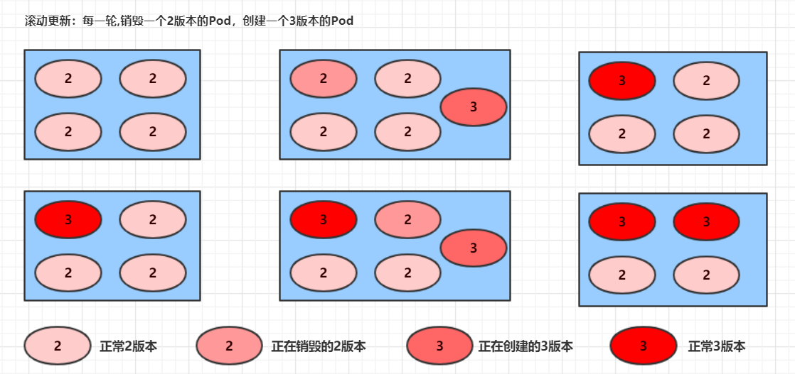

# `Pod控制器`

## 1. 介绍

`Pod`是 `kubernetes`的最小管理单元，在 `kubernetes`中，按照 `pod`的创建方式可以将其分为两类：

- 自主式 `pod`：`kubernetes`直接创建出来的 `Pod`，这种 `pod`删除后就没有了，也不会重建
- 控制器创建 `pod`：`kubernetes`通过控制器创建 `pod`，这种 `pod`删除了之后还会自动重建

> **`什么是Pod控制器`**
>
> `Pod`控制器是管理 `pod`的中间层，使用 `Pod`控制器之后，只需要告诉 `Pod`控制器，想要多少个什么样的 `Pod`就可以了，它会创建出满足条件的 `Pod`并确保每一个 `Pod`资源处于用户期望的目标状态。如果 `Pod`资源在运行中出现故障，它会基于指定策略重新编排 `Pod`。
>
> **`在kubernetes中，有很多类型的pod控制器，每种都有自己的适合的场景，常见的有下面这些：`**
>
> - `ReplicationController`：比较原始的 `pod`控制器，~~已经被废弃~~，由 `ReplicaSet`替代
> - `ReplicaSet`：保证副本数量一直维持在期望值，并支持 `pod`数量扩缩容，镜像版本升级
> - `Deployment`：通过控制 `ReplicaSet`来控制 `Pod`，并支持滚动升级、回退版本，是 `ReplicaSet`的升级版，拥有 `ReplicaSet`的全部功能
> - `Horizontal Pod Autoscaler`：可以根据集群负载自动水平调整 `Pod`的数量，实现削峰填谷
> - `DaemonSet`：在集群中的指定 `Node`上运行且仅运行一个副本，一般用于守护进程类的任务
> - `Job`：它创建出来的 `pod`只要完成任务就立即退出，不需要重启或重建，用于执行一次性任务
> - `Cronjob`：它创建的 `Pod`负责周期性任务控制，不需要持续后台运行
> - `StatefulSet`：管理有状态应用

## 2. ReplicaSet（RS）

`ReplicaSet`的主要作用是**保证一定数量的pod正常运行**，它会持续监听这些 `Pod`的运行状态，一旦 `Pod`发生故障，就会重启或重建。同时它还支持对 `pod`数量的扩缩容和镜像版本的升降级。


```shell
# ReplicaSet的资源清单文件
apiVersion: apps/v1       # 版本号
kind: ReplicaSet          # 类型   
metadata:                 # 元数据
  name:                   # rs名称 
  namespace:              # 所属命名空间 
  labels: 	              # 标签
    controller: rs
spec:                     # 详情描述
  replicas: 3             # 副本数量
  selector:               # 选择器，通过它指定该控制器管理哪些pod
    matchLabels:          # Labels匹配规则
      app: nginx-pod
    matchExpressions:     # Expressions匹配规则
      - {key: app, operator: In, values: [nginx-pod]}
  template:               # 模板，当副本数量不足时，会根据下面的模板创建pod副本
    metadata:
      labels:
        app: nginx-pod
    spec:
      containers:
      - name: nginx
        image: nginx:1.17.1
        ports:
        - containerPort: 80
```

> 在这里面，需要新了解的配置项就是 `spec`下面几个选项：
>
> - `replicas`：指定副本数量，其实就是当前 `rs`创建出来的 `pod`的数量，默认为1
> - `selector`：选择器，它的作用是建立 `pod`控制器和 `pod`之间的关联关系，采用的 `Label Selector`机制
>
>   在 `pod`模板上定义 `label`，在控制器上定义选择器，就可以表明当前控制器能管理哪些 `pod`了
> - `template`：模板，就是当前控制器创建 `pod`所使用的模板板，里面其实就是前一章学过的 `pod`的定义

### 2.1 创建 ReplicaSet

```shell
# 创建pc-replicaset.yaml文件
apiVersion: apps/v1
kind: ReplicaSet   
metadata:
  name: pc-replicaset
  namespace: dev
spec:
  replicas: 3
  selector: 
    matchLabels:
      app: nginx-pod
  template:
    metadata:
      labels:
        app: nginx-pod
    spec:
      containers:
      - name: nginx
        image: nginx:1.17.1
```

```sh
# 清除之前的 namespace
[root@master Download]# kubectl get nodes
NAME     STATUS   ROLES    AGE   VERSION
master   Ready    master   9d    v1.17.4
node1    Ready    <none>   9d    v1.17.4
node2    Ready    <none>   9d    v1.17.4
[root@master Download]# kubectl delete ns dev
namespace "dev" deleted
[root@master Download]# kubectl get ns
NAME              STATUS   AGE
default           Active   9d
kube-flannel      Active   9d
kube-node-lease   Active   9d
kube-public       Active   9d
kube-system       Active   9d

[root@master ~]# kubectl create ns dev
namespace/dev created

# 创建rs
[root@master ~]# kubectl create -f pc-replicaset.yaml
replicaset.apps/pc-replicaset created

# 查看rs
# DESIRED:期望副本数量  
# CURRENT:当前副本数量  
# READY:已经准备好提供服务的副本数量
[root@master ~]# kubectl get rs pc-replicaset -n dev -o wide
NAME            DESIRED   CURRENT   READY   AGE   CONTAINERS   IMAGES         SELECTOR
pc-replicaset   3         3         3       4s    nginx        nginx:1.17.1   app=nginx-pod

# 查看当前控制器创建出来的pod
# 这里发现控制器创建出来的pod的名称是在控制器名称后面拼接了-xxxxx随机码
[root@master ~]# kubectl get pod -n dev
NAME                  READY   STATUS    RESTARTS   AGE
pc-replicaset-6zw7d   1/1     Running   0          8s
pc-replicaset-tzh6l   1/1     Running   0          8s
pc-replicaset-vs7d6   1/1     Running   0          8s
```

### 2.2 扩缩容

```shell
# 编辑rs的副本数量，修改spec:replicas: 6即可
[root@master ~]# kubectl edit rs pc-replicaset -n dev
replicaset.apps/pc-replicaset edited

# Please edit the object below. Lines beginning with a '#' will be ignored,
# and an empty file will abort the edit. If an error occurs while saving this file will be
# reopened with the relevant failures.
#
apiVersion: apps/v1
kind: ReplicaSet
metadata:
  creationTimestamp: "2024-05-30T09:26:18Z"
  generation: 1
  name: pc-replicaset
  namespace: dev
  resourceVersion: "772433"
  selfLink: /apis/apps/v1/namespaces/dev/replicasets/pc-replicaset
  uid: 59b91c99-3b4d-4336-8cff-867fe1a4e01d
spec:
  # 编辑这里的值即可
  replicas: 3
  selector:
    matchLabels:
      app: nginx-pod
  template:
    metadata:
      creationTimestamp: null
      labels:
        app: nginx-pod
    spec:
      containers:
      - image: nginx:1.17.1
        imagePullPolicy: IfNotPresent
        name: nginx
        resources: {}
        terminationMessagePath: /dev/termination-log
        terminationMessagePolicy: File
      dnsPolicy: ClusterFirst
      restartPolicy: Always
      schedulerName: default-scheduler
      securityContext: {}
      terminationGracePeriodSeconds: 30
status:
  availableReplicas: 3
  fullyLabeledReplicas: 3
  observedGeneration: 1
  readyReplicas: 3
  replicas: 3

# 再次查看 pod
[root@master ~]# kubectl get pods -n dev
NAME                  READY   STATUS    RESTARTS   AGE
pc-replicaset-44f4s   1/1     Running   0          104s
pc-replicaset-6zw7d   1/1     Running   0          11m
pc-replicaset-9wx98   1/1     Running   0          104s
pc-replicaset-tzh6l   1/1     Running   0          11m
pc-replicaset-vs7d6   1/1     Running   0          11m
pc-replicaset-z2g7t   1/1     Running   0          104s

# 当然也可以直接使用命令实现
# 使用scale命令实现扩缩容， 后面--replicas=n直接指定目标数量即可
[root@master ~]# kubectl scale rs pc-replicaset --replicas=2 -n dev
replicaset.apps/pc-replicaset scaled

# 命令运行完毕，立即查看，发现已经有4个开始准备退出了
[root@master ~]# kubectl get pods -n dev
NAME                  READY   STATUS        RESTARTS   AGE
pc-replicaset-44f4s   0/1     Terminating   0          2m36s
pc-replicaset-6zw7d   1/1     Running       0          12m
pc-replicaset-9wx98   0/1     Terminating   0          2m36s
pc-replicaset-tzh6l   1/1     Running       0          12m
pc-replicaset-vs7d6   0/1     Terminating   0          12m
pc-replicaset-z2g7t   0/1     Terminating   0          2m36s

# 稍等片刻，剩下2个
[root@master ~]# kubectl get pods -n dev
NAME                  READY   STATUS    RESTARTS   AGE
pc-replicaset-6zw7d   1/1     Running   0          12m
pc-replicaset-tzh6l   1/1     Running   0          12m
```

### 2.3 镜像升级

```shell

# 编辑rs的容器镜像 - image: nginx:1.17.2
[root@master ~]# kubectl edit rs pc-replicaset -n dev
replicaset.apps/pc-replicaset edited


# Please edit the object below. Lines beginning with a '#' will be ignored,
# and an empty file will abort the edit. If an error occurs while saving this file will be
# reopened with the relevant failures.
#
apiVersion: apps/v1
kind: ReplicaSet
metadata:
  creationTimestamp: "2024-05-30T09:26:18Z"
  generation: 3
  name: pc-replicaset
  namespace: dev
  resourceVersion: "774209"
  selfLink: /apis/apps/v1/namespaces/dev/replicasets/pc-replicaset
  uid: 59b91c99-3b4d-4336-8cff-867fe1a4e01d
spec:
  replicas: 2
  selector:
    matchLabels:
      app: nginx-pod
  template:
    metadata:
      creationTimestamp: null
      labels:
        app: nginx-pod
    spec:
      containers:
      # 修改这里即可
      - image: nginx:1.17.1
        imagePullPolicy: IfNotPresent
        name: nginx
        resources: {}
        terminationMessagePath: /dev/termination-log
        terminationMessagePolicy: File
      dnsPolicy: ClusterFirst
      restartPolicy: Always
      schedulerName: default-scheduler
      securityContext: {}
      terminationGracePeriodSeconds: 30
status:
  availableReplicas: 2
  fullyLabeledReplicas: 2
  observedGeneration: 3
  readyReplicas: 2
  replicas: 2
~                                                                                                                                                                                              
~                                                                                                                                                                                       
~                                                                                                                                                                                              
"/tmp/kubectl-edit-uhgoo.yaml" 43L, 1161C


# 再次查看，发现镜像版本已经变更
[root@master ~]# kubectl edit rs pc-replicaset -n dev
replicaset.apps/pc-replicaset edited
[root@master ~]#  kubectl get rs -n dev -o wide
NAME            DESIRED   CURRENT   READY   AGE   CONTAINERS   IMAGES         SELECTOR
pc-replicaset   2         2         2       15m   nginx        nginx:1.17.2   app=nginx-pod

# 同样，也可以使用命令完成这个工作
# kubectl set image rs rs名称 容器=镜像版本 -n namespace
[root@master ~]#  kubectl set image rs pc-replicaset nginx=nginx:1.17.1  -n dev
replicaset.apps/pc-replicaset image updated

# 再次查看，发现镜像版本已经变更
[root@master ~]#  kubectl get rs -n dev -o wide
NAME            DESIRED   CURRENT   READY   AGE   CONTAINERS   IMAGES         SELECTOR
pc-replicaset   2         2         2       16m   nginx        nginx:1.17.1   app=nginx-pod

```

### 2.4 删除ReplicaSet

```shell
# 使用 kubectl delete 命令会删除此RS以及 管理的Pod
# 在 kubernetes 删除RS前，会 将RS 的replicasclear调整为0，等待所有的Pod被删除后，在执行RS对象的删除
[root@master ~]# kubectl delete rs pc-replicaset -n dev
replicaset.apps "pc-replicaset" deleted
[root@master ~]# kubectl get pod -n dev -o wide
NAME                  READY   STATUS        RESTARTS   AGE   IP            NODE    NOMINATED NODE   READINESS GATES
pc-replicaset-tzh6l   0/1     Terminating   0          20m   10.244.1.29   node2   <none>           <none>
[root@master ~]# kubectl get pod -n dev -o wide
No resources found in dev namespace.

# 如果希望仅仅删除RS对象（保留Pod），可以使用kubectl delete命令时添加--cascade=false选项（不推荐）。
[root@master ~]# kubectl delete rs pc-replicaset -n dev --cascade=false
Error from server (NotFound): replicasets.apps "pc-replicaset" not found
[root@master ~]# kubectl create -f pc-replicaset.yaml
replicaset.apps/pc-replicaset created
[root@master ~]# kubectl delete rs pc-replicaset -n dev --cascade=false
replicaset.apps "pc-replicaset" deleted
[root@master ~]# kubectl get pods -n dev
NAME                  READY   STATUS    RESTARTS   AGE
pc-replicaset-c2rfq   1/1     Running   0          12s
pc-replicaset-gqlkr   1/1     Running   0          12s
pc-replicaset-rdjqd   1/1     Running   0          12s

# 可以使用yaml直接删除(推荐)
[root@master ~]#  kubectl create -f pc-replicaset.yaml
replicaset.apps/pc-replicaset created
[root@master ~]# kubectl delete -f pc-replicaset.yaml
replicaset.apps "pc-replicaset" deleted
[root@master ~]# kubectl get pods -n dev
No resources found in dev namespace.
```

## 3. Deployment(Deploy)

为了解决服务编排的问题，**kubernetes**在**V1.2**版本开始，引入了**Deployment** 控制器。值得一提的是，这种控制器并不直接管理**pod**，而是通过管理**ReplicaSet**来简介管理**Pod**，即：**Deployment管理ReplicaSet，ReplicaSet管理Pod**。所以Deployment比ReplicaSet功能更加强大。


> Deployment主要功能有下面几个：
>
> - 支持**ReplicaSet**的所有功能
> - 支持发布的停止、继续
> - 支持滚动升级和回滚版本

```shell
# Deployment 资源清单文件

apiVersion: apps/v1     # 版本号
kind: Deployment        # 类型   
metadata:               # 元数据
  name:                 # rs名称 
  namespace:            # 所属命名空间 
  labels:               # 标签
    controller: deploy
spec:                           # 详情描述
  replicas: 3                   # 副本数量
  revisionHistoryLimit: 3       # 保留历史版本
  paused: false                 # 暂停部署，默认是false
  progressDeadlineSeconds: 600  # 部署超时时间（s），默认是600
  strategy:                     # 策略
    type: RollingUpdate         # 滚动更新策略
    rollingUpdate:              # 滚动更新
      maxSurge: 30%              # 最大额外可以存在的副本数，可以为百分比，也可以为整数
      maxUnavailable: 30%       # 最大不可用状态的 Pod 的最大值，可以为百分比，也可以为整数
  selector:                     # 选择器，通过它指定该控制器管理哪些pod
    matchLabels:                # Labels匹配规则
      app: nginx-pod
    matchExpressions:           # Expressions匹配规则
      - {key: app, operator: In, values: [nginx-pod]}
  template:                     # 模板，当副本数量不足时，会根据下面的模板创建pod副本
    metadata:
      labels:
        app: nginx-pod
    spec:
      containers:
      - name: nginx
        image: nginx:1.17.1
        ports:
        - containerPort: 80
```

### 3.1 创建 deployment

```sh
# 创建 pc-deployment.yaml
apiVersion: apps/v1
kind: Deployment  
metadata:
  name: pc-deployment
  namespace: dev
spec: 
  replicas: 3
  selector:
    matchLabels:
      app: nginx-pod
  template:
    metadata:
      labels:
        app: nginx-pod
    spec:
      containers:
      - name: nginx
        image: nginx:1.17.1


[root@master ~]# vim pc-deployment.yaml
[root@master ~]# kubectl create -f pc-deployment.yaml 
deployment.apps/pc-deployment created

# 查看 deployment
# up-to-date 最新版本 pod 的数量
# available 当前可用的 pod 的数量
[root@master ~]# kubectl get deploy pc-deployment -n dev
NAME            READY   UP-TO-DATE   AVAILABLE   AGE
pc-deployment   3/3     3            3           8m33s
# 查看 rs 
# 发现 rs的名称是在原来 deployment 的名字后哦面添加了一个10位随机字符串
[root@master ~]# kubectl get rs -n dev
NAME                       DESIRED   CURRENT   READY   AGE
pc-deployment-5d89bdfbf9   3         3         3       8m51s
# 查看 pod，也是如此
[root@master ~]# kubectl get pods -n dev
NAME                             READY   STATUS    RESTARTS   AGE
pc-deployment-5d89bdfbf9-f9zdt   1/1     Running   0          9m
pc-deployment-5d89bdfbf9-tvg6d   1/1     Running   0          9m
pc-deployment-5d89bdfbf9-vgvg7   1/1     Running   0          9m
```

### 3.2 扩缩容

```sh
# 方式一：
# 变更副本数量为5个
[root@master ~]# kubectl scale deploy pc-deployment --replicas=5  -n dev
deployment.apps/pc-deployment scaled

# 查看deployment
[root@master ~]# kubectl get deploy pc-deployment -n dev
NAME            READY   UP-TO-DATE   AVAILABLE   AGE
pc-deployment   5/5     5            5           12m

# 查看pod
[root@master ~]# kubectl get pods -n dev
NAME                             READY   STATUS    RESTARTS   AGE
pc-deployment-5d89bdfbf9-67phk   1/1     Running   0          13s
pc-deployment-5d89bdfbf9-f9zdt   1/1     Running   0          12m
pc-deployment-5d89bdfbf9-lrt76   1/1     Running   0          13s
pc-deployment-5d89bdfbf9-tvg6d   1/1     Running   0          12m
pc-deployment-5d89bdfbf9-vgvg7   1/1     Running   0          12m

# 方式二：
# 编辑deployment的副本数量，修改spec:replicas: 4即可
[root@master ~]# kubectl edit deploy pc-deployment -n dev
deployment.apps/pc-deployment edited

# Please edit the object below. Lines beginning with a '#' will be ignored,
# and an empty file will abort the edit. If an error occurs while saving this file will be
# reopened with the relevant failures.
#
apiVersion: apps/v1
kind: Deployment
metadata:
  annotations:
    deployment.kubernetes.io/revision: "1"
  creationTimestamp: "2024-05-30T10:04:53Z"
  generation: 3
  name: pc-deployment
  namespace: dev
  resourceVersion: "780219"
  selfLink: /apis/apps/v1/namespaces/dev/deployments/pc-deployment
  uid: d2886814-3ed9-4fd9-b6b9-7535803e60f7
spec:
  progressDeadlineSeconds: 600
  # 修改这里即可
  replicas: 4
  revisionHistoryLimit: 10
  selector:
    matchLabels:
      app: nginx-pod
  strategy:
    rollingUpdate:
      maxSurge: 25%
      maxUnavailable: 25%
    type: RollingUpdate
  template:
    metadata:
      creationTimestamp: null
      labels:
        app: nginx-pod
    spec:
      containers:
      - image: nginx:1.17.1
        imagePullPolicy: IfNotPresent
        name: nginx
        resources: {}
        terminationMessagePath: /dev/termination-log
        terminationMessagePolicy: File
      dnsPolicy: ClusterFirst
      restartPolicy: Always
      schedulerName: default-scheduler
      securityContext: {}
      terminationGracePeriodSeconds: 30
"/tmp/kubectl-edit-w6mnw.yaml" 65L, 1849C

# 查看pod
[root@master ~]#  kubectl get pods -n dev
NAME                             READY   STATUS    RESTARTS   AGE
pc-deployment-5d89bdfbf9-f9zdt   1/1     Running   0          14m
pc-deployment-5d89bdfbf9-lrt76   1/1     Running   0          2m9s
pc-deployment-5d89bdfbf9-tvg6d   1/1     Running   0          14m
pc-deployment-5d89bdfbf9-vgvg7   1/1     Running   0          14m
```

### 3.3 镜像更新

> **deployment**支持两种更新策略:**重建更新**和**滚动更新(默认)**,可以通过**strategy**指定策略类型,支持两个属性:
>
> strategy：指定新的Pod替换旧的Pod的策略， 支持两个属性：
> type：指定策略类型，支持两种策略
> Recreate：在创建出新的Pod之前会先杀掉所有已存在的Pod
> RollingUpdate：滚动更新，就是杀死一部分，就启动一部分，在更新过程中，存在两个版本Pod
> rollingUpdate：当type为RollingUpdate时生效，用于为RollingUpdate设置参数，支持两个属性：
> maxUnavailable：用来指定在升级过程中不可用Pod的最大数量，默认为25%。
> maxSurge： 用来指定在升级过程中可以超过期望的Pod的最大数量，默认为25%。
>
> #### 重建更新(删除所有，再新增)
>
> ```shell
> # 编辑 pc-deployment.yaml,在 spec 节点下添加更新策略
> spec:
>   strategy: # 策略
>     type: Recreate # 重建更新
> [root@master ~]# vim pc-deployment.yaml
> [root@master ~]# more pc-deployment.yaml 
> apiVersion: apps/v1
> kind: Deployment  
> metadata:
>   name: pc-deployment
>   namespace: dev
> spec: 
>   strategy: # 策略
>     type: Recreate # 重建更新
>   replicas: 3
>   selector:
>     matchLabels:
>       app: nginx-pod
>   template:
>     metadata:
>       labels:
>         app: nginx-pod
>     spec:
>       containers:
>       - name: nginx
>         image: nginx:1.17.1
>
> # 变更镜像
> [root@master ~]# kubectl set image deployment pc-deployment nginx=nginx:1.17.2 -n dev
> deployment.apps/pc-deployment image updated
>
>
> [root@master ~]# kubectl delete ns dev
> namespace "dev" deleted
> [root@master ~]# kubectl create ns dev
> namespace/dev created
> [root@master ~]# kubectl apply -f pc-deployment.yaml 
> deployment.apps/pc-deployment created
>
> # 观察升级过程
> [root@master ~]# kubectl get pods -n dev -w
> NAME                             READY   STATUS    RESTARTS   AGE
> pc-deployment-5d89bdfbf9-47cxl   1/1     Running   0          32s
> pc-deployment-5d89bdfbf9-747v2   1/1     Running   0          32s
> pc-deployment-5d89bdfbf9-pbqmh   1/1     Running   0          32s
> pc-deployment-5d89bdfbf9-47cxl   1/1     Terminating   0          101s
> pc-deployment-5d89bdfbf9-747v2   1/1     Terminating   0          101s
> pc-deployment-5d89bdfbf9-pbqmh   1/1     Terminating   0          101s
> pc-deployment-5d89bdfbf9-47cxl   0/1     Terminating   0          102s
> pc-deployment-5d89bdfbf9-747v2   0/1     Terminating   0          103s
> pc-deployment-5d89bdfbf9-pbqmh   0/1     Terminating   0          103s
> pc-deployment-5d89bdfbf9-pbqmh   0/1     Terminating   0          104s
> pc-deployment-5d89bdfbf9-pbqmh   0/1     Terminating   0          104s
> pc-deployment-5d89bdfbf9-747v2   0/1     Terminating   0          104s
> pc-deployment-5d89bdfbf9-747v2   0/1     Terminating   0          104s
> pc-deployment-5d89bdfbf9-47cxl   0/1     Terminating   0          107s
> pc-deployment-5d89bdfbf9-47cxl   0/1     Terminating   0          107s
> pc-deployment-675d469f8b-d86lj   0/1     Pending       0          0s
> pc-deployment-675d469f8b-d86lj   0/1     Pending       0          0s
> pc-deployment-675d469f8b-9krrz   0/1     Pending       0          0s
> pc-deployment-675d469f8b-s6vw6   0/1     Pending       0          0s
> pc-deployment-675d469f8b-d86lj   0/1     ContainerCreating   0          0s
> pc-deployment-675d469f8b-9krrz   0/1     Pending             0          0s
> pc-deployment-675d469f8b-s6vw6   0/1     Pending             0          0s
> pc-deployment-675d469f8b-9krrz   0/1     ContainerCreating   0          1s
> pc-deployment-675d469f8b-s6vw6   0/1     ContainerCreating   0          1s
> pc-deployment-675d469f8b-d86lj   1/1     Running             0          25s
> pc-deployment-675d469f8b-9krrz   1/1     Running             0          25s
> pc-deployment-675d469f8b-s6vw6   1/1     Running             0          41s
> ```
> #### 滚动更新（边删除，边新增）
>
> ```sh
> # 编辑pc-deployment.yaml,在spec节点下添加更新策略
> spec:
>   strategy: # 策略
>     type: RollingUpdate # 滚动更新策略
>     rollingUpdate:
>       maxSurge: 25% 
>       maxUnavailable: 25%
>
>
> [root@master ~]# vim pc-deployment.yaml
> [root@master ~]# more pc-deployment.yaml 
> apiVersion: apps/v1
> kind: Deployment  
> metadata:
>   name: pc-deployment
>   namespace: dev
> spec:
>   strategy: # 策略
>     type: RollingUpdate # 滚动更新策略
>     rollingUpdate:
>       maxSurge: 25% 
>       maxUnavailable: 25% 
>   replicas: 3
>   selector:
>     matchLabels:
>       app: nginx-pod
>   template:
>     metadata:
>       labels:
>         app: nginx-pod
>     spec:
>       containers:
>       - name: nginx
>         image: nginx:1.17.1
>
> [root@master ~]# kubectl apply -f pc-deployment.yaml 
> deployment.apps/pc-deployment configured
> [root@master ~]# kubectl get pods -n dev
> NAME                             READY   STATUS    RESTARTS   AGE
> pc-deployment-5d89bdfbf9-4hlqt   1/1     Running   0          33s
> pc-deployment-5d89bdfbf9-b42fw   1/1     Running   0          35s
> pc-deployment-5d89bdfbf9-fct7z   1/1     Running   0          31s
>
> # 变更镜像
> [root@master ~]# kubectl set image deployment pc-deployment nginx=nginx:1.17.3 -n dev
> deployment.apps/pc-deployment image updated
>
> # 观察升级过程
> [root@master ~]# kubectl get pods -n dev -w
> NAME                             READY   STATUS    RESTARTS   AGE
> pc-deployment-5d89bdfbf9-4hlqt   1/1     Running   0          70s
> pc-deployment-5d89bdfbf9-b42fw   1/1     Running   0          72s
> pc-deployment-5d89bdfbf9-fct7z   1/1     Running   0          68s
> pc-deployment-7865c58bdf-wbnst   0/1     Pending   0          0s
> pc-deployment-7865c58bdf-wbnst   0/1     Pending   0          0s
> pc-deployment-7865c58bdf-wbnst   0/1     ContainerCreating   0          0s
> pc-deployment-7865c58bdf-wbnst   1/1     Running             0          24s
> pc-deployment-5d89bdfbf9-fct7z   1/1     Terminating         0          94s
> pc-deployment-7865c58bdf-c6xtb   0/1     Pending             0          0s
> pc-deployment-7865c58bdf-c6xtb   0/1     Pending             0          0s
> pc-deployment-7865c58bdf-c6xtb   0/1     ContainerCreating   0          0s
> pc-deployment-5d89bdfbf9-fct7z   0/1     Terminating         0          95s
> pc-deployment-5d89bdfbf9-fct7z   0/1     Terminating         0          106s
> pc-deployment-5d89bdfbf9-fct7z   0/1     Terminating         0          106s
> pc-deployment-7865c58bdf-c6xtb   1/1     Running             0          24s
> pc-deployment-5d89bdfbf9-4hlqt   1/1     Terminating         0          2m
> pc-deployment-7865c58bdf-bvwxd   0/1     Pending             0          0s
> pc-deployment-7865c58bdf-bvwxd   0/1     Pending             0          1s
> pc-deployment-7865c58bdf-bvwxd   0/1     ContainerCreating   0          1s
> pc-deployment-5d89bdfbf9-4hlqt   0/1     Terminating         0          2m1s
> pc-deployment-7865c58bdf-bvwxd   1/1     Running             0          2s
> pc-deployment-5d89bdfbf9-b42fw   1/1     Terminating         0          2m4s
> pc-deployment-5d89bdfbf9-4hlqt   0/1     Terminating         0          2m2s
> pc-deployment-5d89bdfbf9-4hlqt   0/1     Terminating         0          2m2s
> pc-deployment-5d89bdfbf9-b42fw   0/1     Terminating         0          2m5s
> pc-deployment-5d89bdfbf9-b42fw   0/1     Terminating         0          2m6s
> pc-deployment-5d89bdfbf9-b42fw   0/1     Terminating         0          2m6s
>
> # 至此，新版本的pod创建完毕，就版本的pod销毁完毕
> # 中间过程是滚动进行的，也就是边销毁边创建
> ```
> 滚动更新的过程：
>
> 
>
> ps:镜像更新中 **rs** 的变化（滚动更新）:
>
> ```sh
> [root@master ~]# kubectl delete -f pc-deployment.yaml 
> deployment.apps "pc-deployment" deleted
> [root@master ~]# kubectl create -f pc-deployment.yaml --record
> deployment.apps/pc-deployment created
> [root@master ~]# kubectl get pods,deploy,rs -n dev
> NAME                                 READY   STATUS    RESTARTS   AGE
> pod/pc-deployment-5d89bdfbf9-7nfs2   1/1     Running   0          25s
> pod/pc-deployment-5d89bdfbf9-gkknh   1/1     Running   0          25s
> pod/pc-deployment-5d89bdfbf9-mjmqh   1/1     Running   0          25s
>
> NAME                            READY   UP-TO-DATE   AVAILABLE   AGE
> deployment.apps/pc-deployment   3/3     3            3           25s
>
> NAME                                       DESIRED   CURRENT   READY   AGE
> replicaset.apps/pc-deployment-5d89bdfbf9   3         3         3       25s
>
> # 更新 images 版本
> [root@master ~]#  kubectl set image deployment pc-deployment nginx=nginx:1.17.2 -n dev 
> deployment.apps/pc-deployment image updated
>
> # 观察 pods 状态
> [root@master ~]# kubectl get pods -n dev -w
> NAME                             READY   STATUS    RESTARTS   AGE
> pc-deployment-5d89bdfbf9-7nfs2   1/1     Running   0          114s
> pc-deployment-5d89bdfbf9-gkknh   1/1     Running   0          114s
> pc-deployment-5d89bdfbf9-mjmqh   1/1     Running   0          114s
> pc-deployment-675d469f8b-ktcgq   0/1     Pending   0          0s
> pc-deployment-675d469f8b-ktcgq   0/1     Pending   0          0s
> pc-deployment-675d469f8b-ktcgq   0/1     ContainerCreating   0          0s
> pc-deployment-675d469f8b-ktcgq   1/1     Running             0          2s
> pc-deployment-5d89bdfbf9-7nfs2   1/1     Terminating         0          2m46s
> pc-deployment-675d469f8b-5pbn4   0/1     Pending             0          0s
> pc-deployment-675d469f8b-5pbn4   0/1     Pending             0          0s
> pc-deployment-675d469f8b-5pbn4   0/1     ContainerCreating   0          0s
> pc-deployment-675d469f8b-5pbn4   1/1     Running             0          1s
> pc-deployment-5d89bdfbf9-7nfs2   0/1     Terminating         0          2m47s
> pc-deployment-5d89bdfbf9-gkknh   1/1     Terminating         0          2m47s
> pc-deployment-675d469f8b-fr67w   0/1     Pending             0          0s
> pc-deployment-675d469f8b-fr67w   0/1     Pending             0          0s
> pc-deployment-675d469f8b-fr67w   0/1     ContainerCreating   0          0s
> pc-deployment-5d89bdfbf9-gkknh   0/1     Terminating         0          2m48s
> pc-deployment-5d89bdfbf9-7nfs2   0/1     Terminating         0          2m48s
> pc-deployment-5d89bdfbf9-7nfs2   0/1     Terminating         0          2m48s
> pc-deployment-675d469f8b-fr67w   1/1     Running             0          2s
> pc-deployment-5d89bdfbf9-mjmqh   1/1     Terminating         0          2m49s
> pc-deployment-5d89bdfbf9-mjmqh   0/1     Terminating         0          2m50s
> pc-deployment-5d89bdfbf9-mjmqh   0/1     Terminating         0          2m51s
> pc-deployment-5d89bdfbf9-mjmqh   0/1     Terminating         0          2m51s
> pc-deployment-5d89bdfbf9-gkknh   0/1     Terminating         0          2m54s
> pc-deployment-5d89bdfbf9-gkknh   0/1     Terminating         0          2m54s
>
> # 观察 rs 的状态
> [root@master ~]# kubectl get rs -n dev -w
> NAME                       DESIRED   CURRENT   READY   AGE
> pc-deployment-5d89bdfbf9   3         3         3       102s
> pc-deployment-675d469f8b   1         0         0       0s
> pc-deployment-675d469f8b   1         0         0       0s
> pc-deployment-675d469f8b   1         1         0       0s
> pc-deployment-675d469f8b   1         1         1       2s
> pc-deployment-5d89bdfbf9   2         3         3       2m46s
> pc-deployment-675d469f8b   2         1         1       2s
> pc-deployment-5d89bdfbf9   2         3         3       2m46s
> pc-deployment-675d469f8b   2         1         1       2s
> pc-deployment-675d469f8b   2         2         1       2s
> pc-deployment-5d89bdfbf9   2         2         2       2m46s
> pc-deployment-675d469f8b   2         2         2       3s
> pc-deployment-5d89bdfbf9   1         2         2       2m47s
> pc-deployment-675d469f8b   3         2         2       3s
> pc-deployment-5d89bdfbf9   1         2         2       2m47s
> pc-deployment-675d469f8b   3         2         2       3s
> pc-deployment-675d469f8b   3         3         2       3s
> pc-deployment-5d89bdfbf9   1         1         1       2m47s
> pc-deployment-675d469f8b   3         3         3       5s
> pc-deployment-5d89bdfbf9   0         1         1       2m49s
> pc-deployment-5d89bdfbf9   0         1         1       2m49s
> pc-deployment-5d89bdfbf9   0         0         0       2m49s
>
>
> [root@master ~]# kubectl get pods,deploy,rs -n dev
> NAME                                 READY   STATUS    RESTARTS   AGE
> pod/pc-deployment-675d469f8b-5pbn4   1/1     Running   0          96s
> pod/pc-deployment-675d469f8b-fr67w   1/1     Running   0          95s
> pod/pc-deployment-675d469f8b-ktcgq   1/1     Running   0          98s
>
> NAME                            READY   UP-TO-DATE   AVAILABLE   AGE
> deployment.apps/pc-deployment   3/3     3            3           4m22s
> # 多了一个
> NAME                                       DESIRED   CURRENT   READY   AGE
> replicaset.apps/pc-deployment-5d89bdfbf9   0         0         0       4m22s
> replicaset.apps/pc-deployment-675d469f8b   3         3         3       98s
>
> # 查看rs,发现原来的rs的依旧存在，只是pod数量变为了0，而后又新产生了一个rs，pod数量为4
> # 其实这就是deployment能够进行版本回退
>
> ```
> ### 版本回退
>
> deployment支持版本升级过程中的暂停、继续功能以及版本回退等诸多功能，下面具体来看.
>
> kubectl rollout： 版本升级相关功能，支持下面的选项：
>
> - status  显示当前升级状态
> - history 显示 升级历史记录
> - pause   暂停版本升级过程
> - resume  继续已经暂停的版本升级过程
> - restart 重启版本升级过程
> - undo    回滚到上一级版本（可以使用--to-revision回滚到指定版本）
>
> ```sh
> # 查看当前升级版本的状态
> [root@master ~]# kubectl rollout status deploy pc-deployment -n dev
> deployment "pc-deployment" successfully rolled out
>
> # 查看升级历史记录
> [root@master ~]# kubectl rollout history deploy pc-deployment -n dev
> deployment.apps/pc-deployment 
> REVISION  CHANGE-CAUSE
> 1         kubectl create --filename=pc-deployment.yaml --record=true
> 2         kubectl create --filename=pc-deployment.yaml --record=true
> # 可以发现有两次版本记录，说明完成过两次升级
>
>
> # 版本回滚
> # 这里直接使用--to-revision=1回滚到了1版本， 如果省略这个选项，就是回退到上个版本，就是2版本
> [root@master ~]# kubectl rollout undo deployment pc-deployment --to-revision=1 -n dev
> deployment.apps/pc-deployment rolled back
> [root@master ~]# kubectl rollout history deploy pc-deployment -n dev
> deployment.apps/pc-deployment 
> REVISION  CHANGE-CAUSE
> 2         kubectl create --filename=pc-deployment.yaml --record=true
> 3         kubectl create --filename=pc-deployment.yaml --record=true
> 4         kubectl create --filename=pc-deployment.yaml --record=true
>
> # 查看发现，通过nginx镜像版本可以发现到了第一版
> [root@master ~]# kubectl get deploy -n dev -o wide
> NAME            READY   UP-TO-DATE   AVAILABLE   AGE   CONTAINERS   IMAGES         SELECTOR
> pc-deployment   3/3     3            3           75m   nginx        nginx:1.17.1   app=nginx-pod
>
> # 查看rs，发现第一个rs中有3个pod运行，后面两个版本的rs中pod为运行
> # 其实deployment之所以可是实现版本的回滚，就是通过记录下历史rs来实现的，
> # 一旦想回滚到哪个版本，只需要将当前版本pod数量降为0，然后将回滚版本的pod提升为目标数量就可以了
>
> [root@master ~]# kubectl get rs -n dev
> NAME                       DESIRED   CURRENT   READY   AGE
> pc-deployment-5d89bdfbf9   3         3         3       75m
> pc-deployment-675d469f8b   0         0         0       73m
> pc-deployment-7865c58bdf   0         0         0       2m1s
> ```
> ### 金丝雀发布
>
> **Deployment** 控制器支持控制更新过程中的控制，如“暂停(pause)”或“继续(resume)”更新操作。
>
> 比如有一批新的**Pod**资源创建完成后立即暂停更新过程，此时，仅存在一部分新版本的应用，主体部分还是旧的版本。然后，再筛选一小部分的用户请求路由到新版本的Pod应用，继续观察能否稳定地按期望的方式运行。确定没问题之后再继续完成余下的Pod资源滚动更新，否则立即回滚更新操作。这就是所谓的金丝雀发布。
>
> ```sh
> # 更新deployment的版本，并配置暂停deployment
> [root@master ~]# kubectl set image deploy pc-deployment nginx=nginx:1.17.4 -n dev && kubectl rollout pause deployment pc-deployment  -n dev
> deployment.apps/pc-deployment image updated
> deployment.apps/pc-deployment paused
> [root@master ~]# kubectl get rs -n dev
> NAME                       DESIRED   CURRENT   READY   AGE
> pc-deployment-5d89bdfbf9   3         3         3       81m
> pc-deployment-675d469f8b   0         0         0       79m
> pc-deployment-6c9f56fcfb   1         1         0       8s
> pc-deployment-7865c58bdf   0         0         0       8m3s
>
>
>
>
> # 观察更新状态
> [root@master ~]# kubectl rollout status deploy pc-deployment -n dev
> Waiting for deployment "pc-deployment" rollout to finish: 1 out of 3 new replicas have been updated...
> # 监控更新的过程，可以看到已经新增了一个资源，但是并未按照预期的状态去删除一个旧的资源，就是因为使用了pause暂停命令
>
> [root@master ~]# kubectl get rs -n dev -o wide
> NAME                       DESIRED   CURRENT   READY   AGE   CONTAINERS   IMAGES         SELECTOR
> pc-deployment-5d89bdfbf9   3         3         3       86m   nginx        nginx:1.17.1   app=nginx-pod,pod-template-hash=5d89bdfbf9
> pc-deployment-675d469f8b   0         0         0       84m   nginx        nginx:1.17.2   app=nginx-pod,pod-template-hash=675d469f8b
> pc-deployment-6c9f56fcfb   1         1         1       5m    nginx        nginx:1.17.4   app=nginx-pod,pod-template-hash=6c9f56fcfb
> pc-deployment-7865c58bdf   0         0         0       12m   nginx        nginx:1.17.3   app=nginx-pod,pod-template-hash=7865c58bdf
>
>
> [root@master ~]# kubectl rollout resume deploy pc-deployment -n dev
> deployment.apps/pc-deployment resumed
>
> # 查看最后的更新情况
> [root@master ~]# kubectl get rs -n dev -o wide
> NAME                       DESIRED   CURRENT   READY   AGE     CONTAINERS   IMAGES         SELECTOR
> pc-deployment-5d89bdfbf9   0         0         0       87m     nginx        nginx:1.17.1   app=nginx-pod,pod-template-hash=5d89bdfbf9
> pc-deployment-675d469f8b   0         0         0       84m     nginx        nginx:1.17.2   app=nginx-pod,pod-template-hash=675d469f8b
> pc-deployment-6c9f56fcfb   3         3         3       5m52s   nginx        nginx:1.17.4   app=nginx-pod,pod-template-hash=6c9f56fcfb
> pc-deployment-7865c58bdf   0         0         0       13m     nginx        nginx:1.17.3   app=nginx-pod,pod-template-hash=7865c58bdf
>
>
> [root@master ~]# kubectl get pods -n dev
> NAME                             READY   STATUS    RESTARTS   AGE
> pc-deployment-6c9f56fcfb-9t95g   1/1     Running   0          29s
> pc-deployment-6c9f56fcfb-nhzq4   1/1     Running   0          20s
> pc-deployment-6c9f56fcfb-qz9h2   1/1     Running   0          5m58s
> ```
> ### 删除 deployment
>
> ```sh
> # 删除 deployment，其下的rs和pod也将被删除
> [root@master ~]#  kubectl delete -f pc-deployment.yaml
> deployment.apps "pc-deployment" deleted
> ```
> ## Horizontal Pod Autoscaler(HPA)
>
> 现在已经实现通过手工执行**kubectl scale**命令实现**Pod**扩容或缩容，但是这显然不符合**Kubernetes**的定位目标--自动化、智能化。 **Kubernetes** 期望可以实现通过监测 **Pod** 的使用情况，实现 **pod** 数量的自动调整，于是就产生了 **Horizontal Pod Autoscaler** 这种控制器。
> 
>
> ### 安装metrics-server
>
> **metrics-server** 可以用来收集集群中的资源使用情况
>
> ```sh
> [root@master ~]# yum install git -y
> [root@master ~]# git clone -b v0.3.6 https://github.com/kubernetes-incubator/metrics-server
> [root@master ~]# cd /root/metrics-server/deploy/1.8+/
>
> # 需要添加的参数
> hostNetwork: true
> image: registry.cn-hangzhou.aliyuncs.com/google_containers/metrics-server-amd64:v0.3.6
> args:
> - --kubelet-insecure-tls
> - --kubelet-preferred-address-types=InternalIP,Hostname,InternalDNS,ExternalDNS,ExternalIP
>
> [root@master 1.8+]# vim metrics-server-deployment.yaml
> [root@master 1.8+]# more metrics-server-deployment.yaml 
> ---
> apiVersion: v1
> kind: ServiceAccount
> metadata:
>   name: metrics-server
>   namespace: kube-system
> ---
> apiVersion: apps/v1
> kind: Deployment
> metadata:
>   name: metrics-server
>   namespace: kube-system
>   labels:
>     k8s-app: metrics-server
> spec:
>   selector:
>     matchLabels:
>       k8s-app: metrics-server
>   template:
>     metadata:
>       name: metrics-server
>       labels:
>         k8s-app: metrics-server
>     spec:
>       # 添加内存
>       hostNetwork: true
>       serviceAccountName: metrics-server
>       volumes:
>       # mount in tmp so we can safely use from-scratch images and/or read-only containers
>       - name: tmp-dir
>         emptyDir: {}
>       containers:
>       - name: metrics-server
>       # image: k8s.gcr.io/metrics-server-amd64:v0.3.6
>       # 修改镜像地址
>         image: registry.cn-hangzhou.aliyuncs.com/google_containers/metrics-server-amd64:v0.3.6
>         imagePullPolicy: Always
>       # 添加参数
>         args:
>         - --kubelet-insecure-tls
>         - --kubelet-preferred-address-types=InternalIP,Hostname,InternalDNS,ExternalDNS,ExternalIP
>         volumeMounts:
>         - name: tmp-dir
>           mountPath: /tmp
> [root@master 1.8+]# kubectl apply -f ./
> clusterrole.rbac.authorization.k8s.io/system:aggregated-metrics-reader created
> clusterrolebinding.rbac.authorization.k8s.io/metrics-server:system:auth-delegator created
> rolebinding.rbac.authorization.k8s.io/metrics-server-auth-reader created
> apiservice.apiregistration.k8s.io/v1beta1.metrics.k8s.io created
> serviceaccount/metrics-server created
> deployment.apps/metrics-server created
> service/metrics-server created
> clusterrole.rbac.authorization.k8s.io/system:metrics-server created
> clusterrolebinding.rbac.authorization.k8s.io/system:metrics-server created
>
> # 查看pod运行情况
> [root@master 1.8+]# kubectl get pod -n kube-system
> NAME                              READY   STATUS    RESTARTS   AGE
> coredns-9d85f5447-kxvfx           0/1     Running   0          5h34m
> coredns-9d85f5447-qsx4m           0/1     Running   0          5h34m
> etcd-master                       1/1     Running   4          17d
> kube-apiserver-master             1/1     Running   4          17d
> kube-controller-manager-master    1/1     Running   4          17d
> kube-proxy-cb5v5                  1/1     Running   4          17d
> kube-proxy-k2hwq                  1/1     Running   5          17d
> kube-proxy-xzswd                  1/1     Running   4          17d
> kube-scheduler-master             1/1     Running   4          17d
> metrics-server-6b976979db-pdhjv   1/1     Running   0          51s
>
> # 使用kubectl top node 查看资源使用情况
> [root@master 1.8+]# kubectl top node
> NAME     CPU(cores)   CPU%   MEMORY(bytes)   MEMORY%   
> master   100m         5%     1378Mi          51%   
> node1    26m          1%     610Mi           22%   
> node2    22m          1%     527Mi           22%
>
> # 至此,metrics-server安装完成
> ```
> ### 准备 deployment 和 servie
>
> ```sh
> # 创建 pc-hpa-pod.yaml 文件
> apiVersion: apps/v1
> kind: Deployment
> metadata:
>   name: nginx
>   namespace: dev
> spec:
>   strategy: # 策略
>     type: RollingUpdate # 滚动更新策略
>   replicas: 1
>   selector:
>     matchLabels:
>       app: nginx-pod
>   template:
>     metadata:
>       labels:
>         app: nginx-pod
>     spec:
>       containers:
>       - name: nginx
>         image: nginx:1.17.1
>         resources: # 资源配额
>           limits:  # 限制资源（上限）
>             cpu: "1" # CPU限制，单位是core数
>           requests: # 请求资源（下限）
>             cpu: "100m"  # CPU限制，单位是core数
> ```
> ```sh
>
> # 创建deployment
> [root@master 1.8+]# kubectl run nginx --image=nginx:1.17.1 --requests=cpu=100m -n dev
> kubectl run --generator=deployment/apps.v1 is DEPRECATED and will be removed in a future version. Use kubectl run --generator=run-pod/v1 or kubectl create instead.
> deployment.apps/nginx created
>
> # 创建service
> [root@master 1.8+]# kubectl expose deployment nginx --type=NodePort --port=80 -n dev
> service/nginx exposed
>
> # 查看
> [root@master 1.8+]# kubectl get deployment,pod,svc -n dev
> NAME                    READY   UP-TO-DATE   AVAILABLE   AGE
> deployment.apps/nginx   1/1     1            1           87s
>
> NAME                         READY   STATUS    RESTARTS   AGE
> pod/nginx-778cb5fb7b-v92v6   1/1     Running   0          87s
>
> NAME            TYPE       CLUSTER-IP     EXTERNAL-IP   PORT(S)        AGE
> service/nginx   NodePort   10.104.2.190   <none>        80:30709/TCP   78s
> ```
> ### 部署 HPA
>
> ```sh
> # 创建 pc-hpa.yaml 文件
> apiVersion: autoscaling/v1
> kind: HorizontalPodAutoscaler
> metadata:
>   name: pc-hpa
>   namespace: dev
> spec:
>   minReplicas: 1  #最小pod数量
>   maxReplicas: 10 #最大pod数量
>   targetCPUUtilizationPercentage: 3 # CPU使用率指标
>   scaleTargetRef:   # 指定要控制的nginx信息
>     apiVersion:  apps/v1
>     kind: Deployment
>     name: nginx
>
>
> [root@master ~]# vim pc-hpa.yaml
> [root@master ~]# kubectl create -f pc-hpa.yaml
> horizontalpodautoscaler.autoscaling/pc-hpa created
> [root@master ~]# kubectl get hpa -n dev
> NAME     REFERENCE          TARGETS        MINPODS   MAXPODS   REPLICAS   AGE
> pc-hpa   Deployment/nginx   <unknown>/3%   1         10        0          4s  
> ```
> ### 测试
>
> 使用压测工具对 service 地址 [192.168.5.4:31830](http://192.168.1.12:30709/) 进行压测，然后通过控
> 制台查看hpa和pod的变化
>
> 
>
> ## DaemonSet(DS)
>
> **DaemonSet** 类型的控制器可以保证在集群中的每一台（或指定）节点上都运行一个副本。一般适用于日志收集、节点监控等场景。也就是说，如果一个**Pod**提供的功能是节点级别的（每个节点都需要且只需要一个），那么这类Pod就适合使用**DaemonSet**类型的控制器创建。类似于 日志...
>
> 
>
> **DaemonSet** 控制器的特点：
>
> - 每当向集群中添加一个节点时，指定的 Pod 副本也将添加到该节点上
> - 当节点从集群中移除时，Pod 也就被垃圾回收了
>
> ```sh
> # DaemonSet 资源清单文件
> apiVersion: apps/v1    # 版本号
> kind: DaemonSet        # 类型   
> metadata:              # 元数据
>   name:                # rs名称 
>   namespace:           # 所属命名空间 
>   labels:              #标签
>     controller: daemonset
> spec:                       # 详情描述
>   revisionHistoryLimit: 3   # 保留历史版本
>   updateStrategy:           # 更新策略
>     type: RollingUpdate     # 滚动更新策略
>     rollingUpdate:          # 滚动更新
>       maxUnavailable: 1     # 最大不可用状态的 Pod 的最大值，可以为百分比，也可以为整数
>   selector:                 # 选择器，通过它指定该控制器管理哪些pod
>     matchLabels:      # Labels匹配规则
>       app: nginx-pod
>     matchExpressions: # Expressions匹配规则
>       - {key: app, operator: In, values: [nginx-pod]}
>   template:           # 模板，当副本数量不足时，会根据下面的模板创建pod副本
>     metadata:
>       labels:
>         app: nginx-pod
>     spec:
>       containers:
>       - name: nginx
>         image: nginx:1.17.1
>         ports:
>         - containerPort: 80
> ```
> ```sh
> # 创建 pc-daemonset.yaml 文件
> apiVersion: apps/v1
> kind: DaemonSet  
> metadata:
>   name: pc-daemonset
>   namespace: dev
> spec: 
>   selector:
>     matchLabels:
>       app: nginx-pod
>   template:
>     metadata:
>       labels:
>         app: nginx-pod
>     spec:
>       containers:
>       - name: nginx
>         image: nginx:1.17.1
>
>
> [root@master ~]# kubectl delete ns dev
> namespace "dev" deleted
> [root@master ~]# vim pc-daemonset.yaml
> [root@master ~]# kubectl create ns dev
> namespace/dev created
>
> # 创建 daemonset
> [root@master ~]# kubectl create -f  pc-daemonset.yaml
> daemonset.apps/pc-daemonset created
>
> # 查看 daemonset
> [root@master ~]# kubectl get ds -n dev -o wide
> NAME           DESIRED   CURRENT   READY   UP-TO-DATE   AVAILABLE   NODE SELECTOR   AGE   CONTAINERS   IMAGES         SELECTOR
> pc-daemonset   2         2         2       2            2           <none>          4s    nginx        nginx:1.17.1   app=nginx-pod
>
> # 查看 pod,发现在每个Node上都运行一个pod
> [root@master ~]#  kubectl get pods -n dev -o wide
> NAME                 READY   STATUS    RESTARTS   AGE   IP            NODE    NOMINATED NODE   READINESS GATES
> pc-daemonset-2vbnr   1/1     Running   0          15s   10.244.2.72   node1   <none>           <none>
> pc-daemonset-ch44x   1/1     Running   0          15s   10.244.1.52   node2   <none>           <none>
>
> # 删除 daemonset
> [root@master ~]# kubectl delete -f pc-daemonset.yaml
> daemonset.apps "pc-daemonset" deleted
> ```
> ## Job
>
>> Job，主要用于负责 批量处理(一次要处理指定数量任务)短暂的一次性(每个任务仅运行一次就结束) 任务
>>
>
>> Job特点如下：
>>
>> - 当Job创建的pod执行成功结束时，Job将记录成功结束的pod数量
>> - 当成功结束的pod达到指定的数量时，Job将完成执行
>>
>
> 
>
> ```sh
> # Job 资源清单文件
> apiVersion: batch/v1   # 版本号
> kind: Job              # 类型   
> metadata:              # 元数据
>   name:                # rs名称 
>   namespace:           # 所属命名空间 
>   labels:              #标签
>     controller: job
> spec:                       # 详情描述
>   completions: 1            # 指定job需要成功运行Pods的次数。默认值: 1
>   parallelism: 1            # 指定job在任一时刻应该并发运行Pods的数量。默认值: 1
>   activeDeadlineSeconds: 30 # 指定job可运行的时间期限，超过时间还未结束，系统将会尝试进行终止。
>   backoffLimit: 6           # 指定job失败后进行重试的次数。默认是6
>   manualSelector: true      # 是否可以使用selector选择器选择pod，默认是false
>   selector:                 # 选择器，通过它指定该控制器管理哪些pod
>     matchLabels:            # Labels匹配规则
>       app: counter-pod
>     matchExpressions:       # Expressions匹配规则
>       - {key: app, operator: In, values: [counter-pod]}
>   template:                 # 模板，当副本数量不足时，会根据下面的模板创建pod副本
>     metadata:
>       labels:
>         app: counter-pod
>     spec:
>       restartPolicy: Never  # 重启策略只能设置为Never或者OnFailure
>       containers:
>       - name: counter
>         image: busybox:1.30
>         command: ["bin/sh","-c","for i in 9 8 7 6 5 4 3 2 1; do echo $i;sleep 2;done"]
> ```
>> 关于重启策略设置的说明：
>>
>> - 如果指定为OnFailure，则job会在pod出现故障时重启容器，而不是创建pod，failed次数不变
>> - 如果指定为Never，则job会在pod出现故障时创建新的pod，并且故障pod不会消失，也不会重启，failed次数加1
>> - 如果指定为Always的话，就意味着一直重启，意味着job任务会重复去执行了，当然不对，所以不能设置为Always
>>
>
> ```sh
> # 创建 pc-job.yaml 文件
> apiVersion: batch/v1
> kind: Job  
> metadata:
>   name: pc-job
>   namespace: dev
> spec:
>   manualSelector: true
>   selector:
>     matchLabels:
>       app: counter-pod
>   template:
>     metadata:
>       labels:
>         app: counter-pod
>     spec:
>       restartPolicy: Never
>       containers:
>       - name: counter
>         image: busybox:1.30
>         command: ["bin/sh","-c","for i in 9 8 7 6 5 4 3 2 1; do echo $i;sleep 3;done"]
>
> # 创建 job
> [root@master ~]# vim pc-job.yaml
> [root@master ~]# kubectl create -f pc-job.yaml
> job.batch/pc-job created
>
> # 查看 job
> [root@master ~]# kubectl get job -n dev -o wide  -w
> NAME     COMPLETIONS   DURATION   AGE   CONTAINERS   IMAGES         SELECTOR
> pc-job   0/1           7s         7s    counter      busybox:1.30   app=counter-pod
> pc-job   1/1           28s        28s   counter      busybox:1.30   app=counter-pod
>
> # 通过观察 pod 状态可以看到，pod在运行完毕任务后，就会变成 Completed 状态
> [root@master ~]# kubectl get pods -n dev -w
> NAME           READY   STATUS    RESTARTS   AGE
> pc-job-4xj4c   1/1     Running   0          12s
> pc-job-4xj4c   0/1     Completed   0          28s
>
> # 调整下pod运行的总数量和并行数量 即：在spec下设置下面两个选项
> # completions: 6 # 指定job需要成功运行Pods的次数为6
> # parallelism: 3 # 指定job并发运行Pods的数量为3
> # 然后重新运行job，观察效果，此时会发现，job会每次运行3个pod，总共执行了6个pod
> [root@master ~]# kubectl delete -f pc-job.yaml 
> job.batch "pc-job" deleted
> [root@master ~]# vim pc-job.yaml
> [root@master ~]# more pc-job.yaml 
> apiVersion: batch/v1
> kind: Job  
> metadata:
>   name: pc-job
>   namespace: dev
> spec:
>   manualSelector: true
>   # 添加参数
>   completions: 6 # 指定job需要成功运行Pods的次数为6
>   parallelism: 3 # 指定job并发运行Pods的数量为3
>   selector:
>     matchLabels:
>       app: counter-pod
>   template:
>     metadata:
>       labels:
>         app: counter-pod
>     spec:
>       restartPolicy: Never
>       containers:
>       - name: counter
>         image: busybox:1.30
>         command: ["bin/sh","-c","for i in 9 8 7 6 5 4 3 2 1; do echo $i;sleep 3;done"]
> [root@master ~]# kubectl create -f pc-job.yaml
> job.batch/pc-job created
> [root@master ~]# kubectl get pods -n dev -w
> NAME           READY   STATUS    RESTARTS   AGE
> pc-job-qjbsd   0/1     Pending   0          0s
> pc-job-xd9mh   0/1     Pending   0          0s
> pc-job-qjbsd   0/1     Pending   0          0s
> pc-job-2n664   0/1     Pending   0          0s
> pc-job-xd9mh   0/1     Pending   0          0s
> pc-job-2n664   0/1     Pending   0          0s
> pc-job-xd9mh   0/1     ContainerCreating   0          0s
> pc-job-qjbsd   0/1     ContainerCreating   0          0s
> pc-job-2n664   0/1     ContainerCreating   0          0s
> pc-job-xd9mh   1/1     Running             0          1s
> pc-job-2n664   1/1     Running             0          3s
> pc-job-qjbsd   1/1     Running             0          3s
> pc-job-xd9mh   0/1     Completed           0          28s
> pc-job-zw285   0/1     Pending             0          0s
> pc-job-zw285   0/1     Pending             0          0s
> pc-job-zw285   0/1     ContainerCreating   0          0s
> pc-job-zw285   1/1     Running             0          1s
> pc-job-qjbsd   0/1     Completed           0          30s
> pc-job-btrfp   0/1     Pending             0          0s
> pc-job-btrfp   0/1     Pending             0          0s
> pc-job-2n664   0/1     Completed           0          30s
> pc-job-mqkdv   0/1     Pending             0          0s
> pc-job-btrfp   0/1     ContainerCreating   0          0s
> pc-job-mqkdv   0/1     Pending             0          0s
> pc-job-mqkdv   0/1     ContainerCreating   0          0s
> pc-job-btrfp   1/1     Running             0          2s
> pc-job-mqkdv   1/1     Running             0          2s
> ...... 执行完成
>
> # 删除 job
> [root@master ~]# kubectl delete -f pc-job.yaml 
> job.batch "pc-job" deleted
> ```
> ## CronJob(CJ)
>
> **CronJob** 控制器以 Job控制器资源为其管控对象，并借助它管理pod资源对象，Job控制器定义的作业任务在其控制器资源创建之后便会立即执行，但**CronJob** 可以以类似于Linux操作系统的周期性任务作业计划的方式控制其运行时间点及重复运行的方式。也就是说，**CronJob** 可以在特定的时间点(反复的)去运行job任务。
>
> 
>
> ```sh
>
> # CronJob 资源清单文件
> apiVersion: batch/v1beta1     # 版本号
> kind: CronJob                 # 类型   
> metadata:                     # 元数据
>   name:                       # rs名称 
>   namespace:                  # 所属命名空间 
>   labels:                     # 标签
>     controller: cronjob
> spec:                           # 详情描述
>   schedule:                     # cron格式的作业调度运行时间点,用于控制任务在什么时间执行
>   concurrencyPolicy:            # 并发执行策略，用于定义前一次作业运行尚未完成时是否以及如何运行后一次的作业
>   failedJobHistoryLimit:        # 为失败的任务执行保留的历史记录数，默认为1
>   successfulJobHistoryLimit:    # 为成功的任务执行保留的历史记录数，默认为3
>   startingDeadlineSeconds:      # 启动作业错误的超时时长
>   jobTemplate:                  # job控制器模板，用于为cronjob控制器生成job对象;下面其实就是job的定义
>     metadata:
>     spec:
>       completions: 1
>       parallelism: 1
>       activeDeadlineSeconds: 30
>       backoffLimit: 6
>       manualSelector: true
>       selector:
>         matchLabels:
>           app: counter-pod
>         matchExpressions: 规则
>           - {key: app, operator: In, values: [counter-pod]}
>       template:
>         metadata:
>           labels:
>             app: counter-pod
>         spec:
>           restartPolicy: Never 
>           containers:
>           - name: counter
>             image: busybox:1.30
>             command: ["bin/sh","-c","for i in 9 8 7 6 5 4 3 2 1; do echo $i;sleep 20;done"]
> ```
> ```sh
> # 重点解释的几个选项：
> schedule: cron表达式，用于指定任务的执行时间
>     */1    *      *    *     *
>     <分钟> <小时> <日> <月份> <星期>
>
>     分钟 值从 0 到 59.
>     小时 值从 0 到 23.
>     日 值从 1 到 31.
>     月 值从 1 到 12.
>     星期 值从 0 到 6, 0 代表星期日
>     多个时间可以用逗号隔开； 范围可以用连字符给出；*可以作为通配符； /表示每...
> concurrencyPolicy:
>     Allow:   允许Jobs并发运行(默认)
>     Forbid:  禁止并发运行，如果上一次运行尚未完成，则跳过下一次运行
>     Replace: 替换，取消当前正在运行的作业并用新作业替换它
> ```
> ```sh
> # 创建 pc-cronjob.yaml
>
> apiVersion: batch/v1beta1
> kind: CronJob
> metadata:
>   name: pc-cronjob
>   namespace: dev
>   labels:
>     controller: cronjob
> spec:
>   schedule: "*/1 * * * *"
>   jobTemplate:
>     metadata:
>     spec:
>       template:
>         spec:
>           restartPolicy: Never
>           containers:
>           - name: counter
>             image: busybox:1.30
>             command: ["bin/sh","-c","for i in 9 8 7 6 5 4 3 2 1; do echo $i;sleep 3;done"]
>
> # 创建cronjob
> [root@master ~]# vim pc-cronjob.yaml 
> [root@master ~]# kubectl create -f pc-cronjob.yaml
> cronjob.batch/pc-cronjob created
>
> # 观察 job 情况
> [root@master ~]# kubectl get job -n dev -w
> NAME                    COMPLETIONS   DURATION   AGE
> pc-cronjob-1717083900   0/1                      0s
> pc-cronjob-1717083900   0/1           0s         0s
> pc-cronjob-1717083900   1/1           29s        29s
> pc-cronjob-1717083960   0/1                      0s
> pc-cronjob-1717083960   0/1           0s         0s
> pc-cronjob-1717083960   1/1           29s        29s
> pc-cronjob-1717084020   0/1                      0s
> pc-cronjob-1717084020   0/1           0s         0s
>
> # 观察 pod 情况
> [root@master ~]# kubectl get pod -n dev -w
> NAME                          READY   STATUS    RESTARTS   AGE
> pc-cronjob-1717083900-89p9f   1/1     Running   0          8s
> pc-cronjob-1717083900-89p9f   0/1     Completed   0          29s
> pc-cronjob-1717083960-xwxwp   0/1     Pending     0          0s
> pc-cronjob-1717083960-xwxwp   0/1     Pending     0          0s
> pc-cronjob-1717083960-xwxwp   0/1     ContainerCreating   0          0s
> pc-cronjob-1717083960-xwxwp   1/1     Running             0          2s
> pc-cronjob-1717083960-xwxwp   0/1     Completed           0          29s
> pc-cronjob-1717084020-qg88f   0/1     Pending             0          0s
> pc-cronjob-1717084020-qg88f   0/1     Pending             0          0s
> pc-cronjob-1717084020-qg88f   0/1     ContainerCreating   0          0s
>
> # 观察 cj 情况
> [root@master ~]# kubectl get cj -n dev -w
> NAME         SCHEDULE      SUSPEND   ACTIVE   LAST SCHEDULE   AGE
> pc-cronjob   */1 * * * *   False     0        <none>          5s
> pc-cronjob   */1 * * * *   False     1        0s              34s
> pc-cronjob   */1 * * * *   False     0        30s             64s
> pc-cronjob   */1 * * * *   False     1        0s              94s
> pc-cronjob   */1 * * * *   False     0        30s             2m4s
> pc-cronjob   */1 * * * *   False     1        0s              2m34s
>
>
> [root@master ~]# kubectl get cronjobs -n dev
> NAME         SCHEDULE      SUSPEND   ACTIVE   LAST SCHEDULE   AGE
> pc-cronjob   */1 * * * *   False     0        43s             4m17s
> [root@master ~]# kubectl get jobs -n dev
> NAME                    COMPLETIONS   DURATION   AGE
> pc-cronjob-1717083960   1/1           29s        2m47s
> pc-cronjob-1717084020   1/1           29s        107s
> pc-cronjob-1717084080   1/1           29s        47s
> [root@master ~]# kubectl get pods -n dev
> NAME                          READY   STATUS      RESTARTS   AGE
> pc-cronjob-1717083960-xwxwp   0/1     Completed   0          2m51s
> pc-cronjob-1717084020-qg88f   0/1     Completed   0          111s
> pc-cronjob-1717084080-r9dz8   0/1     Completed   0          51s
>
> # 删除 cronjob
> [root@master ~]# kubectl  delete -f pc-cronjob.yaml
> cronjob.batch "pc-cronjob" deleted
> ```
