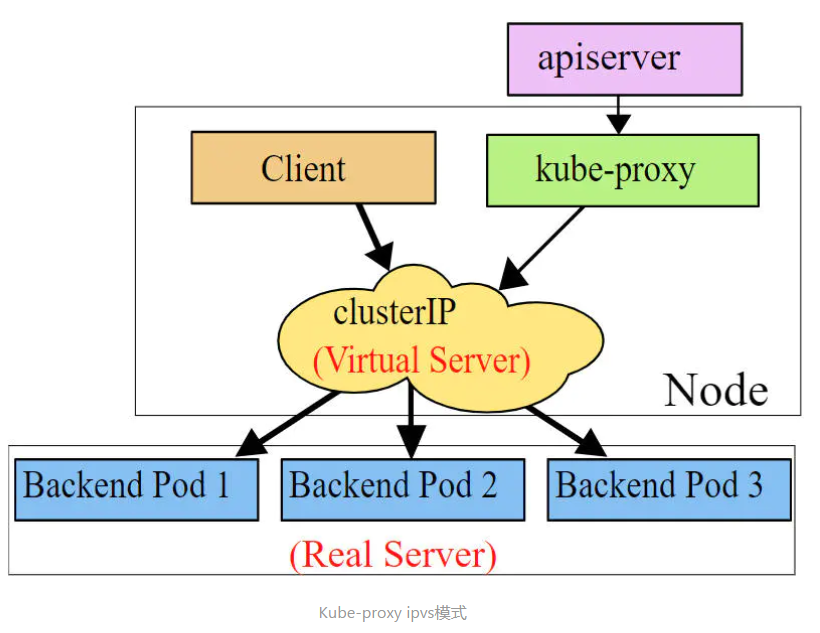

# Service

## 1. Service介绍(即 kube-proxy目前支持三种工作模式)

在**kubernetes**中，**pod**是应用程序的载体，我们可以通过**pod**的**ip**来访问应用程序，但是**pod**的**ip**地址不是固定的，这也就意味着不方便直接采用**pod**的**ip**对服务进行访问。

为了解决这个问题，**kubernetes**提供了**Service**资源，**Service**会对提供同一个服务的多个进行聚合，并且提供一个统一的入口地址。通过访问**Service**的入口地址就能访问到后面的**pod**服务。


**Service**在很多情况下只是一个概念，真正起作用的其实是**kube-proxy**服务进程，每个**Node**节点上都运行着一个**kube-proxy**服务进程。当创建**Service**的时候会通过**api-server**向**etcd**写入创建的**service**的信息，而**kube-proxy**会基于监听的机制发现这种**Service**的变动，然后它会将最新的**Service**信息转换成对应的访问规则。


```sh
# 解释
# 10.97.97.97:80 是service提供的访问入口
# 当访问这个入口的时候，可以发现后面有三个pod的服务在等待调用，
# kube-proxy会基于rr（轮询）的策略，将请求分发到其中一个pod上去
# 这个规则会同时在集群内的所有节点上都生成，所以在任何一个节点，访问都可以。
[root@node1 ~]# ipvsadm -Ln
IP Virtual Server version 1.2.1 (size=4096)
Prot LocalAddress:Port Scheduler Flags
  -> RemoteAddress:Port           Forward Weight ActiveConn InActConn
TCP  10.97.97.97:80 rr
  -> 10.244.1.39:80               Masq    1      0          0
  -> 10.244.1.40:80               Masq    1      0          0
  -> 10.244.2.33:80               Masq    1      0          0
```

### 1.1 userspace 模式

**userspace**模式下，kube-proxy会为每一个**Service**创建一个监听端口，发向 **Cluster IP** （service的IP）的请求被**Iptables**规则重定向到**kube-proxy**监听的端口上，**kube-proxy**根据**LB**算法选择一个提供服务的**pod**并和其建立链接，以将请求转发到**pod**上。 该模式下，**kube-proxy**充当了一个四层负责均衡器的角色。由于**kube-proxy**运行在**userspace**中，在进行转发处理时会增加内核和用户空间之间的数据拷贝，虽然比较稳定，但是效率比较低。


### 1.2 iptables 模式

**Iptables**模式下，**kube-proxy**为service后端的每个Pod创建对应的**Iptables**规则，直接将发向**Cluster IP**的请求重定向到一个**Pod IP**。 该模式下**kube-proxy**不承担四层负责均衡器的角色，只负责创建**iptables**规则。该模式的优点是较**userspace**模式效率更高，但不能提供灵活的**LB**策略，当后端**pod**不可用时也无法进行重试。


### 1.3 ipvs 模式

**ipvs**模式和**iptables**类似，**kube-proxy**监控**Pod**的变化并创建相应的**ipvs**规则。**ipvs**相对**iptables**转发效率更高。除此以外，**ipvs**支持更多的**LB**算法。



```sh
# 查看 IPvs 是否生效
[root@master ~]# ipvsadm -Ln
IP Virtual Server version 1.2.1 (size=4096)
Prot LocalAddress:Port Scheduler Flags
  -> RemoteAddress:Port           Forward Weight ActiveConn InActConn

# 安装 ipvs 模块
# 在 安装集群的时候，就已经安装了

# 此模式必须安装ipvs内核模块，否则会降级为iptables
# 开启ipvs 修改mode: "ipvs"
[root@master ~]# kubectl edit cm kube-proxy -n kube-system
configmap/kube-proxy edited
# 删除 重新加载
[root@master ~]# kubectl delete pod -l k8s-app=kube-proxy -n kube-system
pod "kube-proxy-cb5v5" deleted
pod "kube-proxy-k2hwq" deleted
pod "kube-proxy-xzswd" deleted

[root@master ~]# ipvsadm -Ln
IP Virtual Server version 1.2.1 (size=4096)
Prot LocalAddress:Port Scheduler Flags
  -> RemoteAddress:Port           Forward Weight ActiveConn InActConn
TCP  10.96.0.1:443 rr
  -> 192.168.1.12:6443            Masq    1      0          0     
TCP  10.96.0.10:53 rr
TCP  10.96.0.10:9153 rr
TCP  10.104.110.143:443 rr
  -> 192.168.1.13:443             Masq    1      0          0     
UDP  10.96.0.10:53 rr

```

## 2. Service 类型

```sh
# Service的资源清单文件
kind: Service           # 资源类型
apiVersion: v1          # 资源版本
metadata:               # 元数据
  name: service         # 资源名称
  namespace: dev        # 命名空间
spec:                   # 描述
  selector:             # 标签选择器，用于确定当前service代理哪些pod
    app: nginx
  type:                 # Service类型，指定service的访问方式
  clusterIP:            # 虚拟服务的ip地址
  sessionAffinity:      # session亲和性，支持ClientIP、None两个选项
  ports:                # 端口信息
    - protocol: TCP 
      port: 3017         # service端口
      targetPort: 5003   # pod端口
      nodePort: 31122    # 主机端口
```

- ClusterIP：默认值，它是Kubernetes系统自动分配的虚拟IP，只能在集群内部访问
- NodePort：将Service通过指定的Node上的端口暴露给外部，通过此方法，就可以在集群外部访问服务
- LoadBalancer：使用外接负载均衡器完成到服务的负载分发，注意此模式需要外部云环境支持
- ExternalName： 把集群外部的服务引入集群内部，直接使用

## 3. Service 使用

### 3.1 实验环境准备

在使用service之前，首先利用Deployment创建出3个pod，注意要为pod设置app=nginx-pod的标签

```sh
# 创建deployment.yaml
apiVersion: apps/v1
kind: Deployment  
metadata:
  name: pc-deployment
  namespace: dev
spec: 
  replicas: 3
  selector:
    matchLabels:
      app: nginx-pod
  template:
    metadata:
      labels:
        app: nginx-pod
    spec:
      containers:
      - name: nginx
        image: nginx:1.17.1
        ports:
        - containerPort: 80
```

```sh
[root@master ~]# kubectl create -f deployment.yaml
deployment.apps/pc-deployment created

# 类似的命令 kubectl get all -n dev -o wide 显示全部
[root@master ~]# kubectl get pods -n dev -o wide --show-labels
NAME                             READY   STATUS    RESTARTS   AGE   IP            NODE    NOMINATED NODE   READINESS GATES   LABELS
pc-deployment-6696798b78-25z9m   1/1     Running   0          5s    10.244.1.72   node2   <none>           <none>            app=nginx-pod,pod-template-hash=6696798b78
pc-deployment-6696798b78-gtsjp   1/1     Running   0          5s    10.244.1.73   node2   <none>           <none>            app=nginx-pod,pod-template-hash=6696798b78
pc-deployment-6696798b78-t4qmk   1/1     Running   0          5s    10.244.2.78   node1   <none>           <none>            app=nginx-pod,pod-template-hash=6696798b78

# 访问不到，可以重启一下虚拟机
[root@master ~]# curl 10.244.1.72:80
<!DOCTYPE html>
<html>
<head>
<title>Welcome to nginx!</title>
<style>
    body {
        width: 35em;
        margin: 0 auto;
        font-family: Tahoma, Verdana, Arial, sans-serif;
    }
</style>
</head>
<body>
<h1>Welcome to nginx!</h1>
<p>If you see this page, the nginx web server is successfully installed and
working. Further configuration is required.</p>

<p>For online documentation and support please refer to
<a href="http://nginx.org/">nginx.org</a>.<br/>
Commercial support is available at
<a href="http://nginx.com/">nginx.com</a>.</p>

<p><em>Thank you for using nginx.</em></p>
</body>
</html>

# 修改下三台nginx的index.html页面（三台修改的IP地址不一致）
# kubectl exec -it pc-deployment-6696798b78-25z9m -n dev /bin/sh
# echo "10.244.1.72" > /usr/share/nginx/html/index.html

[root@master ~]# kubectl get pods -n dev -o wide --show-labels
NAME                             READY   STATUS    RESTARTS   AGE     IP            NODE    NOMINATED NODE   READINESS GATES   LABELS
pc-deployment-6696798b78-25z9m   1/1     Running   0          3m34s   10.244.1.72   node2   <none>           <none>            app=nginx-pod,pod-template-hash=6696798b78
pc-deployment-6696798b78-gtsjp   1/1     Running   0          3m34s   10.244.1.73   node2   <none>           <none>            app=nginx-pod,pod-template-hash=6696798b78
pc-deployment-6696798b78-t4qmk   1/1     Running   0          3m34s   10.244.2.78   node1   <none>           <none>            app=nginx-pod,pod-template-hash=6696798b78
[root@master ~]# kubectl exec -it pc-deployment-6696798b78-25z9m -n dev /bin/sh
# echo "10.244.1.72" > /usr/share/nginx/html/index.html
# exit
[root@master ~]# kubectl exec -it pc-deployment-6696798b78-gtsjp -n dev /bin/sh
# echo "10.244.1.73" > /usr/share/nginx/html/index.html
# exit
[root@master ~]# kubectl exec -it pc-deployment-6696798b78-t4qmk -n dev /bin/sh
# echo "10.244.1.78" > /usr/share/nginx/html/index.html
# exit
[root@master ~]# curl 10.244.1.72
10.244.1.72
[root@master ~]# curl 10.244.1.73
10.244.1.73
[root@master ~]# curl 10.244.2.78
10.244.1.78
[root@master ~]#
```

### 3.2 ClusterIP 类型的 Service

```sh
# 创建 service-clusterip.yaml 文件
apiVersion: v1
kind: Service
metadata:
  name: service-clusterip
  namespace: dev
spec:
  selector:
    app: nginx-pod
  clusterIP: 10.97.97.97    # service的ip地址，如果不写，默认会生成一个
  type: ClusterIP
  ports:
  - port: 80        # Service端口   
    targetPort: 80  # pod端口
```

```sh
# 创建 service
[root@master ~]# vim service-clusterip.yaml
[root@master ~]#  kubectl create -f service-clusterip.yaml
service/service-clusterip created

# 查看 service
[root@master ~]# kubectl get svc -n dev -o wide
NAME                TYPE        CLUSTER-IP    EXTERNAL-IP   PORT(S)   AGE   SELECTOR
service-clusterip   ClusterIP   10.97.97.97   <none>        80/TCP    17s   app=nginx-pod

# 查看service的详细信息
# 在这里有一个Endpoints列表，里面就是当前service可以负载到的服务入口
[root@master ~]# kubectl describe svc service-clusterip -n dev
Name:              service-clusterip
Namespace:         dev
Labels:            <none>
Annotations:       <none>
Selector:          app=nginx-pod
Type:              ClusterIP
IP:                10.97.97.97
Port:              <unset>  80/TCP
TargetPort:        80/TCP
Endpoints:         10.244.1.72:80,10.244.1.73:80,10.244.2.78:80 # 对应的pod的那三个IP
Session Affinity:  None
Events:            <none>

# 查看ipvs的映射规则
[root@master ~]# ipvsadm -Ln
IP Virtual Server version 1.2.1 (size=4096)
Prot LocalAddress:Port Scheduler Flags
  -> RemoteAddress:Port           Forward Weight ActiveConn InActConn
TCP  10.96.0.1:443 rr
  -> 192.168.1.12:6443            Masq    1      1          0     
TCP  10.96.0.10:53 rr
TCP  10.96.0.10:9153 rr
TCP  10.97.97.97:80 rr
  -> 10.244.1.72:80               Masq    1      0          0     
  -> 10.244.1.73:80               Masq    1      0          0     
  -> 10.244.2.78:80               Masq    1      0          0     
TCP  10.104.110.143:443 rr
  -> 192.168.1.13:443             Masq    1      2          0     
UDP  10.96.0.10:53 rr

# 访问10.97.97.97:80 观察效果
[root@master ~]# while true;do curl 10.97.97.97:80; sleep 1; done;
10.244.1.72
10.244.1.78
10.244.1.73
10.244.1.72
10.244.1.78
10.244.1.73
10.244.1.78

[root@master ~]# ipvsadm -Ln
IP Virtual Server version 1.2.1 (size=4096)
Prot LocalAddress:Port Scheduler Flags
  -> RemoteAddress:Port           Forward Weight ActiveConn InActConn
TCP  10.96.0.1:443 rr
  -> 192.168.1.12:6443            Masq    1      1          0     
TCP  10.96.0.10:53 rr
TCP  10.96.0.10:9153 rr
TCP  10.97.97.97:80 rr
  -> 10.244.1.72:80               Masq    1      0          0     
  -> 10.244.1.73:80               Masq    1      0          0     
  -> 10.244.2.78:80               Masq    1      0          0     
TCP  10.104.110.143:443 rr
  -> 192.168.1.13:443             Masq    1      2          0     
UDP  10.96.0.10:53 rr
```

### 3.3 Endpoint

**Endpoint** 是**kubernetes**中的一个资源对象，存储在**etcd**中，用来记录一个**service**对应的所有**pod**的访问地址，它是根据**servic**e配置文件中**selector**描述产生的。

一个**Service**由一组**Pod**组成，这些**Pod**通过**Endpoint**暴露出来，**Endpoint**是实现实际服务的端点集合。换句话说，**Service**和**Pod**之间的联系是通过**Endpoint**实现的。


```sh
[root@master ~]# kubectl get endpoints -n dev -o wide
NAME                ENDPOINTS                                      AGE
service-clusterip   10.244.1.72:80,10.244.1.73:80,10.244.2.78:80   7m18s
```

**负载分发策略**（sessionAffinity）

对Service的访问被分发到了后端的Pod上去，目前kubernetes提供了两种负载分发策略：

- 如果不定义，默认使用kube-proxy的策略，比如随机、轮询
- 基于客户端地址的会话保持模式，即来自同一个客户端发起的所有请求都会转发到固定的一个Pod上（此模式可以使在**spec**中添加**sessionAffinity:ClientIP**选项）

```sh
[root@master ~]# kubectl delete -f service-clusterip.yaml 
service "service-clusterip" deleted

# 查看ipvs的映射规则【rr 轮询】
[root@master ~]# ipvsadm -Ln
IP Virtual Server version 1.2.1 (size=4096)
Prot LocalAddress:Port Scheduler Flags
  -> RemoteAddress:Port           Forward Weight ActiveConn InActConn
TCP  10.96.0.1:443 rr
  -> 192.168.1.12:6443            Masq    1      1          0     
TCP  10.96.0.10:53 rr
TCP  10.96.0.10:9153 rr
TCP  10.104.110.143:443 rr
  -> 192.168.1.13:443             Masq    1      2          0     
UDP  10.96.0.10:53 rr

# 修改分发策略 sessionAffinity: ClientIP
[root@master ~]# vim service-clusterip.yaml 
[root@master ~]# more service-clusterip.yaml 
apiVersion: v1
kind: Service
metadata:
  name: service-clusterip
  namespace: dev
spec:
  sessionAffinity: ClientIP
  selector:
    app: nginx-pod
  clusterIP: 10.97.97.97 # service的ip地址，如果不写，默认会生成一个
  type: ClusterIP
  ports:
  - port: 80  # Service端口   
    targetPort: 80 # pod端口

# 查看ipvs的映射规则【rr 轮询】
[root@master ~]# ipvsadm -Ln
IP Virtual Server version 1.2.1 (size=4096)
Prot LocalAddress:Port Scheduler Flags
  -> RemoteAddress:Port           Forward Weight ActiveConn InActConn
TCP  10.96.0.1:443 rr
  -> 192.168.1.12:6443            Masq    1      1          0     
TCP  10.96.0.10:53 rr
TCP  10.96.0.10:9153 rr
TCP  10.104.110.143:443 rr
  -> 192.168.1.13:443             Masq    1      2          0     
UDP  10.96.0.10:53 rr
[root@master ~]# kubectl create -f service-clusterip.yaml 
service/service-clusterip created

[root@master ~]# kubectl describe svc service-clusterip -n dev
Name:              service-clusterip
Namespace:         dev
Labels:            <none>
Annotations:       <none>
Selector:          app=nginx-pod
Type:              ClusterIP
IP:                10.97.97.97
Port:              <unset>  80/TCP
TargetPort:        80/TCP
Endpoints:         10.244.1.72:80,10.244.1.73:80,10.244.2.78:80
# 发生改变
Session Affinity:  ClientIP
Events:            <none>

# 查看ipvs规则【persistent 代表持久】
[root@master ~]#  ipvsadm -Ln
IP Virtual Server version 1.2.1 (size=4096)
Prot LocalAddress:Port Scheduler Flags
  -> RemoteAddress:Port           Forward Weight ActiveConn InActConn
TCP  10.96.0.1:443 rr
  -> 192.168.1.12:6443            Masq    1      1          0     
TCP  10.96.0.10:53 rr
TCP  10.96.0.10:9153 rr
    # 轮询 持久化 persistent
TCP  10.97.97.97:80 rr persistent 10800
  -> 10.244.1.72:80               Masq    1      0          0     
  -> 10.244.1.73:80               Masq    1      0          0     
  -> 10.244.2.78:80               Masq    1      0          0     
TCP  10.104.110.143:443 rr
  -> 192.168.1.13:443             Masq    1      2          0     
UDP  10.96.0.10:53 rr

# 循环访问测试
[root@master ~]# while true;do curl 10.97.97.97; sleep 1; done;
10.244.1.78
10.244.1.78
10.244.1.78
10.244.1.78
10.244.1.78


# 缺点 固定IP ，只能内部集群访问
[root@master ~]# kubectl get svc -n dev
NAME                TYPE        CLUSTER-IP    EXTERNAL-IP   PORT(S)   AGE
service-clusterip   ClusterIP   10.97.97.97   <none>        80/TCP    4m42s

[root@master ~]# kubectl delete -f service-clusterip.yaml 
service "service-clusterip" deleted
```

### 3.4 HeadLiness 类型的 Service

在某些场景中，开发人员可能不想使用**Service**提供的负载均衡功能，而希望自己来控制负载均衡策略，针对这种情况，**kubernetes**提供了**HeadLiness Service**，这类**Service**不会分配**Cluster IP**，如果想要访问**service**，只能通过**service**的域名进行查询。

```sh
# 创建 service-headliness.yaml

apiVersion: v1
kind: Service
metadata:
  name: service-headliness
  namespace: dev
spec:
  selector:
    app: nginx-pod
  clusterIP: None       # 将clusterIP设置为None，即可创建 headliness Service
  type: ClusterIP
  ports:
  - port: 80  
    targetPort: 80

# 创建 service
[root@master ~]# vim service-headliness.yaml
[root@master ~]# kubectl create -f service-headliness.yaml
service/service-headliness created

# 获取service， 发现CLUSTER-IP未分配
[root@master ~]# kubectl get svc service-headliness -n dev -o wide
NAME                 TYPE        CLUSTER-IP   EXTERNAL-IP   PORT(S)   AGE   SELECTOR
service-headliness   ClusterIP   None         <none>        80/TCP    8s    app=nginx-pod

# 查看service详情
[root@master ~]# kubectl describe svc service-headliness  -n dev
Name:              service-headliness
Namespace:         dev
Labels:            <none>
Annotations:       <none>
Selector:          app=nginx-pod
Type:              ClusterIP
IP:                None
Port:              <unset>  80/TCP
TargetPort:        80/TCP
Endpoints:         10.244.1.4:80,10.244.2.6:80,10.244.2.7:80
Session Affinity:  None
Events:            <none>
[root@master ~]# kubectl get pods -n dev
NAME                             READY   STATUS    RESTARTS   AGE
pc-deployment-6696798b78-9dpbn   1/1     Running   0          114s
pc-deployment-6696798b78-cbcmw   1/1     Running   0          114s
pc-deployment-6696798b78-v6n97   1/1     Running   0          114s

# 查看域名的解析情况
[root@master ~]# kubectl exec -it pc-deployment-6696798b78-9dpbn -n  dev /bin/sh
# cat /etc/resolv.conf
nameserver 10.96.0.10
search dev.svc.cluster.local svc.cluster.local cluster.local
options ndots:5
# exit


[root@master ~]# dig @10.96.0.10 service-headliness.dev.svc.cluster.local

; <<>> DiG 9.11.4-P2-RedHat-9.11.4-26.P2.el7 <<>> @10.96.0.10 service-headliness.dev.svc.cluster.local
; (1 server found)
;; global options: +cmd
;; Got answer:
;; WARNING: .local is reserved for Multicast DNS
;; You are currently testing what happens when an mDNS query is leaked to DNS
;; ->>HEADER<<- opcode: QUERY, status: NOERROR, id: 32841
;; flags: qr aa rd; QUERY: 1, ANSWER: 3, AUTHORITY: 0, ADDITIONAL: 1
;; WARNING: recursion requested but not available

;; OPT PSEUDOSECTION:
; EDNS: version: 0, flags:; udp: 4096
;; QUESTION SECTION:
;service-headliness.dev.svc.cluster.local. IN A

;; ANSWER SECTION:
service-headliness.dev.svc.cluster.local. 30 IN A 10.244.2.7
service-headliness.dev.svc.cluster.local. 30 IN A 10.244.2.6
service-headliness.dev.svc.cluster.local. 30 IN A 10.244.1.4

;; Query time: 1 msec
;; SERVER: 10.96.0.10#53(10.96.0.10)
;; WHEN: Fri May 31 00:07:34 PDT 2024
;; MSG SIZE  rcvd: 237

```

### 3.5 NodePort 类型的 Service

在之前的样例中，创建的**Service**的**ip**地址只有集群内部才可以访问，如果希望将**Service**暴露给集群外部使用，那么就要使用到另外一种类型的将**service**，称为**NodePort**类型。**NodePort**的工作原理其实就是将**service**的端口映射到**Node**的一个端口上，然后就可以通过**NodeIp:NodePort**来访问**service**了。


```sh
# 创建 service-nodeport.yaml
apiVersion: v1
kind: Service
metadata:
  name: service-nodeport
  namespace: dev
spec:
  selector:
    app: nginx-pod
  type: NodePort # service类型
  ports:
  - port: 80
    nodePort: 30002 # 指定绑定的node的端口(默认的取值范围是：30000-32767), 如果不指定，会默认分配
    targetPort: 80

[root@master ~]# kubectl delete -f service-headliness.yaml 
service "service-headliness" deleted
[root@master ~]# vim service-nodeport.yaml
[root@master ~]# kubectl create -f service-nodeport.yaml
service/service-nodeport created
[root@master ~]# kubectl get svc -n dev -o wide
NAME               TYPE       CLUSTER-IP      EXTERNAL-IP   PORT(S)        AGE   SELECTOR
service-nodeport   NodePort   10.110.29.164   <none>        80:30002/TCP   5s    app=nginx-pod

# 接下来可以通过电脑主机的浏览器去访问集群中任意一个nodeip的30002端口，即可访问到pod
```


### 3.6 LoadBalancer 类型的 Service

**LoadBalancer**和**NodePort**很相似，目的都是向外部暴露一个端口，区别在于**LoadBalancer**会在集群的外部再来做一个负载均衡设备，而这个设备需要外部环境支持的，外部服务发送到这个设备上的请求，会被设备负载之后转发到集群中。


### 3.7 ExternalName 类型的 Service

**ExternalName**类型的**Service**用于引入集群外部的服务，它通过**externalName**属性指定外部一个服务的地址，然后在集群内部访问此**service**就可以访问到外部的服务了。


```sh
# 创建 service-externalname.yaml 文件
apiVersion: v1
kind: Service
metadata:
  name: service-externalname
  namespace: dev
spec:
  type: ExternalName # service类型
  externalName: www.baidu.com  #改成ip地址也可以

[root@master ~]# vim service-externalname.yaml
[root@master ~]# kubectl  create -f service-externalname.yaml

[root@master ~]# kubectl get svc service-externalname -n dev
NAME                   TYPE           CLUSTER-IP   EXTERNAL-IP     PORT(S)   AGE
service-externalname   ExternalName   <none>       www.baidu.com   <none>    69s
[root@master ~]# kubectl describe svc service-externalname -n dev
Name:              service-externalname
Namespace:         dev
Labels:            <none>
Annotations:       <none>
Selector:          <none>
Type:              ExternalName
IP:            
External Name:     www.baidu.com
Session Affinity:  None
Events:            <none>
service/service-externalname created
[root@master ~]# dig @10.96.0.10 service-externalname.dev.svc.cluster.local

; <<>> DiG 9.11.4-P2-RedHat-9.11.4-26.P2.el7 <<>> @10.96.0.10 service-externalname.dev.svc.cluster.local
; (1 server found)
;; global options: +cmd
;; Got answer:
;; WARNING: .local is reserved for Multicast DNS
;; You are currently testing what happens when an mDNS query is leaked to DNS
;; ->>HEADER<<- opcode: QUERY, status: NOERROR, id: 24175
;; flags: qr aa rd; QUERY: 1, ANSWER: 1, AUTHORITY: 0, ADDITIONAL: 1
;; WARNING: recursion requested but not available

;; OPT PSEUDOSECTION:
; EDNS: version: 0, flags:; udp: 4096
;; QUESTION SECTION:
;service-externalname.dev.svc.cluster.local. IN A

;; ANSWER SECTION:
service-externalname.dev.svc.cluster.local. 30 IN CNAME www.baidu.com.

;; Query time: 1 msec
;; SERVER: 10.96.0.10#53(10.96.0.10)
;; WHEN: Fri May 31 00:25:02 PDT 2024
;; MSG SIZE  rcvd: 140
```

## 4. Ingress 介绍

> Service对集群之外暴露服务的主要方式有两种:**NotePort** 和 **LoadBalancer**，但是这两种方式，都有一定的缺点：
>
> - **NotePort** 方式的缺点是会占用很多集群机器的端口，那么当集群服务变多的时候，这个缺点就愈发明显
> - LB 方式的缺点是每个 service 需要一个 LB，浪费、麻烦，并且需要**kubernetes**之外设备的支持
>
>   基于这种现状，**kubernetes**提供了**Ingress**资源对象，**Ingress**只需要一个**NotePort**或者一个**LB**就可以满足暴露多个**Service**的需求。工作机制大致如下图表示：


实际上，Ingress相当于一个7层的负载均衡器，是kubernetes对反向代理的一个抽象，它的工作原理类似于Nginx，可以理解成在Ingress里建立诸多映射规则，Ingress Controller通过监听这些配置规则并转化成Nginx的反向代理配置 , 然后对外部提供服务。在这里有两个核心概念：

- ingress：kubernetes中的一个对象，作用是定义请求如何转发到service的规则
- ingress controller：具体实现反向代理及负载均衡的程序，对ingress定义的规则进行解析，根据配置的规则来实现请求转发，实现方式有很多，比如Nginx, Contour, Haproxy等等

Ingress（以Nginx为例）的工作原理如下：

1. 用户编写Ingress规则，说明哪个域名对应kubernetes集群中的哪个Service
2. Ingress控制器动态感知Ingress服务规则的变化，然后生成一段对应的Nginx反向代理配置
3. Ingress控制器会将生成的Nginx配置写入到一个运行着的Nginx服务中，并动态更新
4. 到此为止，其实真正在工作的就是一个Nginx了，内部配置了用户定义的请求转发规则


## 5. Ingress 使用

### 5.1 搭建ingress环境

```sh
# 准备文件 service-nodeport.yaml
apiVersion: v1
kind: Service
metadata:
  name: ingress-nginx
  namespace: ingress-nginx
  labels:
    app.kubernetes.io/name: ingress-nginx
    app.kubernetes.io/part-of: ingress-nginx
spec:
  type: NodePort
  ports:
    - name: http
      port: 80
      targetPort: 80
      protocol: TCP
    - name: https
      port: 443
      targetPort: 443
      protocol: TCP
  selector:
    app.kubernetes.io/name: ingress-nginx
    app.kubernetes.io/part-of: ingress-nginx

---

```

```sh
# 创建文件夹
[root@master ~]# mkdir ingress-controller
[root@master ~]# cd ingress-controller/

# 获取 ingress-nginx，本次案例使用的是0.30版本
# 网络原因下载不到，故 需要在git上下载 在上面已经准备好了
[root@k8s-master01 ingress-controller]# wget https://raw.githubusercontent.com/kubernetes/ingress-nginx/nginx-0.30.0/deploy/static/mandatory.yaml
[root@k8s-master01 ingress-controller]# wget https://raw.githubusercontent.com/kubernetes/ingress-nginx/nginx-0.30.0/deploy/static/provider/baremetal/service-nodeport.yaml


[root@master ingress-controller]# kubectl apply -f ./
namespace/ingress-nginx created
configmap/nginx-configuration created
configmap/tcp-services created
configmap/udp-services created
serviceaccount/nginx-ingress-serviceaccount created
clusterrole.rbac.authorization.k8s.io/nginx-ingress-clusterrole created
role.rbac.authorization.k8s.io/nginx-ingress-role created
rolebinding.rbac.authorization.k8s.io/nginx-ingress-role-nisa-binding created
clusterrolebinding.rbac.authorization.k8s.io/nginx-ingress-clusterrole-nisa-binding created
deployment.apps/nginx-ingress-controller created
limitrange/ingress-nginx created
service/ingress-nginx created

# 这里pull比较久 ，需要等待 半个多小时
[root@master ~]# kubectl get pod -n ingress-nginx -w
NAME                                        READY   STATUS    RESTARTS   AGE
nginx-ingress-controller-7f74f657bd-6c9fk   1/1     Running   0          27m
[root@master ~]# kubectl get svc -n ingress-nginx
NAME            TYPE       CLUSTER-IP      EXTERNAL-IP   PORT(S)                      AGE
ingress-nginx   NodePort   10.102.58.104   <none>        80:32103/TCP,443:30249/TCP   32m
```

### 5.2 准备 service 和 pod

创建如下图所示的模型:


```sh
# 创建 tomcat-nginx.yaml
apiVersion: apps/v1
kind: Deployment
metadata:
  name: nginx-deployment
  namespace: dev
spec:
  replicas: 3
  selector:
    matchLabels:
      app: nginx-pod
  template:
    metadata:
      labels:
        app: nginx-pod
    spec:
      containers:
      - name: nginx
        image: nginx:1.17.1
        ports:
        - containerPort: 80

---

apiVersion: apps/v1
kind: Deployment
metadata:
  name: tomcat-deployment
  namespace: dev
spec:
  replicas: 3
  selector:
    matchLabels:
      app: tomcat-pod
  template:
    metadata:
      labels:
        app: tomcat-pod
    spec:
      containers:
      - name: tomcat
        image: tomcat:8.5-jre10-slim
        ports:
        - containerPort: 8080

---

apiVersion: v1
kind: Service
metadata:
  name: nginx-service
  namespace: dev
spec:
  selector:
    app: nginx-pod
  clusterIP: None
  type: ClusterIP
  ports:
  - port: 80
    targetPort: 80

---

apiVersion: v1
kind: Service
metadata:
  name: tomcat-service
  namespace: dev
spec:
  selector:
    app: tomcat-pod
  clusterIP: None
  type: ClusterIP
  ports:
  - port: 8080
    targetPort: 8080
```

```sh
# 创建
[root@master ingress-controller]# kubectl delete ns dev
[root@master ingress-controller]# vim tomcat-nginx.yaml
[root@master ingress-controller]# kubectl create ns dev
namespace/dev created
[root@master ingress-controller]# kubectl create -f tomcat-nginx.yaml
deployment.apps/nginx-deployment created
deployment.apps/tomcat-deployment created
service/nginx-service created
service/tomcat-service created

# 查看
[root@master ingress-controller]# kubectl get svc -n dev
NAME             TYPE        CLUSTER-IP   EXTERNAL-IP   PORT(S)    AGE
nginx-service    ClusterIP   None         <none>        80/TCP     6s
tomcat-service   ClusterIP   None         <none>        8080/TCP   6s
```

### 5.3 Http 代理

```sh
# 创建 ingress-http.yaml
apiVersion: extensions/v1beta1
kind: Ingress
metadata:
  name: ingress-http
  namespace: dev
spec:
  rules:
  - host: nginx.itheima.com
    http:
      paths:
      - path: /
        backend:
          serviceName: nginx-service
          servicePort: 80
  - host: tomcat.itheima.com
    http:
      paths:
      - path: /
        backend:
          serviceName: tomcat-service
          servicePort: 8080
```

```sh
# 创建
[root@master ingress-controller]# vim ingress-http.yaml
[root@master ingress-controller]# kubectl create -f ingress-http.yaml
ingress.extensions/ingress-http created

# 查看
[root@master ingress-controller]# kubectl get ing ingress-http -n dev
NAME           HOSTS                                  ADDRESS   PORTS   AGE
ingress-http   nginx.itheima.com,tomcat.itheima.com             80      4s

[root@master ~]# kubectl get pods -n dev
NAME                                 READY   STATUS    RESTARTS   AGE
nginx-deployment-6696798b78-58s4s    1/1     Running   0          8m22s
nginx-deployment-6696798b78-g4vcz    1/1     Running   0          8m22s
nginx-deployment-6696798b78-vjddr    1/1     Running   0          8m22s
tomcat-deployment-58467d5474-l7jbr   1/1     Running   0          8m22s
tomcat-deployment-58467d5474-mxzch   1/1     Running   0          8m22s
tomcat-deployment-58467d5474-z7fwc   1/1     Running   0          8m22s

[root@master ~]# kubectl get svc -n ingress-nginx
NAME            TYPE       CLUSTER-IP      EXTERNAL-IP   PORT(S)                      AGE
ingress-nginx   NodePort   10.102.58.104   <none>        80:31817/TCP,443:30340/TCP   23m

# 查看详情
[root@master ingress-controller]# kubectl describe ing ingress-http  -n dev
Name:             ingress-http
Namespace:        dev
Address:      
Default backend:  default-http-backend:80 (<none>)
Rules:
  Host                Path  Backends
  ----                ----  --------
  nginx.itheima.com   
                      /   nginx-service:80 (10.244.1.6:80,10.244.2.10:80,10.244.2.9:80)
  tomcat.itheima.com  
                      /   tomcat-service:8080 (10.244.1.5:8080,10.244.1.7:8080,10.244.2.11:8080)
Annotations:
Events:  <none>

# 查询访问端口
[root@master ~]# kubectl get svc -n ingress-nginx
NAME            TYPE       CLUSTER-IP      EXTERNAL-IP   PORT(S)                      AGE
ingress-nginx   NodePort   10.102.58.104   <none>        80:32103/TCP,443:30249/TCP   32m

# 接下来,在本地电脑上配置host文件,解析上面的两个域名到192.168.109.100(master)上
# 然后,就可以分别访问tomcat.itheima.com:32240  和  nginx.itheima.com:32240 查看效果了
# windows 电脑 C:\Windows\System32\drivers\etc 下面host 文件
# 192.168.1.12 nginx.itheima.com
# 192.168.1.12 tomcat.itheima.com

```


### 5.4 Https 代理

```sh
# 创建证书

# 生成证书
openssl req -x509 -sha256 -nodes -days 365 -newkey rsa:2048 -keyout tls.key -out tls.crt -subj "/C=CN/ST=BJ/L=BJ/O=nginx/CN=itheima.com"

# 创建密钥
kubectl create secret tls tls-secret --key tls.key --cert tls.crt
```

```sh
# 创建 ingress-https.yaml
apiVersion: extensions/v1beta1
kind: Ingress
metadata:
  name: ingress-https
  namespace: dev
spec:
  tls:
    - hosts:
      - nginx.itheima.com
      - tomcat.itheima.com
      secretName: tls-secret # 指定秘钥
  rules:
  - host: nginx.itheima.com
    http:
      paths:
      - path: /
        backend:
          serviceName: nginx-service
          servicePort: 80
  - host: tomcat.itheima.com
    http:
      paths:
      - path: /
        backend:
          serviceName: tomcat-service
          servicePort: 8080
```

```sh
[root@master ~]# openssl req -x509 -sha256 -nodes -days 365 -newkey rsa:2048 -keyout tls.key -out tls.crt -subj "/C=CN/ST=BJ/L=BJ/O=nginx/CN=itheima.com"
Generating a 2048 bit RSA private key
........................+++
...+++
writing new private key to 'tls.key'
-----
[root@master ~]# kubectl create secret tls tls-secret --key tls.key --cert tls.crt
secret/tls-secret created

# 创建
[root@master ~]# vim ingress-https.yaml
[root@master ~]# kubectl create -f ingress-https.yaml
ingress.extensions/ingress-https created

# 查看
[root@master ~]# kubectl get ing ingress-https -n dev
NAME            HOSTS                                  ADDRESS         PORTS     AGE
ingress-https   nginx.itheima.com,tomcat.itheima.com   10.102.58.104   80, 443   53s

# 查看详情
[root@master ~]# kubectl describe ing ingress-https -n dev
Name:             ingress-https
Namespace:        dev
Address:          10.102.58.104
Default backend:  default-http-backend:80 (<none>)
TLS:
  tls-secret terminates nginx.itheima.com,tomcat.itheima.com
Rules:
  Host                Path  Backends
  ----                ----  --------
  nginx.itheima.com   
                      /   nginx-service:80 (10.244.1.7:80,10.244.2.8:80,10.244.2.9:80)
  tomcat.itheima.com  
                      /   tomcat-service:8080 (10.244.1.6:8080,10.244.2.10:8080,10.244.2.7:8080)
Annotations:
Events:
  Type    Reason  Age   From                      Message
  ----    ------  ----  ----                      -------
  Normal  CREATE  26s   nginx-ingress-controller  Ingress dev/ingress-https
  Normal  UPDATE  17s   nginx-ingress-controller  Ingress dev/ingress-https

[root@master ~]# kubectl get svc -n ingress-nginx
NAME            TYPE       CLUSTER-IP      EXTERNAL-IP   PORT(S)                      AGE
ingress-nginx   NodePort   10.102.58.104   <none>        80:32103/TCP,443:30249/TCP   41m

# 下面可以通过浏览器访问https://nginx.itheima.com:31335 和 https://tomcat.itheima.com:31335来查看了
```


