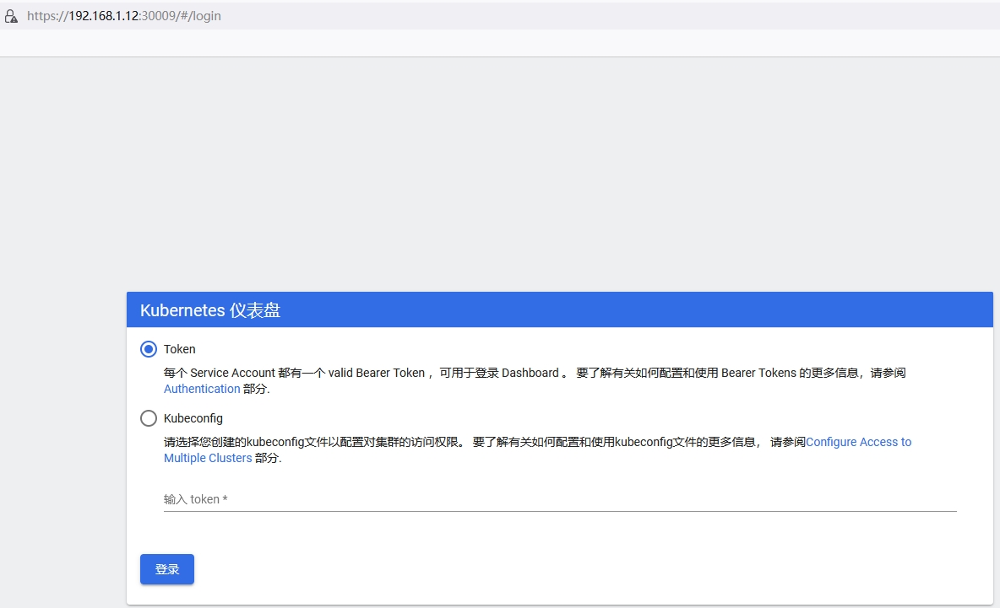
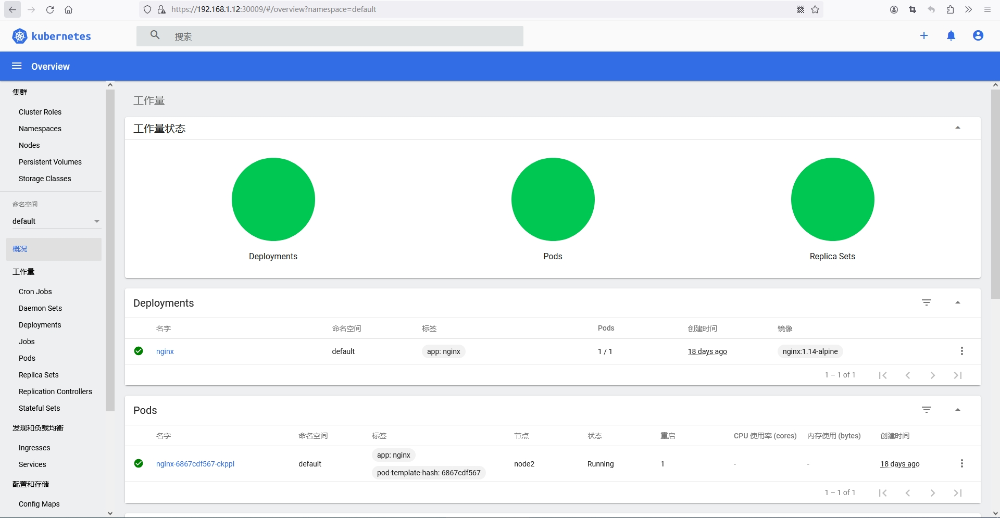

# 1. 数据存储

容器的生命周期可能很短，会被频繁地创建和销毁。那么容器在销毁时，保存在容器中的数据也会被清除。这种结果对用户来说，在某些情况下是不乐意看到的。为了持久化保存容器的数据，kubernetes 引入了 Volume 的概念。

Volume 是 Pod 中能够被多个容器访问的共享目录，它被定义在Pod上，然后被一个Pod里的多个容器挂载到具体的文件目录下，kubernetes 通过 Volume 实现同一个 Pod 中不同容器之间的数据共享以及数据的持久化存储。Volume 的生命容器不与 Pod 中单个容器的生命周期相关，当容器终止或者重启时，Volume 中的数据也不会丢失。

kubernetes 的 Volume 支持多种类型，比较常见的有下面几个：

- 简单存储：EmptyDir、HostPath、NFS
- 高级存储：PV、PVC
- 配置存储：ConfigMap、Secret

## 1.1 基本存储

### 1.1.1 EmptyDir

EmptyDir 是最基础的 Volume 类型，一个 EmptyDir 就是 Host 上的一个空目录。

EmptyDir 是在Pod被分配到 Node 时创建的，它的初始内容为空，并且无须指定宿主机上对应的目录文件，因为 kubernetes 会自动分配一个目录，当 Pod 销毁时， EmptyDir 中的数据也会被永久删除。 EmptyDir 用途如下：

- 临时空间，例如用于某些应用程序运行时所需的临时目录，且无须永久保留
- 一个容器需要从另一个容器中获取数据的目录（多容器共享目录）
接下来，通过一个容器之间文件共享的案例来使用一下 EmptyDir。

在一个 Pod 中准备两个容器 nginx 和 busybox ，然后声明一个 Volume 分别挂在到两个容器的目录中，然后nginx 容器负责向 Volume 中写日志，busybox 中通过命令将日志内容读到控制台。


```sh
# 创建 volume-emptydir.yaml 文件

apiVersion: v1
kind: Pod
metadata:
  name: volume-emptydir
  namespace: dev
spec:
  containers:
  - name: nginx
    image: nginx:1.17.1
    ports:
    - containerPort: 80
    volumeMounts:  # 将logs-volume挂在到nginx容器中，对应的目录为 /var/log/nginx
    - name: logs-volume
      mountPath: /var/log/nginx
  - name: busybox
    image: busybox:1.30
    command: ["/bin/sh","-c","tail -f /logs/access.log"] # 初始命令，动态读取指定文件中内容
    volumeMounts:  # 将logs-volume 挂在到busybox容器中，对应的目录为 /logs
    - name: logs-volume
      mountPath: /logs
  volumes: # 声明volume， name为logs-volume，类型为emptyDir
  - name: logs-volume
    emptyDir: {}

```

```sh
# 创建 Pod
[root@master ~]# vim volume-emptydir.yaml
[root@master ~]# kubectl create -f volume-emptydir.yaml
pod/volume-emptydir created

# 查看 pod
[root@master ~]# kubectl get pods volume-emptydir -n dev -o wide
NAME              READY   STATUS    RESTARTS   AGE   IP            NODE    NOMINATED NODE   READINESS GATES
volume-emptydir   2/2     Running   0          20s   10.244.2.23   node1   <none>           <none>

# 通过 podIp 访问 nginx
[root@master ~]# curl 10.244.2.23
<!DOCTYPE html>
<html>
<head>
<title>Welcome to nginx!</title>
<style>
    body {
        width: 35em;
        margin: 0 auto;
        font-family: Tahoma, Verdana, Arial, sans-serif;
    }
</style>
</head>
<body>
<h1>Welcome to nginx!</h1>
<p>If you see this page, the nginx web server is successfully installed and
working. Further configuration is required.</p>

<p>For online documentation and support please refer to
<a href="http://nginx.org/">nginx.org</a>.<br/>
Commercial support is available at
<a href="http://nginx.com/">nginx.com</a>.</p>

<p><em>Thank you for using nginx.</em></p>
</body>
</html>

# 通过 kubectl logs 命令查看指定容器的标准输出
[root@master ~]# kubectl logs -f volume-emptydir -n dev -c busybox
10.244.0.0 - - [01/Jun/2024:02:48:25 +0000] "GET / HTTP/1.1" 200 612 "-" "curl/7.29.0" "-"
10.244.0.0 - - [01/Jun/2024:02:48:45 +0000] "GET / HTTP/1.1" 200 612 "-" "curl/7.29.0" "-"

```
### 1.1.2 HostPath

EmptyDir 中数据不会被持久化，它会随着Pod的结束而销毁，如果想简单的将数据持久化到主机中，可以选择HostPath。

HostPath 就是将 Node 主机中一个实际目录挂在到 Pod 中，以供容器使用，这样的设计就可以保证 Pod 销毁了，但是数据依据可以存在于 Node 主机上。


```sh
# 创建 volume-hostpath.yaml 文件
apiVersion: v1
kind: Pod
metadata:
  name: volume-hostpath
  namespace: dev
spec:
  containers:
  - name: nginx
    image: nginx:1.17.1
    ports:
    - containerPort: 80
    volumeMounts:
    - name: logs-volume
      mountPath: /var/log/nginx
  - name: busybox
    image: busybox:1.30
    command: ["/bin/sh","-c","tail -f /logs/access.log"]
    volumeMounts:
    - name: logs-volume
      mountPath: /logs
  volumes:
  - name: logs-volume
    hostPath: 
      path: /root/logs
      type: DirectoryOrCreate  # 目录存在就使用，不存在就先创建后使用
```

关于type的值的一点说明：

 - DirectoryOrCreate 目录存在就使用，不存在就先创建后使用
 - Directory   目录必须存在
 - FileOrCreate  文件存在就使用，不存在就先创建后使用
 - File 文件必须存在 
 - Socket  unix套接字必须存在
 - CharDevice  字符设备必须存在
 - BlockDevice 块设备必须存在

```sh
# 创建 Pod
[root@master ~]# vim volume-hostpath.yaml
[root@master ~]# kubectl create -f volume-hostpath.yaml
pod/volume-hostpath created

# 查看 Pod
[root@master ~]#  kubectl get pods volume-hostpath -n dev -o wide
NAME              READY   STATUS              RESTARTS   AGE   IP       NODE    NOMINATED NODE   READINESS GATES
volume-hostpath   0/2     ContainerCreating   0          5s    <none>   node2   <none>           <none>
[root@master ~]#  kubectl get pods volume-hostpath -n dev -o wide
NAME              READY   STATUS    RESTARTS   AGE   IP            NODE    NOMINATED NODE   READINESS GATES
volume-hostpath   2/2     Running   0          28s   10.244.1.16   node2   <none>           <none>

# 访问 nginx
[root@master ~]# curl 10.244.1.16
<!DOCTYPE html>
<html>
<head>
<title>Welcome to nginx!</title>
<style>
    body {
        width: 35em;
        margin: 0 auto;
        font-family: Tahoma, Verdana, Arial, sans-serif;
    }
</style>
</head>
<body>
<h1>Welcome to nginx!</h1>
<p>If you see this page, the nginx web server is successfully installed and
working. Further configuration is required.</p>

<p>For online documentation and support please refer to
<a href="http://nginx.org/">nginx.org</a>.<br/>
Commercial support is available at
<a href="http://nginx.com/">nginx.com</a>.</p>

<p><em>Thank you for using nginx.</em></p>
</body>
</html>
[root@master ~]# kubectl logs -f volume-emptydir -n dev -c busybox
10.244.0.0 - - [01/Jun/2024:02:48:25 +0000] "GET / HTTP/1.1" 200 612 "-" "curl/7.29.0" "-"
10.244.0.0 - - [01/Jun/2024:02:48:45 +0000] "GET / HTTP/1.1" 200 612 "-" "curl/7.29.0" "-"

# 接下来就可以去host的/root/logs目录下查看存储的文件了
###  注意: 下面的操作需要到Pod所在的节点运行（案例中是node2）
[root@node2 ~]# ls /root/logs/
access.log  error.log
# 同样的道理，如果在此目录下创建一个文件，到容器中也是可以看到的

# 删除 pod 之后 ，日志文件依然存在
[root@master ~]# kubectl delete -f volume-hostpath.yaml 
pod "volume-hostpath" deleted
```
### 1.1.3 NFS

HostPath 可以解决数据持久化的问题，但是一旦 Node 节点故障了，Pod如果转移到了别的节点，又会出现问题了，此时需要准备单独的网络存储系统，比较常用的用 NFS、CIFS。

NFS 是一个网络文件存储系统，可以搭建一台 NFS 服务器，然后将 Pod 中的存储直接连接到NFS系统上，这样的话，无论 Pod 在节点上怎么转移，只要 Node 跟 NFS 的对接没问题，数据就可以成功访问。


1. 准备 nfs 服务器，为了简单，直接是 master 节点做 nfs 服务器
```sh
[root@master ~]# yum install nfs-utils -y
[root@master ~]# mkdir /root/data/nfs -pv
mkdir: created directory ‘/root/data’
mkdir: created directory ‘/root/data/nfs’

# 将共享目录以读写权限暴露给192.168.1.0/24网段中的所有主机
[root@master ~]# vim /etc/exports
[root@master ~]# more /etc/exports
/root/data/nfs     192.168.1.0/24(rw,no_root_squash)

# 启动 nfs 服务
[root@master ~]# systemctl restart nfs
```
2. 在的每个 node 节点上都安装下 nfs，这样的目的是为了 node 节点可以驱动 nfs 设备
```sh
[root@node1 ~]# yum install nfs-utils -y
[root@node2 ~]# yum install nfs-utils -y
```
3. 创建 volume-nfs.yaml
```sh
# 创建 volume-nfs.yaml 文件
apiVersion: v1
kind: Pod
metadata:
  name: volume-nfs
  namespace: dev
spec:
  containers:
  - name: nginx
    image: nginx:1.17.1
    ports:
    - containerPort: 80
    volumeMounts:
    - name: logs-volume
      mountPath: /var/log/nginx
  - name: busybox
    image: busybox:1.30
    command: ["/bin/sh","-c","tail -f /logs/access.log"] 
    volumeMounts:
    - name: logs-volume
      mountPath: /logs
  volumes:
  - name: logs-volume
    nfs:
      # 这里配置nfs服务器地址
      server: 192.168.1.12  #nfs服务器地址
      # server: 192.168.5.6  #nfs服务器地址
      path: /root/data/nfs #共享文件路径
```
4. 运行 pod，观察结果
```sh
# 创建 pod
[root@master ~]#  kubectl create -f volume-nfs.yaml
pod/volume-nfs created

[root@master ~]# kubectl get pods volume-nfs -n dev
NAME         READY   STATUS    RESTARTS   AGE
volume-nfs   2/2     Running   0          4s
[root@master ~]# ls /root/data/
nfs

# 查看 pod
[root@master ~]# kubectl get pods volume-nfs -n dev -o wide
NAME         READY   STATUS    RESTARTS   AGE   IP            NODE    NOMINATED NODE   READINESS GATES
volume-nfs   2/2     Running   0          28s   10.244.2.24   node1   <none>           <none>
[root@master ~]# curl 10.244.2.24
<!DOCTYPE html>
<html>
<head>
<title>Welcome to nginx!</title>
<style>
    body {
        width: 35em;
        margin: 0 auto;
        font-family: Tahoma, Verdana, Arial, sans-serif;
    }
</style>
</head>
<body>
<h1>Welcome to nginx!</h1>
<p>If you see this page, the nginx web server is successfully installed and
working. Further configuration is required.</p>

<p>For online documentation and support please refer to
<a href="http://nginx.org/">nginx.org</a>.<br/>
Commercial support is available at
<a href="http://nginx.com/">nginx.com</a>.</p>

<p><em>Thank you for using nginx.</em></p>
</body>
</html>

# 查看 nfs 服务器上的共享目录，发现已经有文件
[root@master ~]# cd  /root/data/nfs/
[root@master nfs]# ll
total 4
-rw-r--r-- 1 root root 91 May 31 20:17 access.log
-rw-r--r-- 1 root root  0 May 31 20:16 error.log
[root@master nfs]# tail -f access.log 
10.244.0.0 - - [01/Jun/2024:03:17:35 +0000] "GET / HTTP/1.1" 200 612 "-" "curl/7.29.0" "-"
```

## 1.2 高级存储

前面已经学习了使用NFS提供存储，此时就要求用户会搭建NFS系统，并且会在yaml配置nfs。由于kubernetes支持的存储系统有很多，要求客户全都掌握，显然不现实。为了能够屏蔽底层存储实现的细节，方便用户使用， kubernetes引入PV和PVC两种资源对象。

- PV（Persistent Volume）是持久化卷的意思，是对底层的共享存储的一种抽象。一般情况下PV由kubernetes管理员进行创建和配置，它与底层具体的共享存储技术有关，并通过插件完成与共享存储的对接。

- PVC（Persistent Volume Claim）是持久卷声明的意思，是用户对于存储需求的一种声明。换句话说，PVC其实就是用户向kubernetes系统发出的一种资源需求申请。


使用了PV和PVC之后，工作可以得到进一步的细分：

- 存储：存储工程师维护
- PV： kubernetes 管理员维护
- PVC：kubernetes 用户维护

### 1.2.1 PV

```sh
# PV是存储资源的抽象，资源清单文件:
# 不用配置 namespace 共享的
apiVersion: v1  
kind: PersistentVolume
metadata:
  name: pv2
spec:
  nfs: # 存储类型，与底层真正存储对应
  capacity:  # 存储能力，目前只支持存储空间的设置
    storage: 2Gi
  accessModes:  # 访问模式
  storageClassName: # 存储类别
  persistentVolumeReclaimPolicy: # 回收策略
```

PV 的关键配置参数说明：

- 存储类型

    底层实际存储的类型，kubernetes支持多种存储类型，每种存储类型的配置都有所差异

- 存储能力（capacity）

    目前只支持存储空间的设置( storage=1Gi )，不过未来可能会加入IOPS、吞吐量等指标的配置

- 访问模式（accessModes）

    用于描述用户应用对存储资源的访问权限，访问权限包括下面几种方式：

    1. ReadWriteOnce（RWO）：读写权限，但是只能被单个节点挂载
    2. ReadOnlyMany（ROX）： 只读权限，可以被多个节点挂载
    3. ReadWriteMany（RWX）：读写权限，可以被多个节点挂载

需要注意的是，底层不同的存储类型可能支持的访问模式不同

- 回收策略（persistentVolumeReclaimPolicy）

    当PV不再被使用了之后，对其的处理方式。目前支持三种策略：

    1. Retain （保留） 保留数据，需要管理员手工清理数据
    2. Recycle（回收） 清除 PV 中的数据，效果相当于执行 rm -rf /thevolume/*
    3. Delete （删除） 与 PV 相连的后端存储完成 volume 的删除操作，当然这常见于云服务商的存储服务

需要注意的是，底层不同的存储类型可能支持的回收策略不同

- 存储类别

    PV 可以通过 storageClassName 参数指定一个存储类别

    1. 具有特定类别的PV只能与请求了该类别的PVC进行绑定
    2. 未设定类别的PV则只能与不请求任何类别的PVC进行绑定
- 状态（status）

    一个 PV 的生命周期中，可能会处于4中不同的阶段：

    1. Available（可用）： 表示可用状态，还未被任何 PVC 绑定
    2. Bound（已绑定）： 表示 PV 已经被 PVC 绑定
    3. Released（已释放）： 表示 PVC 被删除，但是资源还未被集群重新声明
    4. Failed（失败）： 表示该 PV 的自动回收失败


> **实验**
> 使用 NFS 作为存储，来演示 PV 的使用，创建 3个 PV ，对应 NFS 中的3个暴露的路径。
1. 准备 NFS 环境
```sh
[root@master ~]# kubectl delete -f volume-nfs.yaml
pod "volume-nfs" deleted
[root@master nfs]# mkdir /root/data/{pv1,pv2,pv3} -pv
mkdir: created directory ‘/root/data/pv1’
mkdir: created directory ‘/root/data/pv2’
mkdir: created directory ‘/root/data/pv3’

# 编辑
[root@master ~]# more /etc/exports
/root/data/pv1     192.168.1.0/24(rw,no_root_squash)
/root/data/pv2     192.168.1.0/24(rw,no_root_squash)
/root/data/pv3     192.168.1.0/24(rw,no_root_squash)
[root@master ~]# systemctl restart nfs


```
2. 创建 pv.yaml 文件

```sh
# 创建 pv.yaml 文件
apiVersion: v1
kind: PersistentVolume
metadata:
  name:  pv1
spec:
  capacity: 
    storage: 1Gi
  accessModes:
  - ReadWriteMany
  persistentVolumeReclaimPolicy: Retain
  nfs:
    path: /root/data/pv1
    server: 192.168.1.12

---

apiVersion: v1
kind: PersistentVolume
metadata:
  name:  pv2
spec:
  capacity: 
    storage: 2Gi
  accessModes:
  - ReadWriteMany
  persistentVolumeReclaimPolicy: Retain
  nfs:
    path: /root/data/pv2
    server: 192.168.1.12
    
---

apiVersion: v1
kind: PersistentVolume
metadata:
  name:  pv3
spec:
  capacity: 
    storage: 3Gi
  accessModes:
  - ReadWriteMany
  persistentVolumeReclaimPolicy: Retain
  nfs:
    path: /root/data/pv3
    server: 192.168.1.12
```

```sh
[root@master ~]# vim pv.yaml
[root@master ~]# kubectl create -f pv.yaml
persistentvolume/pv1 created
persistentvolume/pv2 created
persistentvolume/pv3 created
[root@master ~]# kubectl get pv -o wide
NAME   CAPACITY   ACCESS MODES   RECLAIM POLICY   STATUS      CLAIM   STORAGECLASS   REASON   AGE   VOLUMEMODE
pv1    1Gi        RWX            Retain           Available                                   9s    Filesystem
pv2    2Gi        RWX            Retain           Available                                   9s    Filesystem
pv3    3Gi        RWX            Retain           Available                                   9s    Filesystem
```


### 1.2.2 PVC

PVC 是资源的申请，用来声明对存储空间、访问模式、存储类别需求信息。下面是资源清单文件:

```sh
apiVersion: v1
kind: PersistentVolumeClaim
metadata:
  name: pvc
  namespace: dev
spec:
  accessModes:      # 访问模式
  selector:         # 采用标签对PV选择
  storageClassName: # 存储类别
  resources:        # 请求空间
    requests:
      storage: 5Gi
```

PVC 的关键配置参数说明：

- 访问模式（accessModes）
    用于描述用户应用对存储资源的访问权限

- 选择条件（selector）

    通过Label Selector的设置，可使PVC对于系统中己存在的PV进行筛选

- 存储类别（storageClassName）

    PVC在定义时可以设定需要的后端存储的类别，只有设置了该class的pv才能被系统选出

- 资源请求（Resources ）

    描述对存储资源的请求

> 实验

1. 创建 pvc.yaml 文件，申请 pv
```sh
apiVersion: v1
kind: PersistentVolumeClaim
metadata:
  name: pvc1
  namespace: dev
spec:
  accessModes: 
  - ReadWriteMany
  resources:
    requests:
      storage: 1Gi
---
apiVersion: v1
kind: PersistentVolumeClaim
metadata:
  name: pvc2
  namespace: dev
spec:
  accessModes: 
  - ReadWriteMany
  resources:
    requests:
      storage: 1Gi
---
apiVersion: v1
kind: PersistentVolumeClaim
metadata:
  name: pvc3
  namespace: dev
spec:
  accessModes: 
  - ReadWriteMany
  resources:
    requests:
      storage: 1Gi
```

```sh
[root@master ~]# vim pvc.yaml
[root@master ~]# kubectl create -f pvc.yaml
persistentvolumeclaim/pvc1 created
persistentvolumeclaim/pvc2 created
persistentvolumeclaim/pvc3 created
[root@master ~]# kubectl get pvc  -n dev -o wide
NAME   STATUS   VOLUME   CAPACITY   ACCESS MODES   STORAGECLASS   AGE   VOLUMEMODE
pvc1   Bound    pv1      1Gi        RWX                           4s    Filesystem
pvc2   Bound    pv2      2Gi        RWX                           4s    Filesystem
pvc3   Bound    pv3      3Gi        RWX                           4s    Filesystem
[root@master ~]# kubectl get pv -o wide
NAME   CAPACITY   ACCESS MODES   RECLAIM POLICY   STATUS   CLAIM      STORAGECLASS   REASON   AGE     VOLUMEMODE
pv1    1Gi        RWX            Retain           Bound    dev/pvc1                           2m34s   Filesystem
pv2    2Gi        RWX            Retain           Bound    dev/pvc2                           2m34s   Filesystem
pv3    3Gi        RWX            Retain           Bound    dev/pvc3                           2m34s   Filesystem
```
2. 创建 pods.yaml 文件 , 使用 pv

```sh
# 创建  pods.yaml 文件
apiVersion: v1
kind: Pod
metadata:
  name: pod1
  namespace: dev
spec:
  containers:
  - name: busybox
    image: busybox:1.30
    command: ["/bin/sh","-c","while true;do echo pod1 >> /root/out.txt; sleep 10; done;"]
    volumeMounts:
    - name: volume
      mountPath: /root/
  volumes:
    - name: volume
      persistentVolumeClaim:
        claimName: pvc1
        readOnly: false
---
apiVersion: v1
kind: Pod
metadata:
  name: pod2
  namespace: dev
spec:
  containers:
  - name: busybox
    image: busybox:1.30
    command: ["/bin/sh","-c","while true;do echo pod2 >> /root/out.txt; sleep 10; done;"]
    volumeMounts:
    - name: volume
      mountPath: /root/
  volumes:
    - name: volume
      persistentVolumeClaim:
        claimName: pvc2
        readOnly: false
```
```sh
[root@master ~]# vim pods.yaml
[root@master ~]# kubectl create -f pods.yaml
pod/pod1 created
pod/pod2 created
[root@master ~]#  kubectl get pods -n dev -o wide
NAME                                 READY   STATUS    RESTARTS   AGE   IP            
pod1                                 1/1     Running   0          6s    10.244.1.17   node2   <none>           <none>
pod2                                 1/1     Running   0          6s    10.244.2.25   node1   <none>           <none>
[root@master ~]# kubectl get pvc -n dev -o wide
NAME   STATUS   VOLUME   CAPACITY   ACCESS MODES   STORAGECLASS   AGE     VOLUMEMODE
pvc1   Bound    pv1      1Gi        RWX                           2m33s   Filesystem
pvc2   Bound    pv2      2Gi        RWX                           2m33s   Filesystem
pvc3   Bound    pv3      3Gi        RWX                           2m33s   Filesystem
[root@master ~]# kubectl get pv -n dev -o wide
NAME   CAPACITY   ACCESS MODES   RECLAIM POLICY   STATUS   CLAIM      STORAGECLASS   REASON   AGE    VOLUMEMODE
pv1    1Gi        RWX            Retain           Bound    dev/pvc1                           5m5s   Filesystem
pv2    2Gi        RWX            Retain           Bound    dev/pvc2                           5m5s   Filesystem
pv3    3Gi        RWX            Retain           Bound    dev/pvc3                           5m5s   Filesystem
[root@master ~]# more /root/data/pv1/out.txt
pod1
pod1
pod1
pod1
pod1
[root@master ~]# more /root/data/pv2/out.txt
pod2
pod2
pod2
pod2
pod2
```

### 1.2.3 生命周期

> PVC 和 PV 是一一对应的，PV 和 PVC 之间的相互作用遵循以下生命周期：

- 资源供应：管理员手动创建底层存储和PV

- 资源绑定：用户创建 PVC ，kubernetes 负责根据 PVC 的声明去寻找 PV，并绑定

    在用户定义好PVC之后，系统将根据PVC对存储资源的请求在已存在的PV中选择一个满足条件的

- 一旦找到，就将该 PV 与用户定义的 PVC 进行绑定，用户的应用就可以使用这个 PVC 了
- 如果找不到，PVC 则会无限期处于 Pending 状态，直到等到系统管理员创建了一个符合其要求的 PV

    PV一旦绑定到某个PVC上，就会被这个 PVC 独占，不能再与其他PVC进行绑定了

- 资源使用：用户可在 pod 中像 volume 一样使用 pvc

    Pod使用Volume的定义，将PVC挂载到容器内的某个路径进行使用。

- 资源释放：用户删除 pvc 来释放 pv

    当存储资源使用完毕后，用户可以删除PVC，与该PVC绑定的PV将会被标记为“已释放”，但还不能立刻与其他PVC进行绑定。通过之前PVC写入的数据可能还被留在存储设备上，只有在清除之后该PV才能再次使用。

- 资源回收：kubernetes 根据 pv 设置的回收策略进行资源的回收

    对于 PV，管理员可以设定回收策略，用于设置与之绑定的 PVC 释放资源之后如何处理遗留数据的问题。只有 PV 的存储空间完成回收，才能供新的 PVC 绑定和使用


## 1.3 配置存储

### 1.3.1 ConfigMap

> ConfigMap是一种比较特殊的存储卷，它的主要作用是用来存储配置信息的。

```sh
# 创建 configmap.yaml 文件
apiVersion: v1
kind: ConfigMap
metadata:
  name: configmap
  namespace: dev
data:
  info: |
    username:admin
    password:123456
```

```sh
[root@master ~]# vim configmap.yaml

# 创建 pod
[root@master ~]# kubectl create -f configmap.yaml
configmap/configmap created

# 查看 pod
[root@master ~]# kubectl describe cm configmap -n dev
Name:         configmap
Namespace:    dev
Labels:       <none>
Annotations:  <none>

Data
====
info:
----
username:admin
password:123456

Events:  <none>
```

```sh

# 创建 pod-configmap.yaml
apiVersion: v1
kind: Pod
metadata:
  name: pod-configmap
  namespace: dev
spec:
  containers:
  - name: nginx
    image: nginx:1.17.1
    volumeMounts:     # 将configmap挂载到目录
    - name: config
      mountPath: /configmap/config
  volumes:            # 引用configmap
  - name: config
    configMap:
      name: configmap
```

```sh

# 创建 pod
[root@master ~]# vim pod-configmap.yaml
[root@master ~]#  kubectl create -f pod-configmap.yaml
pod/pod-configmap created

# 查看 pod
[root@master ~]# kubectl get pod pod-configmap -n dev
NAME            READY   STATUS    RESTARTS   AGE
pod-configmap   1/1     Running   0          6s

# 进入容器
[root@master ~]#  kubectl exec -it pod-configmap -n dev /bin/sh
# cd /configmap/config/
# ls
info
# more info
username:admin
password:123456
# exit

# 可以看到映射已经成功，每个configmap都映射成了一个目录
# key--->文件     value---->文件中的内容
# 此时如果更新 configmap 的内容, 容器中的值也会动态更新
```
### 1.3.2 Secret

> 在 kubernetes 中，还存在一种和 ConfigMap 非常类似的对象，称为 Secret 对象。它主要用于存储敏感信息，例如密码、秘钥、证书等等。

```sh
# 使用 base64 对数据进行编码
# 准备 username
[root@master ~]# echo -n 'admin' | base64 
YWRtaW4=

# 准备 password
[root@master ~]# echo -n '123456' | base64 
MTIzNDU2
```
```sh
# 创建 secret.yaml 文件
apiVersion: v1
kind: Secret
metadata:
  name: secret
  namespace: dev
type: Opaque
data:
  username: YWRtaW4=
  password: MTIzNDU2
```

```sh
# 创建 secret
[root@master ~]# vim secret.yaml
[root@master ~]# kubectl create -f secret.yaml
secret/secret created

# 查看 secret 详情
[root@master ~]#  kubectl describe secret secret -n dev
Name:         secret
Namespace:    dev
Labels:       <none>
Annotations:  <none>

Type:  Opaque

Data
====
username:  5 bytes
password:  6 bytes
```

```sh
# 创建 pod-secret.yaml 文件
apiVersion: v1
kind: Pod
metadata:
  name: pod-secret
  namespace: dev
spec:
  containers:
  - name: nginx
    image: nginx:1.17.1
    volumeMounts: # 将secret挂载到目录
    - name: config
      mountPath: /secret/config
  volumes:
  - name: config
    secret:
      secretName: secret
```

```sh
# 创建 pod
[root@master ~]# vim pod-secret.yaml
[root@master ~]# kubectl create -f pod-secret.yaml
pod/pod-secret created

# 查看 pod
[root@master ~]#  kubectl get pod pod-secret -n dev
NAME         READY   STATUS    RESTARTS   AGE
pod-secret   1/1     Running   0          4s

# 进入容器，查看 secret 信息，发现已经自动解码了
[root@master ~]# kubectl exec -it pod-secret /bin/sh -n dev
# ls /secret/config/
password  username
# more /secret/config/username
admin
# more /secret/config/password
123456
# exit
```

```sh
```

# 2. 安全认证

## 2.1 访问控制概述

Kubernetes 作为一个分布式集群的管理工具，保证集群的安全性是其一个重要的任务。所谓的安全性其实就是保证对 Kubernetes 的各种客户端进行认证和鉴权操作。

### 客户端

在Kubernetes集群中，客户端通常有两类：

User Account：一般是独立于 kubernetes 之外的其他服务管理的用户账号。
Service Account：kubernetes 管理的账号，用于为 Pod 中的服务进程在访问 Kubernetes 时提供身份标识。


### 认证、授权与准入控制

ApiServer是访问及管理资源对象的唯一入口。任何一个请求访问ApiServer，都要经过下面三个流程：

- Authentication（认证）：身份鉴别，只有正确的账号才能够通过认证
- Authorization（授权）： 判断用户是否有权限对访问的资源执行特定的动作
- Admission Control（准入控制）：用于补充授权机制以实现更加精细的访问控制功能。


## 2.2 认证管理

Kubernetes 集群安全的最关键点在于如何识别并认证客户端身份，它提供了3种客户端身份认证方式：
1. HTTP Base认证：通过用户名+密码的方式认证

    这种认证方式是把“用户名:密码”用BASE64算法进行编码后的字符串放在HTTP请求中的Header Authorization域里发送给服务端。服务端收到后进行解码，获取用户名及密码，然后进行用户身份认证的过程。

2. HTTP Token认证：通过一个Token来识别合法用户

    这种认证方式是用一个很长的难以被模仿的字符串--Token来表明客户身份的一种方式。每个Token对应一个用户名，当客户端发起API调用请求时，需要在HTTP Header里放入Token，API Server接到Token后会跟服务器中保存的token进行比对，然后进行用户身份认证的过程。

3. HTTPS证书认证：基于CA根证书签名的双向数字证书认证方式

    这种认证方式是安全性最高的一种方式，但是同时也是操作起来最麻烦的一种方式。

    


HTTPS认证大体分为3个过程：

1. 证书申请和下发
    
    HTTPS通信双方的服务器向CA机构申请证书，CA机构下发根证书、服务端证书及私钥给申请者

2. 客户端和服务端的双向认证

    1. 客户端向服务器端发起请求，服务端下发自己的证书给客户端，
     客户端接收到证书后，通过私钥解密证书，在证书中获得服务端的公钥，
     客户端利用服务器端的公钥认证证书中的信息，如果一致，则认可这个服务器
    2. 客户端发送自己的证书给服务器端，服务端接收到证书后，通过私钥解密证书，
     在证书中获得客户端的公钥，并用该公钥认证证书信息，确认客户端是否合法
3. 服务器端和客户端进行通信

    服务器端和客户端协商好加密方案后，客户端会产生一个随机的秘钥并加密，然后发送到服务器端。
    服务器端接收这个秘钥后，双方接下来通信的所有内容都通过该随机秘钥加密

> 注意: Kubernetes允许同时配置多种认证方式，只要其中任意一个方式认证通过即可
## 2.3 授权管理

授权发生在认证成功之后，通过认证就可以知道请求用户是谁， 然后Kubernetes会根据事先定义的授权策略来决定用户是否有权限访问，这个过程就称为授权。

每个发送到ApiServer的请求都带上了用户和资源的信息：比如发送请求的用户、请求的路径、请求的动作等，授权就是根据这些信息和授权策略进行比较，如果符合策略，则认为授权通过，否则会返回错误。

API Server目前支持以下几种授权策略：

- AlwaysDeny：表示拒绝所有请求，一般用于测试
- AlwaysAllow：允许接收所有请求，相当于集群不需要授权流程（Kubernetes默认的策略）
- ABAC：基于属性的访问控制，表示使用用户配置的授权规则对用户请求进行匹配和控制
- Webhook：通过调用外部REST服务对用户进行授权
- Node：是一种专用模式，用于对kubelet发出的请求进行访问控制
- RBAC：基于角色的访问控制（kubeadm安装方式下的默认选项）

RBAC(Role-Based Access Control) 基于角色的访问控制，主要是在描述一件事情：给哪些对象授予了哪些权限,其中涉及到了下面几个概念：

- 对象：User、Groups、ServiceAccount
- 角色：代表着一组定义在资源上的可操作动作(权限)的集合
- 绑定：将定义好的角色跟用户绑定在一起

    

RBAC引入了4个顶级资源对象：

- Role、ClusterRole：角色，用于指定一组权限
- RoleBinding、ClusterRoleBinding：角色绑定，用于将角色（权限）赋予给对象
### Role、ClusterRole

一个角色就是一组权限的集合，这里的权限都是许可形式的（白名单）。
```sh
# Role只能对命名空间内的资源进行授权，需要指定nameapce
kind: Role
apiVersion: rbac.authorization.k8s.io/v1beta1
metadata:
  namespace: dev
  name: authorization-role
rules:
- apiGroups: [""]  # 支持的API组列表,"" 空字符串，表示核心API群
  resources: ["pods"] # 支持的资源对象列表
  verbs: ["get", "watch", "list"] # 允许的对资源对象的操作方法列表
```
```sh
# ClusterRole可以对集群范围内资源、跨namespaces的范围资源、非资源类型进行授权
kind: ClusterRole
apiVersion: rbac.authorization.k8s.io/v1beta1
metadata:
 name: authorization-clusterrole
rules:
- apiGroups: [""]
  resources: ["pods"]
  verbs: ["get", "watch", "list"]
```

需要详细说明的是，rules中的参数：

- apiGroups: 支持的API组列表

```sh
"","apps", "autoscaling", "batch"
```
- resources：支持的资源对象列表

```sh
"services", "endpoints", "pods","secrets","configmaps","crontabs","deployments","jobs",
"nodes","rolebindings","clusterroles","daemonsets","replicasets","statefulsets",
"horizontalpodautoscalers","replicationcontrollers","cronjobs"
```

- verbs：对资源对象的操作方法列表

```sh
"get", "list", "watch", "create", "update", "patch", "delete", "exec"
```
### RoleBinding、ClusterRoleBinding

角色绑定用来把一个角色绑定到一个目标对象上，绑定目标可以是User、Group或者ServiceAccount。

```sh
# RoleBinding可以将同一namespace中的subject绑定到某个Role下，则此subject即具有该Role定义的权限
kind: RoleBinding
apiVersion: rbac.authorization.k8s.io/v1beta1
metadata:
  name: authorization-role-binding
  namespace: dev
subjects:
- kind: User
  name: heima
  apiGroup: rbac.authorization.k8s.io
roleRef:
  kind: Role
  name: authorization-role
  apiGroup: rbac.authorization.k8s.io
```

```sh
# ClusterRoleBinding在整个集群级别和所有namespaces将特定的subject与ClusterRole绑定，授予权限
kind: ClusterRoleBinding
apiVersion: rbac.authorization.k8s.io/v1beta1
metadata:
 name: authorization-clusterrole-binding
subjects:
- kind: User
  name: heima
  apiGroup: rbac.authorization.k8s.io
roleRef:
  kind: ClusterRole
  name: authorization-clusterrole
  apiGroup: rbac.authorization.k8s.io
```

#### RoleBinding引用 ClusterRole 进行授权
RoleBinding 可以引用 ClusterRole，对属于同一命名空间内 ClusterRole 定义的资源主体进行授权。

    一种很常用的做法就是，集群管理员为集群范围预定义好一组角色（ClusterRole），然后在多个命名空间中重复使用这些ClusterRole。这样可以大幅提高授权管理工作效率，也使得各个命名空间下的基础性授权规则与使用体验保持一致。

```sh
# 虽然authorization-clusterrole是一个集群角色，但是因为使用了RoleBinding
# 所以heima只能读取dev命名空间中的资源
kind: RoleBinding
apiVersion: rbac.authorization.k8s.io/v1beta1
metadata:
  name: authorization-role-binding-ns
  namespace: dev
subjects:
- kind: User
  name: heima
  apiGroup: rbac.authorization.k8s.io
roleRef:
  kind: ClusterRole
  name: authorization-clusterrole
  apiGroup: rbac.authorization.k8s.io
```

> 实战：创建一个只能管理dev空间下Pods资源的账号

1. 创建账号
```sh
# 1) 创建证书
[root@master ~]# cd /etc/kubernetes/pki/
[root@master pki]# (umask 077;openssl genrsa -out devman.key 2048)
Generating RSA private key, 2048 bit long modulus
........................................................+++
....................+++
e is 65537 (0x10001)

# 2) 用apiserver的证书去签署
# 2-1) 签名申请，申请的用户是devman,组是devgroup
[root@master pki]# openssl req -new -key devman.key -out devman.csr -subj "/CN=devman/O=devgroup"
[root@master pki]# openssl x509 -req -in devman.csr -CA ca.crt -CAkey ca.key -CAcreateserial -out devman.crt -days 3650
Signature ok
subject=/CN=devman/O=devgroup
Getting CA Private Key

# 2-2) 签署证书
[root@master pki]# kubectl config set-cluster kubernetes --embed-certs=true --certificate-authority=/etc/kubernetes/pki/ca.crt --server=https://192.168.1.12:6443
Cluster "kubernetes" set.

# 3) 设置集群、用户、上下文信息
[root@master pki]# kubectl config set-credentials devman --embed-certs=true --client-certificate=/etc/kubernetes/pki/devman.crt --client-key=/etc/kubernetes/pki/devman.key
User "devman" set.

# 切换账户到 devman
[root@master pki]# kubectl config set-context devman@kubernetes --cluster=kubernetes --user=devman
Context "devman@kubernetes" created.

# 查看 dev 下 pod ，发现没有权限
[root@master pki]# kubectl config use-context devman@kubernetes
Switched to context "devman@kubernetes".
[root@master pki]# kubectl get pods -n dev
Error from server (Forbidden): pods is forbidden: User "devman" cannot list resource "pods" in API group "" in the namespace "dev"

# 切换到 admin 账户
[root@master pki]# kubectl config use-context kubernetes-admin@kubernetes
Switched to context "kubernetes-admin@kubernetes".
```
2. 创建 Role 和 RoleBinding，为 devman 用户授权
```sh
# 创建 dev-role.yaml 文件
kind: Role
apiVersion: rbac.authorization.k8s.io/v1beta1
metadata:
  namespace: dev
  name: dev-role
rules:
- apiGroups: [""]
  resources: ["pods"]
  verbs: ["get", "watch", "list"]
  
---

kind: RoleBinding
apiVersion: rbac.authorization.k8s.io/v1beta1
metadata:
  name: authorization-role-binding
  namespace: dev
subjects:
- kind: User
  name: devman
  apiGroup: rbac.authorization.k8s.io
roleRef:
  kind: Role
  name: dev-role
  apiGroup: rbac.authorization.k8s.io
```

```sh
[root@master pki]# vim dev-role.yaml
[root@master pki]# more dev-role.yaml 
kind: Role
apiVersion: rbac.authorization.k8s.io/v1beta1
metadata:
  namespace: dev
  name: dev-role
rules:
- apiGroups: [""]
  resources: ["pods"]
  verbs: ["get", "watch", "list"]
  
---

kind: RoleBinding
apiVersion: rbac.authorization.k8s.io/v1beta1
metadata:
  name: authorization-role-binding
  namespace: dev
subjects:
- kind: User
  name: devman
  apiGroup: rbac.authorization.k8s.io
roleRef:
  kind: Role
  name: dev-role
  apiGroup: rbac.authorization.k8s.io
[root@master pki]# kubectl create -f dev-role.yaml
role.rbac.authorization.k8s.io/dev-role created
rolebinding.rbac.authorization.k8s.io/authorization-role-binding created
```
3. 切换账户，再次验证
```sh
# 切换账户到 devman
[root@master pki]# kubectl config use-context devman@kubernetes
Switched to context "devman@kubernetes".

# 再次查看
[root@master pki]# kubectl get pods -n dev
NAME                                 READY   STATUS    RESTARTS   AGE
pod-configmap                        1/1     Running   0          30m
pod-secret                           1/1     Running   0          23m
pod1                                 1/1     Running   0          34m
pod2                                 1/1     Running   0          34m
[root@master pki]# kubectl get deploy -n dev
Error from server (Forbidden): deployments.apps is forbidden: User "devman" cannot list resource "deployments" in API group "apps" in the namespace "dev"

# 切回 admin 账户
[root@master pki]# kubectl config use-context kubernetes-admin@kubernetes
Switched to context "kubernetes-admin@kubernetes".
```

## 2.4 准入控制

通过了前面的认证和授权之后，还需要经过准入控制处理通过之后，apiserver才会处理这个请求。

准入控制是一个可配置的控制器列表，可以通过在Api-Server上通过命令行设置选择执行哪些准入控制器：

```sh
--admission-control=NamespaceLifecycle,LimitRanger,ServiceAccount,PersistentVolumeLabel,
                      DefaultStorageClass,ResourceQuota,DefaultTolerationSeconds
```


只有当所有的准入控制器都检查通过之后，apiserver才执行该请求，否则返回拒绝。

当前可配置的Admission Control准入控制如下：

- AlwaysAdmit：允许所有请求
- AlwaysDeny：禁止所有请求，一般用于测试
- AlwaysPullImages：在启动容器之前总去下载镜像
- DenyExecOnPrivileged：它会拦截所有想在Privileged Container上执行命令的请求
- ImagePolicyWebhook：这个插件将允许后端的一个Webhook程序来完成admission controller的功能。
- Service Account：实现ServiceAccount实现了自动化
- SecurityContextDeny：这个插件将使用SecurityContext的Pod中的定义全部失效
- ResourceQuota：用于资源配额管理目的，观察所有请求，确保在namespace上的配额不会超标
- LimitRanger：用于资源限制管理，作用于namespace上，确保对Pod进行资源限制
- InitialResources：为未设置资源请求与限制的Pod，根据其镜像的历史资源的使用情况进行设置
- NamespaceLifecycle：如果尝试在一个不存在的namespace中创建资源对象，则该创建请求将被拒绝。当删除一个namespace时，系统将会删除该namespace中所有对象。
- DefaultStorageClass：为了实现共享存储的动态供应，为未指定StorageClass或PV的PVC尝试匹配默认的 StorageClass，尽可能减少用户在申请PVC时所需了解的后端存储细节
- DefaultTolerationSeconds：这个插件为那些没有设置forgiveness tolerations并具有notready:NoExecute和unreachable:NoExecute两种taints的Pod设置默认的“容忍”时间，为5min
- PodSecurityPolicy：这个插件用于在创建或修改Pod时决定是否根据Pod的security context和可用的PodSecurityPolicy对Pod的安全策略进行控制

# 3. DashBoard

在 kubernetes 中完成的所有操作都是通过命令行工具 kubectl 完成的。其实，为了提供更丰富的用户体验，kubernetes 还开发了一个基于 web 的用户界面（Dashboard）。用户可以使用 Dashboard 部署容器化的应用，还可以监控应用的状态，执行故障排查以及管理 kubernetes 中各种资源。

## 3.1  部署 Dashboard

```sh
# # 准备 recommended.yaml 文件
[root@master ~]# vim recommended.yaml

# 修改kubernetes-dashboard的 Service 
kind: Service
apiVersion: v1
metadata:
  labels:
    k8s-app: kubernetes-dashboard
  name: kubernetes-dashboard
  namespace: kubernetes-dashboard
spec:
  type: NodePort  # 新增
  ports:
    - port: 443
      targetPort: 8443
      nodePort: 30009  # 新增
  selector:
    k8s-app: kubernetes-dashboard

[root@master ~]# kubectl apply -f recommended.yaml 
namespace/kubernetes-dashboard created
serviceaccount/kubernetes-dashboard created
service/kubernetes-dashboard created
secret/kubernetes-dashboard-certs created
secret/kubernetes-dashboard-csrf created
secret/kubernetes-dashboard-key-holder created
configmap/kubernetes-dashboard-settings created
role.rbac.authorization.k8s.io/kubernetes-dashboard created
clusterrole.rbac.authorization.k8s.io/kubernetes-dashboard created
rolebinding.rbac.authorization.k8s.io/kubernetes-dashboard created
clusterrolebinding.rbac.authorization.k8s.io/kubernetes-dashboard created
deployment.apps/kubernetes-dashboard created
service/dashboard-metrics-scraper created
deployment.apps/dashboard-metrics-scraper created

[root@master ~]# kubectl get pod,svc -n kubernetes-dashboard
NAME                                            READY   STATUS    RESTARTS   AGE
pod/dashboard-metrics-scraper-c79c65bb7-v6n97   1/1     Running   0          46s
pod/kubernetes-dashboard-56484d4c5-6c9fk        1/1     Running   0          46s

NAME                                TYPE        CLUSTER-IP       EXTERNAL-IP   PORT(S)         AGE
service/dashboard-metrics-scraper   ClusterIP   10.109.120.233   <none>        8000/TCP        46s
service/kubernetes-dashboard        NodePort    10.104.131.125   <none>        443:30009/TCP   47s
```
访问URL: https://192.168.1.12:30009/#/login
    

```sh


[root@master ~]# kubectl create serviceaccount dashboard-admin -n kubernetes-dashboard
serviceaccount/dashboard-admin created
[root@master ~]# kubectl create clusterrolebinding dashboard-admin-rb --clusterrole=cluster-admin --serviceaccount=kubernetes-dashboard:dashboard-admin
clusterrolebinding.rbac.authorization.k8s.io/dashboard-admin-rb created
[root@master ~]# kubectl get secrets -n kubernetes-dashboard | grep dashboard-admin
dashboard-admin-token-cmf7b        kubernetes.io/service-account-token   3      22s
[root@master ~]# kubectl describe secrets dashboard-admin-token-xbqhh -n kubernetes-dashboard
Error from server (NotFound): secrets "dashboard-admin-token-xbqhh" not found
[root@master ~]# kubectl describe secrets dashboard-admin-token-cmf7b -n kubernetes-dashboard
Name:         dashboard-admin-token-cmf7b
Namespace:    kubernetes-dashboard
Labels:       <none>
Annotations:  kubernetes.io/service-account.name: dashboard-admin
              kubernetes.io/service-account.uid: 2c1645d7-8fc4-454f-bcd0-8dbecd5ddb4e

Type:  kubernetes.io/service-account-token

Data
====
ca.crt:     1025 bytes
namespace:  20 bytes
token:      eyJhbGciOiJSUzI1NiIsImtpZCI6IlRqNmFrM2t6OW1lcmI0dFlFd2NVbjdqRzFuQnk0N3EwNXFkUGExZ0F1RUkifQ.eyJpc3MiOiJrdWJlcm5ldGVzL3NlcnZpY2VhY2NvdW50Iiwia3ViZXJuZXRlcy5pby9zZXJ2aWNlYWNjb3VudC9uYW1lc3BhY2UiOiJrdWJlcm5ldGVzLWRhc2hib2FyZCIsImt1YmVybmV0ZXMuaW8vc2VydmljZWFjY291bnQvc2VjcmV0Lm5hbWUiOiJkYXNoYm9hcmQtYWRtaW4tdG9rZW4tY21mN2IiLCJrdWJlcm5ldGVzLmlvL3NlcnZpY2VhY2NvdW50L3NlcnZpY2UtYWNjb3VudC5uYW1lIjoiZGFzaGJvYXJkLWFkbWluIiwia3ViZXJuZXRlcy5pby9zZXJ2aWNlYWNjb3VudC9zZXJ2aWNlLWFjY291bnQudWlkIjoiMmMxNjQ1ZDctOGZjNC00NTRmLWJjZDAtOGRiZWNkNWRkYjRlIiwic3ViIjoic3lzdGVtOnNlcnZpY2VhY2NvdW50Omt1YmVybmV0ZXMtZGFzaGJvYXJkOmRhc2hib2FyZC1hZG1pbiJ9.TDTh3p1T8m3t0juvknNpP-7DBd-DcqDYhZO-SXY92-gCXVucSEdNtm3LhnBQrHPjpw8lU_PwXlU8C7NAdiU8zeez0I_PDstDB-d7Wgv0tc9ldT7VRF_lmKm6g7Df8cQXVIZwUEwpAOMCHlpshVlwNfF_r_Kw2Q-e-lceODwGHTFxaR6zJcxZYLoru3pTdWuXx-yhMGAxGCA5-19qZg0kmljqjlP3caWkCqkro_b0FArOvUv2iptUSN_IaEiBcm-XVOLZtwsA1xph8Qi-y1lELw8LdsxQzcr3dTK9O-B43n-g_X1Bptfhd8NFVllRNRwQ1Psq-2ZDOQjQpvQPPOsdUw
```
 

