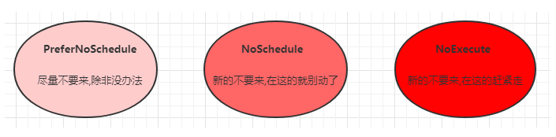
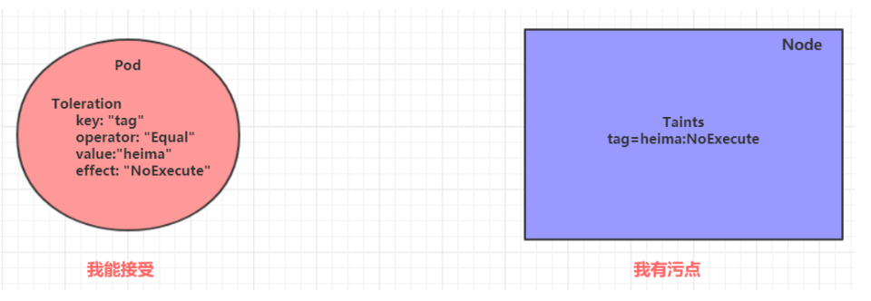

# `Pod`调度

**在默认情况下，一个`Pod`在哪个`Node`节点上运行，是由`Scheduler`组件采用相应的算法计算出来的，这个过程是不受人工控制的，但是在实际使用中，这并不满足需求，因为很多情况下，我们想控制某些`Pod`到达某些节点上，那么应该怎么做呢，这就需要了解`Kubernetes`对`Pod`的调度规则，`Kubernetes`提供了四大类调度方式：**

- 自动调度：运行在哪个节点上完全由`Scheduler`经过一系列的算法计算得出
- 定向调度：NodeName、NodeSlector
- 亲和性调度：NodeAffinity、PodAffinity、PodAntiAffinity
- 污点（容忍）调度：Taints、Toleration

### 定向调度

​	定向调度，指的是利用在`Pod`上声明`nodeName`或者`nodeSelector`，以此将`Pod`调度到期望的`node`节点上。注意，这里的调度是强制的，这就是意味着即使要调度的目标`Node`不存在，也会向上面进行调度，只不过`Pod`运行失败而已。

###### NodeName

​	`NodeName`用于强制约束将`Pod`调度到指定的`Name`的节点上，这种方式，其实是直接跳过`Scheduler`的调度逻辑，

直接将`Pod`调度到指定名称的节点。

```shell
# 创建 pod-nodename.yaml
apiVersion: v1
kind: Pod
metadata:
  name: pod-nodename
  namespace: dev
spec:
  containers:
  - name: nginx
    image: nginx:1.17.1
  nodeName: node1 # 指定调度到node1节点上
```

```sh
[root@master Download]# vim pod-nodename.yaml
[root@master Download]# kubectl create -f pod-nodename.yaml 
pod/pod-nodename created
[root@master Download]# kubectl get pod pod-nodename -n dev
NAME           READY   STATUS    RESTARTS   AGE
pod-nodename   1/1     Running   0          24s
# 查看 Pod 调度到 NODE 属性，确实是调度到了 node1 节点上
[root@master Download]# kubectl get pod pod-nodename -n dev -o wide
NAME           READY   STATUS    RESTARTS   AGE   IP            NODE    NOMINATED NODE   READINESS GATES
pod-nodename   1/1     Running   0          29s   10.244.1.11   node1   <none>           <none>

# 接下来，删除 pod，修改 nodeName 的值为 node3（并没有node3节点）
[root@master Download]# vim pod-nodename.yaml 
[root@master Download]# kubectl create -f pod-nodename.yaml 
Error from server (AlreadyExists): error when creating "pod-nodeName.yaml": pods "pod-nodename" already exists
[root@master Download]# kubectl delete -f pod-nodename.yaml 
pod "pod-nodename" deleted
[root@master Download]# kubectl create -f pod-nodename.yaml 
pod/pod-nodename created
# 再次查看，发现已经向Node3节点调度，但是由于不存在 node3节点，所以 pod 无法正常运行
[root@master Download]# kubectl get pod pod-nodename -n dev -o wide
NAME           READY   STATUS    RESTARTS   AGE   IP       NODE    NOMINATED NODE   READINESS GATES
pod-nodename   0/1     Pending   0          6s    <none>   node3   <none>           <none>
```

###### NodeSelector

​	`NodeSelector`用于将`Pod`调度到添加了指定标签的`node`节点上，它是通过`Kubernetes`的`label-selector`机制实现的，也就是说，在`Pod`创建之前，会由`Scheduler`使用`MatchNodeSelector`调度策略进行`label`匹配，找出目标`node`，然后将`Pod`调度到目标节点，该匹配规则是强制约束。

```sh
# node 节点添加标签
[root@master Download]# kubectl label nodes node1 nodeenv=pro
node/node1 labeled
[root@master Download]# kubectl label nodes node2 nodeenv=test
node/node2 labeled

# 创建 pod-nodeselector.yaml 文件
[root@master Download]# vim pod-nodeselector.yaml
# 创建 pod-nodeselector.yaml
apiVersion: v1
kind: Pod
metadata:
  name: pod-nodeselector
  namespace: dev
spec:
  containers:
  - name: nginx
    image: nginx:1.17.1
  nodeSelector:
    nodeenv: pro # 指定调度到具有nodeenv=pro标签的节点上

# 创建 Pod
[root@master Download]# kubectl create -f pod-nodeselector.yaml 
pod/pod-nodeselector created

# 查看 Pod 调度到 NODE 属性，确实是调度到了node1节点上
[root@master Download]# kubectl get pods pod-nodeselector -n dev -o wide
NAME               READY   STATUS    RESTARTS   AGE   IP            NODE    NOMINATED NODE   READINESS GATES
pod-nodeselector   1/1     Running   0          29s   10.244.1.12   node1   <none>           <none>

# 接下来，删除pod，修改nodeSelector的值为nodeenv: xxxx（不存在打有此标签的节点）
[root@master Download]# kubectl delete -f pod-nodeselector.yaml 
pod "pod-nodeselector" deleted
[root@master Download]# vim pod-nodeselector.yaml 
[root@master Download]# kubectl create -f pod-nodeselector.yaml 
pod/pod-nodeselector created

# 再次查看，发现 pod 无法正常运行, Node的值为 none
[root@master Download]# kubectl get pods pod-nodeselector -n dev -o wide
NAME               READY   STATUS    RESTARTS   AGE   IP       NODE     NOMINATED NODE   READINESS GATES
pod-nodeselector   0/1     Pending   0          25s   <none>   <none>   <none>           <none>

# 查看详情,发现 node selector 匹配失败的提示
[root@master Download]# kubectl describe pods pod-nodeselector -n dev
Name:         pod-nodeselector
Namespace:    dev
Priority:     0
Node:         <none>
Labels:       <none>
Annotations:  <none>
Status:       Pending
IP:           
IPs:          <none>
Containers:
  nginx:
    Image:        nginx:1.17.1
    Port:         <none>
    Host Port:    <none>
    Environment:  <none>
    Mounts:
      /var/run/secrets/kubernetes.io/serviceaccount from default-token-wvfmk (ro)
Conditions:
  Type           Status
  PodScheduled   False 
Volumes:
  default-token-wvfmk:
    Type:        Secret (a volume populated by a Secret)
    SecretName:  default-token-wvfmk
    Optional:    false
QoS Class:       BestEffort
Node-Selectors:  nodeenv=pro1
Tolerations:     node.kubernetes.io/not-ready:NoExecute for 300s
                 node.kubernetes.io/unreachable:NoExecute for 300s
Events:
  Type     Reason            Age                 From               Message
  ----     ------            ----                ----               -------
  Warning  FailedScheduling  2s (x3 over 2m33s)  default-scheduler  0/3 nodes are available: 3 node(s) didn't match node selector.

```

### 亲和性调度（从`pod`角度出发）

上一节，介绍了两种定向调度的方式，使用起来很方便，但是也有一定的问题，那就是如果没有满足条件的`Node`，那么`Pod`将不会被运行，即使在集群中还有可用`Node`列表也不行，这就限制使用场景。

基于上面的问题，`Kubernetes`还提供了一种亲和性调度（Affinity）,在`NodeSelector`的基础上进行了拓展，可以通过配置的形式，实现优先满足条件的`Node`进行调度，如果没有，也可以调度到不满足条件的节点上，使调度灵活。

`Affinity`主要分为三类：

- `nodeAffinity`（`node`亲和性）:以`node`为目标，解决`pod`可以调度到哪些`node`的问题
- `podAffinity`（`pod`亲和性）：以`pod`为目标，解决`pod`可以和哪些已存在的`pod`部署在同意拓扑域中的问题
- `podAntiAffinity`（`pod`反亲和性）:以`pod`为目标，解决`pod`不能和哪些已存在`pod`部署在同意拓扑域中的问题

> 关于亲和性（反亲和性）使用场景的说明：
>
> **亲和性**：如果两个应用频繁交互，那就有必要利用亲和性让两个应用的尽可能靠近，这样可以减少因网络通信而带来的性能损耗。
>
> **反亲和性**：当应用的采用多副本部署时，有必要采用反亲和性让各个应用实例打散分布在各个`node`上，这样可以提高服务的高可以用性。

###### NodeAffinity （node亲和性）

```sh
# NodeAffinity 可配置项
pod.spec.affinity.nodeAffinity
	# Node节点必须满足指定的所有规则才可以，相当于硬限制
  requiredDuringSchedulingIgnoredDuringExecution  
  	# 节点选择列表
    nodeSelectorTerms  
    	# 按节点字段列出的节点选择器要求列表
      matchFields   
      # 按节点标签列出的节点选择器要求列表(推荐)
      matchExpressions   
      
        key    键
        values 值
        operat or 关系符 支持Exists, DoesNotExist, In, NotIn, Gt, Lt
        
        
	# 优先调度到满足指定的规则的Node，相当于软限制 (倾向)
  preferredDuringSchedulingIgnoredDuringExecution 
  	# 一个节点选择器项，与相应的权重相关联
    preference   
    	# 按节点字段列出的节点选择器要求列表
      matchFields   
      # 按节点标签列出的节点选择器要求列表(推荐)
      matchExpressions   
        key    键
        values 值
        operator 关系符 支持In, NotIn, Exists, DoesNotExist, Gt, Lt
	weight 倾向权重，在范围1-100。
```

```sh
# 例子 关系符的使用说明:

- matchExpressions:
  - key: nodeenv              # 匹配存在标签的key为nodeenv的节点
    operator: Exists
  - key: nodeenv              # 匹配标签的key为nodeenv,且value是"xxx"或"yyy"的节点
    operator: In
    values: ["xxx","yyy"]
  - key: nodeenv              # 匹配标签的key为nodeenv,且value大于"xxx"的节点
    operator: Gt
    values: "xxx"
```

**接下来演示一下 requiredDuringSchedulingIgnoredDuringExecution*（硬限制）**

```sh
# 创建 pod-nodeaffinity-required.yaml
apiVersion: v1
kind: Pod
metadata:
  name: pod-nodeaffinity-required
  namespace: dev
spec:
  containers:
  - name: nginx
    image: nginx:1.17.1
  affinity:  #亲和性设置
    nodeAffinity: #设置node亲和性
      requiredDuringSchedulingIgnoredDuringExecution: # 硬限制
        nodeSelectorTerms:
        - matchExpressions: # 匹配env的值在["xxx","yyy"]中的标签
          - key: nodeenv
            operator: In
            values: ["xxx","yyy"]
```

```sh

[root@master Download]# vim pod-nodeaffinity-required.yaml
[root@master Download]# kubectl create -f pod-nodeaffinity-required.yaml
Error from server (NotFound): error when creating "pod-nodeaffinity-required.yaml": namespaces "dev" not found
[root@master Download]# kubectl create ns dev
namespace/dev created
[root@master Download]# kubectl create -f pod-nodeaffinity-required.yaml
pod/pod-nodeaffinity-required created

# 查看 pod 状态 （运行失败）
[root@master Download]# kubectl get pods pod-nodeaffinity-required -n dev -o wide
NAME                        READY   STATUS    RESTARTS   AGE   IP       NODE     NOMINATED NODE   READINESS GATES
pod-nodeaffinity-required   0/1     Pending   0          7s    <none>   <none>   <none>           <none>

# 查看 Pod 的详情
# 发现调度失败，提示 node 选择失败
[root@master Download]# kubectl describe pod pod-nodeaffinity-required -n dev
Name:         pod-nodeaffinity-required
Namespace:    dev
Priority:     0
Node:         <none>
Labels:       <none>
Annotations:  <none>
Status:       Pending
IP:           
IPs:          <none>
Containers:
  nginx:
    Image:        nginx:1.17.1
    Port:         <none>
    Host Port:    <none>
    Environment:  <none>
    Mounts:
      /var/run/secrets/kubernetes.io/serviceaccount from default-token-5zspf (ro)
Conditions:
  Type           Status
  PodScheduled   False 
Volumes:
  default-token-5zspf:
    Type:        Secret (a volume populated by a Secret)
    SecretName:  default-token-5zspf
    Optional:    false
QoS Class:       BestEffort
Node-Selectors:  <none>
Tolerations:     node.kubernetes.io/not-ready:NoExecute for 300s
                 node.kubernetes.io/unreachable:NoExecute for 300s
Events:
  Type     Reason            Age                From               Message
  ----     ------            ----               ----               -------
  Warning  FailedScheduling  14s (x2 over 14s)  default-scheduler  0/3 nodes are available: 3 node(s) didn't match node selector.
  
[root@master Download]# kubectl get nodes --show-labels
NAME     STATUS   ROLES    AGE   VERSION   LABELS
master   Ready    master   8d    v1.17.4   beta.kubernetes.io/arch=amd64,beta.kubernetes.io/os=linux,kubernetes.io/arch=amd64,kubernetes.io/hostname=master,kubernetes.io/os=linux,node-role.kubernetes.io/master=
node1    Ready    <none>   8d    v1.17.4   beta.kubernetes.io/arch=amd64,beta.kubernetes.io/os=linux,kubernetes.io/arch=amd64,kubernetes.io/hostname=node1,kubernetes.io/os=linux,nodeenv=pro
node2    Ready    <none>   8d    v1.17.4   beta.kubernetes.io/arch=amd64,beta.kubernetes.io/os=linux,kubernetes.io/arch=amd64,kubernetes.io/hostname=node2,kubernetes.io/os=linux,nodeenv=test
# 接下来，停止 pod
[root@master Download]# kubectl delete -f pod-nodeaffinity-required.yaml
pod "pod-nodeaffinity-required" deleted


# 修改文件，将 values: ["xxx","yyy"]------> ["pro","yyy"]
[root@master Download]# vim pod-nodeaffinity-required.yaml 

# 再次启动
[root@master Download]# kubectl create -f pod-nodeaffinity-required.yaml
pod/pod-nodeaffinity-required created

# 此时查看，发现调度成功，已经将 pod 调度到了 node1 上
[root@master Download]# kubectl get pods pod-nodeaffinity-required -n dev -o wide
NAME                        READY   STATUS    RESTARTS   AGE   IP            NODE    NOMINATED NODE   READINESS GATES
pod-nodeaffinity-required   1/1     Running   0          5s    10.244.1.13   node1   <none>           <none>
```

**接下来再演示一下`requiredDuringSchedulingIgnoredDuringExecution`（软亲和）**

```sh
# 创建 pod-nodeaffinity-preferred.yaml
apiVersion: v1
kind: Pod
metadata:
  name: pod-nodeaffinity-preferred
  namespace: dev
spec:
  containers:
  - name: nginx
    image: nginx:1.17.1
  affinity:  #亲和性设置
    nodeAffinity: #设置node亲和性
      preferredDuringSchedulingIgnoredDuringExecution: # 软限制
      - weight: 1
        preference:
          matchExpressions: # 匹配env的值在["xxx","yyy"]中的标签(当前环境没有)
          - key: nodeenv
            operator: In
            values: ["xxx","yyy"]
```

```sh
[root@master Download]# vim pod-nodeaffinity-preferred.yaml
[root@master Download]# kubectl create -f pod-nodeaffinity-preferred.yaml
pod/pod-nodeaffinity-preferred created
[root@master Download]# kubectl get pod pod-nodeaffinity-preferred -n dev
NAME                         READY   STATUS    RESTARTS   AGE
pod-nodeaffinity-preferred   1/1     Running   0          6s

```

> > ```
> > NodeAffinity 规则设置的注意事项：
> >     1 如果同时定义了 nodeSelector 和 nodeAffinity ，那么必须两个条件都得到满足，Pod 才能运行在指定的 Node 上
> >     2 如果 nodeAffinity 指定了多个 nodeSelectorTerms ，那么只需要其中一个能够匹配成功即可
> >     3 如果一个 nodeSelectorTerms 中有多个 matchExpressions ，则一个节点必须满足所有的才能匹配成功
> >     4 如果一个 pod 所在的 Node 在 Pod 运行期间其标签发生了改变，不再符合该 Pod 的节点亲和性需求，则系统将忽略此变化
> > ```

######  PodAffinity(pod亲和性)

 **PodAffinity 主要实现以运行的 Pod 为参照，实现让新创建的 Pod 跟参照 pod 在同一区域的功能**

```sh
# PodAffinity 可以配置项
pod.spec.affinity.podAffinity
  requiredDuringSchedulingIgnoredDuringExecution  # 硬限制
    namespaces       # 指定参照pod的namespace
    topologyKey      # 指定调度作用域
    labelSelector    # 标签选择器
      matchExpressions  # 按节点标签列出的节点选择器要求列表(推荐)
        key    键
        values 值
        operator 				# 关系符 支持In, NotIn, Exists, DoesNotExist.
      matchLabels    		# 指多个matchExpressions映射的内容
  preferredDuringSchedulingIgnoredDuringExecution # 软限制
    podAffinityTerm  # 选项
      namespaces      
      topologyKey
      labelSelector
        matchExpressions  
          key    # 键
          values # 值
          operator
        matchLabels 
    weight # 倾向权重，在范围1-100
```

```sh
# topologyKey 用于指定调度时作用域,例如:
    如果指定为kubernetes.io/hostname，那就是以Node节点为区分范围
	如果指定为beta.kubernetes.io/os,则以Node节点的操作系统类型来区分
```

**接下来，演示下`requiredDuringSchedulingIgnoredDuringExecution`（硬限制）**

```sh
# 创建 pod-podaffinity-target.yaml
apiVersion: v1
kind: Pod
metadata:
  name: pod-podaffinity-target
  namespace: dev
  labels:
    podenv: pro #设置标签
spec:
  containers:
  - name: nginx
    image: nginx:1.17.1
  nodeName: node1 # 将目标pod名确指定到node1上
```

```sh
[root@master Download]# vim pod-podaffinity-target.yaml
[root@master Download]# kubectl create -f pod-podaffinity-target.yaml
pod/pod-podaffinity-target created
[root@master Download]# kubectl get pods  pod-podaffinity-target -n dev
NAME                     READY   STATUS    RESTARTS   AGE
pod-podaffinity-target   1/1     Running   0          6s

```

```sh
# 创建 pod-podaffinity-required.yaml
apiVersion: v1
kind: Pod
metadata:
  name: pod-podaffinity-required
  namespace: dev
spec:
  containers:
  - name: nginx
    image: nginx:1.17.1
  affinity:      #亲和性设置
    podAffinity: #设置pod亲和性
      requiredDuringSchedulingIgnoredDuringExecution: # 硬限制
      - labelSelector:
          matchExpressions: # 匹配env的值在["xxx","yyy"]中的标签
          - key: podenv
            operator: In
            values: ["xxx","yyy"]
        topologyKey: kubernetes.io/hostname
```

```sh
# 上面配置表达的意思是：新 Pod 必须要与拥有标签 nodeenv=xxx 或者 nodeenv=yyy 的 pod 在同一Node上，显然现在没有这样pod，接下来，运行测试一下。
[root@master Download]# vim pod-podaffinity-required.yaml

# 启动 pod
[root@master Download]# kubectl create -f pod-podaffinity-required.yaml
pod/pod-podaffinity-required created

# 查看 pod
[root@master Download]# kubectl get pods pod-podaffinity-required -n dev
NAME                       READY   STATUS    RESTARTS   AGE
pod-podaffinity-required   0/1     Pending   0          8s

# 查看详细信息
[root@master Download]# kubectl describe pods pod-podaffinity-required  -n dev
Name:         pod-podaffinity-required
Namespace:    dev
Priority:     0
Node:         <none>
Labels:       <none>
Annotations:  <none>
Status:       Pending
IP:           
IPs:          <none>
Containers:
  nginx:
    Image:        nginx:1.17.1
    Port:         <none>
    Host Port:    <none>
    Environment:  <none>
    Mounts:
      /var/run/secrets/kubernetes.io/serviceaccount from default-token-5zspf (ro)
Conditions:
  Type           Status
  PodScheduled   False 
Volumes:
  default-token-5zspf:
    Type:        Secret (a volume populated by a Secret)
    SecretName:  default-token-5zspf
    Optional:    false
QoS Class:       BestEffort
Node-Selectors:  <none>
Tolerations:     node.kubernetes.io/not-ready:NoExecute for 300s
                 node.kubernetes.io/unreachable:NoExecute for 300s
Events:
  Type     Reason            Age   From               Message
  ----     ------            ----  ----               -------
  Warning  FailedScheduling  15s   default-scheduler  0/3 nodes are available: 1 node(s) had taints that the pod didn't tolerate, 2 node(s) didn't match pod affinity rules.
  
# 接下来修改  values: ["xxx","yyy"]----->values:["pro","yyy"]
# 意思是：新Pod必须要与拥有标签nodeenv=xxx或者nodeenv=yyy的pod在同一Node上
[root@master Download]# vim pod-podaffinity-required.yaml

# 然后重新创建 pod，查看效果
[root@master Download]# kubectl delete -f  pod-podaffinity-required.yaml
pod "pod-podaffinity-required" deleted
[root@master Download]# kubectl create -f pod-podaffinity-required.yaml
pod/pod-podaffinity-required created

# 发现此时Pod运行正常
[root@master Download]# kubectl get pods pod-podaffinity-required -n dev
NAME                       READY   STATUS    RESTARTS   AGE
pod-podaffinity-required   1/1     Running   0          6s

```

**关于`PodAffinity`的 `preferredDuringSchedulingIgnoredDuringExecution`(软限制)，这里不再演示**

###### PodAntiAffinity （pod反亲和性）

**PodAntiAffinity主要以运行的Pod为参照，让新创建的Pod跟参照pod不在一个区域中的功能**

配置方式和选项跟`PodAffinity`是一样的；

```sh
[root@master Download]# kubectl get pods -n dev -o wide --show-labels
NAME                         READY   STATUS    RESTARTS   AGE   IP            NODE    NOMINATED NODE   READINESS GATES   LABELS
pod-nodeaffinity-preferred   1/1     Running   0          39m   10.244.2.14   node2   <none>           <none>            <none>
pod-nodeaffinity-required    1/1     Running   0          42m   10.244.1.13   node1   <none>           <none>            <none>
pod-podaffinity-required     1/1     Running   0          15m   10.244.1.15   node1   <none>           <none>            <none>
pod-podaffinity-target       1/1     Running   0          20m   10.244.1.14   node1   <none>           <none>            podenv=pro
[root@master Download]# kubectl delete -f pod-nodeaffinity-preferred.yaml 
pod "pod-nodeaffinity-preferred" deleted
[root@master Download]# kubectl delete -f pod-nodeaffinity-required.yaml 
pod "pod-nodeaffinity-required" deleted
[root@master Download]# kubectl get pods -n dev -o wide --show-labels
NAME                       READY   STATUS    RESTARTS   AGE   IP            NODE    NOMINATED NODE   READINESS GATES   LABELS
pod-podaffinity-required   1/1     Running   0          16m   10.244.1.15   node1   <none>           <none>            <none>
pod-podaffinity-target     1/1     Running   0          22m   10.244.1.14   node1   <none>           <none>            podenv=pro
```

```sh
# 创建 pod-podantiaffinity-required.yaml
apiVersion: v1
kind: Pod
metadata:
  name: pod-podantiaffinity-required
  namespace: dev
spec:
  containers:
  - name: nginx
    image: nginx:1.17.1
  affinity:  #亲和性设置
    podAntiAffinity: #设置pod亲和性
      requiredDuringSchedulingIgnoredDuringExecution: # 硬限制
      - labelSelector:
          matchExpressions: # 匹配 podenv 的值在["pro"]中的标签
          - key: podenv
            operator: In
            values: ["pro"]
        topologyKey: kubernetes.io/hostname
```

```sh
# 上面配置表达的意思是：新Pod必须要与拥有标签nodeenv=pro的pod不在同一Node上，运行测试一下。

[root@master Download]# vim pod-podantiaffinity-required.yaml
[root@master Download]# kubectl create -f pod-podantiaffinity-required.yaml
pod/pod-podantiaffinity-required created
# 查看 pod
# 发现调度到了 node2 上
[root@master Download]# kubectl get pods pod-podantiaffinity-required -n dev -o wide
NAME                           READY   STATUS    RESTARTS   AGE   IP            NODE    NOMINATED NODE   READINESS GATES
pod-podantiaffinity-required   1/1     Running   0          5s    10.244.2.15   node2   <none>           <none>

```

### 污点和容忍（从`node`角度出发）

##### 污点（Taints）

​	前面的调度方式都是站在`Pod`的角度上，通过在`Pod`上添加属性，来确定`Pod`是否要调度到指定的`Node`上，其实我们也可以站在`Node`的角度上，通过在`Node`上添加**污点**属性，来决定是否允许`Pod`调度过来。

​	`Node`被设置上污点之后就和`Pod`之间存在了一种相斥关系，进而拒绝`Pod`调度进来，甚至可以将已经存在的`Pod`驱逐出去。

​	污点的格式为：`key=value:effect`,`key`和`value`是污点的标签，`effect`描述污点的作用，支持以下三个选项：

- `PreferNoSchedule`：`kubernetes`将尽量避免把`Pod`调度到具有该污点的`Node`上，除非没有其他节点可调度
- `NoSchedule`：`kubernetes`将不会把`Pod`调度到具有该污点的`Node`上，但不会影响当前`Node`上已存在的`Pod`
- `NoExecute`：`kubernetes`将不会把`Pod`调度到具有该污点的`Node`上，同时也会将`Node`上已存在的`Pod`隔离



```sh
# 使用 kubectl 设置和去除污点的命令 示例如下：
kubectl taint nodes node1 key=value:effect

# 去除污点
kubectl taint nodes node1 key:effect-

# 去除所有污点
kubectl taint nodes node1 key-
```

> **演示示例：**
>
> 1. 准备节点`node1`（为了演示，暂停`node2`节点）可直接停止`node2`节点虚拟机
> 2. 为`node1`节点设置一个污点`tag=heima:PreferNoSchedule`; 然后创建`pod1`（pod1可以）
> 3. 修改为`node1`节点设置一个污点：`tag=heima:NoSchedule`; 然后创建`pod2`（`pod1`正常`pod2`失败）
> 4. 修改为`node1`节点设置一个污点：`tag=heima:NoExecute`; 然后创建`pod3`（3个`pod`都失败）
>
> ```sh
> # 停止 node2 节点虚拟机
> [root@master Download]# kubectl get nodes
> NAME     STATUS     ROLES    AGE   VERSION
> master   Ready      master   9d    v1.17.4
> node1    Ready      <none>   9d    v1.17.4
> node2    NotReady   <none>   9d    v1.17.4
> 
> # 为 node1 设置污点（PreferNoSchedule）
> [root@master Download]# kubectl taint nodes node1 tag=heima:PreferNoSchedule
> node/node1 tainted
> [root@master Download]# kubectl describe node node1
> Name:               node1
> Roles:              <none>
> Labels:             beta.kubernetes.io/arch=amd64
>                     beta.kubernetes.io/os=linux
>                     kubernetes.io/arch=amd64
>                     kubernetes.io/hostname=node1
>                     kubernetes.io/os=linux
>                     nodeenv=pro
> Annotations:        flannel.alpha.coreos.com/backend-data: {"VNI":1,"VtepMAC":"2e:c5:b5:a8:61:83"}
>                     flannel.alpha.coreos.com/backend-type: vxlan
>                     flannel.alpha.coreos.com/kube-subnet-manager: true
>                     flannel.alpha.coreos.com/public-ip: 192.168.2.107
>                     kubeadm.alpha.kubernetes.io/cri-socket: /var/run/dockershim.sock
>                     node.alpha.kubernetes.io/ttl: 0
>                     volumes.kubernetes.io/controller-managed-attach-detach: true
> CreationTimestamp:  Mon, 26 Feb 2024 22:55:47 -0800
> 										# 污点
> Taints:             tag=heima:PreferNoSchedule
> Unschedulable:      false
> Lease:
>   HolderIdentity:  node1
>   AcquireTime:     <unset>
>   RenewTime:       Thu, 07 Mar 2024 00:09:40 -0800
> Conditions:
>   Type                 Status  LastHeartbeatTime                 LastTransitionTime                Reason                       Message
>   ----                 ------  -----------------                 ------------------                ------                       -------
>   NetworkUnavailable   False   Wed, 28 Feb 2024 01:10:39 -0800   Wed, 28 Feb 2024 01:10:39 -0800   FlannelIsUp                  Flannel is running on this node
>   MemoryPressure       False   Thu, 07 Mar 2024 00:06:19 -0800   Mon, 26 Feb 2024 22:55:47 -0800   KubeletHasSufficientMemory   kubelet has sufficient memory available
>   DiskPressure         False   Thu, 07 Mar 2024 00:06:19 -0800   Mon, 26 Feb 2024 22:55:47 -0800   KubeletHasNoDiskPressure     kubelet has no disk pressure
>   PIDPressure          False   Thu, 07 Mar 2024 00:06:19 -0800   Mon, 26 Feb 2024 22:55:47 -0800   KubeletHasSufficientPID      kubelet has sufficient PID available
>   Ready                True    Thu, 07 Mar 2024 00:06:19 -0800   Mon, 26 Feb 2024 22:59:57 -0800   KubeletReady                 kubelet is posting ready status
> Addresses:
>   InternalIP:  192.168.2.107
>   Hostname:    node1
> Capacity:
>   cpu:                4
>   ephemeral-storage:  60347608Ki
>   hugepages-1Gi:      0
>   hugepages-2Mi:      0
>   memory:             2010488Ki
>   pods:               110
> Allocatable:
>   cpu:                4
>   ephemeral-storage:  55616355441
>   hugepages-1Gi:      0
>   hugepages-2Mi:      0
>   memory:             1908088Ki
>   pods:               110
> System Info:
>   Machine ID:                 861a72834f8b4939ae7fcc5466096a85
>   System UUID:                009D4D56-011A-0672-3569-B5D129662E58
>   Boot ID:                    b5041bd5-bc22-404e-96db-de3b12b3aef5
>   Kernel Version:             3.10.0-1160.el7.x86_64
>   OS Image:                   CentOS Linux 7 (Core)
>   Operating System:           linux
>   Architecture:               amd64
>   Container Runtime Version:  docker://18.6.3
>   Kubelet Version:            v1.17.4
>   Kube-Proxy Version:         v1.17.4
> PodCIDR:                      10.244.1.0/24
> PodCIDRs:                     10.244.1.0/24
> Non-terminated Pods:          (4 in total)
>   Namespace                   Name                        CPU Requests  CPU Limits  Memory Requests  Memory Limits  AGE
>   ---------                   ----                        ------------  ----------  ---------------  -------------  ---
>   dev                         pod-podaffinity-required    0 (0%)        0 (0%)      0 (0%)           0 (0%)         79m
>   dev                         pod-podaffinity-target      0 (0%)        0 (0%)      0 (0%)           0 (0%)         84m
>   kube-flannel                kube-flannel-ds-d29q9       100m (2%)     0 (0%)      50Mi (2%)        0 (0%)         9d
>   kube-system                 kube-proxy-j2p4h            0 (0%)        0 (0%)      0 (0%)           0 (0%)         9d
> Allocated resources:
>   (Total limits may be over 100 percent, i.e., overcommitted.)
>   Resource           Requests   Limits
>   --------           --------   ------
>   cpu                100m (2%)  0 (0%)
>   memory             50Mi (2%)  0 (0%)
>   ephemeral-storage  0 (0%)     0 (0%)
> Events:              <none>
> 
> # 创建 pod1 
> [root@master Download]# kubectl run taint1 --image=nginx:1.17.1 -n dev
> kubectl run --generator=deployment/apps.v1 is DEPRECATED and will be removed in a future version. Use kubectl run --generator=run-pod/v1 or kubectl create instead.
> deployment.apps/taint1 created
> [root@master Download]# kubectl get pods -n dev -o wide
> NAME                           READY   STATUS    RESTARTS   AGE   IP            NODE    NOMINATED NODE   READINESS GATES
> pod-podaffinity-required       1/1     Running   0          80m   10.244.1.15   node1   <none>           <none>
> pod-podaffinity-target         1/1     Running   0          86m   10.244.1.14   node1   <none>           <none>
> pod-podantiaffinity-required   1/1     Running   0          55m   10.244.2.15   node2   <none>           <none>
> taint1-766c47bf55-ngsv5        1/1     Running   0          16s   10.244.1.16   node1   <none>           <none>
> 
> # 为 node1 设置污点（取消 PreferNoSchedule,设置 NoSchedule）
> [root@master Download]# kubectl taint node node1 tag:PreferNoSchedule-
> node/node1 untainted
> [root@master Download]# kubectl taint nodes node1 tag=heima:NoSchedule
> node/node1 tainted
>  [root@master Download]# kubectl get pods -n dev
> NAME                           READY   STATUS        RESTARTS   AGE
> pod-podaffinity-required       1/1     Running       0          86m
> pod-podaffinity-target         1/1     Running       0          91m
> pod-podantiaffinity-required   1/1     Terminating   0          60m
> taint1-766c47bf55-ngsv5        1/1     Running       0          5m36s
> 
> # 创建 pod2 
> [root@master Download]# kubectl run taint2 --image=nginx1.17.1 -n dev
> kubectl run --generator=deployment/apps.v1 is DEPRECATED and will be removed in a future version. Use kubectl run --generator=run-pod/v1 or kubectl create instead.
> deployment.apps/taint2 created
> [root@master Download]# kubectl get pods -n dev
> NAME                           READY   STATUS        RESTARTS   AGE
> pod-podaffinity-required       1/1     Running       0          88m
> pod-podaffinity-target         1/1     Running       0          94m
> pod-podantiaffinity-required   1/1     Terminating   0          63m
> taint1-766c47bf55-ngsv5        1/1     Running       0          7m58s
> taint2-579777fbbf-hf4mf        0/1     Pending       0          27s
> [root@master Download]# kubectl describe pod taint2-579777fbbf-hf4mf -n dev
> Name:           taint2-579777fbbf-hf4mf
> Namespace:      dev
> Priority:       0
> Node:           <none>
> Labels:         pod-template-hash=579777fbbf
>                 run=taint2
> Annotations:    <none>
> Status:         Pending
> IP:             
> IPs:            <none>
> Controlled By:  ReplicaSet/taint2-579777fbbf
> Containers:
>   taint2:
>     Image:        nginx1.17.1
>     Port:         <none>
>     Host Port:    <none>
>     Environment:  <none>
>     Mounts:
>       /var/run/secrets/kubernetes.io/serviceaccount from default-token-5zspf (ro)
> Conditions:
>   Type           Status
>   PodScheduled   False 
> Volumes:
>   default-token-5zspf:
>     Type:        Secret (a volume populated by a Secret)
>     SecretName:  default-token-5zspf
>     Optional:    false
> QoS Class:       BestEffort
> Node-Selectors:  <none>
> Tolerations:     node.kubernetes.io/not-ready:NoExecute for 300s
>                  node.kubernetes.io/unreachable:NoExecute for 300s
> Events:
>   Type     Reason            Age                From               Message
>   ----     ------            ----               ----               -------
>   # 错误信息
>   Warning  FailedScheduling  84s (x2 over 84s)  default-scheduler  0/3 nodes are available: 3 node(s) had taints that the pod didn't tolerate.
> 
> # 为 node1 设置污点（取消NoSchedule，设置NoExecute）
> [root@master Download]# kubectl taint node node1 tag:NoSchedule-
> node/node1 untainted
> [root@master Download]# kubectl taint node node1 tag=heima:NoExecute
> node/node1 tainted
> 
> [root@master Download]# kubectl get pods -n dev
> NAME                           READY   STATUS        RESTARTS   AGE
> pod-podantiaffinity-required   1/1     Terminating   0          66m
> taint1-766c47bf55-28wxv        0/1     Pending       0          88s
> taint2-579777fbbf-2r2c7        0/1     Pending       0          88s
> 
> # 创建 pod3
> [root@master Download]# kubectl run taint3 --image=nginx1.17.1 -n dev
> kubectl run --generator=deployment/apps.v1 is DEPRECATED and will be removed in a future version. Use kubectl run --generator=run-pod/v1 or kubectl create instead.
> deployment.apps/taint3 created
> [root@master Download]# kubectl get pods -n dev
> NAME                           READY   STATUS        RESTARTS   AGE
> pod-podantiaffinity-required   1/1     Terminating   0          67m
> taint1-766c47bf55-28wxv        0/1     Pending       0          2m9s
> taint2-579777fbbf-2r2c7        0/1     Pending       0          2m9s
> taint3-76bbbd48cc-plrgg        0/1     Pending       0          5s
> 
> 
> # PS: 使用 kubeadm 搭建的集群，默认就会给master 节点添加一个污点标记，所以pod就不会调度到master节点上
> [root@master Download]# kubectl describe nodes master
> Name:               master
> Roles:              master
> Labels:             beta.kubernetes.io/arch=amd64
>                     beta.kubernetes.io/os=linux
>                     kubernetes.io/arch=amd64
>                     kubernetes.io/hostname=master
>                     kubernetes.io/os=linux
>                     node-role.kubernetes.io/master=
> Annotations:        flannel.alpha.coreos.com/backend-data: {"VNI":1,"VtepMAC":"42:63:a3:ed:45:3c"}
>                     flannel.alpha.coreos.com/backend-type: vxlan
>                     flannel.alpha.coreos.com/kube-subnet-manager: true
>                     flannel.alpha.coreos.com/public-ip: 192.168.2.87
>                     kubeadm.alpha.kubernetes.io/cri-socket: /var/run/dockershim.sock
>                     node.alpha.kubernetes.io/ttl: 0
>                     volumes.kubernetes.io/controller-managed-attach-detach: true
> CreationTimestamp:  Mon, 26 Feb 2024 22:54:24 -0800
> 										# 污点
> Taints:             node-role.kubernetes.io/master:NoSchedule
> Unschedulable:      false
> Lease:
>   HolderIdentity:  master
>   AcquireTime:     <unset>
>   RenewTime:       Thu, 07 Mar 2024 00:26:27 -0800
> Conditions:
>   Type                 Status  LastHeartbeatTime                 LastTransitionTime                Reason                       Message
>   ----                 ------  -----------------                 ------------------                ------                       -------
>   NetworkUnavailable   False   Mon, 26 Feb 2024 22:59:38 -0800   Mon, 26 Feb 2024 22:59:38 -0800   FlannelIsUp                  Flannel is running on this node
>   MemoryPressure       False   Thu, 07 Mar 2024 00:23:00 -0800   Mon, 26 Feb 2024 22:54:21 -0800   KubeletHasSufficientMemory   kubelet has sufficient memory available
>   DiskPressure         False   Thu, 07 Mar 2024 00:23:00 -0800   Mon, 26 Feb 2024 22:54:21 -0800   KubeletHasNoDiskPressure     kubelet has no disk pressure
>   PIDPressure          False   Thu, 07 Mar 2024 00:23:00 -0800   Mon, 26 Feb 2024 22:54:21 -0800   KubeletHasSufficientPID      kubelet has sufficient PID available
>   Ready                True    Thu, 07 Mar 2024 00:23:00 -0800   Mon, 26 Feb 2024 22:59:37 -0800   KubeletReady                 kubelet is posting ready status
> Addresses:
>   InternalIP:  192.168.2.87
>   Hostname:    master
> Capacity:
>   cpu:                4
>   ephemeral-storage:  99781016Ki
>   hugepages-1Gi:      0
>   hugepages-2Mi:      0
>   memory:             4477740Ki
>   pods:               110
> Allocatable:
>   cpu:                4
>   ephemeral-storage:  91958184194
>   hugepages-1Gi:      0
>   hugepages-2Mi:      0
>   memory:             4375340Ki
>   pods:               110
> System Info:
>   Machine ID:                 86e69e930f584e78bdbfb61894c558c6
>   System UUID:                84684D56-DEBA-5FF0-AD10-F1F103B67969
>   Boot ID:                    9f1c8f2d-b46a-4027-8b22-42bb291195c8
>   Kernel Version:             3.10.0-1160.el7.x86_64
>   OS Image:                   CentOS Linux 7 (Core)
>   Operating System:           linux
>   Architecture:               amd64
>   Container Runtime Version:  docker://18.6.3
>   Kubelet Version:            v1.17.4
>   Kube-Proxy Version:         v1.17.4
> PodCIDR:                      10.244.0.0/24
> PodCIDRs:                     10.244.0.0/24
> Non-terminated Pods:          (8 in total)
>   Namespace                   Name                              CPU Requests  CPU Limits  Memory Requests  Memory Limits  AGE
>   ---------                   ----                              ------------  ----------  ---------------  -------------  ---
>   kube-flannel                kube-flannel-ds-qd548             100m (2%)     0 (0%)      50Mi (1%)        0 (0%)         9d
>   kube-system                 coredns-9d85f5447-dlvzc           100m (2%)     0 (0%)      70Mi (1%)        170Mi (3%)     9d
>   kube-system                 coredns-9d85f5447-mf72b           100m (2%)     0 (0%)      70Mi (1%)        170Mi (3%)     9d
>   kube-system                 etcd-master                       0 (0%)        0 (0%)      0 (0%)           0 (0%)         9d
>   kube-system                 kube-apiserver-master             250m (6%)     0 (0%)      0 (0%)           0 (0%)         9d
>   kube-system                 kube-controller-manager-master    200m (5%)     0 (0%)      0 (0%)           0 (0%)         9d
>   kube-system                 kube-proxy-kkwzq                  0 (0%)        0 (0%)      0 (0%)           0 (0%)         9d
>   kube-system                 kube-scheduler-master             100m (2%)     0 (0%)      0 (0%)           0 (0%)         9d
> Allocated resources:
>   (Total limits may be over 100 percent, i.e., overcommitted.)
>   Resource           Requests    Limits
>   --------           --------    ------
>   cpu                850m (21%)  0 (0%)
>   memory             190Mi (4%)  340Mi (7%)
>   ephemeral-storage  0 (0%)      0 (0%)
> Events:              <none>
> ```

##### 容忍（Toleration）

​	上面介绍了污点的作用，可以在`node`上添加污点用于拒绝`pod`调度上来，但是如果就是想将一个`pod`调度到一个有污点的`node`上来，这时候就会使用到**容忍**




> 污点就是拒绝，容忍就是忽略，`Node`通过污点拒绝`pod`调度上去，`Pod`通过容忍忽略拒绝
>
> 详细配置：
>
> ```sh
> # kubectl explain pod.spec.tolerations
> ......
> FIELDS:
>    key       					 # 对应着要容忍的污点的键，空意味着匹配所有的键
>    value     					 # 对应着要容忍的污点的值
>    operator  					 # key-value的运算符，支持Equal和Exists（默认）
>    effect    					 # 对应污点的effect，空意味着匹配所有影响
>    tolerationSeconds   # 容忍时间, 当effect为NoExecute时生效，表示pod在Node上的停留时间
> ```

​	**案例：**

1. 上面通过污点已经在`node1`节点上打上了`NoExecute`的污点，此时`pod`是调度不上去的
2. 可以通过给 `pod`添加容忍，然后将其调度`node1`上去

```sh
# 创建  pod-toleration.yaml 文件
apiVersion: v1
kind: Pod
metadata:
  name: pod-toleration
  namespace: dev
spec:
  containers:
  - name: nginx
    image: nginx:1.17.1
  tolerations:      			# 添加容忍
  - key: "tag"        		# 要容忍的污点的key
    operator: "Equal" 		# 操作符
    value: "heima"    		# 容忍的污点的value
    effect: "NoExecute"   # 添加容忍的规则，这里必须和标记的污点规则相同
```

```shell
[root@master Download]# vim pod-toleration.yaml
apiVersion: v1
kind: Pod
metadata:
  name: pod-toleration
  namespace: dev
spec:
  containers:
  - name: nginx
    image: nginx:1.17.1
[root@master Download]# kubectl create -f pod-toleration.yaml 
pod/pod-toleration created

# Pod 失败
[root@master Download]# kubectl get pods -n dev
NAME                           READY   STATUS        RESTARTS   AGE
pod-podantiaffinity-required   1/1     Terminating   0          81m
pod-toleration                 0/1     Pending       0          11s
taint1-766c47bf55-28wxv        0/1     Pending       0          16m
taint2-579777fbbf-2r2c7        0/1     Pending       0          16m
taint3-76bbbd48cc-plrgg        0/1     Pending       0          14m

root@master Download]# kubectl delete -f  pod-toleration.yaml 
pod "pod-toleration" deleted

# 添加容忍
[root@master Download]# vim pod-toleration.yaml 
[root@master Download]# more pod-toleration.yaml 
apiVersion: v1
kind: Pod
metadata:
  name: pod-toleration
  namespace: dev
spec:
  containers:
  - name: nginx
    image: nginx:1.17.1
  tolerations:                         
  - key: "tag"                 
    operator: "Equal"           
    value: "heima"             
    effect: "NoExecute"   
[root@master Download]# kubectl create -f pod-toleration.yaml 
pod/pod-toleration created

# running 状态
[root@master Download]# kubectl get pods -n dev -o wide
NAME                           READY   STATUS        RESTARTS   AGE   IP            NODE     NOMINATED NODE   READINESS GATES
pod-podantiaffinity-required   1/1     Terminating   0          85m   10.244.2.15   node2    <none>           <none>
pod-toleration                 1/1     Running       0          24s   10.244.1.19   node1    <none>           <none>
taint1-766c47bf55-28wxv        0/1     Pending       0          20m   <none>        <none>   <none>           <none>
taint2-579777fbbf-2r2c7        0/1     Pending       0          20m   <none>        <none>   <none>           <none>
taint3-76bbbd48cc-plrgg        0/1     Pending       0          18m   <none>        <none>   <none>           <none>
[root@master Download]# kubectl get pods pod-toleration -n dev -o wide
NAME             READY   STATUS    RESTARTS   AGE   IP            NODE    NOMINATED NODE   READINESS GATES
pod-toleration   1/1     Running   0          41s   10.244.1.19   node1   <none>           <none>

```


